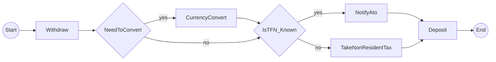

# CLAUDE.md

This file provides guidance to Claude Code (claude.ai/code) when working with code in this repository.

## Project Overview

**Temporalio.Graphs (Python Port)** - A library for generating complete workflow visualization diagrams from Temporal workflows using static code analysis.

**Key Innovation:** Unlike DAG-based workflow engines, Temporal workflows don't provide complete visualization of all possible execution paths. This project generates Mermaid diagrams showing ALL possible workflow paths by analyzing workflow code structure with Python AST (Abstract Syntax Tree).

**Original:** .NET library using runtime interceptor-based mocking
**Python Port:** Uses static code analysis (AST) due to Python SDK interceptor limitations

## Current Status

**Phase 0.5 COMPLETE** - Architecture spike validated static analysis approach (recommended over mock execution and history parsing). Ready for Phase 1 implementation.

See `/spike/EXECUTIVE_SUMMARY.md` for decision rationale and `/IMPLEMENTATION_PLAN.md` for complete 15.5-hour phased plan.

## Common Commands

```bash
# Environment setup (always use uv per user preference)
uv venv
source .venv/bin/activate
uv sync

# Run spike prototypes
cd spike/temporal-spike
uv run python run_all_approaches.py           # Compare all approaches
uv run python approach3_static_analysis.py    # Test recommended approach

# Testing (once implemented)
pytest -v --cov=src/temporalio_graphs         # Run tests with coverage
pytest tests/test_specific.py::test_name      # Single test

# Code quality
mypy src/                                      # Type checking
ruff check src/                                # Linting
ruff format src/                               # Formatting

# Usage (planned)
temporalio-graphs analyze workflow.py --output diagram.md
```

## Architecture

### Core Components (Planned)

1. **AST Parser** - Extracts workflow structure from Python source files
2. **Decision Point Detector** - Identifies branching logic (if/else, conditions)
3. **Path Permutation Generator** - Creates 2^n paths for n decision points
4. **Mermaid Generator** - Converts execution paths to flowchart syntax
5. **CLI Interface** - User-facing command tool

### Key Design Patterns

- **Visitor Pattern**: AST traversal for workflow analysis
- **Builder Pattern**: Graph construction from execution paths
- **Strategy Pattern**: Multiple output formats (Mermaid, DOT, JSON)
- **Context Pattern**: Runtime state during graph building

### Main Classes (Planned)

```python
@dataclass
class GraphBuildingContext:
    """Context for graph generation with configuration options"""
    is_building_graph: bool
    exit_after_building_graph: bool
    graph_output_file: Optional[str]
    split_names_by_words: bool

class GraphPath:
    """Represents single execution path through workflow"""
    def add_step(self, name: str) -> str
    def add_decision(self, id: str, value: bool, name: str) -> str

class GraphGenerator:
    """Generates output from collected paths"""
    def to_mermaid_syntax(self) -> str
    def to_paths(self) -> str

# Workflow helpers
async def to_decision(result: bool, name: str) -> bool
async def wait_condition(condition_check, timeout, name: str) -> bool
```

## Project Structure

```
/spike/                          # Architecture validation (COMPLETE)
  ├── EXECUTIVE_SUMMARY.md       # Decision document
  ├── findings.md                # Technical analysis
  └── temporal-spike/            # Working prototypes
      ├── approach1_simplified.py
      ├── approach2_history_parsing.py
      ├── approach3_static_analysis.py  # ✅ RECOMMENDED
      └── run_all_approaches.py

/Temporalio.Graphs/              # Reference .NET implementation
  ├── Temporalio.Graphs/         # Core library
  │   ├── GraphBuilder.cs        # Main interceptor
  │   └── RuntimeContext.cs      # State management
  └── Samples/MoneyTransferWorker/  # Example workflow

/src/temporalio_graphs/          # Future Python implementation
/tests/                          # Test suite
```

## Technology Stack

**Python:**
- Python 3.10+ (3.11+ recommended)
- Package Manager: `uv` (per user requirement)
- Dependencies: `temporalio >= 1.7.1`, Python `ast` (built-in)
- Dev: `pytest`, `pytest-asyncio`, `mypy`, `ruff`

**Output:** Mermaid.js flowchart syntax

**.NET Reference:** .NET 8.0, Temporalio SDK 1.3.1

## Critical Architectural Decisions

### Why Static Analysis? (Spike Conclusion)

**Tested 3 approaches:**
1. ❌ Mock Activity Registration - Requires 2^n workflow executions, doesn't scale
2. ❌ History-Based Parsing - Only shows executed paths (not all possible paths)
3. ✅ **Static Code Analysis** - Generates ALL paths without execution

**Rationale:**
- Python SDK interceptors CANNOT mock activity return values (unlike .NET)
- Static analysis matches .NET's permutation-based model conceptually
- Performance: < 1ms vs exponential execution time
- Generates complete path coverage (2^n paths for n decisions)

### Implementation Phases

1. **Phase 0.5** (2h) - Architecture spike ✅ COMPLETE
2. **Phase 1** (1.5h) - Foundation (AST parser, decision detector, path generator)
3. **Phase 2** (2h) - Core graph building logic
4. **Phase 3** (3h) - Mermaid generation
5. **Phase 4** (1.5h) - Helpers & integration
6. **Phase 5** (2h) - Testing & examples
7. **Phase 6** (1.5h) - Documentation

**Quality Gates:** 7 review checkpoints with parallel agent execution where possible.

## Code Conventions

- **Naming:** snake_case (functions/vars), PascalCase (classes)
- **Types:** Full type hints (mypy strict mode)
- **Docstrings:** Google/NumPy style
- **Testing:** >80% coverage target
- **Async:** All workflow operations use `async`/`await`

## Example Output

MoneyTransfer workflow with 2 decision points (4 paths):



## Key Files

- `/IMPLEMENTATION_PLAN.md` - Complete 15.5-hour phased implementation plan
- `/spike/EXECUTIVE_SUMMARY.md` - Architecture decision rationale
- `/spike/findings.md` - 2,500+ word technical deep dive
- `/spike/temporal-spike/approach3_static_analysis.py` - Working AST prototype
- `/Temporalio.Graphs/Temporalio.Graphs/GraphBuilder.cs` - .NET reference implementation
