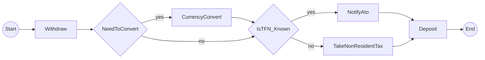

# CLAUDE.md

This file provides guidance to Claude Code (claude.ai/code) when working with code in this repository.

## Project Overview

**Temporalio.Graphs (Python Port)** - A library for generating complete workflow visualization diagrams from Temporal workflows using static code analysis.

**Key Innovation:** Unlike DAG-based workflow engines, Temporal workflows don't provide complete visualization of all possible execution paths. This project generates Mermaid diagrams showing ALL possible workflow paths by analyzing workflow code structure with Python AST (Abstract Syntax Tree).

**Original:** .NET library using runtime interceptor-based mocking
**Python Port:** Uses static code analysis (AST) due to Python SDK interceptor limitations

## Current Status

**Production-Ready (Epic 5 In Progress)** - Core features complete, production hardening underway.

**Completed Epics (1-4):**
- Epic 1: Foundation & Project Setup ✅
- Epic 2: Basic Graph Generation (Linear Workflows) ✅
- Epic 3: Decision Node Support (Branching Workflows) ✅
- Epic 4: Signal & Wait Condition Support ✅

**Epic 5 Progress (2/5 stories, 40% complete):**
- Story 5-1: Validation Warnings ✅ (unreachable activity detection)
- Story 5-2: Error Handling Hierarchy 🔄 (75% complete, needs integration tests)
- Story 5-3: Path List Output Format (backlog)
- Story 5-4: Comprehensive Example Gallery (backlog)
- Story 5-5: Production-Grade Documentation (backlog)

**Quality Metrics:**
- 406 tests passing, 95% coverage
- <1s test execution time
- Mypy strict mode: ✅ passing
- Ruff linting: ✅ passing

See `/spike/EXECUTIVE_SUMMARY.md` for architectural decision rationale.

## Common Commands

```bash
# Environment setup (always use uv per user preference)
uv venv
source .venv/bin/activate
uv sync

# Run spike prototypes
cd spike/temporal-spike
uv run python run_all_approaches.py           # Compare all approaches
uv run python approach3_static_analysis.py    # Test recommended approach

# Testing (once implemented)
pytest -v --cov=src/temporalio_graphs         # Run tests with coverage
pytest tests/test_specific.py::test_name      # Single test

# Code quality
mypy src/                                      # Type checking
ruff check src/                                # Linting
ruff format src/                               # Formatting

# Usage (planned)
temporalio-graphs analyze workflow.py --output diagram.md
```

## Architecture

### Core Components (Implemented)

1. **WorkflowAnalyzer** (`analyzer.py`) - Extracts workflow structure from Python source files using AST
2. **DecisionDetector** (`detector.py`) - Identifies branching logic and decision points (if/else, to_decision calls)
3. **SignalDetector** (`detector.py`) - Identifies signal/wait condition points in workflows
4. **PathPermutationGenerator** (`generator.py`) - Creates 2^n execution paths for n decision points
5. **MermaidRenderer** (`renderer.py`) - Converts execution paths to Mermaid flowchart syntax
6. **Validator** (`validator.py`) - Detects workflow quality issues (unreachable activities)
7. **Error Handler** (`exceptions.py`) - Comprehensive exception hierarchy with actionable messages
8. **Public API** (`__init__.py`) - analyze_workflow() function with GraphBuildingContext configuration

### Key Design Patterns

- **Visitor Pattern**: AST traversal for workflow analysis
- **Builder Pattern**: Graph construction from execution paths
- **Strategy Pattern**: Multiple output formats (Mermaid, DOT, JSON)
- **Context Pattern**: Runtime state during graph building

### Main Classes (Implemented)

```python
@dataclass(frozen=True)
class GraphBuildingContext:
    """Configuration for graph generation"""
    split_names_by_words: bool = True
    start_node_label: str = "Start"
    end_node_label: str = "End"
    suppress_validation: bool = False
    include_validation_report: bool = True
    max_decision_points: int = 10
    max_paths: int = 1024
    graph_output_file: Optional[Path] = None

class WorkflowAnalyzer:
    """Analyzes workflow AST to extract metadata"""
    def analyze(self, tree: ast.Module, file_path: Path) -> WorkflowMetadata

class PathPermutationGenerator:
    """Generates all execution paths (2^n for n decisions)"""
    def generate(self, metadata: WorkflowMetadata, context: GraphBuildingContext) -> list[GraphPath]

class MermaidRenderer:
    """Renders paths as Mermaid flowchart syntax"""
    def render(self, paths: list[GraphPath], context: GraphBuildingContext) -> str

# Workflow helpers (Epic 3-4)
async def to_decision(result: bool, name: str) -> bool
    """Mark decision points in workflow for graph generation"""

async def wait_condition(condition_check: Callable, timeout: timedelta, name: str) -> bool
    """Mark signal/wait points in workflow for graph generation"""

# Validation (Epic 5)
@dataclass(frozen=True)
class ValidationWarning:
    """Represents a single validation warning"""
    severity: WarningSeverity
    category: str
    message: str
    file_path: Path
    line: int

# Error handling (Epic 5)
class TemporalioGraphsError(Exception): ...
class WorkflowParseError(TemporalioGraphsError): ...
class GraphGenerationError(TemporalioGraphsError): ...
```

## Project Structure

```
/spike/                          # Architecture validation (COMPLETE)
  ├── EXECUTIVE_SUMMARY.md       # Decision document
  ├── findings.md                # Technical analysis
  └── temporal-spike/            # Working prototypes
      ├── approach1_simplified.py
      ├── approach2_history_parsing.py
      ├── approach3_static_analysis.py  # ✅ RECOMMENDED
      └── run_all_approaches.py

/Temporalio.Graphs/              # Reference .NET implementation
  ├── Temporalio.Graphs/         # Core library
  │   ├── GraphBuilder.cs        # Main interceptor
  │   └── RuntimeContext.cs      # State management
  └── Samples/MoneyTransferWorker/  # Example workflow

/src/temporalio_graphs/          # Python implementation (IMPLEMENTED)
  ├── __init__.py                # Public API (analyze_workflow)
  ├── analyzer.py                # WorkflowAnalyzer (AST parsing)
  ├── context.py                 # GraphBuildingContext configuration
  ├── detector.py                # DecisionDetector, SignalDetector
  ├── generator.py               # PathPermutationGenerator
  ├── renderer.py                # MermaidRenderer
  ├── path.py                    # GraphPath data model
  ├── helpers.py                 # to_decision(), wait_condition()
  ├── validator.py               # ValidationWarning, ValidationReport (Epic 5)
  ├── exceptions.py              # Error handling hierarchy (Epic 5)
  └── _internal/
      └── graph_models.py        # WorkflowMetadata, DecisionPoint, SignalPoint

/tests/                          # Test suite (406 tests, 95% coverage)
  ├── test_*.py                  # Unit tests
  ├── integration/               # Integration tests
  │   ├── test_signal_workflow.py
  │   └── test_validation_warnings.py
  └── fixtures/                  # Test fixtures

/examples/                       # Working examples (Epic 2-4)
  ├── simple_linear/             # 3 sequential activities
  ├── money_transfer/            # 2 decisions, 4 paths
  └── signal_workflow/           # Signal/wait condition example

/docs/                           # Documentation & sprint artifacts
  ├── sprint-artifacts/
  │   ├── stories/               # User stories
  │   ├── sprint-status.yaml     # Epic/story tracking
  │   └── tech-spec-epic-*.md    # Technical specifications
  ├── architecture.md            # Architecture documentation
  └── prd.md                     # Product requirements
```

## Technology Stack

**Python:**
- Python 3.10+ (3.11+ recommended)
- Package Manager: `uv` (per user requirement)
- Dependencies: `temporalio >= 1.7.1`, Python `ast` (built-in)
- Dev: `pytest`, `pytest-asyncio`, `mypy`, `ruff`

**Output:** Mermaid.js flowchart syntax

**.NET Reference:** .NET 8.0, Temporalio SDK 1.3.1

## Critical Architectural Decisions

### Why Static Analysis? (Spike Conclusion)

**Tested 3 approaches:**
1. ❌ Mock Activity Registration - Requires 2^n workflow executions, doesn't scale
2. ❌ History-Based Parsing - Only shows executed paths (not all possible paths)
3. ✅ **Static Code Analysis** - Generates ALL paths without execution

**Rationale:**
- Python SDK interceptors CANNOT mock activity return values (unlike .NET)
- Static analysis matches .NET's permutation-based model conceptually
- Performance: < 1ms vs exponential execution time
- Generates complete path coverage (2^n paths for n decisions)

### Implementation Phases

1. **Phase 0.5** (2h) - Architecture spike ✅ COMPLETE
2. **Phase 1** (1.5h) - Foundation (AST parser, decision detector, path generator)
3. **Phase 2** (2h) - Core graph building logic
4. **Phase 3** (3h) - Mermaid generation
5. **Phase 4** (1.5h) - Helpers & integration
6. **Phase 5** (2h) - Testing & examples
7. **Phase 6** (1.5h) - Documentation

**Quality Gates:** 7 review checkpoints with parallel agent execution where possible.

## Code Conventions

- **Naming:** snake_case (functions/vars), PascalCase (classes)
- **Types:** Full type hints (mypy strict mode)
- **Docstrings:** Google/NumPy style
- **Testing:** >80% coverage target
- **Async:** All workflow operations use `async`/`await`

## Example Output

MoneyTransfer workflow with 2 decision points (4 paths):



## Key Files

- `/IMPLEMENTATION_PLAN.md` - Complete 15.5-hour phased implementation plan
- `/spike/EXECUTIVE_SUMMARY.md` - Architecture decision rationale
- `/spike/findings.md` - 2,500+ word technical deep dive
- `/spike/temporal-spike/approach3_static_analysis.py` - Working AST prototype
- `/Temporalio.Graphs/Temporalio.Graphs/GraphBuilder.cs` - .NET reference implementation
