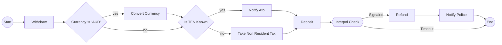

# Temporalio.Graphs Python Port - Implementation Plan

> [!CAUTION]
> **THIS IS THE OLD FIRST DRAFT** - This implementation plan describes the **Runtime Interceptor** approach, which was explored but ultimately rejected in favor of **Static Analysis** (AST-based). Please refer to `docs/architecture.md` and `docs/prd.md` for the current approved architecture. See ADR-001 in the Architecture document for the decision rationale.

## Executive Summary

This document outlines the comprehensive plan to port the .NET Temporalio.Graphs library to Python. The library generates complete workflow visualizations as Mermaid diagrams by running Temporal workflows in mock mode and exploring all execution paths through decision permutations.

**Estimated Timeline:** 17.5 hours with architecture spike + parallelization + reviews (vs 34.5 hours sequential)
**Python Version:** 3.10+
**Package Manager:** uv
**Target Package Name:** `temporalio-graphs`
**Temporal SDK Version:** 1.7.1 (pinned for stability)

**Quality Assurance:** Architecture validation spike + 7 dedicated review phases totaling 3.5 hours, ensuring thorough validation after each implementation phase

**⚠️ Critical Update:** Plan revised based on Python Temporal SDK constraints - interceptor-based mocking doesn't work; using mock activity registration or history-based approach instead.

---

## Architecture Overview

### Core Concept

The library uses Temporal's interceptor system to:
1. Mock workflow activities during execution
2. Track decision nodes and create path permutations (2^n paths for n decisions)
3. Execute workflow multiple times to explore all branches
4. Collect execution paths and convert to Mermaid flowchart syntax

### Key Components

```
┌─────────────────────────────────────────────────────────────┐
│                    GraphBuilder                              │
│              (Main Interceptor)                              │
├─────────────────────────────────────────────────────────────┤
│  WorkflowInboundInterceptor  │  ActivityInboundInterceptor │
│  - Orchestrates execution     │  - Mocks activities         │
│  - Manages decision plans     │  - Tracks decisions         │
│  - Collects paths             │  - Records steps            │
└─────────────────────────────────────────────────────────────┘
                          │
                          ▼
              ┌─────────────────────┐
              │  RuntimeContext     │
              │  - Decision plans   │
              │  - Current path     │
              │  - Configuration    │
              └─────────────────────┘
                          │
                          ▼
              ┌─────────────────────┐
              │  GraphGenerator     │
              │  - Path collection  │
              │  - Mermaid syntax   │
              │  - Node formatting  │
              └─────────────────────┘
```

### Decision Permutation Algorithm

```python
# Start with empty plan
decision_plans = [{}]
scenarios = []

while decision_plans:
    current_plan = decision_plans.pop(0)
    current_path = []

    # Execute workflow with current plan as guidance
    execute_workflow_with_plan(current_plan)

    # When new decision encountered:
    if decision not in current_plan:
        # Clone plan with both outcomes
        plan_true = current_plan.copy()
        plan_true[decision] = True

        plan_false = current_plan.copy()
        plan_false[decision] = False

        decision_plans.extend([plan_true, plan_false])

    scenarios.append(current_path)

# Generate Mermaid from all scenarios
mermaid = generate_mermaid(scenarios)
```

---

## Project Structure

```
temporalio-graphs/
├── pyproject.toml
├── README.md
├── IMPLEMENTATION_PLAN.md
├── src/
│   └── temporalio_graphs/
│       ├── __init__.py
│       ├── types.py                  # Shared type definitions
│       ├── constants.py              # Shared constants
│       ├── graph_builder.py          # Main interceptor class
│       ├── runtime_context.py        # State management
│       ├── graph_generator.py        # Graph generation & Mermaid
│       ├── activities.py             # GenericActivities
│       ├── decorators.py             # @decision decorator
│       ├── workflow_helpers.py       # to_decision, wait_condition
│       └── extensions.py             # Utility functions
├── tests/
│   ├── __init__.py
│   ├── conftest.py
│   ├── test_graph_path.py
│   ├── test_graph_generator.py
│   ├── test_runtime_context.py
│   ├── test_interceptors.py
│   ├── test_decorators.py
│   └── test_integration.py
└── examples/
    └── money_transfer/
        ├── __init__.py
        ├── workflow.py
        ├── activities.py
        └── worker.py
```

---

## Phase Breakdown with Parallelization

### PHASE 0: Pre-Implementation Setup (Sequential - 30 min)

**Single Agent Task:**
- Define API contracts and type definitions
- Create shared types.py and constants.py
- Set up dependency graph documentation

**Deliverables:**
- ✅ `types.py` with all dataclasses and protocols
- ✅ `constants.py` with shared constants
- ✅ API contract documentation

---

### PHASE 0.5: Architecture Validation Spike (CRITICAL - 2 hours)

**⚠️ CRITICAL PHASE** - Validates the core approach before full implementation.

**Why This Phase Exists:**
Python's Temporal SDK does NOT support interceptor-based activity mocking like .NET does. We must validate which architectural approach actually works before committing to full implementation.

**Single Agent Task:**
Prototype and validate the graph generation approach.

**Research Tasks (30 min):**

1. **Python SDK Interceptor Limitations**
   - Read official Temporal Python SDK interceptor documentation
   - Document what interceptors CAN and CANNOT do
   - Specifically test: Can interceptors replace activity return values?
   - Answer: NO (unlike .NET)

2. **Existing Python Tool Analysis**
   - Clone [Temporal Diagram Generator](https://temporal.io/code-exchange/temporal-diagram-generator) from Code Exchange
   - Study its architecture (history-based approach)
   - Document how it extracts workflow structure
   - Note formatting/legend choices to borrow

3. **SDK Version Compatibility**
   - Test with temporalio 1.7.0, 1.7.1, 1.8.0
   - Document any interceptor API changes
   - Choose most stable version to pin

**Prototype Tasks (90 min):**

Create simple test workflow with one decision:
```python
@workflow.defn
class SpikeTestWorkflow:
    @workflow.run
    async def run(self, amount: int) -> str:
        # Activity 1
        await workflow.execute_activity(
            withdraw, args=[amount],
            start_to_close_timeout=timedelta(seconds=10)
        )

        # Decision point
        needs_approval = amount > 1000

        if needs_approval:
            await workflow.execute_activity(
                approve, args=[amount],
                start_to_close_timeout=timedelta(seconds=10)
            )

        # Activity 2
        await workflow.execute_activity(
            deposit, args=[amount],
            start_to_close_timeout=timedelta(seconds=10)
        )

        return "complete"
```

**Approach 1: Mock Activity Registration (45 min)**

```python
# spike/approach_1_mock_activities.py
from temporalio import activity, workflow
from temporalio.worker import Worker
from temporalio.testing import WorkflowEnvironment
from dataclasses import dataclass

@dataclass
class GraphPath:
    steps: list[str]

class MockActivities:
    """Mock activities that record steps and drive branching."""

    def __init__(self, decision_plan: dict[str, bool], path: GraphPath):
        self.plan = decision_plan
        self.path = path

    @activity.defn(name="withdraw")
    async def withdraw(self, amount: int) -> str:
        self.path.steps.append("Withdraw")
        return f"mock_tx_{amount}"

    @activity.defn(name="approve")
    async def approve(self, amount: int) -> str:
        self.path.steps.append("Approve")
        return "approved"

    @activity.defn(name="deposit")
    async def deposit(self, amount: int) -> str:
        self.path.steps.append("Deposit")
        return "deposited"

async def run_with_mocks(decision_value: bool) -> GraphPath:
    """Run workflow with specific decision value."""
    path = GraphPath(steps=[])
    mocks = MockActivities({"needs_approval": decision_value}, path)

    async with await WorkflowEnvironment.start_time_skipping() as env:
        worker = Worker(
            env.client,
            task_queue="spike-queue",
            workflows=[SpikeTestWorkflow],
            activities=[mocks.withdraw, mocks.approve, mocks.deposit]
        )
        async with worker:
            result = await env.client.execute_workflow(
                SpikeTestWorkflow.run,
                args=[1500],  # Amount > 1000 to trigger decision
                id=f"spike-test-{decision_value}",
                task_queue="spike-queue"
            )
    return path

# Test: Run with both decision values
path_approved = await run_with_mocks(True)
path_not_approved = await run_with_mocks(False)

# Should get different paths
assert path_approved.steps == ["Withdraw", "Approve", "Deposit"]
assert path_not_approved.steps == ["Withdraw", "Deposit"]  # No Approve
```

**Approach 2: History-Based Parsing (30 min)**

```python
# spike/approach_2_history.py
async def extract_from_history():
    """Run workflow and extract graph from execution history."""

    async with await WorkflowEnvironment.start_time_skipping() as env:
        worker = Worker(...)  # With real/simple mock activities
        async with worker:
            handle = await env.client.start_workflow(
                SpikeTestWorkflow.run,
                args=[1500],
                id="spike-history-test",
                task_queue="spike-queue"
            )
            result = await handle.result()

            # Fetch execution history
            history = await handle.fetch_history()

            # Parse events
            steps = []
            for event in history.events:
                if event.HasField("activity_task_scheduled"):
                    activity_name = event.activity_task_scheduled.activity_type.name
                    steps.append(activity_name)

            return steps

# Challenge: This only gives ONE execution path
# To get both paths, need to run twice with different inputs
# Doesn't solve the "explore all branches" problem
```

**Approach 3: Hybrid (15 min evaluation)**

Combine interceptor observation + mock activities:
- Interceptor: Observe and log workflow structure
- Mock activities: Drive branching logic
- Evaluate if this adds value over pure mock approach

**Evaluation Criteria:**

| Criterion | Approach 1 (Mock) | Approach 2 (History) | Approach 3 (Hybrid) |
|-----------|-------------------|----------------------|---------------------|
| Can generate 2^n paths? | ✅ Yes | ❌ Only 1 per run | ✅ Yes |
| Deterministic? | ✅ Yes | ⚠️ Input-dependent | ✅ Yes |
| Complexity (LOC) | ~150 | ~100 | ~200 |
| Matches .NET model? | ✅ Yes (permutations) | ❌ No | ✅ Yes |
| Performance | Fast (time-skip) | Fast (time-skip) | Fast |
| Maintainability | Good | Excellent | Complex |

**Decision Matrix:**

Choose **Approach 1 (Mock Activities)** if:
- Can successfully run multiple permutations
- Can capture all activity names
- Can handle decision nodes
- Performance is acceptable

Choose **Approach 2 (History)** if:
- Mock approach proves too complex
- Existing tool's approach is sufficient
- Don't need full branch exploration

**Deliverables:**
- ✅ Working prototype of chosen approach (runnable code)
- ✅ `spike/findings.md` documenting:
  - What works and what doesn't
  - Python SDK limitations discovered
  - Recommended approach with justification
  - Code samples
  - Performance measurements
- ✅ Decision on which architecture to use
- ✅ Updated Phase 3 specification based on chosen approach

**Success Criteria:**
- At least one approach successfully generates 2 different paths
- Prototype can produce simple Mermaid output
- Execution time < 5 seconds for 2-path test
- Clear recommendation documented

**If Spike Fails:**
- Document blockers
- Consider: Is this project feasible in Python?
- Alternative: Build on existing Temporal Diagram Generator instead of porting .NET approach

---

### REVIEW PHASE 0.5→1: Spike Validation Review (20 min)

**Reviewer Agent Task:**
Validate spike results before proceeding with full implementation.

**Review Checklist:**
- [ ] At least one approach successfully demonstrated
- [ ] Can generate different execution paths
- [ ] Decision documented with clear justification
- [ ] Code is understandable and well-commented
- [ ] Performance is acceptable (<5s for simple test)
- [ ] Limitations are documented
- [ ] Recommended approach is technically sound

**Critical Questions:**
- [ ] Can the chosen approach handle 2^n decision permutations?
- [ ] Will it scale to real workflows (5+ decisions)?
- [ ] Is the implementation complexity manageable?
- [ ] Does it match .NET functionality requirements?

**Gate Criteria:**
- ✅ Working prototype exists
- ✅ Generates at least 2 different paths
- ✅ Decision is documented
- ✅ Approach is feasible for full implementation
- ✅ No major blockers discovered

**If Spike Shows Unfeasible:**
- STOP full port implementation
- Document why Python approach differs from .NET
- Recommend alternative: Extend existing Python Temporal Diagram Generator
- Pivot plan if needed

---

### REVIEW PHASE 0→1: Foundation Contract Review (20 min)

**Reviewer Agent Task:**
Review Phase 0 deliverables before proceeding to Phase 1 parallel execution.

**Review Checklist:**
- [ ] All type definitions are complete and consistent
- [ ] `types.py` includes all shared dataclasses (GraphBuildingContext, etc.)
- [ ] `constants.py` defines all shared constants (node formats, markers, etc.)
- [ ] No type ambiguities or missing definitions
- [ ] API contracts are clearly documented
- [ ] Dependency graph is clear and acyclic
- [ ] All Phase 1 agents can proceed independently with these definitions

**Review Method:**
1. Type-check all definitions: `mypy types.py constants.py`
2. Verify all planned classes/functions are declared
3. Check for completeness against .NET reference implementation
4. Validate naming conventions (snake_case, clear names)
5. Ensure docstrings are present for all public interfaces

**Gate Criteria:**
- ✅ All type definitions compile without errors
- ✅ No `Any` types or `type: ignore` comments
- ✅ All Phase 1 dependencies satisfied
- ✅ Documentation is clear and complete

**If Issues Found:**
- Document specific issues with line numbers
- Assign fixes back to Phase 0 agent
- Re-review after corrections

---

### PHASE 1: Foundation (PARALLEL - 5 Agents - 1.5 hours)

| Agent | Task | Files | Dependencies | Deliverables |
|-------|------|-------|--------------|--------------|
| **Agent 1** | Project scaffolding | `pyproject.toml`, `__init__.py`, directory structure | None | Working `uv sync`, importable package |
| **Agent 2** | Core data structures | `types.py` additions, initial classes | Agent 1 (types.py) | `GraphBuildingContext`, `GraphPath` with tests |
| **Agent 3** | Utility functions | `extensions.py` | Phase 0 types | String manipulation, name formatting, hash functions |
| **Agent 4** | Research Temporal SDK | Documentation markdown | None | Interceptor API guide, code examples |
| **Agent 5** | Documentation templates | `README.md` template, example structure | None | Documentation skeleton with TODOs |

#### Agent 1: Project Scaffolding

**Tasks:**
1. Create `pyproject.toml` with uv configuration
2. Set up src layout with `__init__.py`
3. Configure pytest, mypy, ruff
4. Create basic package metadata

**Acceptance Criteria:**
- `uv sync` runs successfully
- `from temporalio_graphs import __version__` works
- `pytest` discovers test directory
- `mypy src/` runs without errors

**Files to Create:**
```toml
# pyproject.toml
[project]
name = "temporalio-graphs"
version = "0.1.0"
description = "Generate Mermaid diagrams from Temporal workflows"
requires-python = ">=3.10"
dependencies = [
    "temporalio==1.7.1",  # Pinned for API stability - interceptor APIs change between versions
]

[project.optional-dependencies]
dev = [
    "pytest>=8.0.0",
    "pytest-asyncio>=0.23.0",
    "mypy>=1.8.0",
    "ruff>=0.2.0",
]

[build-system]
requires = ["hatchling"]
build-backend = "hatchling.build"

[tool.pytest.ini_options]
asyncio_mode = "auto"

[tool.mypy]
python_version = "3.10"
strict = true
```

---

#### Agent 2: Core Data Structures

**Tasks:**
1. Implement `GraphBuildingContext` dataclass
2. Implement `GraphPath` class
3. Write unit tests for both

**API Contract:**
```python
from dataclasses import dataclass
from typing import Optional

@dataclass
class GraphBuildingContext:
    """Configuration for graph building mode."""
    is_building_graph: bool
    exit_after_building_graph: bool
    graph_output_file: Optional[str] = None
    split_names_by_words: bool = False
    suppress_validation: bool = True
    preserve_decision_id: bool = True
    mermaid_only: bool = False
    suppress_activity_mocking: bool = False
    start_node: str = "Start"
    end_node: str = "End"

    # Path explosion guards (NEW - prevents 2^n explosion on large workflows)
    max_decisions: int = 5  # Limit decision nodes (2^5 = 32 paths max)
    max_paths: int = 100    # Hard limit on total paths generated
    max_depth: int = 50     # Maximum workflow depth to traverse
    timeout_per_run: timedelta = timedelta(minutes=1)  # Per-permutation timeout


class GraphPath:
    """Tracks a single execution path through a workflow."""

    def __init__(self) -> None:
        self.elements: list[str] = []

    def clear(self) -> "GraphPath":
        """Clear all steps/nodes."""
        self.elements.clear()
        return self

    def add_step(self, name: str = "") -> str:
        """Add a step/node to the graph."""
        self.elements.append(name)
        return f"DAG step: {name}"

    def add_decision(
        self,
        id: str,
        value: bool,
        name: str = "",
        result_text: str = "yes|no"
    ) -> str:
        """Add a decision node to the graph."""
        result_values = result_text.split("|")
        if len(result_values) != 2:
            raise ValueError(f"result_text must contain two values separated by '|'")

        result = result_values[0] if value else result_values[1]
        self.elements.append(f"{id}{{{name}}}:{result}")
        return f"DAG decision: {name}"
```

**Tests:**
```python
def test_graph_path_add_step():
    path = GraphPath()
    path.add_step("Withdraw")
    path.add_step("Deposit")
    assert path.elements == ["Withdraw", "Deposit"]

def test_graph_path_add_decision():
    path = GraphPath()
    path.add_decision("0", True, "NeedToConvert")
    assert path.elements == ["0{NeedToConvert}:yes"]
```

---

#### Agent 3: Utility Functions

**Tasks:**
1. Implement string manipulation utilities
2. Implement name formatting (camelCase → Proper Words)
3. Implement hash function for decision IDs
4. Write unit tests

**API Contract:**
```python
def split_by_words(text: str, is_mermaid: bool = False) -> str:
    """
    Split camelCase/PascalCase into separate words.

    Examples:
        split_by_words("notifyCustomer") -> "Notify Customer"
        split_by_words("isPdf", is_mermaid=True) -> "isPdf[Is Pdf]"
    """
    ...

def to_simple_node_name(name: str) -> str:
    """
    Convert full qualified name to simple node name.

    Examples:
        "namespace.class.method" -> "method"
        "d1{namespace.class.method}:yes" -> "d1{method}:yes"
    """
    ...

def to_decision_id(name: str) -> int:
    """Generate consistent hash ID for decision name."""
    ...

def decorate_signals(name: str) -> str:
    """
    Convert signal markers to Mermaid syntax.

    Examples:
        "check:&sgnl;" -> "{{check}}"
    """
    ...
```

**Tests:**
```python
def test_split_by_words():
    assert split_by_words("notifyCustomer") == "Notify Customer"
    assert split_by_words("processXMLFile") == "Process XML File"

def test_to_simple_node_name():
    assert to_simple_node_name("banking.withdraw") == "withdraw"
    assert to_simple_node_name("0{banking.check}:yes") == "0{check}:yes"
```

---

#### Agent 4: Research Temporal SDK & Existing Tools

**Tasks:**
1. Research Python Temporal interceptor API
2. **Analyze existing [Temporal Diagram Generator](https://temporal.io/code-exchange/temporal-diagram-generator)** (NEW)
   - Study its history-based approach
   - Document Mermaid formatting conventions
   - Extract reusable patterns
3. Review Phase 0.5 spike findings
4. Document how to create custom interceptors (if needed based on spike)
5. Provide code examples
6. Document differences from .NET implementation

**Deliverables:**
Create `TEMPORAL_SDK_RESEARCH.md` with:
- Summary of Phase 0.5 spike decision
- Python interceptor capabilities and limitations
- How existing Temporal Diagram Generator works
- Comparison: history-based vs mock-activity approaches
- Recommended Mermaid formatting (borrow from existing tool)
- How to implement `WorkflowInboundInterceptor` (if chosen approach uses it)
- How to implement `ActivityInboundInterceptor` (if chosen approach uses it)
- Testing strategies with WorkflowEnvironment
- Code examples for chosen architecture

---

#### Agent 5: Documentation Templates

**Tasks:**
1. Create README.md structure
2. Set up example directory structure
3. Create documentation TODOs

**README Structure:**
```markdown
# temporalio-graphs

Generate complete workflow visualizations as Mermaid diagrams for Temporal workflows.

## Installation
[TODO: PyPI installation]

## Quick Start
[TODO: Basic example]

## Features
[TODO: Feature list]

## API Reference
[TODO: API docs]

## Examples
[TODO: Link to examples]

## How It Works
[TODO: Architecture explanation]

## License
MIT
```

---

### REVIEW PHASE 1→2: Foundation Components Review (30 min)

**Reviewer Agent Task:**
Review all 5 agents' work from Phase 1 before proceeding to Phase 2.

**Review Checklist:**

**Agent 1 (Project Scaffolding):**
- [ ] `uv sync` runs without errors
- [ ] All dependencies correctly specified in `pyproject.toml`
- [ ] Package structure follows Python best practices (src layout)
- [ ] pytest, mypy, ruff configurations are correct
- [ ] `from temporalio_graphs import __version__` works

**Agent 2 (Core Data Structures):**
- [ ] `GraphBuildingContext` dataclass has all required fields
- [ ] `GraphPath` class API matches specification
- [ ] Unit tests exist and pass for both classes
- [ ] Type hints are complete and correct
- [ ] Docstrings are clear and comprehensive

**Agent 3 (Utility Functions):**
- [ ] All utility functions implemented: `split_by_words`, `to_simple_node_name`, `to_decision_id`, `decorate_signals`
- [ ] Functions match .NET behavior for equivalent inputs
- [ ] Comprehensive unit tests with edge cases
- [ ] No use of unsafe operations (e.g., unhandled regex)

**Agent 4 (Temporal SDK Research):**
- [ ] Documentation covers WorkflowInboundInterceptor API
- [ ] Documentation covers ActivityInboundInterceptor API
- [ ] Code examples are tested and work with current Temporal version
- [ ] Differences from .NET implementation are documented
- [ ] Testing strategies are practical and detailed

**Agent 5 (Documentation Templates):**
- [ ] README.md template structure is complete
- [ ] Example directory structure is logical
- [ ] TODOs are specific and actionable
- [ ] Template follows Python documentation conventions

**Cross-Agent Integration Review:**
- [ ] No conflicting type definitions
- [ ] Import dependencies are correct
- [ ] No circular imports
- [ ] Naming conventions consistent across all files
- [ ] All agents used types from Phase 0 correctly

**Review Method:**
1. Run full type check: `mypy src/`
2. Run all tests: `pytest -v`
3. Run linter: `ruff check src/`
4. Test imports: `python -c "from temporalio_graphs import GraphBuildingContext, GraphPath"`
5. Verify `uv sync` creates working environment
6. Cross-reference against Phase 0 API contracts

**Gate Criteria:**
- ✅ All tests pass (100% of Phase 1 tests)
- ✅ No mypy errors
- ✅ No ruff violations
- ✅ Package is importable
- ✅ All deliverables from 5 agents present and correct
- ✅ Temporal SDK documentation is accurate

**If Issues Found:**
- Create detailed issue list with file paths and line numbers
- Categorize by severity (blocking vs. non-blocking)
- Assign fixes back to appropriate agents
- Re-run review after all fixes applied

---

### PHASE 2: Core Implementation (PARALLEL - 3 Agents - 2 hours)

**Prerequisites:** Phase 1 complete, Review 1→2 passed

| Agent | Task | Files | Dependencies | Deliverables |
|-------|------|-------|--------------|--------------|
| **Agent A** | Graph generator | `graph_generator.py` | GraphPath (Phase 1) | GraphGenerator class with Mermaid output |
| **Agent B** | Runtime context | `runtime_context.py` | GraphBuildingContext (Phase 1) | RuntimeContext with session management |
| **Agent C** | Activities & decorators | `activities.py`, `decorators.py` | Types (Phase 0) | GenericActivities, @decision decorator |

#### Agent A: Graph Generator

**Tasks:**
1. Implement `GraphGenerator` class
2. Implement `to_mermaid_syntax()` method
3. Implement `to_paths()` method
4. Implement `prettify_nodes()` method
5. Write comprehensive tests

**API Contract:**
```python
class GraphGenerator:
    """Generates Mermaid diagrams from collected execution paths."""

    def __init__(self) -> None:
        self.scenarios: list[list[str]] = []

    def prettify_nodes(self) -> None:
        """Replace hash-based IDs with simple numeric IDs."""
        ...

    def to_paths(self) -> str:
        """Convert scenarios to human-readable path list."""
        ...

    def to_mermaid_syntax(self) -> str:
        """
        Convert scenarios to Mermaid flowchart syntax.

        Returns:
            Mermaid markdown with flowchart definition
        """
        ...

    def validate_graph_against(self, module) -> str:
        """Validate graph against defined activities."""
        ...
```

**Tests:**
```python
def test_mermaid_simple_path():
    gen = GraphGenerator()
    gen.scenarios = [["Start", "Withdraw", "Deposit", "End"]]
    mermaid = gen.to_mermaid_syntax()
    assert "```mermaid" in mermaid
    assert "flowchart LR" in mermaid
    assert "s((Start)) --> Withdraw" in mermaid

def test_mermaid_with_decision():
    gen = GraphGenerator()
    gen.scenarios = [
        ["Start", "0{NeedConvert}:yes", "Convert", "End"],
        ["Start", "0{NeedConvert}:no", "End"]
    ]
    mermaid = gen.to_mermaid_syntax()
    assert "0{NeedConvert} -- yes --> Convert" in mermaid
    assert "0{NeedConvert} -- no --> e((End))" in mermaid
```

---

#### Agent B: Runtime Context

**Tasks:**
1. Implement `RuntimeContext` class
2. Implement session management with contextvars
3. Implement decision plan management
4. Write tests

**API Contract:**
```python
from contextvars import ContextVar
from typing import Optional

# Context variable for current runtime context
_runtime_context: ContextVar[Optional["RuntimeContext"]] = ContextVar(
    "runtime_context", default=None
)

class RuntimeContext:
    """Runtime state for a single workflow execution."""

    def __init__(self) -> None:
        self.client_request: Optional[GraphBuildingContext] = None
        self.decision_plans: list[dict[tuple[str, int], bool]] = []
        self.current_graph_path: GraphPath = GraphPath()
        self.initialized: bool = False

    @property
    def current_decision_plan(self) -> Optional[dict[tuple[str, int], bool]]:
        """Get the first decision plan from the queue."""
        return self.decision_plans[0] if self.decision_plans else None

    @property
    def is_building_graph(self) -> bool:
        return self.client_request is not None and \
               self.client_request.is_building_graph

    @property
    def split_names_by_words(self) -> bool:
        return self.client_request is not None and \
               self.client_request.split_names_by_words

    def init_from_context(self, context: Optional[GraphBuildingContext]) -> bool:
        """Initialize from GraphBuildingContext."""
        if context is not None:
            self.client_request = context
            return True
        return False


def get_runtime_context() -> Optional[RuntimeContext]:
    """Get current runtime context from contextvar."""
    return _runtime_context.get()

def set_runtime_context(ctx: RuntimeContext) -> None:
    """Set current runtime context."""
    _runtime_context.set(ctx)
```

---

#### Agent C: Activities & Decorators

**Tasks:**
1. Implement `GenericActivities` class with `make_decision` activity
2. Implement `@decision` decorator
3. Write tests

**API Contract:**
```python
from temporalio import activity
from typing import Callable, TypeVar, Any
from dataclasses import dataclass

@dataclass
class DecisionInfo:
    """Metadata for decision activities."""
    positive_result_name: str = "Yes"
    negative_result_name: str = "No"

F = TypeVar('F', bound=Callable[..., Any])

def decision(
    positive: str = "Yes",
    negative: str = "No"
) -> Callable[[F], F]:
    """
    Decorator to mark an activity as a decision node.

    Usage:
        @activity.defn
        @decision(positive="Yes", negative="No")
        async def check_tfn(details) -> bool:
            return details.account.startswith("AU_")
    """
    def decorator(fn: F) -> F:
        # Store metadata on function
        setattr(fn, "_decision_info", DecisionInfo(positive, negative))
        return fn
    return decorator


class GenericActivities:
    """Generic activities used for dynamic decision nodes."""

    @activity.defn(name="make_decision")
    @decision()
    async def make_decision(
        self,
        decision_result: bool,
        decision_name: str,
        decision_id: int,
        result_text: str
    ) -> bool:
        """
        Generic decision activity used internally for dynamic decisions.

        Args:
            decision_result: The boolean result of the decision
            decision_name: Name of the decision for the graph
            decision_id: Unique ID for this decision
            result_text: Text for results (e.g., "yes|no")
        """
        return decision_result
```

**Tests:**
```python
def test_decision_decorator():
    @decision(positive="Valid", negative="Invalid")
    async def check_validity() -> bool:
        return True

    info = getattr(check_validity, "_decision_info")
    assert info.positive_result_name == "Valid"
    assert info.negative_result_name == "Invalid"

async def test_generic_activities():
    activities = GenericActivities()
    result = await activities.make_decision(True, "test", 123, "yes|no")
    assert result is True
```

---

### REVIEW PHASE 2→3: Core Components Review (30 min)

**Reviewer Agent Task:**
Review all 3 agents' work from Phase 2 before proceeding to Phase 3 interceptor implementation.

**Review Checklist:**

**Agent A (Graph Generator):**
- [ ] `GraphGenerator` class implements all required methods
- [ ] `to_mermaid_syntax()` produces valid Mermaid flowchart syntax
- [ ] `to_paths()` correctly formats human-readable paths
- [ ] `prettify_nodes()` correctly simplifies decision IDs
- [ ] Unit tests cover simple paths, decision paths, signal paths
- [ ] Tests validate Mermaid syntax structure
- [ ] Edge cases handled (empty scenarios, single node, etc.)

**Agent B (Runtime Context):**
- [ ] `RuntimeContext` class correctly manages workflow state
- [ ] `contextvars` integration works correctly
- [ ] `current_decision_plan` property returns correct plan
- [ ] `decision_plans` list management is correct
- [ ] `is_building_graph` and `split_names_by_words` properties work
- [ ] Session management by run_id is implemented
- [ ] Unit tests verify context isolation between workflows

**Agent C (Activities & Decorators):**
- [ ] `GenericActivities.make_decision()` is properly decorated with `@activity.defn`
- [ ] `@decision` decorator stores metadata correctly
- [ ] Metadata includes positive/negative result names
- [ ] Decorator works with Temporal activity registration
- [ ] Unit tests verify decorator behavior
- [ ] Integration with actual Temporal activities tested

**Integration Review:**
- [ ] `GraphGenerator` can consume paths from `RuntimeContext.current_graph_path`
- [ ] `RuntimeContext` uses `GraphBuildingContext` from Phase 1
- [ ] `GenericActivities` can be registered with Temporal Worker
- [ ] No circular dependencies between modules
- [ ] Type hints are compatible across modules

**Review Method:**
1. Run all Phase 2 unit tests: `pytest tests/test_graph_generator.py tests/test_runtime_context.py tests/test_decorators.py -v`
2. Type check: `mypy src/temporalio_graphs/graph_generator.py src/temporalio_graphs/runtime_context.py src/temporalio_graphs/activities.py`
3. Verify Mermaid output format matches .NET examples
4. Test `GraphGenerator` with sample scenarios from .NET test cases
5. Validate contextvar isolation with concurrent workflow simulation

**Gate Criteria:**
- ✅ All Phase 2 tests pass (100%)
- ✅ Mermaid syntax validates (can render in Mermaid editor)
- ✅ Runtime context correctly isolates workflow executions
- ✅ Decorators compatible with Temporal SDK
- ✅ No type errors in any Phase 2 modules
- ✅ Code coverage >80% for all new modules

**If Issues Found:**
- Document failures with specific test names
- Review Mermaid output against .NET reference
- Test contextvar behavior with asyncio tasks
- Assign fixes back to appropriate agents
- Re-review after corrections

---

### PHASE 3: Core Graph Generation Implementation (SEQUENTIAL - 1 Agent - 2.5-3 hours)

**⚠️ IMPLEMENTATION DEPENDS ON PHASE 0.5 SPIKE RESULTS**

**Prerequisites:** Phase 2 complete, Review 2→3 passed, **Phase 0.5 spike decision documented**

**Why Sequential:** Core graph logic is tightly coupled regardless of approach chosen.

**Note:** This phase implementation varies significantly based on spike decision:
- **If Mock Activity Approach:** Focus on mock orchestration + path permutation
- **If History-Based Approach:** Focus on history parsing + graph extraction
- **If Hybrid Approach:** Implement both components

#### Single Agent: Implement Chosen Architecture

**Tasks (vary based on spike decision):**

**If Mock Activity Approach Chosen (Approach 1):**
1. Implement `MockActivityOrchestrator` - Creates mock activities per decision plan
2. Implement `GraphPath` collector - Records execution steps
3. Implement decision permutation generator - Creates 2^n plans with explosion guards
4. Implement multi-run orchestration with WorkflowEnvironment
5. Implement Mermaid generation from collected paths
6. Write integration tests

**If History-Based Approach Chosen (Approach 2):**
1. Implement workflow execution wrapper
2. Implement history event parser
3. Implement graph extraction from history events
4. Implement Mermaid generation from parsed events
5. Handle multiple runs for branch exploration (if needed)
6. Write integration tests

**If Hybrid Approach Chosen (Approach 3):**
1. Implement lightweight interceptor for step observation
2. Implement mock activities for branching control
3. Implement coordinator between interceptor + mocks
4. Implement decision permutation logic
5. Implement Mermaid generation
6. Write integration tests

**Files:**
- `graph_builder.py`

**API Contract:**
```python
from temporalio.worker import Interceptor, WorkflowInboundInterceptor, ActivityInboundInterceptor
from typing import Optional, Callable
import asyncio

class GraphBuilder(Interceptor):
    """
    Main interceptor for building workflow graphs.

    Usage:
        context = GraphBuildingContext(is_building_graph=True, ...)
        interceptor = GraphBuilder(context, stop_callback=worker.shutdown)

        worker = Worker(
            client,
            task_queue="my-queue",
            workflows=[MyWorkflow],
            activities=[...],
            interceptors=[interceptor]
        )
    """

    def __init__(
        self,
        context: Optional[GraphBuildingContext] = None,
        stop_callback: Optional[Callable[[], None]] = None
    ):
        self.client_request = context
        self.stop_callback = stop_callback
        self._sessions: dict[str, RuntimeContext] = {}

    def workflow_interceptor_class(
        self, input: WorkflowInterceptorClassInput
    ) -> Optional[type[WorkflowInboundInterceptor]]:
        """Return custom workflow interceptor."""
        return _WorkflowInbound

    def activity_interceptor_class(
        self, input: ActivityInterceptorClassInput
    ) -> Optional[type[ActivityInboundInterceptor]]:
        """Return custom activity interceptor."""
        return _ActivityInbound

    def get_or_create_session(self, run_id: str) -> RuntimeContext:
        """Get or create runtime context for workflow run."""
        if run_id not in self._sessions:
            self._sessions[run_id] = RuntimeContext()
        return self._sessions[run_id]


class _WorkflowInbound(WorkflowInboundInterceptor):
    """Intercepts workflow execution to build graphs."""

    async def execute_workflow(self, input: ExecuteWorkflowInput):
        """
        Execute workflow in graph-building mode.

        Algorithm:
        1. Initialize runtime context
        2. Create initial empty decision plan
        3. While decision plans remain:
           a. Clear current path
           b. Execute workflow (activities mocked)
           c. Collect execution path
           d. Remove completed plan
        4. Generate Mermaid output
        5. Save to file or print
        """
        runtime = self._get_runtime_context()

        if not runtime.is_building_graph:
            # Normal execution
            return await super().execute_workflow(input)

        # Graph building mode
        runtime.decision_plans.append({})
        generator = GraphGenerator()

        while runtime.decision_plans:
            try:
                runtime.current_graph_path.clear()

                # Add start node
                if runtime.client_request.start_node:
                    runtime.current_graph_path.add_step(
                        runtime.client_request.start_node
                    )

                # Execute workflow with mocked activities
                await super().execute_workflow(input)

                # Add end node
                if runtime.client_request.end_node:
                    runtime.current_graph_path.add_step(
                        runtime.client_request.end_node
                    )

                # Save this path
                generator.scenarios.append(
                    runtime.current_graph_path.elements.copy()
                )
            finally:
                runtime.decision_plans.pop(0)

        # Generate output
        output = self._generate_output(generator, runtime)

        # Save or print
        if runtime.client_request.graph_output_file:
            with open(runtime.client_request.graph_output_file, 'a') as f:
                f.write(output)
        else:
            print("=" * 50)
            print(output)
            print("=" * 50)

        # Exit if configured
        if runtime.client_request.exit_after_building_graph:
            if self._builder.stop_callback:
                self._builder.stop_callback()

        return output


class _ActivityInbound(ActivityInboundInterceptor):
    """Intercepts activity execution to mock and track."""

    async def execute_activity(self, input: ExecuteActivityInput):
        """
        Execute activity - mock if building graph.

        For decision activities:
        1. Check if decision already in current plan
        2. If not, create two new plans (true/false)
        3. Add decision node to path
        4. Return plan's decision value

        For normal activities:
        1. Add step to path
        2. Return None (mocked)
        """
        runtime = self._get_runtime_context()

        if not runtime.is_building_graph:
            return await super().execute_activity(input)

        # Check if this is a decision activity
        decision_info = self._get_decision_info(input)

        if decision_info:
            # Handle decision node
            return await self._handle_decision(input, decision_info, runtime)
        else:
            # Handle normal activity
            activity_name = input.fn.__name__
            runtime.current_graph_path.add_step(activity_name)

            # Mock the activity unless suppressed
            if runtime.client_request.suppress_activity_mocking:
                try:
                    return await super().execute_activity(input)
                except:
                    pass

            return None

    async def _handle_decision(self, input, decision_info, runtime):
        """Handle decision activity execution."""
        decision_name = decision_info['name']
        decision_id = decision_info['id']
        result_text = decision_info['result_text']

        # Check if decision in current plan
        plan_key = (decision_name, decision_id)
        current_plan = runtime.current_decision_plan

        if current_plan is not None and plan_key not in current_plan:
            # New decision - create permutations
            plan_true = current_plan.copy()
            plan_true[plan_key] = True

            plan_false = current_plan.copy()
            plan_false[plan_key] = False

            # Add true to current, false to queue
            current_plan[plan_key] = True
            runtime.decision_plans.append(plan_false)

        # Get decision value from plan
        decision_value = current_plan.get(plan_key, False) if current_plan else False

        # Add to path
        runtime.current_graph_path.add_decision(
            str(decision_id),
            decision_value,
            decision_name,
            result_text
        )

        return decision_value
```

**Tests:**
```python
@pytest.mark.asyncio
async def test_simple_workflow_graph():
    """Test graph generation for simple linear workflow."""
    # Test implementation
    ...

@pytest.mark.asyncio
async def test_workflow_with_decision():
    """Test graph generation with single decision."""
    # Should produce 2 paths
    ...
```

---

### REVIEW PHASE 3→4: Interceptor Implementation Review (40 min)

**Reviewer Agent Task:**
Review Phase 3 interceptor implementation - this is the most critical component.

**Review Checklist:**

**Interceptor Architecture:**
- [ ] `GraphBuilder` class properly implements `Interceptor` interface
- [ ] `WorkflowInboundInterceptor` and `ActivityInboundInterceptor` are correctly defined
- [ ] Interceptors register properly with Temporal Worker
- [ ] Session management dictionary works correctly (keyed by run_id)
- [ ] Proper cleanup on workflow completion

**Workflow Interception Logic:**
- [ ] Graph building mode detection works
- [ ] Normal mode falls through to base implementation
- [ ] Decision plan initialization correct (starts with empty dict)
- [ ] Workflow loop executes all decision permutations
- [ ] Start/end nodes added correctly
- [ ] Path collection into `GraphGenerator.scenarios` works
- [ ] Mermaid output generation and saving works
- [ ] Worker shutdown callback triggers correctly

**Activity Interception Logic:**
- [ ] Activity mocking works in graph-building mode
- [ ] Normal activities return `None` when mocked
- [ ] Decision activity detection works correctly
- [ ] Decision node processing creates proper permutations
- [ ] Decision plan cloning creates both true/false branches
- [ ] Decision value from plan used correctly
- [ ] Non-mocking mode (suppress_activity_mocking) works

**Decision Permutation Algorithm:**
- [ ] First decision creates 2 paths (true, false)
- [ ] Second decision creates 4 paths (2^2)
- [ ] N decisions create 2^n paths
- [ ] No duplicate paths generated
- [ ] All branches explored exactly once
- [ ] Decision plan queue management correct

**Integration with Phase 2 Components:**
- [ ] Uses `RuntimeContext` correctly
- [ ] Uses `GraphGenerator` correctly
- [ ] Uses `GenericActivities.make_decision` correctly
- [ ] Context variables properly set/retrieved
- [ ] Graph output format matches specification

**Review Method:**
1. Code review of interceptor logic against .NET implementation
2. Test with simple linear workflow (no decisions) - should produce 1 path
3. Test with 1 decision - should produce exactly 2 paths
4. Test with 2 decisions - should produce exactly 4 paths
5. Verify Mermaid output for complex workflow matches .NET
6. Test error handling (workflow exceptions, activity failures)
7. Test concurrent workflow execution (context isolation)
8. Run integration tests: `pytest tests/test_interceptors.py -v`

**Critical Checks:**
- [ ] No infinite loops in decision permutation
- [ ] No memory leaks from session storage
- [ ] Thread-safe / async-safe context management
- [ ] Proper exception handling and propagation
- [ ] Worker shutdown doesn't leave orphaned processes

**Gate Criteria:**
- ✅ Simple workflow produces correct Mermaid
- ✅ Decision workflow produces 2^n paths
- ✅ All paths are unique and complete
- ✅ Mermaid syntax is valid
- ✅ Integration tests pass
- ✅ No race conditions in concurrent execution
- ✅ Context cleanup works properly

**If Issues Found:**
- Test decision permutation algorithm in isolation
- Add logging to trace path generation
- Compare generated paths with .NET output
- Fix and re-test critical path issues immediately
- Document any deviations from .NET behavior

**Special Attention:**
This is the core of the library. Extra scrutiny required:
- Decision permutation algorithm must be correct
- Context management must be bulletproof
- Mermaid generation must match .NET output

---

### PHASE 4: Helpers & Integration (PARALLEL - 2 Agents - 1.5 hours)

**Prerequisites:** Phase 3 complete, Review 3→4 passed

| Agent | Task | Files | Dependencies | Deliverables |
|-------|------|-------|--------------|--------------|
| **Agent X** | Workflow helpers | `workflow_helpers.py` | GenericActivities (Phase 2) | `to_decision()`, `wait_condition()` |
| **Agent Y** | Integration & errors | Package init, exception classes | All previous | Clean public API, error handling |

#### Agent X: Workflow Helpers

**Tasks:**
1. Implement `to_decision()` helper
2. Implement `wait_condition()` wrapper
3. Write tests and examples

**API Contract:**
```python
from temporalio import workflow
from temporalio.workflow import ActivityOptions
from typing import Optional
import inspect

async def to_decision(
    result: bool,
    name: Optional[str] = None,
    options: Optional[ActivityOptions] = None
) -> bool:
    """
    Convert a boolean value into a decision node in the workflow graph.

    Usage:
        need_convert = await to_decision(
            currency != "AUD",
            name="NeedToConvert"
        )

        if need_convert:
            await workflow.execute_activity(convert_currency, ...)

    Args:
        result: The boolean decision result
        name: Name for the decision node (required in Python)
        options: Activity options (default: 5min timeout)

    Returns:
        The boolean result (passed through)
    """
    if name is None:
        # Try to infer from caller (fragile, but convenient)
        frame = inspect.currentframe()
        if frame and frame.f_back:
            # Get the source line and try to extract variable name
            # This is best-effort only
            name = "Decision"

    if options is None:
        options = ActivityOptions(start_to_close_timeout=timedelta(minutes=5))

    decision_id = to_decision_id(name)

    from .activities import GenericActivities

    return await workflow.execute_activity(
        GenericActivities.make_decision,
        args=[result, name, decision_id, "yes|no"],
        activity_options=options
    )


async def wait_condition(
    condition_check: Callable[[], bool],
    timeout: timedelta,
    name: str,
    options: Optional[ActivityOptions] = None
) -> bool:
    """
    Wait for a condition (signal) and record in graph.

    Usage:
        is_flagged = await wait_condition(
            lambda: self.flagged,
            timeout=timedelta(hours=1),
            name="Interpol Check"
        )

    Args:
        condition_check: Function that returns bool
        timeout: How long to wait
        name: Name for the signal node
        options: Activity options

    Returns:
        True if condition met, False if timeout
    """
    runtime = get_runtime_context()

    if not runtime or not runtime.is_building_graph:
        # Normal mode - use actual wait condition
        return await workflow.wait_condition(condition_check, timeout)

    # Graph building mode - mock as decision
    if options is None:
        options = ActivityOptions(start_to_close_timeout=timedelta(minutes=5))

    decision_id = to_decision_id(name)
    signal_name = f"{name}:&sgnl;"

    from .activities import GenericActivities

    return await workflow.execute_activity(
        GenericActivities.make_decision,
        args=[False, signal_name, decision_id, "Signaled|Timeout"],
        activity_options=options
    )
```

---

#### Agent Y: Integration & Public API

**Tasks:**
1. Set up clean package exports in `__init__.py`
2. Create exception classes
3. Add type exports
4. Write package-level tests

**`__init__.py`:**
```python
"""
temporalio-graphs: Generate Mermaid diagrams from Temporal workflows.
"""

__version__ = "0.1.0"

from .graph_builder import GraphBuilder
from .types import GraphBuildingContext
from .workflow_helpers import to_decision, wait_condition
from .decorators import decision
from .activities import GenericActivities

__all__ = [
    "GraphBuilder",
    "GraphBuildingContext",
    "to_decision",
    "wait_condition",
    "decision",
    "GenericActivities",
]
```

**Exception Classes:**
```python
class GraphBuildingError(Exception):
    """Base exception for graph building errors."""
    pass

class InvalidDecisionError(GraphBuildingError):
    """Raised when decision format is invalid."""
    pass
```

---

### REVIEW PHASE 4→5: Helpers & Public API Review (25 min)

**Reviewer Agent Task:**
Review Phase 4 workflow helpers and public API before comprehensive testing begins.

**Review Checklist:**

**Agent X (Workflow Helpers):**
- [ ] `to_decision()` function signature matches specification
- [ ] `to_decision()` creates proper activity call to `GenericActivities.make_decision`
- [ ] Decision name parameter handling works (explicit names)
- [ ] Optional name inference works (if implemented)
- [ ] Activity options default correctly (5min timeout)
- [ ] `wait_condition()` wrapper works in both modes (normal vs graph-building)
- [ ] Signal node format `:&sgnl;` marker applied correctly
- [ ] Signal results text "Signaled|Timeout" correct
- [ ] Unit tests cover both helpers comprehensively

**Agent Y (Integration & Public API):**
- [ ] `__init__.py` exports all public API elements
- [ ] Clean imports: `from temporalio_graphs import GraphBuilder, to_decision, ...`
- [ ] Exception classes defined and documented
- [ ] No internal implementation details leaked in public API
- [ ] `__all__` list is complete and accurate
- [ ] Version string is correct
- [ ] Type stubs generated if needed

**Public API Review:**
- [ ] API is Pythonic (follows PEP 8, naming conventions)
- [ ] All public functions have docstrings
- [ ] Type hints are complete for all public interfaces
- [ ] No `# type: ignore` in public API
- [ ] Examples in docstrings are correct and tested

**Integration Testing:**
- [ ] Can import and use all public API elements
- [ ] `to_decision()` integrates with interceptor correctly
- [ ] `wait_condition()` integrates with interceptor correctly
- [ ] Exception handling works end-to-end
- [ ] Example workflow using helpers can be constructed

**Review Method:**
1. Import all public API: `from temporalio_graphs import *`
2. Verify no `_private` names in exports
3. Test helper functions with mock workflow
4. Run type checker on public API: `mypy --strict`
5. Test exception handling
6. Verify docstrings render correctly in IDE

**Gate Criteria:**
- ✅ All helpers work correctly
- ✅ Public API is clean and well-documented
- ✅ Type hints pass strict mypy
- ✅ No implementation details exposed
- ✅ Helper functions integrate with interceptors
- ✅ Exceptions are properly hierarchical

**If Issues Found:**
- Fix API design issues immediately (breaking changes now vs later)
- Update docstrings for clarity
- Add missing type hints
- Refactor if internal details leaked

---

### PHASE 5: Testing & Examples (PARALLEL - 3 Agents - 2 hours)

**Prerequisites:** Phase 4 complete, Review 4→5 passed

| Agent | Task | Files | Dependencies | Deliverables |
|-------|------|-------|--------------|--------------|
| **Agent T1** | Unit tests | `tests/test_*.py` | All components | Comprehensive unit test suite |
| **Agent T2** | MoneyTransfer sample | `examples/money_transfer/` | All components | Working example workflow |
| **Agent T3** | Integration tests | `tests/test_integration.py` | MoneyTransfer sample | End-to-end validation |

#### Agent T1: Unit Tests

**Tasks:**
1. Write tests for all utility functions
2. Write tests for GraphGenerator
3. Write tests for RuntimeContext
4. Ensure >80% code coverage

**Test Files:**
- `test_extensions.py` - String utilities
- `test_graph_generator.py` - Mermaid generation
- `test_runtime_context.py` - State management
- `test_decorators.py` - @decision decorator

---

#### Agent T2: MoneyTransfer Sample & Golden Fixtures

**Tasks:**
1. Port MoneyTransferWorkflow from .NET sample
2. Port BankingActivities
3. Create worker script
4. **Create golden fixture files** (NEW):
   - `tests/fixtures/money_transfer.expected.mermaid` - Expected output from .NET version
   - `tests/fixtures/simple_linear.expected.mermaid` - Linear workflow (no decisions)
   - `tests/fixtures/single_decision.expected.mermaid` - One decision (2 paths)
5. Generate actual output and compare with golden fixtures
6. Verify Mermaid output matches .NET version **structurally** (node order may vary)

**Example Workflow:**
```python
from temporalio import workflow
from temporalio.workflow import ActivityOptions
from temporalio_graphs import to_decision, wait_condition
from datetime import timedelta
from dataclasses import dataclass

@dataclass
class PaymentDetails:
    currency: str
    target_account: str
    amount: float

@workflow.defn
class MoneyTransferWorkflow:
    def __init__(self):
        self.interpol_check = False

    @workflow.run
    async def run(self, details: PaymentDetails) -> str:
        options = ActivityOptions(
            start_to_close_timeout=timedelta(minutes=5)
        )

        # Withdraw
        withdraw_result = await workflow.execute_activity(
            withdraw,
            args=[details],
            activity_options=options
        )

        # Decision: need to convert?
        need_convert = await to_decision(
            details.currency != "AUD",
            name="Currency != 'AUD'"
        )

        if need_convert:
            await workflow.execute_activity(
                convert_currency,
                args=[details],
                activity_options=options
            )

        # Decision: TFN known?
        is_tfn_known = await to_decision(
            details.target_account.startswith("AU_"),
            name="Is TFN Known"
        )

        if is_tfn_known:
            await workflow.execute_activity(
                notify_ato,
                args=[details],
                activity_options=options
            )
        else:
            await workflow.execute_activity(
                take_non_resident_tax,
                args=[details],
                activity_options=options
            )

        # Deposit
        deposit_result = await workflow.execute_activity(
            deposit,
            args=[details],
            activity_options=options
        )

        # Wait for Interpol check (signal)
        is_illegal = await wait_condition(
            lambda: self.interpol_check,
            timeout=timedelta(hours=1),
            name="Interpol Check"
        )

        if is_illegal:
            await workflow.execute_activity(refund, args=[details])
            await workflow.execute_activity(notify_police, args=[details])

        return f"Transfer complete: {withdraw_result}, {deposit_result}"

    @workflow.signal
    async def flag_as_illegal(self):
        self.interpol_check = True
```

**Expected Output:**


---

#### Agent T3: Integration Tests

**Tasks:**
1. Write end-to-end test using MoneyTransfer sample
2. Verify Mermaid syntax validity
3. Test edge cases (no decisions, all decisions, signals)
4. Performance testing with complex workflows

---

### REVIEW PHASE 5→6: Testing & Examples Review (35 min)

**Reviewer Agent Task:**
Comprehensive review of all tests and the MoneyTransfer example - validate correctness before documentation.

**Review Checklist:**

**Agent T1 (Unit Tests):**
- [ ] Test coverage >80% verified with `pytest --cov`
- [ ] All utility functions tested
- [ ] All GraphGenerator methods tested
- [ ] All RuntimeContext functionality tested
- [ ] Decorator behavior tested
- [ ] Edge cases covered (empty paths, single nodes, max depth)
- [ ] Tests are independent and don't share state
- [ ] Test names are descriptive
- [ ] Assertions are specific and meaningful

**Agent T2 (MoneyTransfer Sample):**
- [ ] Sample workflow is complete and runnable
- [ ] All activities implemented (withdraw, deposit, convert, etc.)
- [ ] Worker setup is correct
- [ ] Workflow uses `to_decision()` for dynamic decisions
- [ ] Workflow uses `wait_condition()` for signals
- [ ] Generated Mermaid matches .NET reference output (structure)
- [ ] Example demonstrates all key features
- [ ] Code is well-commented and educational

**Agent T3 (Integration Tests):**
- [ ] End-to-end test executes successfully
- [ ] Mermaid syntax is valid (can render)
- [ ] No decisions workflow produces 1 path
- [ ] Single decision produces 2 paths
- [ ] Multiple decisions produce 2^n paths
- [ ] Signal nodes render correctly as `{{name}}`
- [ ] Performance is acceptable for complex workflows
- [ ] Tests cover error scenarios

**Critical Validation:**
- [ ] **MoneyTransfer Mermaid output matches .NET version** (most important!)
- [ ] All paths in generated graph are reachable
- [ ] No missing nodes or edges
- [ ] Decision nodes have correct true/false branches
- [ ] Start and end nodes present
- [ ] Node names are properly formatted (if split_names_by_words=True)

**Cross-Validation:**
- [ ] Integration tests use MoneyTransfer sample
- [ ] Unit tests support integration test scenarios
- [ ] No test failures or warnings
- [ ] Tests run in reasonable time (<30s total)
- [ ] Tests are deterministic (no flakiness)

**Review Method:**
1. Run full test suite: `pytest -v --cov=src/temporalio_graphs`
2. Review coverage report for gaps
3. Run MoneyTransfer example in graph mode
4. Compare Mermaid output with .NET reference (visual + text)
5. Render Mermaid in online editor to verify syntax
6. Test with Temporal server running (end-to-end)
7. Performance test with 5+ decision nodes (2^5=32 paths)

**Gate Criteria:**
- ✅ All tests pass (100%)
- ✅ Code coverage >80%
- ✅ MoneyTransfer Mermaid output structurally identical to .NET
- ✅ Mermaid syntax validates
- ✅ All 2^n paths generated for n decisions
- ✅ Performance acceptable (can handle 5+ decisions)
- ✅ No test warnings or deprecations

**If Issues Found:**
- **Critical:** Mermaid output doesn't match .NET
  - Debug decision permutation algorithm
  - Check path collection logic
  - Verify node formatting
  - Compare step-by-step with .NET execution
- **High:** Test failures
  - Fix implementation bugs
  - Update tests if specification changed
- **Medium:** Coverage gaps
  - Add missing tests
- **Low:** Performance issues
  - Profile and optimize if needed

**Special Focus:**
Compare MoneyTransfer output line-by-line with .NET version:
```
Expected (from .NET):
s((Start)) --> Withdraw
Withdraw --> 0{Currency != 'AUD'}
...

Actual (from Python):
[Review actual output here]
```

---

### PHASE 6: Documentation & Polish (PARALLEL - 2 Agents - 1.5 hours)

**Prerequisites:** Phase 5 complete, Review 5→6 passed

| Agent | Task | Files | Dependencies | Deliverables |
|-------|------|-------|--------------|--------------|
| **Agent D1** | Complete documentation | `README.md`, API docs | Working examples | Production-ready docs |
| **Agent D2** | Additional examples | `examples/` | Core library | Multiple example workflows |

#### Agent D1: Documentation

**Tasks:**
1. Complete README with installation, usage, examples
2. Write API reference documentation
3. Create migration guide from .NET version
4. Add architecture notes

**README Sections:**
- Installation via PyPI
- Quick start example
- Features list
- How it works (architecture)
- API reference
- Examples
- Contributing
- License

---

#### Agent D2: Additional Examples

**Tasks:**
1. Create simple linear workflow example
2. Create multi-decision workflow example
3. Create signal-based workflow example
4. Add inline documentation to examples

---

### REVIEW PHASE 6→RELEASE: Final Documentation & Release Readiness (30 min)

**Reviewer Agent Task:**
Final comprehensive review before package release - ensure production quality.

**Review Checklist:**

**Agent D1 (Documentation):**
- [ ] README.md is complete and professional
- [ ] Installation instructions are accurate and tested
- [ ] Quick start example works (copy-paste ready)
- [ ] Features list is complete and accurate
- [ ] API reference covers all public interfaces
- [ ] Examples section links to working examples
- [ ] Architecture explanation is clear
- [ ] Contributing guidelines present (if applicable)
- [ ] License is correct (MIT)
- [ ] No TODOs remaining in user-facing docs
- [ ] Links are valid and working
- [ ] Code examples are syntax-highlighted correctly

**Agent D2 (Additional Examples):**
- [ ] Linear workflow example runs successfully
- [ ] Multi-decision workflow example works
- [ ] Signal-based workflow example works
- [ ] All examples are well-commented
- [ ] Examples demonstrate different features
- [ ] Examples follow Python best practices
- [ ] Example README files explain how to run
- [ ] Examples use realistic scenarios

**Overall Quality Review:**
- [ ] Package is pip-installable (test: `pip install .`)
- [ ] All tests pass on clean install
- [ ] No security vulnerabilities (run: `pip-audit` if available)
- [ ] No linting errors (run: `ruff check src/`)
- [ ] Type checking passes (run: `mypy src/`)
- [ ] Documentation renders correctly (test README on GitHub preview)
- [ ] Version number is correct in all locations
- [ ] CHANGELOG.md exists with release notes (if applicable)

**Cross-Project Validation:**
- [ ] All Phase verifications still pass
- [ ] No regressions introduced in documentation phase
- [ ] Examples don't contradict documentation
- [ ] API contracts match implementation
- [ ] Performance is still acceptable

**Release Checklist:**
- [ ] `pyproject.toml` metadata is complete (name, version, authors, description, etc.)
- [ ] Dependencies are correctly specified with version constraints
- [ ] Package builds successfully: `python -m build`
- [ ] Package can be installed from built wheel
- [ ] Installed package works in clean virtualenv
- [ ] README.md renders correctly on PyPI preview
- [ ] License file included in package
- [ ] MANIFEST.in correct (if needed)

**User Experience Review:**
- [ ] First-time user can understand what library does
- [ ] Installation is straightforward
- [ ] Quick start gets user to working code in <5 min
- [ ] Error messages are helpful
- [ ] Examples cover common use cases
- [ ] API is intuitive and discoverable
- [ ] Documentation answers likely questions

**Review Method:**
1. Fresh virtualenv: `uv venv test-env && source test-env/bin/activate`
2. Install package: `pip install .`
3. Run quick start example from README
4. Run all example workflows
5. Check documentation links
6. Test building package: `python -m build`
7. Test installing from wheel
8. Review with "beginner eyes" - is it clear?

**Gate Criteria:**
- ✅ README is professional and complete
- ✅ All examples run successfully
- ✅ Package builds and installs cleanly
- ✅ No remaining TODOs in docs
- ✅ All links work
- ✅ Documentation is clear and comprehensive
- ✅ Package is ready for PyPI publication
- ✅ First-time user experience is smooth

**Final Validation:**
Run complete validation suite:
```bash
# Clean environment
uv venv fresh-test && source fresh-test/bin/activate

# Install and test
pip install .
pytest tests/ -v
mypy src/
ruff check src/
python -m build

# Run examples
cd examples/money_transfer && python worker.py -graph

# Verify output matches expected
```

**If Issues Found:**
- **Critical:** Fix before release (broken examples, install failures)
- **High:** Fix if possible (clarity issues, missing docs)
- **Medium:** Document in known issues or roadmap
- **Low:** Add to future enhancements

**Sign-Off:**
- [ ] Technical quality: Implementation is correct and tested
- [ ] Documentation quality: Complete, clear, professional
- [ ] User experience: Intuitive and well-explained
- [ ] Package quality: Ready for PyPI publication

---

## API Contracts Summary

### Core Types

```python
@dataclass
class GraphBuildingContext:
    is_building_graph: bool
    exit_after_building_graph: bool
    graph_output_file: Optional[str] = None
    split_names_by_words: bool = False
    suppress_validation: bool = True
    preserve_decision_id: bool = True
    mermaid_only: bool = False
    suppress_activity_mocking: bool = False
    start_node: str = "Start"
    end_node: str = "End"
```

### Main Interceptor

```python
class GraphBuilder(Interceptor):
    def __init__(
        self,
        context: Optional[GraphBuildingContext] = None,
        stop_callback: Optional[Callable[[], None]] = None
    ): ...
```

### Workflow Helpers

```python
async def to_decision(
    result: bool,
    name: str,
    options: Optional[ActivityOptions] = None
) -> bool: ...

async def wait_condition(
    condition_check: Callable[[], bool],
    timeout: timedelta,
    name: str,
    options: Optional[ActivityOptions] = None
) -> bool: ...
```

### Decorators

```python
@decision(positive="Yes", negative="No")
async def my_decision_activity() -> bool: ...
``****`

---

## Dependencies & Requirements

### Runtime Dependencies
- `temporalio >= 1.6.0` - Python Temporal SDK

### Development Dependencies
- `pytest >= 8.0.0` - Testing framework
- `pytest-asyncio >= 0.23.0` - Async test support
- `mypy >= 1.8.0` - Type checking
- `ruff >= 0.2.0` - Linting and formatting

### Python Version
- **Minimum:** Python 3.10
- **Recommended:** Python 3.11+

### External Tools
- `uv` - Package manager (per user requirements)
- Temporal server (for running examples)

---

## Testing Strategy

### Unit Tests
- **Coverage Target:** >80%
- **Framework:** pytest with pytest-asyncio
- **Scope:** Individual functions and classes in isolation

### Integration Tests
- **Scope:** Full workflow execution with graph generation
- **Validation:** Mermaid syntax correctness, path completeness

### Comparison Tests
- **Scope:** Compare Python output with .NET reference output
- **Method:** Port exact .NET sample, compare Mermaid diagrams

### Performance Tests
- **Scope:** Complex workflows with many decisions
- **Metrics:** Execution time, memory usage for 2^n paths

---

## Risk Mitigation

### Risk: Type Incompatibilities Between Agents

**Mitigation:**
- Phase 0 creates all shared types first
- All agents reference Phase 0 types
- Mypy runs after each phase

### Risk: Interceptor API Changes in Temporal SDK

**Mitigation:**
- Agent 4 researches current API in Phase 1
- Pin exact Temporal version in pyproject.toml
- Document API version assumptions

### Risk: Circular Import Dependencies

**Mitigation:**
- Clear dependency graph established in Phase 0
- Use `TYPE_CHECKING` for type-only imports
- Runtime imports only where needed

### Risk: Merge Conflicts

**Mitigation:**
- Each agent works on separate files
- Clear file ownership per phase
- Integration points well-defined

### Risk: Mermaid Output Differs from .NET

**Mitigation:**
- Agent T2 creates comparison test
- Use exact same test workflow as .NET
- Validate graph structure, not formatting

---

## Timeline & Milestones

### Phase-by-Phase Breakdown

| Phase | Duration | Agent-Hours | Parallelization | Wall Time |
|-------|----------|-------------|-----------------|-----------|
| Phase 0 | 30 min | 0.5 | No (1 agent) | 30 min |
| **Review 0→1** | **20 min** | **0.33** | **No (1 reviewer)** | **20 min** |
| Phase 1 | 1.5 hours | 7.5 | Yes (5 agents) | 1.5 hours |
| **Review 1→2** | **30 min** | **0.5** | **No (1 reviewer)** | **30 min** |
| Phase 2 | 2 hours | 6 | Yes (3 agents) | 2 hours |
| **Review 2→3** | **30 min** | **0.5** | **No (1 reviewer)** | **30 min** |
| Phase 3 | 3 hours | 3 | No (1 agent) | 3 hours |
| **Review 3→4** | **40 min** | **0.67** | **No (1 reviewer)** | **40 min** |
| Phase 4 | 1.5 hours | 3 | Yes (2 agents) | 1.5 hours |
| **Review 4→5** | **25 min** | **0.42** | **No (1 reviewer)** | **25 min** |
| Phase 5 | 2 hours | 6 | Yes (3 agents) | 2 hours |
| **Review 5→6** | **35 min** | **0.58** | **No (1 reviewer)** | **35 min** |
| Phase 6 | 1.5 hours | 3 | Yes (2 agents) | 1.5 hours |
| **Review 6→Release** | **30 min** | **0.5** | **No (1 reviewer)** | **30 min** |
| **Total Implementation** | **12 hours** | **29 hours** | **Mixed** | **12 hours** |
| **Total Reviews** | **3.5 hours** | **3.5 hours** | **Sequential** | **3.5 hours** |
| **GRAND TOTAL** | **15.5 hours** | **32.5 hours** | **Mixed** | **15.5 hours** |

### Milestones

- ✅ **M0:** Phase 0 complete + Review 0→1 passed - API contracts established
- ✅ **M1:** Phase 1 complete + Review 1→2 passed - Foundation components validated
- ✅ **M2:** Phase 2 complete + Review 2→3 passed - Core logic verified
- ✅ **M3:** Phase 3 complete + Review 3→4 passed - Interceptors thoroughly tested
- ✅ **M4:** Phase 4 complete + Review 4→5 passed - Public API validated
- ✅ **M5:** Phase 5 complete + Review 5→6 passed - All tests passing, examples working
- ✅ **M6:** Phase 6 complete + Review 6→Release passed - Production-ready for release

Each milestone requires both implementation completion AND successful review gate passage.

---

## Verification Checklist

After each phase:

### Phase 1 Verification
- [ ] `uv sync` runs successfully
- [ ] `mypy src/` passes with no errors
- [ ] `pytest` discovers tests
- [ ] Can import package: `from temporalio_graphs import GraphBuildingContext`

### Phase 2 Verification
- [ ] All unit tests pass
- [ ] `GraphGenerator().to_mermaid_syntax()` produces valid output
- [ ] `RuntimeContext` manages state correctly
- [ ] `@decision` decorator stores metadata

### Phase 3 Verification
- [ ] Can create `GraphBuilder` instance
- [ ] Interceptors register with Worker
- [ ] Simple workflow executes in graph mode
- [ ] Decision permutations generate correctly

### Phase 4 Verification
- [ ] `to_decision()` creates decision nodes
- [ ] `wait_condition()` creates signal nodes
- [ ] Public API is clean and documented
- [ ] Type hints are complete

### Phase 5 Verification
- [ ] All unit tests pass (>80% coverage)
- [ ] MoneyTransfer example generates correct Mermaid
- [ ] Integration tests pass
- [ ] Output matches .NET reference

### Phase 6 Verification
- [ ] README is complete and accurate
- [ ] All examples run successfully
- [ ] Documentation is comprehensive
- [ ] Package is ready for PyPI

---

## Success Criteria

The port is successful when:

1. ✅ **Functional Parity:** Generates identical Mermaid diagrams to .NET version for equivalent workflows
2. ✅ **API Quality:** Pythonic, type-safe API with comprehensive documentation
3. ✅ **Test Coverage:** >80% unit test coverage, all integration tests passing
4. ✅ **Example Validation:** MoneyTransfer sample produces expected output
5. ✅ **Code Quality:** Passes mypy strict mode, ruff linting
6. ✅ **Documentation:** Complete README, API docs, migration guide, examples
7. ✅ **Packaging:** Properly packaged with uv, ready for PyPI publication

---

## Next Steps

**To begin implementation:**

1. Execute Phase 0 (single agent, 30 min)
2. **Run Review 0→1 (20 min)** - Validate API contracts
3. Launch Phase 1 with 5 parallel agents (1.5 hours)
4. **Run Review 1→2 (30 min)** - Validate foundation components
5. Launch Phase 2 with 3 parallel agents (2 hours)
6. **Run Review 2→3 (30 min)** - Validate core components
7. Execute Phase 3 (single agent, 3 hours) - Critical interceptor logic
8. **Run Review 3→4 (40 min)** - Thoroughly validate interceptors
9. Launch Phase 4 with 2 parallel agents (1.5 hours)
10. **Run Review 4→5 (25 min)** - Validate helpers & public API
11. Launch Phase 5 with 3 parallel agents (2 hours)
12. **Run Review 5→6 (35 min)** - Validate tests & examples
13. Launch Phase 6 with 2 parallel agents (1.5 hours)
14. **Run Review 6→Release (30 min)** - Final release readiness check

**Total time: 15.5 hours with quality gates at every phase transition**

**Command to start:**
```bash
cd /Users/luca/dev/bounty
mkdir -p temporalio-graphs
cd temporalio-graphs
# Ready for Phase 0
```

**Review Process:**
Each review phase acts as a quality gate:
- ❌ **Review fails** → Fix issues and re-run review before proceeding
- ✅ **Review passes** → Proceed to next implementation phase

This ensures:
- No bugs propagate to later phases
- Each phase builds on solid foundation
- Final product is thoroughly validated
- Reduced rework and debugging time

---

## Appendix: Agent Task Cards

### Phase 1 - Agent 1: Project Scaffolding

**Input:** None
**Output:** Working package structure
**Duration:** 1.5 hours

**Tasks:**
1. Create directory structure
2. Write `pyproject.toml`
3. Create `src/temporalio_graphs/__init__.py`
4. Set up pytest configuration
5. Run `uv sync`
6. Verify imports work

**Deliverables:**
- `pyproject.toml` with all dependencies
- Working package structure
- Passing `uv sync`

---

### Phase 1 - Agent 2: Core Data Structures

**Input:** `types.py` from Phase 0
**Output:** `GraphBuildingContext`, `GraphPath` classes
**Duration:** 1.5 hours

**Tasks:**
1. Implement `GraphBuildingContext` dataclass
2. Implement `GraphPath` class
3. Write unit tests
4. Add type hints and docstrings

**Deliverables:**
- `types.py` with dataclasses
- `tests/test_graph_path.py` with passing tests

---

### Phase 1 - Agent 3: Utility Functions

**Input:** Type definitions
**Output:** String manipulation utilities
**Duration:** 1.5 hours

**Tasks:**
1. Implement `split_by_words()`
2. Implement `to_simple_node_name()`
3. Implement `to_decision_id()`
4. Implement `decorate_signals()`
5. Write comprehensive tests

**Deliverables:**
- `extensions.py` with all utilities
- `tests/test_extensions.py` with passing tests

---

*(Continue with detailed task cards for each agent...)*

---

## Conclusion

This plan provides a comprehensive roadmap for porting Temporalio.Graphs from .NET to Python with explicit parallelization opportunities and rigorous quality gates. By leveraging up to 5 agents in parallel for implementation and dedicated review phases between each stage, we achieve:

**Timeline Optimization:**
- Sequential execution: ~32.5 hours
- With parallelization + reviews: **15.5 hours** (52% reduction)
- Implementation: 12 hours (parallelized)
- Quality reviews: 3.5 hours (sequential gates)

**Quality Assurance:**
- **7 dedicated review phases** ensure thorough validation
- Each phase builds on verified foundations
- Review gates prevent bugs from propagating
- Final product thoroughly validated before release

**The key to success is:**
1. **Clear API contracts** defined upfront (Phase 0)
2. **Independent agent tasks** with minimal dependencies
3. **Rigorous review gates** after each phase (no shortcuts)
4. **Consistent type system** throughout all modules
5. **Comprehensive testing** before documentation phase

**Quality Gates Include:**
- Type checking (mypy strict mode)
- Linting (ruff)
- Unit test coverage (>80%)
- Integration testing
- MoneyTransfer output validation against .NET reference
- Performance testing
- Documentation review
- Release readiness validation

The resulting Python library will be:
- ✅ **Production-ready** - All quality gates passed
- ✅ **Fully tested** - >80% coverage + integration tests
- ✅ **Functionally equivalent** - Generates identical Mermaid diagrams to .NET
- ✅ **Pythonic** - Native Python idioms and conventions
- ✅ **Well-documented** - Comprehensive README, API docs, examples
- ✅ **Ready for PyPI** - Proper packaging and distribution

**Time Investment Breakdown:**
- Fast implementation through parallelization: 12 hours
- Thorough quality validation: 3.5 hours
- **Total**: 15.5 hours to production-ready package

This balanced approach prioritizes both speed (through parallelization) and quality (through comprehensive reviews), ensuring a robust, well-tested library that Python developers can trust.
