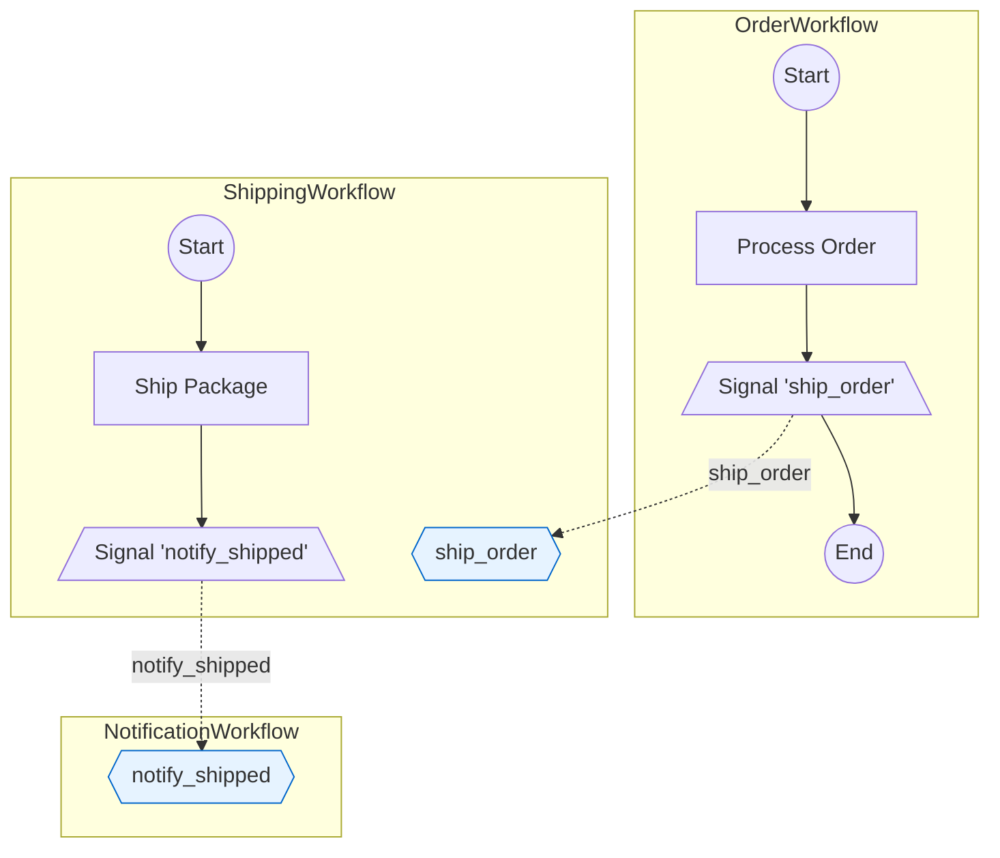

# temporalio-graphs

Static analysis for Temporal Python workflows that outputs Mermaid diagrams covering every possible execution path.

## What it does
- Parses workflow source with Python's AST; no Temporal server or activity execution required.
- Detects activities, decision points (`to_decision`), signal/wait points (`wait_condition`), and child workflow calls.
- Generates every path permutation (2^n across decisions + signals) with configurable limits to prevent explosion.
- Emits validation warnings for unreachable activities and branch-limit overruns.
- Optional multi-workflow view for `execute_child_workflow()` using reference, inline, or subgraph rendering modes.

## Install
```bash
# Recommended for development
uv pip install temporalio-graphs

# Standard
pip install temporalio-graphs
```
Requires Python 3.10+ and `temporalio>=1.7.1`.

## Quick start
```python
from datetime import timedelta
from temporalio import workflow
from temporalio_graphs import analyze_workflow, to_decision, wait_condition

@workflow.defn
class PaymentWorkflow:
    def __init__(self) -> None:
        self.approved = False

    @workflow.run
    async def run(self, amount: int) -> str:
        await workflow.execute_activity(validate_payment, amount)

        if await to_decision(amount > 1_000, "HighValue"):
            await workflow.execute_activity(require_approval, amount)

        if await wait_condition(lambda: self.approved, timedelta(hours=24), "WaitForApproval"):
            await workflow.execute_activity(process_payment, amount)
            return "approved"

        await workflow.execute_activity(handle_timeout, amount)
        return "timeout"

print(analyze_workflow("payment_workflow.py"))  # Mermaid diagram string
```
String literal names are required for `to_decision(..., "Name")` and `wait_condition(..., "Name")` so they can be detected statically.

## Configuration (GraphBuildingContext)
Create a context and pass it to `analyze_workflow()` or `analyze_workflow_graph()`.
```python
from temporalio_graphs import GraphBuildingContext

context = GraphBuildingContext(
    max_decision_points=10,   # decisions + signals allowed before warning
    max_paths=1024,           # hard cap on generated paths
    split_names_by_words=True,
    include_path_list=True,   # included when output_format="full"
    output_format="full",    # "mermaid", "paths", or "full"
    child_workflow_expansion="reference",  # also "inline" or "subgraph"
    graph_output_file=None,   # write to file when set
)
```
Key defaults: start/end labels `"Start"`/`"End"`, decision edge labels `"yes"`/`"no"`, signal edges `"Signaled"`/`"Timeout"`.

### Signal Visualization Options (Epic 8)
For `analyze_signal_graph()`, additional context options control signal discovery:
```python
context = GraphBuildingContext(
    # Maximum recursion depth for signal-based workflow discovery (default: 10)
    signal_max_discovery_depth=10,
    # Emit warnings for signals that cannot be resolved to handlers (default: True)
    warn_unresolved_signals=True,
    # Strategy: "by_name" (default), "explicit", or "hybrid"
    signal_resolution_strategy="by_name",
    # Visualization mode: "subgraph" (default) or "unified"
    signal_visualization_mode="subgraph",
)
```

| Option | Type | Default | Description |
|--------|------|---------|-------------|
| `resolve_signal_targets` | `bool` | `False` | Enable signal resolution for cross-workflow visualization |
| `signal_target_search_paths` | `tuple[Path, ...]` | `()` | Additional directories to search for target workflows |
| `signal_resolution_strategy` | `Literal` | `"by_name"` | Strategy: `"by_name"`, `"explicit"`, `"hybrid"` |
| `signal_visualization_mode` | `Literal` | `"subgraph"` | Mode: `"subgraph"` or `"unified"` |
| `signal_max_discovery_depth` | `int` | `10` | Maximum recursion depth for signal chain discovery |
| `warn_unresolved_signals` | `bool` | `True` | Emit warnings for unresolved signals |

## Multi-workflow graphs
Use `analyze_workflow_graph()` when a parent workflow spawns children via `execute_child_workflow()`.
```python
from temporalio_graphs import analyze_workflow_graph, GraphBuildingContext

context = GraphBuildingContext(child_workflow_expansion="inline")
diagram = analyze_workflow_graph(
    "parent_workflow.py",
    workflow_search_paths=["./workflows"],
    context=context,
)
```
`child_workflow_expansion` modes:
- `reference` (default): render children as `[[ChildWorkflow]]` nodes without multiplying paths.
- `inline`: full end-to-end paths across parent and children.
- `subgraph`: separate Mermaid subgraphs for each workflow.

## Cross-Workflow Signal Visualization
Use `analyze_signal_graph()` when workflows communicate via peer-to-peer signals (external workflow handles).
```python
from temporalio_graphs import analyze_signal_graph

# Analyze workflows connected by signals (Order -> Shipping -> Notification)
diagram = analyze_signal_graph(
    "workflows/order_workflow.py",
    search_paths=["workflows/"],
)
print(diagram)  # Mermaid diagram with connected subgraphs
```

Example output showing three workflows connected by signals:


### Signal Visualization Syntax
| Element | Mermaid Syntax | Purpose |
|---------|---------------|---------|
| Subgraph wrapper | `subgraph Name ... end` | Groups workflow nodes |
| Signal handler | `{{signal_name}}` | Hexagon for signal reception |
| External signal | `[/Signal 'name'\]` | Trapezoid for signal send |
| Cross-workflow edge | `-.signal_name.->` | Dashed edge between workflows |
| Handler styling | `fill:#e6f3ff,stroke:#0066cc` | Blue color for hexagons |
| Unresolved signal | `[/?/]` | Warning node when handler not found |

### Signal Types Comparison
| Signal Type | Function | Shape |
|-------------|----------|-------|
| Internal (Epic 4) | `wait_condition()` | Hexagon `{{name}}` |
| Parent-Child (Epic 6) | `execute_child_workflow()` | Subroutine `[[name]]` |
| Peer-to-Peer (Epic 7-8) | `get_external_workflow_handle().signal()` | Trapezoid + Hexagon |

## Examples
Run the curated examples (linear, branching, signals, multi-decision, cross-workflow signals):
```bash
make run-examples
# or individually
python examples/simple_linear/run.py        # Linear workflow (Epic 2)
python examples/money_transfer/run.py       # Decision branches (Epic 3)
python examples/signal_workflow/run.py      # Wait conditions (Epic 4)
python examples/multi_decision/run.py       # Multiple decisions
python examples/signal_flow/run.py          # Cross-workflow signals (Epic 8)
```

The `examples/signal_flow/` directory demonstrates peer-to-peer workflow signaling with three connected workflows (Order -> Shipping -> Notification). See `expected_output.md` for the expected Mermaid diagram.

## Troubleshooting
- **Too many branches**: Raise `max_decision_points` / `max_paths` in `GraphBuildingContext` or simplify the workflow; errors include the calculated path count.
- **Names missing**: Decision/signal names must be string literals; variables and f-strings are ignored by static analysis.
- **Unsupported flow**: Loops or dynamic activity names are not graphed; refactor to explicit steps or decisions.
- **Signals not resolved**: Ensure `search_paths` includes directories containing target workflow files with `@workflow.signal` handlers.
- **Unresolved signal `[/?/]` node**: Target workflow not found in search paths or no matching `@workflow.signal` handler exists. Check that signal name matches handler method name.
- **Multiple handlers warning**: Multiple workflows handle the same signal name. This may be intentional (e.g., broadcast signals) or indicate naming conflicts. Review handler implementations.

## Development
```bash
uv venv && source .venv/bin/activate
uv sync
pytest -v --cov=src/temporalio_graphs
mypy src/
ruff check src/ tests/ examples/
ruff format src/ tests/ examples/
```

## Reference
- API: `docs/api-reference.md`
- Architecture rationale: `docs/architecture.md`, `spike/EXECUTIVE_SUMMARY.md`
- Examples: `examples/`
- License: MIT (`LICENSE`)
