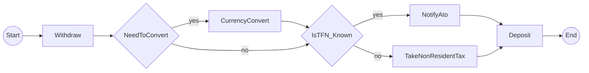

# temporalio-graphs

Generate complete workflow visualizations as Mermaid diagrams for Temporal workflows using static code analysis.

## Status

🚀 **Production-Ready** - Epic 5 (Production Readiness) In Progress

**Test Quality:** 406 tests passing, 95% coverage, <1s execution time

**Completed Epics:**
- Epic 1: Foundation & Project Setup ✅
- Epic 2: Basic Graph Generation (Linear Workflows) ✅
- Epic 3: Decision Node Support (Branching Workflows) ✅
- Epic 4: Signal & Wait Condition Support ✅

**Epic 5 Progress (2/5 stories complete):**
- Story 5-1: Validation Warnings ✅ (Unreachable activity detection)
- Story 5-2: Error Handling Hierarchy 🔄 (75% complete, integration tests needed)
- Story 5-3: Path List Output Format (Backlog)
- Story 5-4: Comprehensive Example Gallery (Backlog)
- Story 5-5: Production-Grade Documentation (Backlog)

## Overview

Unlike DAG-based workflow engines, Temporal workflows don't provide complete visualization of all possible execution paths. This library generates Mermaid diagrams showing **ALL** possible workflow paths by analyzing workflow code structure using Python's AST (Abstract Syntax Tree).

### Key Innovation

- **Static Analysis Approach**: Analyzes workflow code without executing it
- **Complete Path Coverage**: Generates 2^n paths for n decision points
- **Fast**: < 1ms analysis time vs exponential execution time
- **No Runtime Dependencies**: Works on source code directly

## Architecture Decision

After evaluating three approaches (mock execution, history parsing, static analysis), we chose **static code analysis** because:

1. Python Temporal SDK interceptors cannot mock activity return values (unlike .NET)
2. Generates ALL possible paths without workflow execution
3. Performance: sub-millisecond vs exponential execution time
4. Matches conceptual model of .NET reference implementation

See `/spike/EXECUTIVE_SUMMARY.md` for detailed rationale.

## Installation

```bash
# Once published to PyPI
pip install temporalio-graphs

# Development installation
git clone https://github.com/yourusername/temporalio-graphs
cd temporalio-graphs
uv venv
source .venv/bin/activate
uv sync
```

## Quick Start

### Basic Usage (3 lines)

Analyze a workflow and get a Mermaid diagram:

```python
from temporalio_graphs import analyze_workflow

result = analyze_workflow("my_workflow.py")
print(result)  # Prints Mermaid diagram
```

## Examples

The library includes comprehensive examples demonstrating different workflow patterns and visualization capabilities. Examples are ordered by complexity to provide a clear learning path.

### Running All Examples

Run all examples at once using the Makefile:

```bash
make run-examples
```

Or run individual examples as shown below.

### 1. Simple Linear Workflow (Beginner)

**Pattern**: Sequential activities with no branching
**Path Count**: 1 path (no decisions)
**Use Case**: Basic workflow pipelines, ETL processes, simple data transformations

```bash
python examples/simple_linear/run.py
```

This demonstrates the simplest workflow pattern with 3 sequential activities:

```python
@workflow.defn
class SimpleWorkflow:
    @workflow.run
    async def run(self) -> str:
        await workflow.execute_activity(validate_input, ...)
        await workflow.execute_activity(process_data, ...)
        await workflow.execute_activity(save_result, ...)
        return "complete"
```

**Output**: Linear flowchart showing validate_input → process_data → save_result

**Learn More**: See [`examples/simple_linear/`](examples/simple_linear/) for complete code and documentation.

---

### 2. MoneyTransfer Workflow (Intermediate)

**Pattern**: Multiple decision points with conditional branches
**Path Count**: 4 paths (2 decisions = 2^2)
**Use Case**: Business workflows with conditional logic, approval processes, branching pipelines

```bash
python examples/money_transfer/run.py
```

This demonstrates decision-based branching with 2 decision points creating 4 execution paths:

```python
from temporalio_graphs import to_decision

@workflow.defn
class MoneyTransferWorkflow:
    @workflow.run
    async def run(self, source_currency: str, dest_currency: str, tfn_known: bool) -> str:
        await workflow.execute_activity(withdraw_funds, ...)

        # Decision 1: Currency conversion needed?
        if await to_decision(source_currency != dest_currency, "NeedToConvert"):
            await workflow.execute_activity(currency_convert, ...)

        # Decision 2: Tax file number known?
        if await to_decision(tfn_known, "IsTFN_Known"):
            await workflow.execute_activity(notify_ato, ...)
        else:
            await workflow.execute_activity(take_non_resident_tax, ...)

        await workflow.execute_activity(deposit_funds, ...)
        return "transfer_complete"
```

**Key Features**:
- Decision nodes rendered as diamonds: `d0{Need To Convert}`, `d1{Is TFN_Known}`
- Yes/No branch labels on decision edges
- Conditional activities execute only on specific paths
- Reconverging branches (deposit_funds executes on all paths)

**Learn More**: See [`examples/money_transfer/`](examples/money_transfer/) for complete code and all 4 execution paths.

---

### 3. Signal Workflow (Intermediate)

**Pattern**: Asynchronous wait conditions with timeouts
**Path Count**: 2 paths (Signaled vs Timeout)
**Use Case**: Approval workflows, event-driven processes, human-in-the-loop patterns

```bash
python examples/signal_workflow/run.py
```

This demonstrates signal/wait condition patterns with timeout handling:

```python
from temporalio_graphs import wait_condition
from datetime import timedelta

@workflow.defn
class ApprovalWorkflow:
    def __init__(self) -> None:
        self.approved = False

    @workflow.run
    async def run(self, request_id: str) -> str:
        await workflow.execute_activity(submit_request, ...)

        # Wait for signal with timeout
        if await wait_condition(
            lambda: self.approved,
            timedelta(hours=24),
            "WaitForApproval"
        ):
            # Signaled branch
            await workflow.execute_activity(process_approved, ...)
            return "approved"
        else:
            # Timeout branch
            await workflow.execute_activity(handle_timeout, ...)
            return "timeout"

    @workflow.signal
    async def approve(self) -> None:
        self.approved = True
```

**Key Features**:
- Signal nodes rendered as hexagons: `{{Wait For Approval}}`
- Two execution paths: Signaled (approval received) and Timeout (no approval)
- Conditional activities based on signal outcome
- Models asynchronous wait patterns common in real workflows

**Learn More**: See [`examples/signal_workflow/`](examples/signal_workflow/) for complete code and explanation.

---

### 4. Multi-Decision Workflow (Advanced)

**Pattern**: Multiple independent decision points with complex path permutations
**Path Count**: 8 paths (3 decisions = 2^3)
**Use Case**: Complex approval workflows, multi-criteria evaluation, loan processing, risk assessment

```bash
python examples/multi_decision/run.py
```

This demonstrates complex workflows with 3 independent decision points creating 8 execution paths:

```python
from temporalio_graphs import to_decision

@workflow.defn
class LoanApprovalWorkflow:
    @workflow.run
    async def run(self, amount: float, credit_score: int, has_existing_loans: bool) -> str:
        await workflow.execute_activity(validate_application, ...)

        # Decision 1: High-value loan? (>$10,000)
        if await to_decision(amount > 10000, "HighValue"):
            await workflow.execute_activity(manager_review, ...)

        # Decision 2: Low credit score? (<600)
        if await to_decision(credit_score < 600, "LowCredit"):
            await workflow.execute_activity(require_collateral, ...)

        # Decision 3: Existing loans?
        if await to_decision(has_existing_loans, "ExistingLoans"):
            await workflow.execute_activity(debt_ratio_check, ...)

        await workflow.execute_activity(approve_loan, ...)
        return "loan_approved"
```

**Key Features**:
- Three independent decision points creating 8 distinct execution paths
- Path permutations: each combination of yes/no decisions generates a unique path
- Demonstrates real-world business logic (loan approval criteria)
- Shows how 2^n path explosion works (3 decisions = 2³ = 8 paths)

**All 8 Execution Paths**:
1. No special checks (fast-track approval)
2. Debt ratio check only
3. Collateral required only
4. Collateral + debt ratio check
5. Manager review only
6. Manager review + debt ratio check
7. Manager review + collateral
8. All checks (manager + collateral + debt ratio)

**Learn More**: See [`examples/multi_decision/`](examples/multi_decision/) for complete code and detailed path analysis.

---

### Example Structure

Each example follows a consistent structure:
- `workflow.py` - Complete Temporal workflow with proper decorators and type hints
- `run.py` - Script demonstrating `analyze_workflow()` API usage
- `expected_output.md` - Golden file with complete Mermaid diagram and path list

### When to Use Each Example

- **Simple Linear**: Learning the basics, testing library installation, simple pipelines
- **MoneyTransfer**: Understanding decision nodes, learning conditional branching
- **Signal Workflow**: Implementing approval flows, event-driven patterns, timeout handling
- **Multi-Decision**: Complex business logic, multi-criteria evaluation, understanding path explosion

### Using Decision Points

Mark decision points in your workflow using the `to_decision()` helper function to enable graph generation with branching paths:

```python
from temporalio import workflow, activity
from temporalio_graphs import to_decision

@activity.defn
async def process_high_value(amount: int) -> str:
    """Handle high-value transactions."""
    return f"High-value processing: {amount}"

@activity.defn
async def process_regular(amount: int) -> str:
    """Handle regular transactions."""
    return f"Regular processing: {amount}"

@workflow.defn
class PaymentWorkflow:
    @workflow.run
    async def run(self, amount: int) -> str:
        # Mark decision point with to_decision()
        if await to_decision(amount > 5000, "HighValue"):
            return await workflow.execute_activity(
                process_high_value, amount, schedule_to_close_timeout=600
            )
        else:
            return await workflow.execute_activity(
                process_regular, amount, schedule_to_close_timeout=600
            )
```

The `to_decision()` function marks boolean expressions as decision nodes in your workflow graph. It's a transparent passthrough - at runtime it simply returns the input boolean value unchanged while serving as a marker for static analysis.

**Important**: The decision name must be a string literal (not a variable or f-string) for static analysis to extract it:

```python
# ✅ Correct - string literal
if await to_decision(amount > 5000, "HighValue"):
    pass

# ❌ Incorrect - variable name won't be detected
decision_name = "HighValue"
if await to_decision(amount > 5000, decision_name):
    pass

# ❌ Incorrect - f-string won't be detected
if await to_decision(amount > 5000, f"Check_{item}"):
    pass
```

### Using Signal/Wait Conditions

Mark signal points in your workflow using the `wait_condition()` helper function to visualize asynchronous wait patterns:

```python
from temporalio import workflow
from temporalio_graphs import wait_condition
from datetime import timedelta

@workflow.defn
class ApprovalWorkflow:
    def __init__(self) -> None:
        self.approved = False

    @workflow.run
    async def run(self, request_id: str) -> str:
        # Submit request
        await workflow.execute_activity(submit_request, args=[request_id], ...)

        # Wait for approval signal (creates hexagon node in graph)
        if await wait_condition(
            lambda: self.approved,
            timedelta(hours=24),
            "WaitForApproval",  # Signal name (must be string literal)
        ):
            # Signaled branch
            await workflow.execute_activity(process_approved, ...)
            return "approved"
        else:
            # Timeout branch
            await workflow.execute_activity(handle_timeout, ...)
            return "timeout"

    @workflow.signal
    async def approve(self) -> None:
        self.approved = True
```

**Important Notes:**
- Signal names must be **string literals** (not variables or f-strings) for static analysis
- Returns `True` if signaled before timeout, `False` if timeout occurs
- Creates hexagon-shaped nodes in Mermaid diagrams: `{{NodeName}}`
- Generates two execution paths: "Signaled" and "Timeout"

### Advanced Usage with Custom Configuration

Customize node labels and output location:

```python
from temporalio_graphs import analyze_workflow, GraphBuildingContext

context = GraphBuildingContext(
    split_names_by_words=False,
    start_node_label="BEGIN",
    end_node_label="FINISH",
    graph_output_file="workflow_diagram.md"
)
result = analyze_workflow("my_workflow.py", context)
```

## Configuration

All configuration options are provided via the `GraphBuildingContext` dataclass. The context is immutable and flows through the entire analysis pipeline. Default values support typical use cases; customize for specific requirements.

### Configuration Options

| Option | Type | Default | Purpose |
|--------|------|---------|---------|
| `split_names_by_words` | bool | True | Convert camelCase activity names to "camel Case" in labels |
| `start_node_label` | str | "Start" | Custom label for workflow start node |
| `end_node_label` | str | "End" | Custom label for workflow end node |
| `suppress_validation` | bool | False | Disable validation warnings (e.g., path explosion) |
| `max_decision_points` | int | 10 | Maximum allowed decision points (prevents 2^n path explosion) |
| `max_paths` | int | 1024 | Maximum allowed total execution paths |
| `graph_output_file` | Path \| None | None | Write output to file instead of returning string |

### Configuration Examples

#### Example 1: Disable Word Splitting for Acronyms

When your activities use acronyms or prefer exact naming:

```python
from temporalio_graphs import analyze_workflow, GraphBuildingContext

context = GraphBuildingContext(split_names_by_words=False)
result = analyze_workflow("workflow.py", context)
# Output: "fetchAPIData" stays as "fetchAPIData", not "fetch A P I Data"
```

#### Example 2: Custom Domain Terminology

Use domain-specific labels for start/end nodes:

```python
context = GraphBuildingContext(
    start_node_label="Initiate",
    end_node_label="Complete"
)
result = analyze_workflow("workflow.py", context)
# Output: "i((Initiate)) --> ... --> e((Complete))"
```

#### Example 3: Complex Workflows with Many Decisions

Increase limits for workflows with many decision points (Epic 3+):

```python
context = GraphBuildingContext(
    max_decision_points=15,  # Allows up to 32,768 paths (2^15)
    max_paths=32768
)
result = analyze_workflow("workflow.py", context)
# Note: May generate large diagrams; consider breaking into sub-workflows
```

#### Example 4: File Output for CI/CD Integration

Automatically write generated diagrams to files:

```python
from pathlib import Path

context = GraphBuildingContext(
    graph_output_file=Path("docs/workflow_diagram.md")
)
result = analyze_workflow("workflow.py", context)
# File is created at docs/workflow_diagram.md
# Result is still returned and can be printed/processed
```

#### Example 5: Quick Analysis Without Validation

Suppress validation warnings for rapid iteration:

```python
context = GraphBuildingContext(suppress_validation=True)
result = analyze_workflow("workflow.py", context)
# No validation warnings printed, only diagram output
```

#### Example 6: Combined Configuration

Use multiple options together for full control:

```python
from pathlib import Path

context = GraphBuildingContext(
    split_names_by_words=False,
    start_node_label="WORKFLOW_START",
    end_node_label="WORKFLOW_END",
    suppress_validation=True,
    max_decision_points=10,
    graph_output_file=Path("output/diagram.md")
)
result = analyze_workflow("complex_workflow.py", context)
```

### Performance Implications

- **Word Splitting**: O(n) where n = activity name length. Negligible performance impact.
- **Max Decision Points**: Prevents path explosion. Default (10) generates up to 1024 paths. Epic 3 will support decision-based path generation; larger limits increase generation time exponentially (2^n).
- **File Output**: Adds I/O time proportional to diagram size. Minimal impact (<5ms typical).

### Configuration Validation

Invalid configuration raises `ValueError` with clear error messages:

```python
# Negative max_decision_points raises ValueError
context = GraphBuildingContext(max_decision_points=-1)
# ValueError: max_decision_points must be positive, got -1.
# Consider increasing this value (default: 10)
```

All configuration is validated when `analyze_workflow()` is called.

## Error Handling

The library provides comprehensive error handling with actionable error messages for all failure modes.

### Exception Hierarchy

All library exceptions inherit from `TemporalioGraphsError`, enabling you to catch all library errors with a single except clause:

```python
from temporalio_graphs import (
    analyze_workflow,
    TemporalioGraphsError,
    WorkflowParseError,
    GraphGenerationError,
    UnsupportedPatternError,
)

try:
    result = analyze_workflow("my_workflow.py")
    print(result)
except WorkflowParseError as e:
    # Handle parsing errors (missing decorators, syntax errors, file not found)
    print(f"Parse error at {e.file_path}:{e.line}")
    print(f"Suggestion: {e.suggestion}")
except GraphGenerationError as e:
    # Handle generation errors (path explosion, rendering failures)
    print(f"Generation failed: {e.reason}")
    if e.context:
        print(f"Context: {e.context}")
except TemporalioGraphsError as e:
    # Catch all other library errors
    print(f"Library error: {e}")
```

### Exception Types

| Exception | Raised When | Attributes |
|-----------|-------------|------------|
| `WorkflowParseError` | Workflow file cannot be parsed, missing decorators, syntax errors, file not found | `file_path`, `line`, `message`, `suggestion` |
| `UnsupportedPatternError` | Workflow uses patterns beyond MVP scope (loops, dynamic activity names) | `pattern`, `suggestion`, `line` |
| `GraphGenerationError` | Graph generation fails (path explosion, rendering failures) | `reason`, `context` (dict with details) |
| `InvalidDecisionError` | Helper functions used incorrectly (to_decision, wait_condition) | `function`, `issue`, `suggestion` |

### Common Errors

**Missing Decorator:**
```
WorkflowParseError: Cannot parse workflow file: workflow.py
Line 10: Missing @workflow.defn decorator
Suggestion: Add @workflow.defn decorator to workflow class
```

**Path Explosion:**
```
GraphGenerationError: Graph generation failed: Too many decision points (12) would generate 4096 paths (limit: 1024)
Context: {'decision_count': 12, 'limit': 10, 'paths': 4096}
Suggestion: Refactor workflow to reduce decisions or increase max_decision_points
```

**File Not Found:**
```
WorkflowParseError: Cannot parse workflow file: missing_workflow.py
Line 0: Workflow file not found
Suggestion: Verify file path is correct
```

All error messages include actionable suggestions to help you fix the issue quickly.

## Features

### Completed (Epics 1-4)

**Core Analysis (Epic 2):**
- ✅ Static code analysis using Python AST
- ✅ Linear workflow detection (0 decision points)
- ✅ Activity tracking and sequencing
- ✅ Mermaid flowchart LR syntax output
- ✅ Public API with analyze_workflow() function
- ✅ Type-safe configuration via GraphBuildingContext

**Decision Support (Epic 3):**
- ✅ Decision point detection with `to_decision()` helper
- ✅ Path permutation generation (2^n paths for n decisions)
- ✅ Decision node rendering in Mermaid (diamond shapes)
- ✅ MoneyTransfer example workflow (2 decisions, 4 paths)

**Signal Support (Epic 4):**
- ✅ Signal/wait condition detection with `wait_condition()` helper
- ✅ Signal node rendering in Mermaid (hexagon shapes)
- ✅ Timeout vs Signaled path branches
- ✅ ApprovalWorkflow example

**Production Readiness (Epic 5 - Partial):**
- ✅ Validation warnings (unreachable activity detection)
- ✅ Comprehensive error handling hierarchy (5 exception types)
- ✅ Complete test coverage (406 tests, 95% coverage)

### In Progress (Epic 5 Remaining)

- 🔄 Path list output format (text-based alternative to Mermaid)
- 🔄 Comprehensive example gallery
- 🔄 Production-grade documentation

### Planned (Post-MVP)

- 🚧 CLI interface (command-line tool)
- 🚧 Multiple output formats (JSON, DOT)
- 🚧 Loop detection and warnings
- 🚧 Complex control flow patterns

## Project Structure

```
/spike/                          # Architecture validation (COMPLETE)
  ├── EXECUTIVE_SUMMARY.md       # Decision rationale
  ├── findings.md                # Technical analysis
  └── temporal-spike/            # Working prototypes
      └── approach3_static_analysis.py  # ✅ RECOMMENDED

/src/temporalio_graphs/          # Python implementation (IN PROGRESS)
/tests/                          # Test suite
/examples/                       # Example workflows
```

## Development

```bash
# Setup environment (always use uv)
uv venv
source .venv/bin/activate
uv sync

# Run tests
pytest -v --cov=src/temporalio_graphs

# Type checking
mypy src/

# Linting
ruff check src/
ruff format src/
```

## Implementation Plan

See [IMPLEMENTATION_PLAN.md](./IMPLEMENTATION_PLAN.md) for the complete 15.5-hour phased implementation plan with 7 quality gate reviews.

**Current Status**: Phase 0.5 Complete ✅ - Ready for Phase 1

## How It Works

1. **AST Parsing**: Parse Python workflow source files
2. **Decision Detection**: Identify branching logic (if/else, conditions)
3. **Path Generation**: Create 2^n execution paths for n decisions
4. **Graph Building**: Construct workflow graph from paths
5. **Mermaid Output**: Convert to flowchart syntax

## Example Output

MoneyTransfer workflow with 2 decision points generates 4 paths:



## Contributing

Contributions welcome! Please see the implementation plan for current priorities.

## License

MIT

## Sponsors

This project is made possible by the generous support of:

- [@davidhw](https://github.com/davidhw) - Original bounty sponsor

## Credits

Python port of [Temporalio.Graphs (.NET)](https://github.com/oleg-shilo/Temporalio.Graphs) with architectural adaptations for Python SDK constraints.
