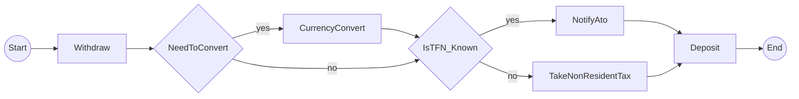

# temporalio-graphs

Generate complete workflow visualizations as Mermaid diagrams for Temporal workflows using static code analysis.

## Status

🚧 **Under Development** - Epic 2 (Basic Graph Generation) In Progress
- Story 2-1: Core Data Models ✅
- Story 2-2: AST Workflow Analyzer ✅
- Story 2-3: Activity Detection 🔄 (Review)
- Story 2-4: Path Generator ✅
- Story 2-5: Mermaid Renderer ✅
- Story 2-6: Public API Entry Point ✅ (This Release)
- Story 2-7: Configuration Options (Next)

## Overview

Unlike DAG-based workflow engines, Temporal workflows don't provide complete visualization of all possible execution paths. This library generates Mermaid diagrams showing **ALL** possible workflow paths by analyzing workflow code structure using Python's AST (Abstract Syntax Tree).

### Key Innovation

- **Static Analysis Approach**: Analyzes workflow code without executing it
- **Complete Path Coverage**: Generates 2^n paths for n decision points
- **Fast**: < 1ms analysis time vs exponential execution time
- **No Runtime Dependencies**: Works on source code directly

## Architecture Decision

After evaluating three approaches (mock execution, history parsing, static analysis), we chose **static code analysis** because:

1. Python Temporal SDK interceptors cannot mock activity return values (unlike .NET)
2. Generates ALL possible paths without workflow execution
3. Performance: sub-millisecond vs exponential execution time
4. Matches conceptual model of .NET reference implementation

See `/spike/EXECUTIVE_SUMMARY.md` for detailed rationale.

## Installation

```bash
# Once published to PyPI
pip install temporalio-graphs

# Development installation
git clone https://github.com/yourusername/temporalio-graphs
cd temporalio-graphs
uv venv
source .venv/bin/activate
uv sync
```

## Quick Start

### Basic Usage (3 lines)

Analyze a workflow and get a Mermaid diagram:

```python
from temporalio_graphs import analyze_workflow

result = analyze_workflow("my_workflow.py")
print(result)  # Prints Mermaid diagram
```

### Advanced Usage with Custom Configuration

Customize node labels and output location:

```python
from temporalio_graphs import analyze_workflow, GraphBuildingContext

context = GraphBuildingContext(
    split_names_by_words=False,
    start_node_label="BEGIN",
    end_node_label="FINISH",
    graph_output_file="workflow_diagram.md"
)
result = analyze_workflow("my_workflow.py", context)
```

See `/examples/simple_linear/` for complete working examples.

## Features

### Completed (Epic 2: Basic Graph Generation)

- ✅ Static code analysis using Python AST
- ✅ Linear workflow detection (0 decision points)
- ✅ Activity tracking and sequencing
- ✅ Mermaid flowchart LR syntax output
- ✅ Public API with analyze_workflow() function
- ✅ Type-safe configuration via GraphBuildingContext
- ✅ Complete test coverage (>95%)

### Planned (Epic 3+)

- 🚧 Decision point detection (if/else, conditions)
- 🚧 Path permutation generation (2^n paths for n decisions)
- 🚧 Signal and wait condition support
- 🚧 CLI interface
- 🚧 Multiple output formats (JSON, path lists)

## Project Structure

```
/spike/                          # Architecture validation (COMPLETE)
  ├── EXECUTIVE_SUMMARY.md       # Decision rationale
  ├── findings.md                # Technical analysis
  └── temporal-spike/            # Working prototypes
      └── approach3_static_analysis.py  # ✅ RECOMMENDED

/src/temporalio_graphs/          # Python implementation (IN PROGRESS)
/tests/                          # Test suite
/examples/                       # Example workflows
```

## Development

```bash
# Setup environment (always use uv)
uv venv
source .venv/bin/activate
uv sync

# Run tests
pytest -v --cov=src/temporalio_graphs

# Type checking
mypy src/

# Linting
ruff check src/
ruff format src/
```

## Implementation Plan

See [IMPLEMENTATION_PLAN.md](./IMPLEMENTATION_PLAN.md) for the complete 15.5-hour phased implementation plan with 7 quality gate reviews.

**Current Status**: Phase 0.5 Complete ✅ - Ready for Phase 1

## How It Works

1. **AST Parsing**: Parse Python workflow source files
2. **Decision Detection**: Identify branching logic (if/else, conditions)
3. **Path Generation**: Create 2^n execution paths for n decisions
4. **Graph Building**: Construct workflow graph from paths
5. **Mermaid Output**: Convert to flowchart syntax

## Example Output

MoneyTransfer workflow with 2 decision points generates 4 paths:



## Contributing

Contributions welcome! Please see the implementation plan for current priorities.

## License

MIT

## Sponsors

This project is made possible by the generous support of:

- [@davidhw](https://github.com/davidhw) - Original bounty sponsor

## Credits

Python port of [Temporalio.Graphs (.NET)](https://github.com/oleg-shilo/Temporalio.Graphs) with architectural adaptations for Python SDK constraints.
