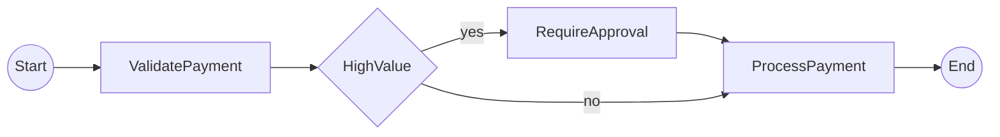
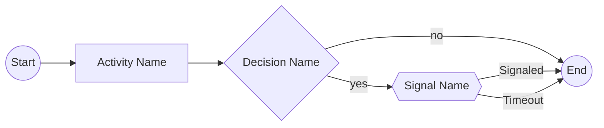

# temporalio-graphs

[](https://pypi.org/project/temporalio-graphs/)
[](https://pypi.org/project/temporalio-graphs/)
[](LICENSE)
[](https://github.com/yourusername/temporalio-graphs)
[](https://github.com/yourusername/temporalio-graphs)

Generate complete workflow visualization diagrams for Temporal workflows using static code analysis.

## Table of Contents

- [Overview](#overview)
- [Key Features](#key-features)
- [Installation](#installation)
- [Quick Start](#quick-start)
- [Core Concepts](#core-concepts)
- [Configuration](#configuration)
- [Examples](#examples)
- [Troubleshooting](#troubleshooting)
- [Architecture: Python vs .NET](#architecture-python-vs-net)
- [API Reference](#api-reference)
- [Development](#development)
- [Contributing](#contributing)
- [License](#license)
- [Credits](#credits)

## Overview

Unlike DAG-based workflow engines, Temporal workflows don't provide complete visualization of all possible execution paths. This library generates Mermaid diagrams showing **ALL** possible workflow paths by analyzing workflow code structure using Python's AST (Abstract Syntax Tree).

**The Innovation:** Most workflow engines visualize only executed paths. temporalio-graphs uses static code analysis to generate complete path coverage (2^n paths for n decision points) without executing any workflow code. Perfect for documentation, code review, and workflow understanding.

### Why temporalio-graphs?

- **Complete Path Coverage**: See all possible execution paths, not just executed ones
- **Zero Runtime Overhead**: Pure static analysis - no workflow execution required
- **Blazing Fast**: <1ms analysis time vs exponential execution time
- **No Mock Setup**: Unlike runtime approaches, no interceptor or mock configuration needed
- **Production Ready**: 95% test coverage, comprehensive error handling, actionable error messages

## Key Features

### Core Capabilities

- **Static AST Analysis**: Analyzes workflow code without executing it
- **Complete Path Visualization**: Generates 2^n paths for n decision points
- **Decision Node Support**: Mark decision points with `to_decision()` helper
- **Signal Node Support**: Mark wait conditions with `wait_condition()` helper
- **Mermaid Output**: Industry-standard flowchart LR syntax
- **Path List Format**: Text-based alternative for CI/CD integration
- **Validation Warnings**: Detects unreachable activities and path explosion
- **Comprehensive Error Handling**: 5 exception types with actionable messages

### Configuration Options

- Customizable node labels (Start/End, Yes/No, Signaled/Timeout)
- Word splitting control for activity names
- Path explosion limits (max decisions, max paths)
- File output support for CI/CD pipelines
- Validation control (suppress warnings, include reports)

### Output Formats

- **Mermaid Diagrams**: Flowchart LR syntax for GitHub, GitLab, Notion, etc.
- **Path Lists**: Text-based execution path enumeration
- **Full Mode**: Combined Mermaid + path list + validation report

## Installation

### Using pip (recommended for production)

```bash
pip install temporalio-graphs
```

### Using uv (recommended for development)

```bash
uv pip install temporalio-graphs
```

### Using poetry

```bash
poetry add temporalio-graphs
```

### From source (development)

```bash
git clone https://github.com/yourusername/temporalio-graphs
cd temporalio-graphs
uv venv
source .venv/bin/activate  # On Windows: .venv\Scripts\activate
uv sync
```

### Requirements

- Python 3.10+ (3.11+ recommended)
- temporalio >= 1.7.1

## Quick Start

Analyze a workflow and generate a Mermaid diagram in 3 lines:

```python
from temporalio_graphs import analyze_workflow

result = analyze_workflow("my_workflow.py")
print(result)
```

That's it! The `analyze_workflow()` function performs static analysis on your workflow source file and returns a complete Mermaid flowchart showing all possible execution paths.

## Core Concepts

Understanding how temporalio-graphs works will help you write better workflows and interpret generated diagrams effectively.

### Static AST Analysis

**How it works:** The library parses your workflow source code into an Abstract Syntax Tree (AST) and analyzes the structure to detect activities, decision points, and control flow - all without executing any code.

**Benefits:**
- **No execution required**: Analyze workflows without setting up Temporal server or activities
- **Complete coverage**: Detects all possible paths, not just executed ones
- **Fast**: Sub-millisecond analysis time vs exponential execution time
- **Safe**: No side effects from running workflow code

**Comparison with other approaches:**

| Approach | Analysis Time | Path Coverage | Execution Required |
|----------|---------------|---------------|-------------------|
| **Static Analysis (Python)** | <1ms | 100% (all paths) | No |
| Runtime Interceptors (.NET) | 2^n executions | 100% (all paths) | Yes |
| History Parsing | Instant | Partial (executed only) | Yes |

### Decision Nodes

Decision nodes represent branching logic in your workflow. Each decision creates **2 execution paths** (yes and no branches).

**Path Permutations Formula:** For n independent decisions, the workflow has **2^n total paths**.

**Examples:**
- 1 decision = 2^1 = 2 paths
- 2 decisions = 2^2 = 4 paths
- 3 decisions = 2^3 = 8 paths
- 10 decisions = 2^10 = 1,024 paths (default limit)

**Marking Decision Points:**

Use the `to_decision()` helper to mark boolean expressions as decision nodes:

```python
from temporalio import workflow
from temporalio_graphs import to_decision

@workflow.defn
class PaymentWorkflow:
    @workflow.run
    async def run(self, amount: int) -> str:
        await workflow.execute_activity(validate_payment, amount)

        # Mark this as a decision point
        if await to_decision(amount > 1000, "HighValue"):
            await workflow.execute_activity(require_approval, amount)

        await workflow.execute_activity(process_payment, amount)
        return "completed"
```

**Graph Output:**



**When to use `to_decision()` vs raw if statements:**

- **Use `to_decision()`** when you want the decision visible in the graph
- **Use raw if statements** for implementation details you want hidden from the diagram
- Rule of thumb: Mark decisions that represent business logic branches

### Signal Nodes

Signal nodes represent asynchronous wait conditions with timeouts. Each signal creates **2 execution paths** (Signaled and Timeout).

**Marking Signal Points:**

Use the `wait_condition()` helper to mark wait conditions:

```python
from temporalio import workflow
from temporalio_graphs import wait_condition
from datetime import timedelta

@workflow.defn
class ApprovalWorkflow:
    def __init__(self) -> None:
        self.approved = False

    @workflow.run
    async def run(self, request_id: str) -> str:
        await workflow.execute_activity(submit_request, request_id)

        # Wait for approval signal (max 24 hours)
        if await wait_condition(
            lambda: self.approved,
            timedelta(hours=24),
            "WaitForApproval"
        ):
            # Signaled path
            await workflow.execute_activity(process_approved, request_id)
            return "approved"
        else:
            # Timeout path
            await workflow.execute_activity(handle_timeout, request_id)
            return "timeout"

    @workflow.signal
    async def approve(self) -> None:
        self.approved = True
```

**Graph Output:**

```mermaid
flowchart LR
s((Start)) --> SubmitRequest
SubmitRequest --> {{WaitForApproval}}
{{WaitForApproval}} -- Signaled --> ProcessApproved --> e((End))
{{WaitForApproval}} -- Timeout --> HandleTimeout --> e
```

### Node Types in Diagrams

Visual reference for all node types in generated Mermaid diagrams:



| Node Type | Shape | Mermaid Syntax | Represents |
|-----------|-------|----------------|------------|
| Start | Circle | `((Start))` | Workflow entry point |
| Activity | Rectangle | `[ActivityName]` | Temporal activity execution |
| Decision | Diamond | `{DecisionName}` | Conditional branch (if/else) |
| Signal | Hexagon | `{{SignalName}}` | Wait condition with timeout |
| End | Circle | `((End))` | Workflow completion |

### Path Explosion Management

As workflows grow in complexity, the number of paths can explode exponentially. temporalio-graphs provides built-in limits and warnings to prevent performance issues.

**Default Limits:**
- `max_decision_points`: 10 (generates up to 1,024 paths)
- `max_paths`: 1,024

**When limits are exceeded:**
- Validation warning is emitted with actionable suggestions
- Graph generation continues (non-blocking by default)
- Recommendations provided: increase limits or refactor workflow

**Example Warning:**

```
⚠️  Validation Warning: Path Explosion Risk
Decision points: 12 (limit: 10)
Estimated paths: 4,096 (limit: 1,024)

Suggestions:
1. Increase limits: GraphBuildingContext(max_decision_points=12, max_paths=4096)
2. Refactor workflow: Break into sub-workflows or reduce decision points
3. Suppress warning: GraphBuildingContext(suppress_validation=True)
```

**Best Practices:**
- Keep workflows under 10 independent decision points for maintainability
- Use sub-workflows to break complex logic into smaller pieces
- Consider if all decisions need to be graphed (some can use raw if statements)

### String Literal Requirement (CRITICAL)

For static analysis to work, the `name` parameter in `to_decision()` and `wait_condition()` **must be a string literal**.

```python
# ✅ Correct - string literal
if await to_decision(amount > 1000, "HighValue"):
    pass

# ❌ Incorrect - variable won't be detected by AST
decision_name = "HighValue"
if await to_decision(amount > 1000, decision_name):
    pass

# ❌ Incorrect - f-string won't be detected by AST
if await to_decision(amount > 1000, f"Check_{item}"):
    pass
```

**Why?** Static analysis examines the source code's AST structure before execution. Variables and f-strings are resolved at runtime, so their values aren't available during static analysis.

## Configuration

All configuration options are provided via the `GraphBuildingContext` dataclass. The context is immutable and flows through the entire analysis pipeline.

### Configuration Options

| Option | Type | Default | Purpose |
|--------|------|---------|---------|
| `split_names_by_words` | bool | `True` | Convert camelCase activity names to "Camel Case" in labels |
| `start_node_label` | str | `"Start"` | Custom label for workflow start node |
| `end_node_label` | str | `"End"` | Custom label for workflow end node |
| `suppress_validation` | bool | `False` | Disable validation warnings (e.g., path explosion) |
| `include_validation_report` | bool | `True` | Include validation report in output |
| `max_decision_points` | int | `10` | Maximum allowed decision points (prevents 2^n explosion) |
| `max_paths` | int | `1024` | Maximum allowed total execution paths |
| `decision_true_label` | str | `"yes"` | Edge label for true branches |
| `decision_false_label` | str | `"no"` | Edge label for false branches |
| `signal_success_label` | str | `"Signaled"` | Edge label for successful signals |
| `signal_timeout_label` | str | `"Timeout"` | Edge label for timeout paths |
| `graph_output_file` | Path \| None | `None` | Write output to file instead of returning string |
| `output_format` | str | `"full"` | Output mode: "mermaid", "paths", or "full" |
| `include_path_list` | bool | `True` | Include text path list in output |

### Configuration Patterns

#### Pattern 1: Disable Word Splitting for Acronyms

When your activities use acronyms or prefer exact naming:

```python
from temporalio_graphs import analyze_workflow, GraphBuildingContext

context = GraphBuildingContext(split_names_by_words=False)
result = analyze_workflow("workflow.py", context)
# "fetchAPIData" stays as "fetchAPIData", not "fetch A P I Data"
```

#### Pattern 2: Custom Domain Terminology

Use domain-specific labels for start/end nodes:

```python
context = GraphBuildingContext(
    start_node_label="Initiate",
    end_node_label="Complete"
)
result = analyze_workflow("workflow.py", context)
# Output: "i((Initiate)) --> ... --> e((Complete))"
```

#### Pattern 3: Complex Workflows with Many Decisions

Increase limits for workflows with many decision points:

```python
context = GraphBuildingContext(
    max_decision_points=15,  # Allows up to 32,768 paths (2^15)
    max_paths=32768
)
result = analyze_workflow("workflow.py", context)
# Note: May generate large diagrams; consider breaking into sub-workflows
```

#### Pattern 4: File Output for CI/CD Integration

Automatically write generated diagrams to files:

```python
from pathlib import Path

context = GraphBuildingContext(
    graph_output_file=Path("docs/workflow_diagram.md")
)
result = analyze_workflow("workflow.py", context)
# File is created at docs/workflow_diagram.md
# Result is still returned and can be printed/processed
```

#### Pattern 5: Quick Analysis Without Validation

Suppress validation warnings for rapid iteration:

```python
context = GraphBuildingContext(suppress_validation=True)
result = analyze_workflow("workflow.py", context)
# No validation warnings printed, only diagram output
```

#### Pattern 6: Mermaid Only (No Path List)

Get only the Mermaid diagram without path list:

```python
result = analyze_workflow("workflow.py", output_format="mermaid")
# Returns only Mermaid diagram (backward compatible default)
```

#### Pattern 7: Path List Only (No Diagram)

Get text-based path list for CI/CD parsing:

```python
result = analyze_workflow("workflow.py", output_format="paths")
# Returns only path list in text format
```

## Examples

The library includes comprehensive examples demonstrating different workflow patterns and visualization capabilities. Examples are ordered by complexity to provide a clear learning path.

### Running All Examples

Run all examples at once using the Makefile:

```bash
make run-examples
```

Or run individual examples as shown below.

### 1. Simple Linear Workflow (Beginner)

**Pattern**: Sequential activities with no branching
**Path Count**: 1 path (no decisions)
**Use Case**: Basic workflow pipelines, ETL processes, simple data transformations

```bash
python examples/simple_linear/run.py
```

This demonstrates the simplest workflow pattern with 3 sequential activities:

```python
@workflow.defn
class SimpleWorkflow:
    @workflow.run
    async def run(self) -> str:
        await workflow.execute_activity(validate_input, ...)
        await workflow.execute_activity(process_data, ...)
        await workflow.execute_activity(save_result, ...)
        return "complete"
```

**Output**: Linear flowchart showing validate_input → process_data → save_result

**Learn More**: See [`examples/simple_linear/`](examples/simple_linear/) for complete code and documentation.

---

### 2. MoneyTransfer Workflow (Intermediate)

**Pattern**: Multiple decision points with conditional branches
**Path Count**: 4 paths (2 decisions = 2^2)
**Use Case**: Business workflows with conditional logic, approval processes, branching pipelines

```bash
python examples/money_transfer/run.py
```

This demonstrates decision-based branching with 2 decision points creating 4 execution paths:

```python
from temporalio_graphs import to_decision

@workflow.defn
class MoneyTransferWorkflow:
    @workflow.run
    async def run(self, source_currency: str, dest_currency: str, tfn_known: bool) -> str:
        await workflow.execute_activity(withdraw_funds, ...)

        # Decision 1: Currency conversion needed?
        if await to_decision(source_currency != dest_currency, "NeedToConvert"):
            await workflow.execute_activity(currency_convert, ...)

        # Decision 2: Tax file number known?
        if await to_decision(tfn_known, "IsTFN_Known"):
            await workflow.execute_activity(notify_ato, ...)
        else:
            await workflow.execute_activity(take_non_resident_tax, ...)

        await workflow.execute_activity(deposit_funds, ...)
        return "transfer_complete"
```

**Key Features**:
- Decision nodes rendered as diamonds: `d0{Need To Convert}`, `d1{Is TFN_Known}`
- Yes/No branch labels on decision edges
- Conditional activities execute only on specific paths
- Reconverging branches (deposit_funds executes on all paths)

**Learn More**: See [`examples/money_transfer/`](examples/money_transfer/) for complete code and all 4 execution paths.

---

### 3. Signal Workflow (Intermediate)

**Pattern**: Asynchronous wait conditions with timeouts
**Path Count**: 2 paths (Signaled vs Timeout)
**Use Case**: Approval workflows, event-driven processes, human-in-the-loop patterns

```bash
python examples/signal_workflow/run.py
```

This demonstrates signal/wait condition patterns with timeout handling:

```python
from temporalio_graphs import wait_condition
from datetime import timedelta

@workflow.defn
class ApprovalWorkflow:
    def __init__(self) -> None:
        self.approved = False

    @workflow.run
    async def run(self, request_id: str) -> str:
        await workflow.execute_activity(submit_request, ...)

        # Wait for signal with timeout
        if await wait_condition(
            lambda: self.approved,
            timedelta(hours=24),
            "WaitForApproval"
        ):
            # Signaled branch
            await workflow.execute_activity(process_approved, ...)
            return "approved"
        else:
            # Timeout branch
            await workflow.execute_activity(handle_timeout, ...)
            return "timeout"

    @workflow.signal
    async def approve(self) -> None:
        self.approved = True
```

**Key Features**:
- Signal nodes rendered as hexagons: `{{Wait For Approval}}`
- Two execution paths: Signaled (approval received) and Timeout (no approval)
- Conditional activities based on signal outcome
- Models asynchronous wait patterns common in real workflows

**Learn More**: See [`examples/signal_workflow/`](examples/signal_workflow/) for complete code and explanation.

---

### 4. Multi-Decision Workflow (Advanced)

**Pattern**: Multiple independent decision points with complex path permutations
**Path Count**: 8 paths (3 decisions = 2^3)
**Use Case**: Complex approval workflows, multi-criteria evaluation, loan processing, risk assessment

```bash
python examples/multi_decision/run.py
```

This demonstrates complex workflows with 3 independent decision points creating 8 execution paths:

```python
from temporalio_graphs import to_decision

@workflow.defn
class LoanApprovalWorkflow:
    @workflow.run
    async def run(self, amount: float, credit_score: int, has_existing_loans: bool) -> str:
        await workflow.execute_activity(validate_application, ...)

        # Decision 1: High-value loan? (>$10,000)
        if await to_decision(amount > 10000, "HighValue"):
            await workflow.execute_activity(manager_review, ...)

        # Decision 2: Low credit score? (<600)
        if await to_decision(credit_score < 600, "LowCredit"):
            await workflow.execute_activity(require_collateral, ...)

        # Decision 3: Existing loans?
        if await to_decision(has_existing_loans, "ExistingLoans"):
            await workflow.execute_activity(debt_ratio_check, ...)

        await workflow.execute_activity(approve_loan, ...)
        return "loan_approved"
```

**Key Features**:
- Three independent decision points creating 8 distinct execution paths
- Path permutations: each combination of yes/no decisions generates a unique path
- Demonstrates real-world business logic (loan approval criteria)
- Shows how 2^n path explosion works (3 decisions = 2³ = 8 paths)

**All 8 Execution Paths**:
1. No special checks (fast-track approval)
2. Debt ratio check only
3. Collateral required only
4. Collateral + debt ratio check
5. Manager review only
6. Manager review + debt ratio check
7. Manager review + collateral
8. All checks (manager + collateral + debt ratio)

**Learn More**: See [`examples/multi_decision/`](examples/multi_decision/) for complete code and detailed path analysis.

---

### Example Structure

Each example follows a consistent structure:
- `workflow.py` - Complete Temporal workflow with proper decorators and type hints
- `run.py` - Script demonstrating `analyze_workflow()` API usage
- `expected_output.md` - Golden file with complete Mermaid diagram and path list

### When to Use Each Example

- **Simple Linear**: Learning the basics, testing library installation, simple pipelines
- **MoneyTransfer**: Understanding decision nodes, learning conditional branching
- **Signal Workflow**: Implementing approval flows, event-driven patterns, timeout handling
- **Multi-Decision**: Complex business logic, multi-criteria evaluation, understanding path explosion

## Troubleshooting

Common errors and their solutions.

### Error: Cannot parse workflow file

**Error Message:**
```
WorkflowParseError: Cannot parse workflow file: workflow.py
Line 10: Missing @workflow.defn decorator
Suggestion: Add @workflow.defn decorator to workflow class
```

**Root Cause:** Workflow class is missing the `@workflow.defn` decorator.

**Solution:**

```python
from temporalio import workflow

@workflow.defn  # Add this decorator
class MyWorkflow:
    @workflow.run
    async def run(self):
        ...
```

---

### Error: Too many decision points

**Error Message:**
```
GraphGenerationError: Too many decision points (12) would generate 4096 paths (limit: 1024)
Context: {'decision_count': 12, 'limit': 10, 'paths': 4096}
```

**Root Cause:** Workflow has more decision points than the configured limit, which would cause path explosion.

**Solution 1 - Increase Limits:**

```python
from temporalio_graphs import analyze_workflow, GraphBuildingContext

context = GraphBuildingContext(
    max_decision_points=15,
    max_paths=32768
)
result = analyze_workflow("workflow.py", context)
```

**Solution 2 - Refactor Workflow:**

Break complex workflow into sub-workflows:

```python
@workflow.defn
class MainWorkflow:
    @workflow.run
    async def run(self):
        result1 = await workflow.execute_child_workflow(SubWorkflow1)
        result2 = await workflow.execute_child_workflow(SubWorkflow2)
        return combine_results(result1, result2)
```

---

### Warning: Unsupported pattern detected

**Warning Message:**
```
UnsupportedPatternError: Unsupported pattern: while loop at line 23
Suggestion: Refactor loop into linear activities
```

**Root Cause:** Workflow uses control flow patterns that cannot be analyzed statically (loops, dynamic logic).

**Supported Patterns:**
- Sequential activities
- if/elif/else statements with `to_decision()`
- Ternary operators
- Linear control flow

**Not Supported:**
- while loops
- for loops
- Dynamic activity names (using variables)
- Complex nested logic with multiple returns

**Solution:**

Refactor loops into explicit activities:

```python
# ❌ Not supported - loop
for item in items:
    await workflow.execute_activity(process_item, item)

# ✅ Supported - explicit activities
await workflow.execute_activity(process_batch, items)
```

---

### Error: Missing helper function

**Error Message:**
```
InvalidDecisionError: to_decision() called without name parameter
Suggestion: Provide decision name as second argument
```

**Root Cause:** Raw if statement used instead of `to_decision()` helper, or helper called incorrectly.

**Solution:**

```python
from temporalio_graphs import to_decision

# ❌ Raw if statement - not visible in graph
if amount > 1000:
    await workflow.execute_activity(special_handling)

# ✅ Using to_decision() - visible in graph
if await to_decision(amount > 1000, "HighValue"):
    await workflow.execute_activity(special_handling)
```

---

### Performance Tips

**Issue:** Analysis takes too long for large workflows

**Tips:**

1. **Limit decision points** - Keep workflows under 10 decisions
   ```python
   context = GraphBuildingContext(max_decision_points=10)
   ```

2. **Suppress validation** - Disable warnings for faster iteration
   ```python
   context = GraphBuildingContext(suppress_validation=True)
   ```

3. **Consider refactoring** - Break workflows with >1024 paths into sub-workflows

4. **Use sub-workflows** - Each sub-workflow analyzed separately, avoiding combinatorial explosion

---

### Debugging Tips

**Enable detailed logging:**

```python
import logging

logging.basicConfig(level=logging.DEBUG)
result = analyze_workflow("workflow.py")
```

**Examine AST structure:**

```python
import ast
from pathlib import Path

source = Path("workflow.py").read_text()
tree = ast.parse(source)
print(ast.dump(tree, indent=2))
```

**Use validation mode:**

```python
from temporalio_graphs import analyze_workflow, GraphBuildingContext

context = GraphBuildingContext(
    suppress_validation=False,
    include_validation_report=True,
    output_format="full"
)
result = analyze_workflow("workflow.py", context)
# Check validation report for issues
```

---

### Reporting Issues

Found a bug or have a feature request? Please [open an issue on GitHub](https://github.com/yourusername/temporalio-graphs/issues) with:

1. **Environment details** (Python version, OS, library version)
2. **Minimal reproducible example** (workflow code that triggers the issue)
3. **Expected behavior** vs actual behavior
4. **Error messages** (full stack trace if applicable)

## Architecture: Python vs .NET

temporalio-graphs is a Python port of [Temporalio.Graphs (.NET)](https://github.com/oleg-shilo/Temporalio.Graphs), with architectural adaptations for Python SDK constraints.

### Key Architectural Difference

| Aspect | .NET Temporalio.Graphs | Python temporalio-graphs |
|--------|------------------------|--------------------------|
| **Approach** | Runtime interceptors with mock execution | Static AST analysis |
| **Execution Required** | Yes (2^n workflow executions) | No (zero executions) |
| **Analysis Time** | Exponential (2^n × workflow time) | Sub-millisecond (<1ms) |
| **Path Coverage** | Complete (2^n paths) | Complete (2^n paths) |
| **Mock Setup** | Required (activity return values) | Not required |
| **Runtime Overhead** | Workflow execution + mocking | Zero (analysis at build time) |

### Why Static Analysis for Python?

**Problem:** Python Temporal SDK interceptors cannot mock activity return values (unlike .NET).

**Solution:** Analyze workflow source code with Python's AST module to detect structure without execution.

**Benefits:**
1. **Faster**: <1ms vs exponential execution time
2. **Simpler**: No mock setup or interceptor configuration
3. **Safer**: No side effects from executing workflow code
4. **CI-Friendly**: Run in build pipelines without Temporal server

### Feature Parity Comparison

| Feature | .NET | Python | Status |
|---------|------|--------|--------|
| Activity Detection | ✅ Runtime | ✅ Static | ✅ **Equivalent** |
| Decision Nodes | ✅ GraphBuilder context | ✅ `to_decision()` helper | ✅ **Equivalent** |
| Path Permutations (2^n) | ✅ Execution-based | ✅ Analysis-based | ✅ **Equivalent** |
| Mermaid Output | ✅ Flowchart LR | ✅ Flowchart LR | ✅ **Compatible** |
| Signal Support | ✅ GraphBuilder context | ✅ `wait_condition()` helper | ✅ **Equivalent** |
| Configuration Options | ✅ `GraphBuildingContext` | ✅ `GraphBuildingContext` | ✅ **Same API** |
| Validation Warnings | ❌ Not available | ✅ Built-in | ✅ **Enhanced** |
| Error Handling | ⚠️ Basic | ✅ Comprehensive | ✅ **Enhanced** |
| CLI Tool | ✅ Available | 🚧 Planned | 🚧 **Roadmap** |

### Migration Guide for .NET Users

If you're familiar with .NET Temporalio.Graphs, here's how to port your workflows:

#### 1. Setup Changes

**.NET (Runtime Interceptor):**
```csharp
var context = new GraphBuildingContext
{
    IsEnabled = true
};
var builder = new GraphBuilder(context);
await workflow.ExecuteAsync(builder.Interceptor);
```

**Python (Static Analysis):**
```python
from temporalio_graphs import analyze_workflow

result = analyze_workflow("workflow.py")
```

#### 2. Decision Point Marking

**.NET (GraphBuilder Context):**
```csharp
var needsApproval = amount > 1000;
if (builder.ToDecision(needsApproval, "HighValue"))
{
    await workflow.ExecuteActivityAsync<ApprovalActivity>();
}
```

**Python (to_decision Helper):**
```python
from temporalio_graphs import to_decision

if await to_decision(amount > 1000, "HighValue"):
    await workflow.execute_activity(approval_activity, ...)
```

#### 3. Signal/Wait Conditions

**.NET (GraphBuilder Context):**
```csharp
var approved = await builder.WaitCondition(
    () => this.IsApproved,
    TimeSpan.FromHours(24),
    "WaitForApproval"
);
```

**Python (wait_condition Helper):**
```python
from temporalio_graphs import wait_condition
from datetime import timedelta

approved = await wait_condition(
    lambda: self.approved,
    timedelta(hours=24),
    "WaitForApproval"
)
```

#### 4. Output Handling

**.NET (File Writing):**
```csharp
context.GraphOutputFile = "workflow.md";
// Graph written automatically after execution
```

**Python (File Writing or Return):**
```python
from pathlib import Path
from temporalio_graphs import GraphBuildingContext

# Option 1: Return as string
result = analyze_workflow("workflow.py")
Path("workflow.md").write_text(result)

# Option 2: Write automatically
context = GraphBuildingContext(
    graph_output_file=Path("workflow.md")
)
result = analyze_workflow("workflow.py", context)
```

### Benefits of Python Static Analysis Approach

1. **No Temporal Server Required**: Analyze workflows in CI/CD without infrastructure
2. **Instant Feedback**: <1ms analysis vs minutes of execution time for complex workflows
3. **Build-Time Safety**: Detect workflow structure issues before deployment
4. **Documentation Generation**: Generate diagrams as part of build process
5. **No Mock Complexity**: No need to configure mock return values for activities

## API Reference

See [docs/api-reference.md](docs/api-reference.md) for complete API documentation including:

- `analyze_workflow()` - Main entry point
- `GraphBuildingContext` - Configuration dataclass
- `to_decision()` - Decision node helper
- `wait_condition()` - Signal node helper
- Exception hierarchy with 5 exception types
- ValidationWarning & ValidationReport

**Quick Links:**
- [analyze_workflow() Documentation](docs/api-reference.md#analyze_workflow)
- [GraphBuildingContext Documentation](docs/api-reference.md#graphbuildingcontext)
- [Helper Functions](docs/api-reference.md#to_decision)
- [Exception Handling](docs/api-reference.md#exception-hierarchy)

## Development

### Setup Environment

```bash
# Clone repository
git clone https://github.com/yourusername/temporalio-graphs
cd temporalio-graphs

# Setup virtual environment (use uv for speed)
uv venv
source .venv/bin/activate  # On Windows: .venv\Scripts\activate

# Install dependencies
uv sync
```

### Run Tests

```bash
# Run all tests with coverage
pytest -v --cov=src/temporalio_graphs

# Run specific test file
pytest tests/test_analyzer.py -v

# Run tests with detailed output
pytest -vv -s
```

### Code Quality

```bash
# Type checking
mypy src/

# Linting
ruff check src/

# Formatting
ruff format src/

# Run all quality checks
make quality  # If Makefile available
```

### Project Structure

```
temporalio-graphs/
├── src/temporalio_graphs/   # Source code
│   ├── __init__.py          # Public API
│   ├── analyzer.py          # AST analysis
│   ├── context.py           # Configuration
│   ├── generator.py         # Path generation
│   ├── renderer.py          # Mermaid rendering
│   ├── helpers.py           # Workflow helpers
│   ├── exceptions.py        # Error types
│   └── validator.py         # Validation logic
├── tests/                   # Test suite (95% coverage)
│   ├── unit/               # Unit tests
│   └── integration/        # Integration tests
├── examples/               # Example workflows
│   ├── simple_linear/
│   ├── money_transfer/
│   ├── signal_workflow/
│   └── multi_decision/
├── docs/                   # Documentation
│   ├── api-reference.md
│   ├── architecture.md
│   └── prd.md
├── spike/                  # Architecture research
│   └── EXECUTIVE_SUMMARY.md
├── README.md              # This file
├── CHANGELOG.md           # Version history
├── LICENSE                # MIT License
└── pyproject.toml         # Project metadata
```

### Contributing Workflow

See [Contributing](#contributing) section below for guidelines.

## Contributing

Contributions welcome! We're looking for:

- **Bug fixes** - Found an issue? Submit a PR with a fix and test
- **Feature requests** - Open an issue to discuss new capabilities
- **Documentation improvements** - Clarify confusing sections, add examples
- **Example workflows** - Share interesting workflow patterns

### Guidelines

1. **Code Quality**: All code must pass mypy strict mode and ruff checks
2. **Test Coverage**: Maintain >80% coverage, add tests for new features
3. **Documentation**: Update relevant docs (README, API reference, CHANGELOG)
4. **Commit Messages**: Use conventional commits (feat:, fix:, docs:, etc.)

### Development Process

1. Fork the repository
2. Create feature branch: `git checkout -b feature/my-feature`
3. Make changes with tests
4. Run quality checks: `mypy src/ && ruff check src/ && pytest`
5. Commit with clear message: `git commit -m "feat: add support for X"`
6. Push and open Pull Request

### Reporting Issues

Found a bug? [Open an issue](https://github.com/yourusername/temporalio-graphs/issues) with:
- Python version and OS
- Minimal reproducible example
- Expected vs actual behavior
- Full error message if applicable

## License

MIT License - see [LICENSE](LICENSE) file for details.

Copyright (c) 2025 Luca

## Credits

Python port of [Temporalio.Graphs (.NET)](https://github.com/oleg-shilo/Temporalio.Graphs) with architectural adaptations for Python SDK constraints.

### Acknowledgments

- **[@davidhw](https://github.com/davidhw)** - Original bounty sponsor
- **Oleg Shilo** - Author of .NET Temporalio.Graphs (inspiration for this project)
- **Temporal Technologies** - Temporal workflow engine and Python SDK

### Links

- **Documentation**: [Full API Reference](docs/api-reference.md)
- **Source Code**: [GitHub Repository](https://github.com/yourusername/temporalio-graphs)
- **Issues**: [Bug Tracker](https://github.com/yourusername/temporalio-graphs/issues)
- **PyPI**: [Package Page](https://pypi.org/project/temporalio-graphs/)
- **Changelog**: [Release Notes](CHANGELOG.md)
- **.NET Version**: [Temporalio.Graphs](https://github.com/oleg-shilo/Temporalio.Graphs)

---

**Made with ❤️ for the Temporal community**
