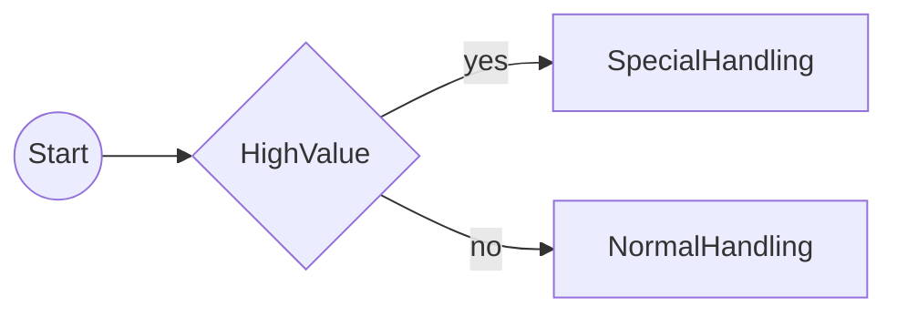

# API Reference

Complete reference documentation for all public APIs in temporalio-graphs.

## Table of Contents

- [analyze_workflow()](#analyze_workflow)
- [GraphBuildingContext](#graphbuildingcontext)
- [to_decision()](#to_decision)
- [wait_condition()](#wait_condition)
- [Exception Hierarchy](#exception-hierarchy)
  - [TemporalioGraphsError](#temporaliographserror)
  - [WorkflowParseError](#workflowparseerror)
  - [UnsupportedPatternError](#unsupportedpatternerror)
  - [GraphGenerationError](#graphgenerationerror)
  - [InvalidDecisionError](#invaliddecisionerror)
  - [InvalidSignalError](#invalidsignalerror)
- [ValidationWarning & ValidationReport](#validationwarning--validationreport)

---

## analyze_workflow()

**Main entry point** for workflow analysis and graph generation.

### Signature

```python
def analyze_workflow(
    workflow_file: Path | str,
    context: GraphBuildingContext | None = None,
    output_format: Literal["mermaid", "json", "paths"] = "mermaid",
) -> str
```

### Parameters

| Parameter | Type | Default | Description |
|-----------|------|---------|-------------|
| `workflow_file` | `Path \| str` | Required | Path to Python workflow source file (.py). Can be absolute or relative path, as string or Path object. |
| `context` | `GraphBuildingContext \| None` | `None` | Optional configuration for graph generation. If None, uses default GraphBuildingContext(). Customize to change node labels, enable/disable word splitting, etc. |
| `output_format` | `Literal["mermaid", "json", "paths"]` | `"mermaid"` | Output format mode. Controls which sections are included:<br>- `"mermaid"`: Mermaid diagram only (default)<br>- `"paths"`: Path list only (no diagram)<br>- `"json"`: Reserved for future use (not yet implemented)<br>Note: `GraphBuildingContext.output_format` can override this for `"full"` mode. |

### Returns

`str` - Graph representation as string in requested format.

- `"mermaid"`: Complete markdown with fenced code blocks
- `"paths"`: Text-based path list showing all execution paths
- If `context.output_format="full"`: Mermaid + path list + validation report

### Raises

| Exception | When |
|-----------|------|
| `ValueError` | If `workflow_file` is None or `output_format` is invalid |
| `FileNotFoundError` | If `workflow_file` does not exist |
| `PermissionError` | If `workflow_file` is not readable |
| `WorkflowParseError` | If workflow file cannot be parsed, no `@workflow.defn` decorator found, or workflow structure invalid |

### Performance Characteristics

- **Linear workflows**: <1ms analysis time
- **Complex workflows** (8-10 decision points): 1-5ms analysis time
- **Large workflows** (15+ decision points): 5-20ms depending on path count
- No workflow execution required - pure static analysis
- Memory usage: ~1-5MB for typical workflows

### Examples

**Basic usage (3 lines):**

```python
from temporalio_graphs import analyze_workflow

result = analyze_workflow("my_workflow.py")
print(result)
```

**With custom configuration:**

```python
from temporalio_graphs import analyze_workflow, GraphBuildingContext

context = GraphBuildingContext(
    split_names_by_words=False,
    start_node_label="BEGIN",
    end_node_label="FINISH"
)
result = analyze_workflow("workflow.py", context)
print(result)
```

**Writing to file:**

```python
from pathlib import Path
from temporalio_graphs import analyze_workflow, GraphBuildingContext

context = GraphBuildingContext(
    graph_output_file=Path("docs/workflow_diagram.md")
)
result = analyze_workflow("workflow.py", context)
# Result written to docs/workflow_diagram.md
# Also returned as string
```

**Error handling:**

```python
from temporalio_graphs import (
    analyze_workflow,
    TemporalioGraphsError,
    WorkflowParseError,
)

try:
    result = analyze_workflow("my_workflow.py")
    print(result)
except WorkflowParseError as e:
    print(f"Parse error at {e.file_path}:{e.line}")
    print(f"Suggestion: {e.suggestion}")
except TemporalioGraphsError as e:
    print(f"Library error: {e}")
```

**Path list output:**

```python
from temporalio_graphs import analyze_workflow

# Get text path list instead of Mermaid diagram
paths = analyze_workflow("workflow.py", output_format="paths")
print(paths)
# Output:
# Execution Paths (4 total):
# Path 1: Start → Activity1 → Activity2 → End
# Path 2: Start → Activity1 → Activity3 → End
# ...
```

### Notes

- This function performs **STATIC ANALYSIS only**. It does not execute the workflow code or invoke any activities.
- The workflow file must contain valid Python syntax and at least one `@workflow.defn` decorated class.
- Analysis is performed on source code, not bytecode or compiled modules.
- For best results, use clear activity names and avoid dynamic activity name generation.

### Path Explosion Safeguards

- `max_decision_points` limits the number of branch points (decisions + signals). Exceeding the limit raises `GraphGenerationError` with the projected path count.
- `max_paths` is a secondary hard cap on total paths (2^(decisions+signals)). If exceeded, generation aborts before allocating paths and raises `GraphGenerationError` with guidance to lower branching or increase the limit.

### .NET Parity Notes

- **MermaidOnly**: Use `output_format="mermaid"` to match the .NET `MermaidOnly=true` behavior. This suppresses path list and validation report output while still enforcing safety checks.

---

## GraphBuildingContext

**Immutable configuration dataclass** for workflow graph generation.

### Overview

This frozen dataclass holds all configuration options for graph building, including output options, node labeling, and resource limits. Once created, the configuration cannot be modified, ensuring consistent behavior across the graph generation pipeline.

### Signature

```python
@dataclass(frozen=True)
class GraphBuildingContext:
    is_building_graph: bool = True
    exit_after_building_graph: bool = False
    graph_output_file: Path | None = None
    split_names_by_words: bool = True
    suppress_validation: bool = False
    include_validation_report: bool = True
    start_node_label: str = "Start"
    end_node_label: str = "End"
    max_decision_points: int = 10
    max_paths: int = 1024
    decision_true_label: str = "yes"
    decision_false_label: str = "no"
    signal_success_label: str = "Signaled"
    signal_timeout_label: str = "Timeout"
    include_path_list: bool = True
    output_format: Literal["mermaid", "paths", "full"] = "full"
```

### Fields

| Field | Type | Default | Description |
|-------|------|---------|-------------|
| `is_building_graph` | `bool` | `True` | Enable graph building mode. When False, workflow executes normally without graph generation. |
| `exit_after_building_graph` | `bool` | `False` | Exit workflow immediately after completing graph generation. Useful for static analysis without executing workflow logic. |
| `graph_output_file` | `Path \| None` | `None` | Optional path where the generated diagram will be written. If None, output goes to return value only. |
| `split_names_by_words` | `bool` | `True` | Convert PascalCase/snake_case activity names to "Pascal Case" / "Snake Case" in graph labels for readability. |
| `suppress_validation` | `bool` | `False` | Disable graph validation warnings (e.g., excessive decision points, path explosion, unreachable activities). |
| `include_validation_report` | `bool` | `True` | Include validation report in output when warnings exist. Has no effect if `suppress_validation` is True. |
| `start_node_label` | `str` | `"Start"` | Display label for the workflow start node. |
| `end_node_label` | `str` | `"End"` | Display label for the workflow end node. |
| `max_decision_points` | `int` | `10` | Guardrail on branch points (decisions + signals). If exceeded, path generation raises `GraphGenerationError` to prevent 2^n explosion (default cap ≈1024 paths). |
| `max_paths` | `int` | `1024` | Hard cap on generated execution paths. If computed paths exceed this limit, generation aborts early with `GraphGenerationError`. |
| `decision_true_label` | `str` | `"yes"` | Edge label for decision branches evaluating to True. |
| `decision_false_label` | `str` | `"no"` | Edge label for decision branches evaluating to False. |
| `signal_success_label` | `str` | `"Signaled"` | Edge label for successful signal completion. |
| `signal_timeout_label` | `str` | `"Timeout"` | Edge label for signal timeout paths. |
| `include_path_list` | `bool` | `True` | Include text path list in output when True. Path list shows all execution paths in text format. |
| `output_format` | `Literal["mermaid", "paths", "full"]` | `"full"` | Output format mode. Controls which sections are included:<br>- `"mermaid"`: Mermaid diagram only (equivalent to .NET `MermaidOnly=true`)<br>- `"paths"`: Path list only<br>- `"full"`: Mermaid + path list + validation report |

### Examples

**Basic usage with defaults:**

```python
from temporalio_graphs import GraphBuildingContext

ctx = GraphBuildingContext()
assert ctx.is_building_graph is True
assert ctx.max_decision_points == 10
```

**Custom configuration for production:**

```python
from pathlib import Path
from temporalio_graphs import GraphBuildingContext

ctx = GraphBuildingContext(
    graph_output_file=Path("workflow_diagram.md"),
    max_decision_points=15,
    split_names_by_words=False,
)
assert ctx.graph_output_file == Path("workflow_diagram.md")
```

**Configuration is immutable:**

```python
from temporalio_graphs import GraphBuildingContext

ctx = GraphBuildingContext()
try:
    ctx.max_paths = 2048  # This will raise an error
except AttributeError:
    pass  # Expected: frozen dataclass prevents mutation
```

**Disable word splitting for acronyms:**

```python
from temporalio_graphs import GraphBuildingContext

ctx = GraphBuildingContext(split_names_by_words=False)
# "fetchAPIData" stays as "fetchAPIData", not "fetch A P I Data"
```

**Custom domain terminology:**

```python
from temporalio_graphs import GraphBuildingContext

ctx = GraphBuildingContext(
    start_node_label="Initiate",
    end_node_label="Complete"
)
# Output: "i((Initiate)) --> ... --> e((Complete))"
```

**Complex workflows with many decisions:**

```python
from temporalio_graphs import GraphBuildingContext

ctx = GraphBuildingContext(
    max_decision_points=15,  # Allows up to 32,768 paths (2^15)
    max_paths=32768
)
# Note: May generate large diagrams; consider breaking into sub-workflows
```

### Notes

- Context is **frozen** (immutable) - fields cannot be changed after creation.
- Invalid configuration values (negative numbers, wrong types) raise `ValueError` or `TypeError`.
- For workflows with many decisions, consider increasing `max_decision_points` or refactoring into sub-workflows.

---

## to_decision()

**Helper function** to mark boolean expressions as decision points in workflow execution.

### Signature

```python
async def to_decision(result: bool, name: str) -> bool
```

### Parameters

| Parameter | Type | Description |
|-----------|------|-------------|
| `result` | `bool` | Boolean expression value determining the decision outcome. Can be any boolean value or expression: `amount > 1000`, `status == "approved"`, `(a and b)`, etc. |
| `name` | `str` | String literal identifier for this decision point in the graph. This name appears as a decision node label in generated diagrams. **CRITICAL**: Must be a string literal (not a variable or f-string) for static analysis to extract it. |

### Returns

`bool` - The input boolean value unchanged (transparent passthrough).

### Runtime Behavior

This function is a **transparent passthrough** with zero runtime overhead:
- Execution time: <1 microsecond (just a return statement)
- No memory allocation or object creation
- No garbage collection pressure
- No impact on workflow performance

The static analysis that uses this function is performed during graph generation (before workflow execution), not at runtime.

### Examples

**Use in if statements to mark decision branches:**

```python
from temporalio import workflow
from temporalio_graphs import to_decision

@workflow.defn
class PaymentWorkflow:
    @workflow.run
    async def run(self, amount: int) -> str:
        if await to_decision(amount > 1000, "HighValue"):
            await workflow.execute_activity(special_handling, amount)
        else:
            await workflow.execute_activity(normal_handling, amount)
```

**Use with assignment to make decision logic explicit:**

```python
needs_approval = await to_decision(
    amount > 5000 and department == "procurement",
    "RequiresApproval"
)
if needs_approval:
    await workflow.execute_activity(request_approval)
```

**String literal requirement (CRITICAL):**

```python
# ✅ Correct - string literal
if await to_decision(amount > 5000, "HighValue"):
    pass

# ❌ Incorrect - variable name won't be detected
decision_name = "HighValue"
if await to_decision(amount > 5000, decision_name):
    pass

# ❌ Incorrect - f-string won't be detected
if await to_decision(amount > 5000, f"Check_{item}"):
    pass
```

### Graph Output

Decision nodes appear as **diamond shapes** in Mermaid diagrams:



### Notes

- Must be called with `await` in async workflows
- The `name` parameter **must be a string literal** for static analysis to work
- Creates 2 execution paths in the graph (yes branch and no branch)
- Edge labels use `context.decision_true_label` and `context.decision_false_label`
- For workflows with >10 independent decisions, consider refactoring to avoid path explosion

---

## wait_condition()

**Helper function** to mark wait conditions as signal nodes in the workflow graph.

### Signature

```python
async def wait_condition(
    condition_check: Callable[[], bool],
    timeout: timedelta,
    name: str,
) -> bool
```

### Parameters

| Parameter | Type | Description |
|-----------|------|-------------|
| `condition_check` | `Callable[[], bool]` | Callable that returns True when condition is met. Typically a lambda checking workflow state: `lambda: self.approved`. Must be a no-argument callable returning bool. |
| `timeout` | `timedelta` | Maximum duration to wait before timing out. Uses Python's `timedelta` for type safety and clarity: `timedelta(hours=24)`. |
| `name` | `str` | Human-readable name for the signal node in the graph. **CRITICAL**: Must be a string literal (not a variable or f-string) for static analysis to extract it. Examples: `"WaitForApproval"`, `"PaymentReceived"`. |

### Returns

`bool` - True if condition was met before timeout, False if timeout occurred.

### Raises

`TemporalError` - If called outside workflow context.

### Runtime Behavior

This function wraps Temporal's `workflow.wait_condition()` and:
- Waits for the condition to become True or timeout to occur
- Returns `True` if signaled before timeout
- Returns `False` if timeout occurs (catches `asyncio.TimeoutError`)
- Has minimal overhead beyond Temporal SDK's `wait_condition()`

### Examples

**Use in workflows to wait for signals with timeout:**

```python
from temporalio import workflow
from temporalio_graphs import wait_condition
from datetime import timedelta

@workflow.defn
class ApprovalWorkflow:
    def __init__(self) -> None:
        self.approved = False

    @workflow.run
    async def run(self) -> str:
        # Wait up to 24 hours for approval signal
        result = await wait_condition(
            lambda: self.approved,
            timedelta(hours=24),
            "WaitForApproval"
        )

        if result:
            return "approved"
        else:
            return "timeout"

    @workflow.signal
    async def approve(self) -> None:
        self.approved = True
```

**Conditional activities based on signal outcome:**

```python
@workflow.defn
class PaymentWorkflow:
    def __init__(self) -> None:
        self.payment_received = False

    @workflow.run
    async def run(self, order_id: str) -> str:
        await workflow.execute_activity(create_invoice, order_id)

        # Wait for payment
        if await wait_condition(
            lambda: self.payment_received,
            timedelta(days=30),
            "WaitForPayment"
        ):
            # Signaled branch - payment received
            await workflow.execute_activity(fulfill_order, order_id)
            return "completed"
        else:
            # Timeout branch - payment not received
            await workflow.execute_activity(cancel_order, order_id)
            return "cancelled"

    @workflow.signal
    async def payment_received(self) -> None:
        self.payment_received = True
```

**String literal requirement (CRITICAL):**

```python
# ✅ Correct - string literal
if await wait_condition(lambda: self.ready, timeout, "WaitForReady"):
    pass

# ❌ Incorrect - variable won't be detected
signal_name = "WaitForReady"
if await wait_condition(lambda: self.ready, timeout, signal_name):
    pass
```

### Graph Output

Signal nodes appear as **hexagon shapes** in Mermaid diagrams:

```mermaid
flowchart LR
s((Start)) --> CreateInvoice
CreateInvoice --> {{WaitForPayment}}
{{WaitForPayment}} -- Signaled --> FulfillOrder --> e((End))
{{WaitForPayment}} -- Timeout --> CancelOrder --> e
```

### Notes

- Must be called with `await` in async workflows
- The `name` parameter **must be a string literal** for static analysis to work
- Creates 2 execution paths in the graph (Signaled and Timeout)
- Edge labels use `context.signal_success_label` and `context.signal_timeout_label`
- At runtime, catches `TimeoutError` and returns False for timeout
- Returns True when condition becomes true before timeout
- No side effects or state changes beyond calling SDK function

---

## Exception Hierarchy

All library exceptions inherit from `TemporalioGraphsError`, enabling you to catch all library errors with a single except clause.

```
TemporalioGraphsError (base)
├── WorkflowParseError
├── UnsupportedPatternError
├── GraphGenerationError
├── InvalidDecisionError
└── InvalidSignalError
```

### TemporalioGraphsError

**Base exception** for all temporalio_graphs errors.

```python
class TemporalioGraphsError(Exception):
    pass
```

**Example:**

```python
try:
    result = analyze_workflow("workflow.py")
except TemporalioGraphsError as e:
    print(f"Library error: {e}")
```

---

### WorkflowParseError

Raised when workflow parsing fails.

**Raised when:**
- Required decorators (`@workflow.defn`, `@workflow.run`) are missing
- Python syntax errors prevent AST parsing
- File validation fails (file not found, permission denied)
- Workflow structure is invalid or malformed

**Attributes:**

| Attribute | Type | Description |
|-----------|------|-------------|
| `file_path` | `Path` | Path to workflow file where error occurred |
| `line` | `int` | Line number where error occurred (0 if not applicable) |
| `message` | `str` | Detailed error description |
| `suggestion` | `str` | Actionable suggestion for fixing the error |

**Example:**

```python
try:
    result = analyze_workflow("workflow.py")
except WorkflowParseError as e:
    print(f"Parse error at {e.file_path}:{e.line}")
    print(f"Message: {e.message}")
    print(f"Suggestion: {e.suggestion}")
```

**Common Error Messages:**

```
WorkflowParseError: Cannot parse workflow file: workflow.py
Line 10: Missing @workflow.defn decorator
Suggestion: Add @workflow.defn decorator to workflow class
```

---

### UnsupportedPatternError

Raised when workflow uses patterns beyond MVP scope.

**Raised when:**
- Loops (while/for) that would require dynamic execution
- Dynamic activity names using variables
- Complex control flow patterns
- Reflection or metaprogramming

**Attributes:**

| Attribute | Type | Description |
|-----------|------|-------------|
| `pattern` | `str` | Description of the unsupported pattern |
| `suggestion` | `str` | Actionable suggestion for refactoring |
| `line` | `int \| None` | Optional line number where pattern was detected |

**Example:**

```python
try:
    result = analyze_workflow("workflow.py")
except UnsupportedPatternError as e:
    print(f"Unsupported pattern: {e.pattern}")
    if e.line:
        print(f"at line {e.line}")
    print(f"Suggestion: {e.suggestion}")
```

**Common Error Messages:**

```
UnsupportedPatternError: Unsupported pattern: while loop at line 23
Suggestion: Refactor loop into linear activities
```

---

### GraphGenerationError

Raised when graph generation fails.

**Raised when:**
- Workflow has too many decision points for path generation
- Path explosion would exceed configured limits
- Graph rendering fails due to invalid structure
- Other graph generation constraints are violated

**Attributes:**

| Attribute | Type | Description |
|-----------|------|-------------|
| `reason` | `str` | Detailed reason for the generation failure |
| `context` | `dict[str, int] \| None` | Optional dictionary with additional context (decision count, limits, etc.) |

**Example:**

```python
try:
    result = analyze_workflow("workflow.py")
except GraphGenerationError as e:
    print(f"Generation failed: {e.reason}")
    if e.context:
        print(f"Context: {e.context}")
```

**Common Error Messages:**

```
GraphGenerationError: Graph generation failed: Too many decision points (12) would generate 4096 paths (limit: 1024)
Context: {'decision_count': 12, 'limit': 10, 'paths': 4096}
```

---

### InvalidDecisionError

Raised when `to_decision()` or `wait_condition()` used incorrectly.

**Raised when:**
- `to_decision()` called without name parameter
- `wait_condition()` called with invalid timeout
- Helper function called outside workflow context
- Other helper function validation failures

**Attributes:**

| Attribute | Type | Description |
|-----------|------|-------------|
| `function` | `str` | Name of the helper function (e.g., "to_decision", "wait_condition") |
| `issue` | `str` | Description of what's wrong with the usage |
| `suggestion` | `str` | Actionable suggestion for correct usage |

**Example:**

```python
try:
    result = analyze_workflow("workflow.py")
except InvalidDecisionError as e:
    print(f"Invalid {e.function} usage: {e.issue}")
    print(f"Suggestion: {e.suggestion}")
```

---

### InvalidSignalError

Raised when `wait_condition()` call is invalid or malformed.

**Raised when:**
- `wait_condition()` called with fewer than 3 required arguments
- Signal name argument is missing or invalid
- Other signal-specific validation failures

**Attributes:**

| Attribute | Type | Description |
|-----------|------|-------------|
| `file_path` | `str` | Path to workflow file where error occurred |
| `line` | `int` | Line number of invalid wait_condition() call |
| `message` | `str` | Detailed error description with actionable suggestion |

**Example:**

```python
try:
    result = analyze_workflow("workflow.py")
except InvalidSignalError as e:
    print(f"Signal error at {e.file_path}:{e.line}")
    print(e.message)
```

---

## ValidationWarning & ValidationReport

Data models for workflow quality validation.

### ValidationWarning

```python
@dataclass
class ValidationWarning:
    severity: Literal["warning", "error"]
    category: str
    message: str
    suggestion: str
```

Represents a single validation issue detected in the workflow.

### ValidationReport

```python
@dataclass
class ValidationReport:
    warnings: list[ValidationWarning]

    def has_warnings(self) -> bool:
        return len(self.warnings) > 0

    def format(self) -> str:
        # Returns formatted report with all warnings
```

Contains all validation warnings for a workflow.

**Example:**

```python
from temporalio_graphs import analyze_workflow, GraphBuildingContext

# Validation is automatic, report included in "full" output
context = GraphBuildingContext(output_format="full")
result = analyze_workflow("workflow.py", context)
# Result includes validation report if warnings exist
```

---

## Related Documentation

- [README.md](../README.md) - Quick start and examples
- [Core Concepts](../README.md#core-concepts) - Understanding AST analysis, decision nodes, and signals
- [Configuration Patterns](../README.md#configuration) - Common configuration use cases
- [Troubleshooting Guide](../README.md#troubleshooting) - Common errors and solutions
- [CHANGELOG.md](../CHANGELOG.md) - Version history and release notes

---

**Version:** 0.1.0
**Last Updated:** 2025-01-19
**Python Version:** 3.10+
