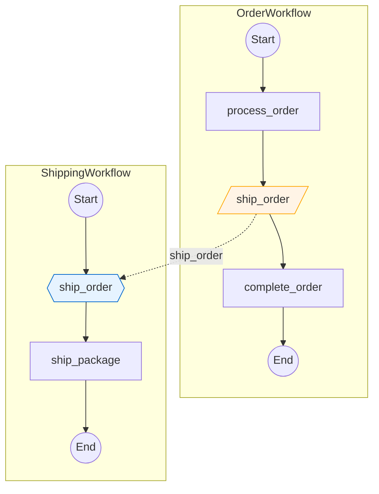

# Epic 8: Cross-Workflow Signal Visualization - Design Notes

**Date:** 2025-11-26
**Author:** Claude (with Luca)
**Status:** Design Notes (Pre-Tech-Spec)
**Depends On:** Epic 7 (Peer-to-Peer Workflow Signaling)

---

## Executive Summary

Epic 7 implemented detection and visualization of external signals (outgoing signals from a workflow to another workflow). However, it only visualizes the **sender side** - the signal appears as a trapezoid node that "goes nowhere" in the diagram.

Epic 8 extends this to provide **full cross-workflow signal visualization**, showing both the sender workflow and receiver workflow connected together, with the signal flow clearly visible between them.

### The Gap

**Current (Epic 7):** Single workflow view only
```
OrderWorkflow:  Start → process_order → [/ship_order/] → complete_order → End
                                              ↓
                                         (goes nowhere in visualization)
```

**Desired (Epic 8):** Cross-workflow connected view
```
┌─────────────────────────────────────────────────────────────┐
│ OrderWorkflow                                                │
│   Start → process_order → [/ship_order/] → complete_order → End │
└────────────────────────────┬────────────────────────────────┘
                             │ -.signal.->
┌────────────────────────────▼────────────────────────────────┐
│ ShippingWorkflow                                             │
│   Start → {{receive ship_order}} → ship_package → End        │
└─────────────────────────────────────────────────────────────┘
```

---

## Problem Statement

### Current Limitations (Epic 7)

1. **Send-side only**: We detect `get_external_workflow_handle().signal()` but don't analyze the target workflow
2. **No handler detection**: We don't detect `@workflow.signal` decorated methods in receiver workflows
3. **No cross-workflow linking**: External signals appear as dead-ends in the diagram
4. **Target resolution gap**: Pattern `"shipping-{*}"` doesn't map to an actual workflow file

### User Pain Points

- Cannot visualize complete signal flows across workflow boundaries
- Must manually correlate sender and receiver workflows
- No single diagram showing the full distributed workflow architecture
- Hard to understand which workflows communicate with which

---

## Requirements

### Functional Requirements

#### FR-80: Signal Handler Detection
- MUST detect `@workflow.signal` decorated methods in workflow classes
- MUST extract signal name (method name or explicit name from decorator)
- MUST track source line number for signal handler
- MUST handle both sync and async signal handlers

#### FR-81: Signal Handler Data Model
- MUST create `SignalHandler` frozen dataclass with: signal_name, method_name, workflow_class, source_line, node_id
- MUST add `signal_handlers` field to `WorkflowMetadata`
- MUST ensure backward compatibility (empty tuple default)

#### FR-82: Target Workflow Resolution
- MUST support resolution by signal name matching (find workflows with matching `@workflow.signal`)
- SHOULD support configurable search paths for target workflow discovery
- SHOULD support explicit mapping file for complex scenarios
- MUST handle case where target workflow not found (warn, render as "unresolved")

#### FR-83: Cross-Workflow Graph Building
- MUST build graph of connected workflows from entry point
- MUST track signal connections (sender, receiver, signal_name, lines)
- MUST detect and handle circular signal dependencies
- MUST support configurable max depth for recursive analysis

#### FR-84: Cross-Workflow Visualization
- MUST render connected workflows as Mermaid subgraphs
- MUST render signal connections as dashed edges between subgraphs
- MUST style signal handler nodes distinctly (hexagon shape)
- SHOULD support multiple visualization modes (subgraph, unified, sequence)

#### FR-85: API and Configuration
- MUST provide `analyze_signal_flow()` function or extend existing API
- MUST add context options for signal resolution and visualization
- MUST maintain backward compatibility with existing `analyze_workflow()`

### Non-Functional Requirements

#### NFR-PERF: Performance
- Signal handler detection: <1ms per workflow (AST traversal)
- Target resolution: <100ms for 100 workflow files
- Total analysis: <5s for graphs with 20 connected workflows

#### NFR-SAFE: Safety
- Cycle detection to prevent infinite loops
- Max depth limit for recursive analysis
- Graceful handling of missing/invalid target workflows

#### NFR-COMPAT: Compatibility
- Existing Epic 1-7 tests must continue passing
- Existing `analyze_workflow()` behavior unchanged by default
- New features opt-in via context configuration

---

## Technical Design

### 1. Signal Handler Detector

New AST visitor class to detect `@workflow.signal` decorated methods:

```python
class SignalHandlerDetector(ast.NodeVisitor):
    """Detects @workflow.signal decorated methods in workflow classes.

    Identifies signal handlers that can receive external signals from
    other workflows. Supports both explicit signal names and method-name
    based signals.

    Patterns detected:
    1. @workflow.signal
       async def ship_order(self, data): ...
       → signal_name = "ship_order"

    2. @workflow.signal(name="custom_signal")
       async def handler(self, data): ...
       → signal_name = "custom_signal"
    """

    def __init__(self) -> None:
        self._handlers: list[SignalHandler] = []
        self._workflow_class: str = ""

    def set_workflow_class(self, name: str) -> None:
        """Set workflow class context for handler metadata."""
        self._workflow_class = name

    def visit_AsyncFunctionDef(self, node: ast.AsyncFunctionDef) -> None:
        """Detect @workflow.signal decorated async methods."""
        for decorator in node.decorator_list:
            if self._is_signal_decorator(decorator):
                signal_name = self._extract_signal_name(decorator, node.name)
                handler = SignalHandler(
                    signal_name=signal_name,
                    method_name=node.name,
                    workflow_class=self._workflow_class,
                    source_line=node.lineno,
                    node_id=f"sig_handler_{signal_name}_{node.lineno}",
                )
                self._handlers.append(handler)
        self.generic_visit(node)

    def visit_FunctionDef(self, node: ast.FunctionDef) -> None:
        """Detect @workflow.signal decorated sync methods."""
        # Same logic as AsyncFunctionDef
        ...

    def _is_signal_decorator(self, decorator: ast.expr) -> bool:
        """Check if decorator is @workflow.signal or @signal."""
        # Handle: @workflow.signal, @workflow.signal(), @workflow.signal(name="...")
        ...

    def _extract_signal_name(self, decorator: ast.expr, method_name: str) -> str:
        """Extract signal name from decorator or fall back to method name."""
        # If @workflow.signal(name="custom"), return "custom"
        # Otherwise return method_name
        ...

    @property
    def handlers(self) -> list[SignalHandler]:
        return list(self._handlers)
```

### 2. Data Models

#### SignalHandler
```python
@dataclass(frozen=True)
class SignalHandler:
    """Represents a @workflow.signal decorated method.

    Signal handlers receive external signals from other workflows.
    They are the "receive side" of peer-to-peer signal communication.

    Args:
        signal_name: Name of the signal this handler receives.
            Usually matches method name unless explicitly specified.
        method_name: Actual method name in the workflow class.
        workflow_class: Name of the workflow class containing this handler.
        source_line: Line number where the handler is defined.
        node_id: Unique identifier for graph rendering.

    Example:
        >>> handler = SignalHandler(
        ...     signal_name="ship_order",
        ...     method_name="ship_order",
        ...     workflow_class="ShippingWorkflow",
        ...     source_line=67,
        ...     node_id="sig_handler_ship_order_67"
        ... )
    """
    signal_name: str
    method_name: str
    workflow_class: str
    source_line: int
    node_id: str
```

#### SignalConnection
```python
@dataclass(frozen=True)
class SignalConnection:
    """Represents a signal flow between two workflows.

    Captures the relationship between an external signal send
    (ExternalSignalCall) and a signal handler (SignalHandler).

    Args:
        sender_workflow: Name of workflow sending the signal.
        receiver_workflow: Name of workflow receiving the signal.
        signal_name: Name of the signal being sent/received.
        sender_line: Line number in sender where signal() is called.
        receiver_line: Line number in receiver where @workflow.signal is.
        sender_node_id: Node ID of the external signal node.
        receiver_node_id: Node ID of the signal handler node.
    """
    sender_workflow: str
    receiver_workflow: str
    signal_name: str
    sender_line: int
    receiver_line: int
    sender_node_id: str
    receiver_node_id: str
```

#### PeerSignalGraph
```python
@dataclass(frozen=True)
class PeerSignalGraph:
    """Complete graph of workflows connected by peer-to-peer signals.

    The result of cross-workflow signal analysis, containing all
    discovered workflows, their signal handlers, and the connections
    between them.

    Args:
        root_workflow: Entry point workflow for the analysis.
        workflows: All workflows discovered during analysis.
            Maps workflow class name to WorkflowMetadata.
        signal_handlers: All signal handlers discovered.
            Maps signal name to list of handlers (multiple workflows
            may handle the same signal).
        connections: All signal connections between workflows.
        unresolved_signals: External signals where no target was found.
    """
    root_workflow: WorkflowMetadata
    workflows: dict[str, WorkflowMetadata]
    signal_handlers: dict[str, list[SignalHandler]]
    connections: list[SignalConnection]
    unresolved_signals: list[ExternalSignalCall]
```

#### WorkflowMetadata Extension
```python
@dataclass
class WorkflowMetadata:
    # ... existing fields ...

    # NEW: Epic 8 - Signal handlers in this workflow
    signal_handlers: tuple[SignalHandler, ...] = ()
```

### 3. Target Workflow Resolution

#### Resolution Strategies

**Strategy 1: Signal Name Matching (Recommended Default)**
```python
class SignalNameResolver:
    """Resolves external signals to target workflows by signal name.

    Searches for workflows that have a @workflow.signal handler
    with a name matching the external signal's signal_name.
    """

    def __init__(self, search_paths: list[Path]) -> None:
        self._search_paths = search_paths
        self._workflow_cache: dict[Path, WorkflowMetadata] = {}
        self._handler_index: dict[str, list[tuple[Path, SignalHandler]]] = {}

    def build_index(self) -> None:
        """Scan search paths and index all signal handlers."""
        for search_path in self._search_paths:
            for py_file in search_path.glob("**/*.py"):
                try:
                    metadata = self._analyze_file(py_file)
                    if metadata and metadata.signal_handlers:
                        self._workflow_cache[py_file] = metadata
                        for handler in metadata.signal_handlers:
                            if handler.signal_name not in self._handler_index:
                                self._handler_index[handler.signal_name] = []
                            self._handler_index[handler.signal_name].append(
                                (py_file, handler)
                            )
                except Exception:
                    continue  # Skip invalid files

    def resolve(self, signal: ExternalSignalCall) -> list[tuple[Path, SignalHandler]]:
        """Find workflows that handle the given signal."""
        return self._handler_index.get(signal.signal_name, [])
```

**Strategy 2: Explicit Mapping**
```python
# User provides mapping file: signal_mapping.yaml
# shipping-*: workflows/shipping_workflow.py
# notification-*: services/notification_workflow.py

class ExplicitMappingResolver:
    """Resolves external signals using explicit user-provided mapping."""

    def __init__(self, mapping: dict[str, Path]) -> None:
        self._mapping = mapping  # pattern -> workflow_file

    def resolve(self, signal: ExternalSignalCall) -> Path | None:
        """Find workflow file for the given signal's target pattern."""
        for pattern, path in self._mapping.items():
            if self._matches(signal.target_workflow_pattern, pattern):
                return path
        return None
```

**Strategy 3: Hybrid (Signal Name + Pattern Hints)**
```python
class HybridResolver:
    """Combines signal name matching with pattern hints for disambiguation."""

    def resolve(self, signal: ExternalSignalCall) -> list[tuple[Path, SignalHandler]]:
        # 1. Find all workflows with matching signal handler name
        candidates = self._signal_name_resolver.resolve(signal)

        # 2. If multiple candidates, use target pattern to narrow down
        if len(candidates) > 1 and signal.target_workflow_pattern != "<dynamic>":
            candidates = self._filter_by_pattern(candidates, signal.target_workflow_pattern)

        return candidates
```

### 4. Cross-Workflow Graph Analyzer

```python
class PeerSignalGraphAnalyzer:
    """Analyzes workflows and builds cross-workflow signal graph.

    Starting from an entry workflow, discovers all connected workflows
    by following external signal → signal handler connections.

    Example:
        >>> analyzer = PeerSignalGraphAnalyzer(
        ...     search_paths=[Path("./workflows/")],
        ...     max_depth=10,
        ... )
        >>> graph = analyzer.analyze(Path("order_workflow.py"))
        >>> print(graph.workflows.keys())
        ['OrderWorkflow', 'ShippingWorkflow', 'NotificationWorkflow']
    """

    def __init__(
        self,
        search_paths: list[Path],
        resolver: SignalNameResolver | None = None,
        max_depth: int = 10,
        context: GraphBuildingContext | None = None,
    ) -> None:
        self._search_paths = search_paths
        self._resolver = resolver or SignalNameResolver(search_paths)
        self._max_depth = max_depth
        self._context = context or GraphBuildingContext()

        # Analysis state
        self._visited_workflows: set[str] = set()
        self._workflows: dict[str, WorkflowMetadata] = {}
        self._connections: list[SignalConnection] = []
        self._unresolved: list[ExternalSignalCall] = []

    def analyze(self, entry_workflow: Path) -> PeerSignalGraph:
        """Analyze entry workflow and discover all connected workflows."""
        # Build signal handler index
        self._resolver.build_index()

        # Analyze entry workflow
        root_metadata = self._analyze_workflow(entry_workflow)
        self._workflows[root_metadata.workflow_class] = root_metadata
        self._visited_workflows.add(root_metadata.workflow_class)

        # Recursively discover connected workflows
        self._discover_connections(root_metadata, depth=0)

        # Build handler index from all discovered workflows
        handler_index = self._build_handler_index()

        return PeerSignalGraph(
            root_workflow=root_metadata,
            workflows=self._workflows,
            signal_handlers=handler_index,
            connections=self._connections,
            unresolved_signals=self._unresolved,
        )

    def _discover_connections(
        self,
        metadata: WorkflowMetadata,
        depth: int
    ) -> None:
        """Recursively discover workflows connected by signals."""
        if depth >= self._max_depth:
            logger.warning(f"Max depth {self._max_depth} reached, stopping discovery")
            return

        for external_signal in metadata.external_signals:
            # Find target workflows
            targets = self._resolver.resolve(external_signal)

            if not targets:
                self._unresolved.append(external_signal)
                continue

            for target_path, handler in targets:
                # Skip if already visited (cycle detection)
                target_metadata = self._analyze_workflow(target_path)

                if target_metadata.workflow_class in self._visited_workflows:
                    # Still record the connection for visualization
                    pass
                else:
                    self._workflows[target_metadata.workflow_class] = target_metadata
                    self._visited_workflows.add(target_metadata.workflow_class)

                    # Recurse into target workflow
                    self._discover_connections(target_metadata, depth + 1)

                # Record connection
                connection = SignalConnection(
                    sender_workflow=metadata.workflow_class,
                    receiver_workflow=target_metadata.workflow_class,
                    signal_name=external_signal.signal_name,
                    sender_line=external_signal.source_line,
                    receiver_line=handler.source_line,
                    sender_node_id=external_signal.node_id,
                    receiver_node_id=handler.node_id,
                )
                self._connections.append(connection)
```

### 5. Mermaid Rendering Extension

#### Subgraph Mode (Recommended)
```python
def render_signal_graph(
    self,
    graph: PeerSignalGraph,
    context: GraphBuildingContext
) -> str:
    """Render cross-workflow signal graph as Mermaid with subgraphs."""
    lines = ["```mermaid", "flowchart TB"]

    # Render each workflow as a subgraph
    for workflow_name, metadata in graph.workflows.items():
        lines.append(f"    subgraph {workflow_name}")

        # Render workflow internals (activities, decisions, etc.)
        internal_lines = self._render_workflow_internal(metadata, context)
        for line in internal_lines:
            lines.append(f"        {line}")

        # Render signal handlers as hexagon nodes
        for handler in metadata.signal_handlers:
            lines.append(
                f"        {handler.node_id}{{{{{handler.signal_name}}}}}"
            )

        lines.append("    end")

    # Render cross-subgraph signal connections
    for conn in graph.connections:
        lines.append(
            f"    {conn.sender_node_id} -.{conn.signal_name}.-> {conn.receiver_node_id}"
        )

    # Render unresolved signals with "?" target
    for unresolved in graph.unresolved_signals:
        lines.append(
            f"    {unresolved.node_id} -.{unresolved.signal_name}.-> "
            f"unknown_{unresolved.signal_name}[/?/]"
        )

    # Styling
    lines.append("    %% Signal handler styling")
    for metadata in graph.workflows.values():
        for handler in metadata.signal_handlers:
            lines.append(
                f"    style {handler.node_id} fill:#e6f3ff,stroke:#0066cc"
            )

    lines.append("```")
    return "\n".join(lines)
```

#### Expected Output Example


### 6. API Design

#### New Function
```python
def analyze_signal_flow(
    entry_workflow: Path | str,
    search_paths: list[Path | str] | None = None,
    context: GraphBuildingContext | None = None,
) -> str:
    """Analyze workflows and visualize cross-workflow signal connections.

    Starting from an entry workflow, discovers all connected workflows
    by following external signal sends to their signal handlers. Renders
    the complete signal flow graph as a Mermaid diagram with subgraphs.

    Args:
        entry_workflow: Path to the entry point workflow file.
        search_paths: Directories to search for target workflows.
            Defaults to the directory containing entry_workflow.
        context: Configuration options for graph generation.

    Returns:
        Mermaid diagram string showing all connected workflows
        with signal flow edges between them.

    Example:
        >>> result = analyze_signal_flow(
        ...     "workflows/order_workflow.py",
        ...     search_paths=["workflows/", "services/"],
        ... )
        >>> print(result)
        ```mermaid
        flowchart TB
            subgraph OrderWorkflow
                ...
            end
            subgraph ShippingWorkflow
                ...
            end
            ext_sig_ship_order_56 -.ship_order.-> sig_handler_ship_order_67
        ```

    Raises:
        FileNotFoundError: If entry_workflow does not exist.
        WorkflowParseError: If entry_workflow is not a valid workflow.
    """
```

#### Context Extensions
```python
@dataclass(frozen=True)
class GraphBuildingContext:
    # ... existing fields ...

    # Epic 8: Cross-workflow signal options
    resolve_signal_targets: bool = False
    signal_target_search_paths: tuple[Path, ...] = ()
    signal_resolution_strategy: Literal["by_name", "explicit", "hybrid"] = "by_name"
    signal_visualization_mode: Literal["subgraph", "unified"] = "subgraph"
    signal_max_discovery_depth: int = 10
    warn_unresolved_signals: bool = True
```

---

## Edge Cases and Error Handling

### Edge Case 1: Same Signal Name in Multiple Workflows
```python
# Both ShippingWorkflow and FulfillmentWorkflow have @workflow.signal ship_order

# Resolution options:
# A) Show all matches (may be confusing)
# B) Use target pattern to disambiguate
# C) Require explicit mapping
# D) Warn user about ambiguity

# Recommendation: Show all matches + warning
```

### Edge Case 2: Circular Signal Dependencies
```python
# OrderWorkflow signals ShippingWorkflow
# ShippingWorkflow signals NotificationWorkflow
# NotificationWorkflow signals OrderWorkflow (cycle!)

# Solution:
# - Track visited workflows
# - Still render the cycle edge, but don't re-analyze
# - Visual: Show cycle with annotation
```

### Edge Case 3: Dynamic Target Patterns
```python
# target_id = compute_target()
# handle = get_external_workflow_handle(target_id)  # <dynamic>

# Cannot resolve statically
# Solution: Render as "unresolved" node with warning
```

### Edge Case 4: Missing Target Workflow
```python
# external signal to "shipping-*" but no workflow has @workflow.signal ship_order

# Solution:
# - Add to unresolved_signals list
# - Render as dead-end with "?" node
# - Emit validation warning
```

### Edge Case 5: Signal Handler Without External Senders
```python
# ShippingWorkflow has @workflow.signal ship_order
# But no workflow in search path sends ship_order signal

# Solution:
# - Still include in workflow metadata
# - Don't include in connections (no sender found)
# - Visual: Render handler but no incoming edge
```

---

## Implementation Phases

### Phase 1: Signal Handler Detection (Stories 8.1-8.2)
- Create `SignalHandlerDetector` class
- Create `SignalHandler` data model
- Extend `WorkflowMetadata` with `signal_handlers` field
- Unit tests for detection

**Deliverables:**
- `SignalHandlerDetector` in `detector.py`
- `SignalHandler` in `graph_models.py`
- Tests in `test_detector.py`

### Phase 2: Target Resolution (Stories 8.3-8.4)
- Create `SignalNameResolver` class
- Implement search path scanning
- Build signal handler index
- Handle resolution failures

**Deliverables:**
- `SignalNameResolver` in new `resolver.py`
- Tests in `test_resolver.py`

### Phase 3: Graph Building (Stories 8.5-8.6)
- Create `PeerSignalGraphAnalyzer` class
- Create `SignalConnection` and `PeerSignalGraph` data models
- Implement recursive discovery with cycle detection
- Handle max depth limits

**Deliverables:**
- `PeerSignalGraphAnalyzer` in new `signal_graph_analyzer.py`
- Data models in `graph_models.py`
- Tests in `test_signal_graph_analyzer.py`

### Phase 4: Visualization (Stories 8.7-8.8)
- Extend `MermaidRenderer` for subgraph mode
- Implement cross-subgraph signal edges
- Add signal handler node styling
- Handle unresolved signals visualization

**Deliverables:**
- `render_signal_graph()` method in `renderer.py`
- Tests in `test_renderer.py`

### Phase 5: API and Integration (Stories 8.9-8.10)
- Create `analyze_signal_flow()` public function
- Extend `GraphBuildingContext` with new options
- Integration tests with example workflows
- Documentation updates

**Deliverables:**
- `analyze_signal_flow()` in `__init__.py`
- Context extensions in `context.py`
- Integration tests
- README updates

---

## Story Breakdown (Draft)

| Story | Title | Description | Effort |
|-------|-------|-------------|--------|
| 8.1 | Signal Handler Detector | Create SignalHandlerDetector to detect @workflow.signal methods | 4h |
| 8.2 | Signal Handler Data Model | Create SignalHandler dataclass, extend WorkflowMetadata | 2h |
| 8.3 | Signal Name Resolver | Create resolver to find workflows by signal handler name | 4h |
| 8.4 | Search Path Scanning | Implement directory scanning and handler indexing | 3h |
| 8.5 | Signal Connection Model | Create SignalConnection and PeerSignalGraph data models | 2h |
| 8.6 | Peer Signal Graph Analyzer | Build cross-workflow graph with cycle detection | 6h |
| 8.7 | Subgraph Rendering | Extend MermaidRenderer for subgraph mode | 5h |
| 8.8 | Cross-Subgraph Edges | Render signal connections between subgraphs | 3h |
| 8.9 | Public API | Create analyze_signal_flow() and context extensions | 3h |
| 8.10 | Integration Tests | End-to-end tests with Order→Shipping example | 3h |
| 8.11 | Documentation | README, examples, API reference | 2h |

**Total Estimated Effort: ~37 hours (~5 days)**

---

## Testing Strategy

### Unit Tests
- `test_signal_handler_detector.py`: Detection of @workflow.signal methods
- `test_signal_name_resolver.py`: Target resolution logic
- `test_signal_graph_analyzer.py`: Graph building, cycle detection
- `test_renderer_signal_graph.py`: Subgraph rendering

### Integration Tests
- `test_order_shipping_signal_flow.py`: Complete Order → Shipping example
- `test_multi_workflow_signal_chain.py`: A → B → C signal chain
- `test_circular_signals.py`: Cycle handling
- `test_unresolved_signals.py`: Missing target handling

### Example Workflows for Testing
```
examples/
  signal_flow/
    order_workflow.py      # Sends ship_order signal
    shipping_workflow.py   # Receives ship_order, sends notify_shipped
    notification_workflow.py  # Receives notify_shipped
    run.py                 # Demonstrates analyze_signal_flow()
    expected_output.md     # Golden output for regression testing
```

---

## Open Questions

### Q1: Multiple Handlers for Same Signal
**Question:** If multiple workflows have `@workflow.signal ship_order`, how do we handle it?

**Options:**
- A) Show all connections (may be valid in some architectures)
- B) Require disambiguation via target pattern
- C) Warn user and pick first match
- D) Error out and require explicit mapping

**Recommendation:** Option A with warning - show all matches, let user decide

### Q2: Visualization Mode Default
**Question:** Should subgraph mode be the default, or unified mode?

**Options:**
- A) Subgraph (clearer workflow boundaries)
- B) Unified (shows temporal flow better)
- C) User must explicitly choose

**Recommendation:** Option A - subgraph mode as default, clearly shows boundaries

### Q3: Signal Handler Rendering Shape
**Question:** What shape for signal handler nodes?

**Options:**
- A) Hexagon `{{name}}` (matches internal signals from Epic 4)
- B) Stadium/pill `([name])` (distinct from internal signals)
- C) Trapezoid reverse `[\name/]` (inverse of sender trapezoid)

**Recommendation:** Option A - hexagon for consistency with Epic 4 signal nodes

### Q4: Search Path Default
**Question:** If no search_paths provided, what's the default?

**Options:**
- A) Same directory as entry workflow
- B) Current working directory
- C) Error requiring explicit paths

**Recommendation:** Option A - same directory as entry workflow (intuitive default)

---

## Risk Assessment

| Risk | Likelihood | Impact | Mitigation |
|------|------------|--------|------------|
| Performance with large codebases | Medium | Medium | Lazy indexing, caching, parallel scanning |
| Ambiguous signal matching | High | Low | Clear warnings, documentation of behavior |
| Complex visualization for many workflows | Medium | Medium | Collapse option, depth limits |
| Circular dependencies causing issues | Low | High | Robust cycle detection, max depth limit |
| Breaking existing API | Low | High | New function, opt-in context flags |

---

## Success Criteria

1. **Functional:** Order → Shipping example produces connected subgraph diagram
2. **Complete:** All signal connections discovered and rendered
3. **Safe:** Circular dependencies handled gracefully
4. **Fast:** Analysis completes in <5s for 20 workflow graph
5. **Compatible:** All existing Epic 1-7 tests pass
6. **Documented:** README updated with signal flow analysis section

---

## References

- Epic 7 Tech Spec: `docs/sprint-artifacts/tech-spec-epic-7.md`
- Temporal Python SDK Signal Docs: https://docs.temporal.io/develop/python/message-passing#signals
- Mermaid Subgraph Syntax: https://mermaid.js.org/syntax/flowchart.html#subgraphs
- Existing Peer Signal Example: `examples/peer_signal_workflow/`

---

**Next Steps:**
1. Review these notes with stakeholders
2. Finalize open questions
3. Generate full tech spec using BMM workflow
4. Create stories in sprint backlog
