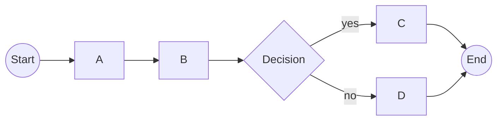

# Fix Plan for 2025-11-19 Review Findings

**Review Source**: `docs/review-2025-11-19.md`
**Verification**: All findings independently verified 2025-11-19
**Status**: Planning phase

## Executive Summary

This document provides a detailed implementation plan for addressing all findings from the 2025-11-19 codebase review. Issues are categorized by severity and include effort estimates, implementation details, and acceptance criteria.

**High-Severity (Release Blockers)**: 2 issues, ~35 min total
**Parity Gaps (Optional)**: 3 issues, ~8 hours total
**Documentation Updates**: 2 items, ~30 min total

---

## High-Severity Issues (Must Fix Before Release)

### Issue #1: Public API Export Mismatch

**Severity**: HIGH - Blocks test passage
**Effort**: 5 minutes
**Priority**: P0 - Fix immediately

#### Problem Statement
- **Current**: `__all__` exports 13 symbols including `analyze_workflow_graph` and `MultiWorkflowPath`
- **Expected**: Test expects exactly 11 symbols (minimal API surface)
- **Impact**: Failing test `test_public_api_clean_minimal_export`
- **Location**: `src/temporalio_graphs/__init__.py:35-49`

#### Root Cause
Epic 6 (cross-workflow visualization) added two new public symbols to `__all__` but did not update the API contract test to reflect this intentional expansion.

#### Decision Required (needs PO sign-off)
Choose one approach (must be agreed before coding; Option B implies semantic-version bump and changelog entry):

**Option A: Shrink `__all__` (Conservative)**
- Remove `analyze_workflow_graph` and `MultiWorkflowPath` from public API
- Keep these as internal/experimental features
- Maintains minimal API surface
- **Pros**: Simpler API, backward compatible
- **Cons**: Users can't access Epic 6 features via public API

**Option B: Update Test Contract (Expansive) — requires PO/PM approval + version bump**
- Update `tests/test_public_api.py` to expect 13 symbols
- Document that Epic 6 expanded the public API
- Add these symbols to API reference docs
- **Pros**: Makes Epic 6 features officially public
- **Cons**: Larger API surface to maintain

#### Recommended Approach
- **Decision gate:** If PO approves public-surface expansion, proceed with **Option B** and bump version (e.g., 0.1.1) + changelog callout.
- If approval is not granted before release cut, take **Option A** (trim `__all__`) as the fastest unblock for the failing test.

#### Implementation Plan

**Option B Implementation**:

1. Update test contract (only if Option B approved):
```python
# File: tests/test_public_api.py
# Around line 18-28
assert set(exported) == {
    # Existing 11 symbols...
    "GraphBuildingContext",
    "analyze_workflow",
    "to_decision",
    "wait_condition",
    "ValidationWarning",
    "ValidationReport",
    "TemporalioGraphsError",
    "WorkflowParseError",
    "UnsupportedPatternError",
    "GraphGenerationError",
    "InvalidDecisionError",
    # New Epic 6 additions
    "analyze_workflow_graph",
    "MultiWorkflowPath",
}
```

2. Update API documentation:
- Add `analyze_workflow_graph()` to `docs/api-reference.md`
- Add `MultiWorkflowPath` class documentation
- Update CHANGELOG.md with API expansion note

3. Add docstring note in `__init__.py` (if Option B):
```python
# Epic 6 (Cross-Workflow Visualization) additions:
# - analyze_workflow_graph: Multi-workflow analysis entry point
# - MultiWorkflowPath: Data model for cross-workflow execution paths
```

#### Acceptance Criteria
- [ ] Decision recorded (Option A or B) with PO approval if expanding
- [ ] `pytest tests/test_public_api.py::TestAnalyzeWorkflowSignature::test_public_api_clean_minimal_export` passes
- [ ] If Option B: API docs updated, version bumped, CHANGELOG entry noting public API expansion

#### Files Modified
- `tests/test_public_api.py` (1 line - update expected set)
- `docs/api-reference.md` (~50 lines - document new APIs)
- `CHANGELOG.md` (~5 lines - version entry)

---

### Issue #2: Path-Explosion Guard Gap

**Severity**: HIGH - Safety/correctness issue
**Effort**: 30 minutes
**Priority**: P0 - Fix immediately

#### Problem Statement
- **Issue**: `generate_paths()` validates `max_decision_points` but ignores `max_paths` configuration
- **Location**: `src/temporalio_graphs/generator.py:180-196`
- **Impact**: Users can exceed path limits by increasing `max_decision_points`
- **Example**: With `max_decision_points=11`, generates 2^11=2048 paths despite `max_paths=1024` limit

#### Root Cause
The validation logic only checks branch point count, not the calculated path count:

```python
# Current code (generator.py:180-196)
if total_branch_points > context.max_decision_points:
    paths_count = 2**total_branch_points
    raise GraphGenerationError(...)

# Missing: check if paths_count > context.max_paths
```

#### Implementation Plan

1. **Add max_paths validation** in `generator.py` (compute once, check both limits sequentially):

```python
# File: src/temporalio_graphs/generator.py
# Insert after line 196

# Compute total potential paths once
paths_count = 2**total_branch_points

# Guard 1: decision-point ceiling (existing behavior)
if total_branch_points > context.max_decision_points:
    raise GraphGenerationError(
        reason=(
            f"Too many branch points ({total_branch_points}) would generate "
            f"{paths_count} paths (limit: {context.max_decision_points}). "
            f"Branch points: {num_decisions} decisions + {num_signals} signals. "
            f"Suggestion: Refactor workflow or increase max_decision_points limit"
        ),
        context={
            "decision_count": num_decisions,
            "signal_count": num_signals,
            "total_branch_points": total_branch_points,
            "limit": context.max_decision_points,
            "paths": paths_count,
        },
    )

# Guard 2: absolute path-count ceiling (new)
if paths_count > context.max_paths:
    raise GraphGenerationError(
        reason=(
            f"Calculated path count ({paths_count}) exceeds max_paths limit "
            f"({context.max_paths}). Total branch points: {total_branch_points} "
            f"({num_decisions} decisions + {num_signals} signals). "
            f"Suggestion: Reduce decisions/signals or increase context.max_paths"
        ),
        context={
            "decision_count": num_decisions,
            "signal_count": num_signals,
            "total_branch_points": total_branch_points,
            "paths_count": paths_count,
            "max_paths_limit": context.max_paths,
        },
    )
```

2. **Add test coverage** in `tests/test_generator.py`:

```python
def test_path_explosion_exceeds_max_paths_limit(self) -> None:
    """Verify max_paths limit is enforced during path generation."""
    # Arrange: 11 decision points = 2048 paths, but max_paths=1024
    context = GraphBuildingContext(
        max_decision_points=15,  # Allow 11 decisions
        max_paths=1024,          # But cap total paths
    )

    decisions = [
        # DecisionPoint(id, name, line_number, line_num, true_label, false_label)
        DecisionPoint(f"d{i}", f"Decision{i}", i * 10, i * 10, "yes", "no")
        for i in range(11)  # 2^11 = 2048 paths
    ]

    metadata = WorkflowMetadata(
        workflow_class="TestWorkflow",
        workflow_run_method="run",
        activities=[],
        decision_points=decisions,
        signal_points=[],
        source_file=Path("test.py"),
        total_paths=2 ** 11,
        child_workflow_calls=[],
    )

    generator = PathPermutationGenerator()

    # Act & Assert
    with pytest.raises(GraphGenerationError) as exc_info:
        generator.generate_paths(metadata, context)

    assert "exceeds max_paths limit" in str(exc_info.value)
    assert "2048" in str(exc_info.value)
    assert "1024" in str(exc_info.value)
```

3. **Update documentation**:
- Add note to `context.py` docstring for `max_paths` field
- Update `docs/api-reference.md` explaining dual safety checks

#### Edge Cases to Consider
- What if `max_decision_points` check passes but `max_paths` fails?
  - **Answer**: Both checks should run, `max_paths` is the stricter enforcement
- Should we apply same check in cross-workflow path generation?
  - **Answer**: YES - inline mode already has this (generator.py:628), verify it's consistent

#### Acceptance Criteria
- [ ] `max_paths` validation enforced in `generate_paths()`
- [ ] New test `test_path_explosion_exceeds_max_paths_limit` passes
- [ ] Existing 545 tests still pass
- [ ] Error message includes actionable suggestions
- [ ] Context dict includes all relevant debugging info

#### Files Modified
- `src/temporalio_graphs/generator.py` (~15 lines added)
- `tests/test_generator.py` (~25 lines - new test)
- `src/temporalio_graphs/context.py` (~3 lines - docstring update)

---

## Parity Gaps (Optional Enhancements)

### Issue #3: Missing PreserveDecisionId Option

**Severity**: MEDIUM - Feature parity gap
**Effort**: 1-2 hours
**Priority**: P2 - Epic 7 candidate

#### Problem Statement
- **.NET has**: `PreserveDecisionId` option to keep hashed decision IDs
- **Python lacks**: Always simplifies to `d0`, `d1`, `d2`, etc.
- **User impact**: Cannot match decision IDs between runs or preserve semantic IDs

#### Current Behavior
```python
# Python always generates:
d0 → NeedConvert
d1 → IsTFNKnown

# .NET with PreserveDecisionId=true could preserve:
d_a8f3c2 → NeedConvert
d_b9e1d4 → IsTFNKnown
```

#### Implementation Plan

1. **Add configuration option** in `context.py`:

```python
@dataclass(frozen=True)
class GraphBuildingContext:
    # ... existing fields ...
    preserve_decision_id: bool = False  # Add after max_paths
```

2. **Modify ID generation logic** — IDs are assigned in `DecisionDetector` (without context access), so we must thread `GraphBuildingContext` (or a flag) down into analyzer/detector or post-process IDs in `PathPermutationGenerator` without breaking deterministic ordering. This adds some plumbing risk and bumps effort.

3. **Conditional ID logic** (after wiring context):
```python
if context.preserve_decision_id:
    decision_id = generate_hash_based_id(decision_node)  # deterministic (e.g., name+line hash)
else:
    decision_id = f"d{index}"  # current behavior
```

4. **Testing strategy**:
- Test with `preserve_decision_id=False` (default) - ensure no regression
- Test with `preserve_decision_id=True` - verify hashed IDs preserved
- Test ID stability across multiple runs with same workflow

#### Open Questions / Risks
- How to pass context into `DecisionDetector` cleanly without widening public API? (Likely via analyzer constructor arg.)
- .NET hashing algorithm needs to be confirmed in `GraphBuilder.cs`; target deterministic hash (name + line) for stability.

#### Acceptance Criteria
- [ ] `preserve_decision_id` field added to `GraphBuildingContext`
- [ ] When `False` (default): behavior unchanged (`d0`, `d1`, ...)
- [ ] When `True`: deterministic hashed IDs preserved
- [ ] Tests cover both modes
- [ ] Documentation explains use case (debugging, ID stability)

#### Files Modified
- `src/temporalio_graphs/context.py` (1 field)
- `src/temporalio_graphs/generator.py` or `detector.py` (ID generation logic, ~20 lines)
- `tests/test_generator.py` (~40 lines - new tests)
- `docs/api-reference.md` (~10 lines - document option)

#### Deferral Justification
Not a blocker - current simplified IDs work fine for visualization. Can be Epic 7 enhancement for advanced debugging workflows.

---

### Issue #4: Missing MermaidOnly Option

**Severity**: LOW - Already effectively implemented
**Effort**: 15 minutes (documentation only)
**Priority**: P3 - Documentation clarification

#### Problem Statement
- **.NET has**: `MermaidOnly` boolean to suppress path list output
- **Python has**: `output_format` enum with "mermaid" | "paths" | "full"
- **Gap**: Different API, but functionally equivalent

#### Current Implementation
```python
# Python already supports this via output_format:
context = GraphBuildingContext(output_format="mermaid")  # Mermaid only
context = GraphBuildingContext(output_format="full")     # Mermaid + paths + validation
```

#### Recommendation
**Do NOT add `mermaid_only` field** - this would be redundant API design.

Instead:
1. Document in API reference that `output_format="mermaid"` is the Python equivalent
2. Add migration note for .NET users
3. Consider this a "parity achieved via different design" case

#### Implementation Plan

**Documentation updates only**:

1. Add to `docs/api-reference.md`:
```markdown
### .NET Parity Notes

**MermaidOnly option**: Python uses `output_format="mermaid"` instead of a boolean flag.

Migration from .NET:
```csharp
// .NET
var context = new GraphBuildingContext { MermaidOnly = true };
```

```python
# Python equivalent
context = GraphBuildingContext(output_format="mermaid")
```

2. Update `docs/dotnet-python-port-gaps.md` (if exists):
- Mark `MermaidOnly` as "Implemented via different API design"
- Explain enum vs boolean tradeoff

#### Acceptance Criteria
- [ ] API documentation explains `output_format` as MermaidOnly equivalent
- [ ] Migration guide added for .NET users
- [ ] No code changes required

#### Files Modified
- `docs/api-reference.md` (~15 lines)

---

### Issue #5: Missing Compact Mermaid Output

**Severity**: MEDIUM - Feature parity gap, output optimization
**Effort**: 4-8 hours
**Priority**: P2 - Epic 7 candidate

#### Problem Statement
- **.NET has**: `ToMermaidCompactSyntax()` - optimized output reducing duplicate path segments
- **Python lacks**: Only verbose Mermaid output (every path fully spelled out)
- **Impact**: Large diagrams with many paths have redundant node definitions

#### Example

**Current Python output (verbose)**:
```mermaid
flowchart LR
s((Start)) --> A --> B --> d0{Decision}
s((Start)) --> A --> B --> d0{Decision}  # Duplicate path
d0 -- yes --> C --> e((End))
d0 -- no --> D --> e((End))
```

**Desired compact output**:


#### .NET Algorithm (from Graphs.cs:154-163)
```csharp
// Find longest path, add it to diagram
// For remaining paths, add only unique sequences not in other paths
// Result: minimal Mermaid definition
```

#### Implementation Plan

**Phase 1: Research** (30 min)
1. Read .NET `ToMermaidCompactSyntax()` implementation fully
2. Understand path uniqueness detection algorithm
3. Identify Python equivalent data structures

**Phase 2: Design** (1 hour)
1. Design compact rendering strategy:
   - Collect all paths
   - Find common subsequences
   - Build minimal node/edge set
2. Decide: Modify `MermaidRenderer` or add new `CompactMermaidRenderer` class?
   - **Recommendation**: Add a feature-flagged option on the existing renderer; keep verbose as default so rollback is just toggling the flag.

**Phase 3: Implementation** (2-3 hours)

1. Add configuration:
```python
@dataclass(frozen=True)
class GraphBuildingContext:
    # ... existing fields ...
    compact_mermaid: bool = False  # After preserve_decision_id; default False (verbose)
```

2. Add compact rendering logic in `renderer.py`:

```python
def to_mermaid(self, paths: list[GraphPath], context: GraphBuildingContext) -> str:
    if context.compact_mermaid:
        return self._render_compact(paths, context)
    else:
        return self._render_verbose(paths, context)  # Current implementation

def _render_compact(self, paths: list[GraphPath], context: GraphBuildingContext) -> str:
    """Render Mermaid using compact syntax (minimal redundancy).

    Algorithm:
    1. Find longest path (most nodes)
    2. Render it completely
    3. For each remaining path, find unique subsequences
    4. Only render unique portions
    """
    # Implementation here - adapt .NET algorithm
    pass
```

3. Key algorithm steps:
```python
# Pseudocode
def find_unique_sequences(path: GraphPath, rendered_nodes: set[str]) -> list[Sequence]:
    """Find node sequences in path not yet rendered."""
    unique = []
    current_seq = []

    for node in path.steps:
        if node.id not in rendered_nodes:
            current_seq.append(node)
        else:
            if current_seq:
                unique.append(current_seq)
                current_seq = []

    return unique
```

**Phase 4: Testing** (2-3 hours)

1. Unit tests comparing verbose vs compact output (set a baseline: compact should reduce Mermaid line count on a 4-path shared-prefix fixture):
```python
def test_compact_mermaid_reduces_redundancy(self) -> None:
    """Verify compact mode produces fewer lines than verbose."""
    # Arrange: workflow with 4 paths sharing common prefix
    paths = create_test_paths_with_common_prefix()

    # Act
    verbose_output = render_mermaid(paths, compact=False)
    compact_output = render_mermaid(paths, compact=True)

    # Assert
    assert len(compact_output.split('\n')) < len(verbose_output.split('\n'))
    assert "Start --> A" in compact_output  # Common prefix rendered once
```

2. Integration tests with examples:
- Re-render all examples with `compact=True`
- Verify Mermaid syntax validity (use Mermaid CLI if available)
- Compare visual output (manual review)

3. Edge cases:
- Single linear path (no redundancy possible)
- Completely divergent paths (no compression)
- Complex decision tree (maximum compression opportunity)

**Phase 5: Documentation** (1 hour)
- Update API reference with `compact_mermaid` option
- Add example showing size reduction
- Document performance characteristics

#### Complexity Analysis
**Why 4-8 hour estimate**:
- Algorithm adaptation: 2-3 hours (non-trivial graph logic)
- Edge case handling: 1-2 hours
- Comprehensive testing: 2-3 hours
- Documentation: 1 hour

#### Acceptance Criteria
- [ ] `compact_mermaid` field added to `GraphBuildingContext`
- [ ] When `False` (default): behavior unchanged
- [ ] When `True`: compact syntax with reduced redundancy
- [ ] Compact mode is feature-flagged and can be rolled back by toggling default
- [ ] Compact output produces valid Mermaid diagrams
- [ ] Tests verify line count reduction for multi-path workflows (baseline fixture)
- [ ] Performance: compact mode not significantly slower than verbose
- [ ] Documentation with before/after examples

#### Files Modified
- `src/temporalio_graphs/context.py` (1 field)
- `src/temporalio_graphs/renderer.py` (~150 lines - compact algorithm)
- `tests/test_renderer.py` (~80 lines - compact mode tests)
- `docs/api-reference.md` (~30 lines - document feature)

#### Deferral Justification
Not a blocker - verbose output works correctly, just larger. This is a nice-to-have optimization for complex workflows with many paths. Epic 7 enhancement candidate.

---

## Documentation Updates

### Issue #6: Signal Support Documentation Gap

**Severity**: LOW - Documentation accuracy
**Effort**: 15 minutes
**Priority**: P1 - Fix with release

#### Problem Statement
Earlier documentation may have marked signal/wait_condition support as "stub" or "planned", but implementation is complete (verified in Epic 4).

#### Implementation Plan

1. **Audit documentation** for stale signal references:
```bash
grep -r "signal.*stub\|signal.*planned\|wait_condition.*todo" docs/
```

2. **Update findings**:
- `docs/architecture.md` - verify signal section is accurate
- `docs/epics.md` - Epic 4 should be marked complete
- `README.md` - ensure signal examples are current
- `docs/dotnet-python-port-gaps.md` - flip any signal-related items from "missing" to "implemented"
- Any `TODO` or `FIXME` comments in code

3. **Add verification note**:
```markdown
## Signal & Wait Condition Support

**Status**: ✅ Fully implemented (Epic 4)
**Last verified**: 2025-11-19

Implementation includes:
- `wait_condition()` helper function (helpers.py)
- SignalDetector AST analysis (detector.py)
- Signal node rendering in Mermaid diagrams
- Full test coverage (57+ signal tests)
```

#### Acceptance Criteria
- [ ] No documentation claims signal support is incomplete
- [ ] Epic 4 marked as complete in all docs
- [ ] Signal examples are current and working

#### Files Modified
- `docs/architecture.md` (verify accuracy)
- `docs/epics.md` (Epic 4 status)
- `README.md` (features section)

---

### Issue #7: Path Ordering Fix Documentation

**Severity**: LOW - Documentation accuracy
**Effort**: 15 minutes
**Priority**: P1 - Fix with release

#### Problem Statement
Documentation may reference old bug where paths had incorrect ordering ("all activities then all decisions"). This was fixed - generator now interleaves by line number.

#### Implementation Plan

1. **Search for stale ordering references**:
```bash
grep -r "path.*order\|activity.*decision.*order" docs/
```

2. **Add verification section** to architecture docs:
```markdown
## Path Generation - Execution Order

**Current behavior** (verified 2025-11-19):
- Activities, decisions, signals, and child workflows are interleaved by source line number
- Ensures correct branching topology
- See generator.py:302-304 for implementation details

**Historical note**:
- Earlier versions ordered "all activities, then all decisions"
- Fixed in Epic 3 with line-number-based sorting
```

3. **Update any examples** showing incorrect ordering

4. Update `docs/dotnet-python-port-gaps.md` to mark the ordering bug as fixed.

#### Acceptance Criteria
- [ ] Documentation reflects line-number-based interleaving
- [ ] No references to old "sequential" ordering bug
- [ ] Code comments accurate (generator.py:302-304 is marked CRITICAL)

#### Files Modified
- `docs/architecture.md` (path generation section)
- Any affected examples

---

## Implementation Roadmap

### Phase 1: Critical Fixes (Release Blockers)
**Timeline**: 1 hour
**Deliverables**: Test passage, safety enforcement

1. Issue #1: Public API Mismatch (5 min)
2. Issue #2: Path-Explosion Guard (30 min)
3. Issue #6: Signal Documentation (15 min)
4. Issue #7: Path Ordering Documentation (15 min)

**Exit criteria**: All tests pass, documentation accurate

### Phase 2: Epic 7 - .NET Parity Enhancements
**Timeline**: 8-12 hours (future epic)
**Deliverables**: Feature parity with .NET implementation

1. Issue #3: PreserveDecisionId (2 hours)
2. Issue #4: MermaidOnly docs (15 min)
3. Issue #5: Compact Mermaid (6 hours)

**Exit criteria**: Python implementation has feature parity with .NET reference

---

## Testing Strategy

### Regression Testing
Before implementing any fixes:
```bash
pytest -v  # Baseline: 545 passed, 1 failed (expected)
time pytest -v  # Record baseline execution time for performance comparison
```

After each fix:
```bash
pytest -v  # Verify no new failures
time pytest -v  # Compare execution time (should be within ±5% of baseline)
pytest tests/test_specific.py -v  # Target affected tests
```

### Integration Testing
After all Phase 1 fixes:
```bash
pytest tests/integration/ -v  # Verify examples still work
python examples/*/run.py       # Manual verification
```

### Coverage Maintenance
```bash
pytest --cov=src/temporalio_graphs --cov-report=term-missing
# Target: Maintain ≥91% coverage (current: 91.58%)
```

---

## Risk Assessment

### Low Risk
- Issue #1 (API mismatch): Test-only change
- Issue #6, #7 (Documentation): No code impact

### Medium Risk
- Issue #2 (Path guard): Core generator logic, but simple validation add
  - Mitigation: Comprehensive test coverage for edge cases

### High Risk
- Issue #5 (Compact Mermaid): Complex graph algorithm
  - Mitigation: Defer to Epic 7, extensive testing before release
  - Rollback plan: Feature flag allows falling back to verbose mode

---

## Success Metrics

### Phase 1 Success Criteria
- [ ] All 546 tests passing (currently 545 passing, 1 failing)
- [ ] Coverage ≥91.58% (no regression)
- [ ] Performance: No significant regression on typical workflow analysis (pytest execution time within ±5% of baseline)
- [ ] Documentation audit complete (no stale claims)
- [ ] Zero known high-severity issues

### Phase 2 Success Criteria (Epic 7)
- [ ] Feature parity matrix: 100% .NET features available in Python
- [ ] Compact Mermaid: ≥30% size reduction on multi-path workflows
- [ ] Performance: No degradation vs baseline (< 1ms for typical workflows)

---

## Appendix

### Verification Evidence
All findings verified via independent code review on 2025-11-19. See verification transcript for detailed evidence trail including:
- Direct pytest execution
- Source code inspection
- .NET reference comparison
- AST analysis verification

### Related Documents
- Original review: `docs/review-2025-11-19.md`
- Architecture docs: `docs/architecture.md`
- Epic specifications: `docs/sprint-artifacts/tech-spec-epic-*.md`
- API reference: `docs/api-reference.md`
