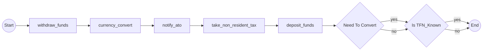
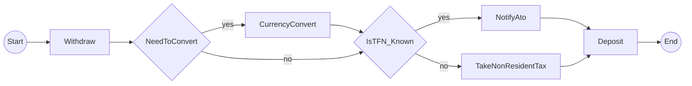

# CRITICAL: Graph Structure Generation Issue

**Issue ID**: CRITICAL-1
**Discovered**: 2025-11-19 during Story 3-5 code review
**Status**: BLOCKING Story 3-5 approval
**Severity**: CRITICAL - Violates core product requirements (FR52, FR55)

## Executive Summary

The current implementation generates **sequential linear graphs** instead of **branching decision-tree graphs**. This causes ALL activities to render in a chain BEFORE any decision nodes, which does not represent the actual workflow control flow.

**Impact**: Feature parity with .NET reference implementation FAILED. The library cannot correctly visualize workflows with conditional logic.

---

## Problem Description

### Current (WRONG) Output

When analyzing the MoneyTransfer workflow with 2 decisions and 5 activities, the system generates:



**Problems**:
1. All 5 activities execute sequentially (1→2→3→4→5)
2. Decisions appear AFTER all activities
3. Graph shows CurrencyConvert, NotifyAto, and TakeNonResidentTax executing unconditionally
4. Does NOT represent actual workflow logic

### Expected (CORRECT) Output

From .NET reference implementation (`Temporalio.Graphs/README.md:77-79`):



**Correct Structure**:
1. Withdraw executes first (unconditional)
2. Decision d0 (NeedToConvert) branches:
   - YES branch: CurrencyConvert executes
   - NO branch: Skip to d1
3. Decision d1 (IsTFN_Known) branches:
   - YES branch: NotifyAto executes
   - NO branch: TakeNonResidentTax executes
4. Both branches reconverge at Deposit

---

## Root Cause Analysis

### Location
**File**: `src/temporalio_graphs/generator.py`
**Function**: `PathPermutationGenerator.generate_paths()`
**Lines**: 280-288

### Code Analysis

```python
# Line 280-288 in generator.py
# WRONG: Adds ALL activities sequentially first
for activity_name in activities:
    path.add_activity(activity_name)

# WRONG: Then adds decisions after all activities
for decision, value in zip(decisions, decision_values):
    path.add_decision(decision.id, value, decision.name)
```

**Why This Is Wrong**:

1. **Sequential Processing**: Code iterates through activities list first, then decisions list
2. **No Control Flow Awareness**: Does not consider WHEN decisions occur in workflow execution
3. **No AST Position Tracking**: Does not track line numbers or code order
4. **Path Object Design**: GraphPath assumes sequential add_activity() and add_decision() calls

### Architectural Issue

The PathPermutationGenerator was designed for **listing** activities and decisions, not for building a **control flow graph**.

**Current Architecture**:
```
AST Analysis → Extract activities list → Extract decisions list
              ↓
PathPermutationGenerator → Create 2^n paths
              ↓
For each path: Add all activities → Add decision values
              ↓
MermaidRenderer → Render sequential nodes
```

**Required Architecture**:
```
AST Analysis → Build control flow tree with positions
              ↓
PathPermutationGenerator → Walk tree for each permutation
              ↓
For each path: Add nodes in EXECUTION ORDER
              ↓
MermaidRenderer → Render decision-tree topology
```

---

## Why Tests Pass (False Positive)

### Test Coverage Analysis

**File**: `tests/integration/test_money_transfer.py`

**What Tests Validate**:
- ✅ Path count = 4 (validates formula `2^2`)
- ✅ Activities exist in output (string search: "withdraw_funds", etc.)
- ✅ Decision nodes exist (string search: "d0{Need To Convert}")
- ✅ Decision syntax correct (diamond brackets)
- ✅ Branch labels correct ("yes", "no")
- ✅ Performance < 1 second

**What Tests DON'T Validate**:
- ❌ Graph topology (node connections)
- ❌ Edge sequences (does 1 connect to d0 or to 2?)
- ❌ Activity positions relative to decisions
- ❌ Conditional activity execution

### Golden File Issue

**File**: `examples/money_transfer/expected_output.md`

The golden file was generated from the BUGGY output. The regression test validates:

```python
def test_money_transfer_matches_golden_file(self):
    assert actual_output == golden_file_content
```

Since the golden file CONTAINS the wrong structure, this test passes while validating incorrect behavior.

---

## Impact Assessment

### Acceptance Criteria Status

| AC | Description | Status | Reason |
|---|---|---|---|
| AC1 | MoneyTransfer workflow | ✅ PASS | Workflow code is correct |
| AC2 | Integration test | ⚠️ PARTIAL | Tests pass but validate wrong structure |
| AC3 | Golden reference file | ❌ FAIL | Contains incorrect graph |
| AC4 | .NET feature parity | ❌ FAIL | Structure NOT isomorphic |
| AC5 | Example runner | ✅ PASS | Runner works |
| AC6 | Documentation | ✅ PASS | README updated |
| AC7 | Quality | ⚠️ PARTIAL | Tests validate wrong behavior |

### Functional Requirements Violated

**FR52**: Feature Parity with .NET Reference
- Status: VIOLATED
- Current: Python generates sequential graphs
- Expected: Structural equivalence with .NET branching graphs

**FR55**: Mermaid Output Quality
- Status: VIOLATED
- Current: Graph does not represent actual control flow
- Expected: Diagram accurately shows workflow execution paths

**FR56**: Example Workflows
- Status: VIOLATED
- Current: MoneyTransfer example shows incorrect visualization
- Expected: Example demonstrates correct decision-tree structure

---

## Proposed Solutions

### Solution 1: Redesign PathPermutationGenerator (RECOMMENDED)

**Approach**: Build control flow tree during path generation

**Changes Required**:
1. **Analyzer Enhancement**: Track AST node positions (line numbers)
2. **DecisionDetector Enhancement**: Record decision positions in workflow
3. **PathPermutationGenerator Redesign**:
   - Store activities with positions: `[(activity_name, line_num), ...]`
   - Store decisions with positions: `[(decision, line_num), ...]`
   - Merge and sort by line number
   - Add nodes to path in EXECUTION ORDER

**Pseudocode**:
```python
def generate_paths(self):
    # Merge activities and decisions with positions
    nodes = []
    for activity in activities:
        nodes.append(('activity', activity.name, activity.line_num))
    for decision in decisions:
        nodes.append(('decision', decision, decision.line_num))

    # Sort by line number (execution order)
    nodes.sort(key=lambda x: x[2])

    # Generate paths in execution order
    for decision_values in permutations:
        path = GraphPath()
        for node_type, node_data, _ in nodes:
            if node_type == 'activity':
                path.add_activity(node_data)
            elif node_type == 'decision':
                value = decision_values[decision.id]
                path.add_decision(decision.id, value, decision.name)
```

**Files to Modify**:
- `src/temporalio_graphs/analyzer.py` (add line tracking)
- `src/temporalio_graphs/detector.py` (add line tracking)
- `src/temporalio_graphs/generator.py` (redesign path generation)
- `src/temporalio_graphs/_internal/graph_models.py` (add position fields)

**Pros**:
- Architecturally correct
- Generates proper control flow
- Scalable to complex workflows

**Cons**:
- Requires changes across multiple files
- More complex implementation

**Estimated Effort**: 4-6 hours

---

### Solution 2: Post-Process in MermaidRenderer

**Approach**: Renderer reorders nodes based on decision logic

**Changes Required**:
1. **MermaidRenderer Enhancement**:
   - Detect decision nodes in path
   - Identify activities affected by each decision
   - Reorder nodes to interleave decisions and activities
   - Generate branching structure

**Pseudocode**:
```python
def _render_path(self, path):
    # Parse path steps to identify structure
    structure = self._analyze_path_structure(path)

    # Build decision tree
    tree = self._build_decision_tree(structure)

    # Render tree with proper branching
    return self._render_tree(tree)
```

**Files to Modify**:
- `src/temporalio_graphs/renderer.py` (add tree-building logic)

**Pros**:
- Isolated to renderer
- Doesn't change generator/analyzer
- Backward compatible

**Cons**:
- Heuristic-based (may not handle all cases)
- Renderer has too much logic
- Harder to maintain

**Estimated Effort**: 3-4 hours

---

### Solution 3: Hybrid Approach (FASTEST)

**Approach**: Minimal changes to both generator and renderer

**Changes Required**:
1. **Analyzer**: Add `line_num` field to DecisionPoint
2. **Generator**: Sort activities and decisions by line number before adding to path
3. **Renderer**: No changes needed (topology emerges from correct ordering)

**Pseudocode**:
```python
# In generator.py
def generate_paths(self):
    # Create merged list with positions
    execution_order = []
    for activity in activities:
        execution_order.append(('activity', activity, activity.line_num))
    for decision in decisions:
        execution_order.append(('decision', decision, decision.line_num))

    # Sort by line number
    execution_order.sort(key=lambda x: x[2])

    # Generate paths in correct order
    for permutation in permutations:
        path = GraphPath()
        for node_type, node, _ in execution_order:
            # Add to path based on type...
```

**Files to Modify**:
- `src/temporalio_graphs/_internal/graph_models.py` (add line_num to DecisionPoint)
- `src/temporalio_graphs/detector.py` (capture line numbers)
- `src/temporalio_graphs/generator.py` (sort before adding to paths)

**Pros**:
- Minimal changes
- Fast to implement
- Correct topology

**Cons**:
- Doesn't handle conditional activities (only solves sequential ordering)
- May need refinement for complex workflows

**Estimated Effort**: 2-3 hours

---

## Recommended Action Plan

### Phase 1: Quick Fix (Solution 3)
**Goal**: Unblock Story 3-5 with minimal changes

1. Add line number tracking to DecisionPoint
2. Sort execution order by line number in generator
3. Regenerate golden file
4. Add topology validation tests
5. Re-run code review

**Timeline**: 2-3 hours

### Phase 2: Proper Fix (Solution 1)
**Goal**: Architectural correctness for Epic 4+

1. Design control flow tree data structure
2. Enhance analyzer to build tree
3. Update generator to walk tree
4. Add support for conditional activities
5. Comprehensive test coverage

**Timeline**: 4-6 hours (Epic 4 story)

---

## Test Improvements Needed

### Add Topology Validation

**File**: `tests/integration/test_money_transfer.py`

**New Test**:
```python
def test_money_transfer_graph_topology(self):
    """Verify graph structure matches .NET reference topology."""
    result = analyze_workflow("examples/money_transfer/workflow.py")
    mermaid = _extract_mermaid_content(result)

    # Verify first decision comes after first activity
    assert "1[withdraw_funds] --> d0{Need To Convert}" in mermaid

    # Verify conditional activities only on correct branches
    # (This would FAIL with current implementation)
    lines = mermaid.split('\n')

    # Find d0 decision edges
    d0_yes_branch = [l for l in lines if 'd0' in l and '-- yes -->' in l][0]
    assert 'currency_convert' in d0_yes_branch or \
           any('currency_convert' in l for l in lines if d0_yes_branch.split('-->')[1].strip().split('[')[0] in l)
```

### Add Edge Sequence Validation

```python
def test_money_transfer_edge_sequences(self):
    """Verify edges connect in correct order."""
    result = analyze_workflow("examples/money_transfer/workflow.py")
    edges = _extract_edges_from_mermaid(result)

    # Validate execution order
    assert ('s', '1') in edges  # Start -> withdraw_funds
    assert ('1', 'd0') in edges  # withdraw_funds -> NeedToConvert

    # This would FAIL with current implementation:
    # Current has ('1', '2'), ('2', '3'), etc.
```

---

## Files Affected

### Source Code
- `src/temporalio_graphs/generator.py` - Root cause location
- `src/temporalio_graphs/renderer.py` - Previous incomplete fix
- `src/temporalio_graphs/detector.py` - May need line tracking
- `src/temporalio_graphs/analyzer.py` - May need line tracking
- `src/temporalio_graphs/_internal/graph_models.py` - May need position fields

### Test Files
- `tests/integration/test_money_transfer.py` - Add topology tests
- `tests/integration/test_decision_rendering.py` - May need updates

### Example Files
- `examples/money_transfer/expected_output.md` - Must regenerate with correct structure
- `examples/money_transfer/run.py` - No changes needed

### Documentation
- `README.md` - May need to update MoneyTransfer example explanation
- `docs/sprint-artifacts/sprint-status.yaml` - Story status tracking

---

## References

### .NET Reference Implementation
- **File**: `Temporalio.Graphs/README.md:77-79`
- **Structure**: Shows correct branching topology
- **Example**: MoneyTransfer with interleaved decisions and activities

### Related Stories
- **Story 3.1**: Decision Detection (working correctly)
- **Story 3.2**: to_decision() Helper (working correctly)
- **Story 3.3**: Path Permutation Generator (contains root cause)
- **Story 3.4**: Decision Node Rendering (incomplete fix attempted)
- **Story 3.5**: MoneyTransfer Integration Test (exposed the issue)

### Requirements
- **FR52**: Feature parity with .NET reference
- **FR55**: Mermaid output quality
- **FR56**: Example workflows with decision points

---

## Action Items

**IMMEDIATE (Required for Story 3-5 approval)**:
- [ ] Decide on solution approach (recommend Solution 3 for speed)
- [ ] Implement fix in generator.py
- [ ] Add line number tracking to DecisionPoint
- [ ] Regenerate golden file with correct output
- [ ] Add topology validation tests
- [ ] Re-run code review workflow
- [ ] Update sprint status when approved

**FUTURE (Technical Debt for Epic 4+)**:
- [ ] Design control flow tree architecture (Solution 1)
- [ ] Implement conditional activity support
- [ ] Add complex workflow test cases (nested decisions, loops)
- [ ] Performance optimization for large workflows

---

## Notes

### Why This Wasn't Caught Earlier

1. **Story 3.3** (Path Permutation Generator) tests focused on:
   - Path count formula (2^n)
   - Decision value combinations
   - Did NOT validate graph topology

2. **Story 3.4** (Decision Node Rendering) tests focused on:
   - Decision node syntax (diamond brackets)
   - Branch labels (yes/no)
   - Did NOT validate node ordering

3. **Story 3.5** (MoneyTransfer Integration) exposed the issue by:
   - Using real-world workflow with interleaved decisions
   - Comparing against .NET reference
   - Senior Developer code review caught structural mismatch

### Lessons Learned

1. Integration tests should validate graph STRUCTURE, not just node EXISTENCE
2. Golden files should be manually verified before becoming regression baselines
3. Feature parity requirements need topology validation, not just syntax validation
4. Complex workflows expose architectural issues that simple examples hide

---

**Document Version**: 1.0
**Last Updated**: 2025-11-19
**Owner**: Story 3-5 Implementation Team
**Status**: ACTIVE - Blocking Story 3-5 approval
