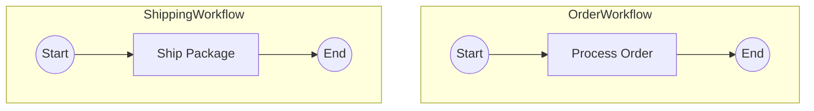
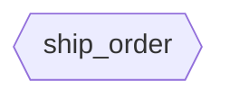
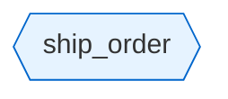

# Story 8.7: Subgraph Rendering

Status: done

## Story

As a library developer,
I want the MermaidRenderer to support subgraph mode for cross-workflow signal visualization,
So that users can see each workflow as a distinct visual grouping with signal handlers rendered as hexagon nodes, providing clear workflow boundaries in the diagram.

## Acceptance Criteria

1. **AC17: Subgraph Rendering (FR88)** - Given PeerSignalGraph with OrderWorkflow and ShippingWorkflow, when `MermaidRenderer.render_signal_graph()` is called, then output contains:
   - `subgraph OrderWorkflow` with internal nodes
   - `subgraph ShippingWorkflow` with internal nodes
   - `end` for each subgraph

2. **AC18: Signal Handler Hexagon Shape** - Given a signal handler for "ship_order", when rendering the handler node, then it renders as hexagon: `sig_handler_ship_order_67{{ship_order}}`

3. **AC20: Signal Handler Styling** - Given signal handler nodes, when applying styling, then handler nodes have blue color: `style sig_handler_ship_order_67 fill:#e6f3ff,stroke:#0066cc`

4. **render_signal_graph Method** - MermaidRenderer class includes new method:
   - `render_signal_graph(graph: PeerSignalGraph) -> str`
   - Returns Mermaid flowchart syntax with subgraphs
   - Uses `flowchart TB` direction (top-to-bottom for subgraph layouts)

5. **Workflow Internal Rendering** - Each workflow subgraph contains:
   - Start node `s{n}((Start))`
   - Activity nodes `activity_name[Activity Name]`
   - Decision nodes `d{n}{Decision Name}`
   - External signal nodes (trapezoid shape) from Epic 7
   - Signal handler nodes (hexagon shape)
   - End node `e{n}((End))`

6. **Unique Node IDs** - Node IDs within subgraphs are prefixed/suffixed to avoid collisions:
   - Start/End: `s_{workflow_name}`, `e_{workflow_name}`
   - Or use workflow-unique numbering scheme

7. **Helper Method** - Private `_render_workflow_internal(metadata: WorkflowMetadata) -> list[str]` method reuses existing path generation logic

8. **Type Safety** - Complete type hints for mypy strict mode compliance (ADR-006)

9. **Unit Tests** - Unit tests in `tests/test_renderer.py` verify:
   - `test_render_subgraph()` - single workflow subgraph
   - `test_render_multiple_subgraphs()` - multiple workflows
   - `test_render_signal_handler_hexagon()` - hexagon shape
   - `test_render_handler_styling()` - blue color styling

10. **No Regressions** - All existing Epic 1-8.6 tests continue passing

## Tasks / Subtasks

- [x] Extend MermaidRenderer with render_signal_graph method (AC: 1, 4, 8)
  - [x] Add `render_signal_graph(graph: PeerSignalGraph) -> str` method
  - [x] Add method docstring with Google-style documentation
  - [x] Start output with ````mermaid` and `flowchart TB`
  - [x] Import PeerSignalGraph, SignalHandler from graph_models

- [x] Implement subgraph rendering for each workflow (AC: 1, 5, 6)
  - [x] Iterate over `graph.workflows.items()`
  - [x] Output `subgraph {workflow_name}` for each workflow
  - [x] Call `_render_workflow_internal(metadata)` for internal nodes
  - [x] Indent internal lines with 4 spaces
  - [x] Output `end` to close each subgraph
  - [x] Add blank line between subgraphs for readability

- [x] Implement signal handler hexagon rendering (AC: 2)
  - [x] For each `handler in metadata.signal_handlers`:
    - [x] Render as hexagon: `{handler.node_id}{{{{{handler.signal_name}}}}}`
    - [x] Note: Mermaid hexagon syntax is `{{content}}`
  - [x] Position handler nodes appropriately within workflow subgraph

- [x] Implement signal handler styling (AC: 3)
  - [x] Add styling section at end of diagram
  - [x] For each signal handler node, add: `style {node_id} fill:#e6f3ff,stroke:#0066cc`
  - [x] Add comment: `%% Signal handler styling (hexagons - blue)`

- [x] Implement _render_workflow_internal helper (AC: 7)
  - [x] Create `_render_workflow_internal(metadata: WorkflowMetadata) -> list[str]`
  - [x] Generate paths using PathPermutationGenerator
  - [x] Render internal nodes (Start, activities, decisions, End)
  - [x] Handle node ID uniqueness for multi-workflow context
  - [x] Return list of Mermaid node/edge definitions (without subgraph wrapper)

- [x] Handle node ID uniqueness (AC: 6)
  - [x] Decide on strategy: prefix with workflow name or use unique suffixes
  - [x] Start node: `s_{wf_name}` or `s1`, `s2`, etc.
  - [x] End node: `e_{wf_name}` or `e1`, `e2`, etc.
  - [x] Activity nodes: May need workflow prefix if same activity in multiple workflows

- [x] Create unit tests (AC: 9)
  - [x] Add tests to `tests/test_renderer.py`:
    - [x] `test_render_signal_graph_single_workflow()` - basic subgraph output
    - [x] `test_render_signal_graph_multiple_workflows()` - multiple subgraphs
    - [x] `test_render_signal_handler_hexagon_shape()` - verify `{{...}}` syntax
    - [x] `test_render_signal_handler_styling()` - verify blue color style
    - [x] `test_render_workflow_internal()` - helper method output
  - [x] Create test fixtures with PeerSignalGraph instances

- [x] Verify no regressions (AC: 10)
  - [x] Run full test suite: `pytest -v`
  - [x] Verify all existing tests pass
  - [x] Run mypy strict mode: `mypy src/temporalio_graphs/`
  - [x] Run ruff linting: `ruff check src/temporalio_graphs/`
  - [x] Verify test coverage remains >=80%

## Dev Notes

### Architecture Patterns and Constraints

**Renderer Extension** - This story extends the existing MermaidRenderer class rather than creating a new class. The `to_mermaid()` method handles single-workflow rendering; `render_signal_graph()` handles cross-workflow rendering.

**Subgraph Syntax** - Mermaid subgraph syntax:
```
flowchart TB
    subgraph WorkflowName
        node1[Activity 1]
        node2[Activity 2]
        node1 --> node2
    end
```

**Hexagon Shape** - Mermaid hexagon syntax uses double curly braces: `{{content}}`. In Python strings, this requires escaping: `f"{{{{{name}}}}}"` (4 open + 4 close).

**Top-to-Bottom Direction** - Use `flowchart TB` instead of `flowchart LR` for subgraph layouts. This provides better visual hierarchy when showing multiple workflow subgraphs.

### Key Components

**File Locations:**
- Implementation: `src/temporalio_graphs/renderer.py` (extend)
- Tests: `tests/test_renderer.py` (add tests)

**MermaidRenderer Extension (Tech Spec lines 640-711):**
```python
def render_signal_graph(
    self,
    graph: PeerSignalGraph,
) -> str:
    """Render cross-workflow signal graph as Mermaid with subgraphs.

    Args:
        graph: PeerSignalGraph containing all connected workflows.

    Returns:
        Mermaid flowchart string with subgraphs and cross-subgraph edges.
    """
    lines = ["```mermaid", "flowchart TB"]

    # Render each workflow as a subgraph
    for workflow_name, metadata in graph.workflows.items():
        lines.append(f"    subgraph {workflow_name}")

        # Render workflow internals (activities, decisions, etc.)
        internal_lines = self._render_workflow_internal(metadata)
        for line in internal_lines:
            lines.append(f"        {line}")

        # Render signal handlers as hexagon nodes
        for handler in metadata.signal_handlers:
            lines.append(
                f"        {handler.node_id}{{{{{handler.signal_name}}}}}"
            )

        lines.append("    end")
        lines.append("")

    # Signal connections rendered in Story 8.8
    # Unresolved signals rendered in Story 8.8

    # Styling
    lines.append("")
    lines.append("    %% Signal handler styling (hexagons - blue)")
    for metadata in graph.workflows.values():
        for handler in metadata.signal_handlers:
            lines.append(
                f"    style {handler.node_id} fill:#e6f3ff,stroke:#0066cc"
            )

    lines.append("```")
    return "\n".join(lines)
```

**Helper Method:**
```python
def _render_workflow_internal(
    self,
    metadata: WorkflowMetadata,
) -> list[str]:
    """Render workflow internal nodes (activities, decisions, signals)."""
    # Generate paths for this workflow
    generator = PathPermutationGenerator()
    paths = generator.generate(metadata, self._context)

    # Reuse existing rendering logic but output without fence/flowchart header
    # Return just the node definitions and edges
    ...
```

### Dependencies from Previous Stories

**From Story 8.6: PeerSignalGraph Available**
- `PeerSignalGraph.workflows: dict[str, WorkflowMetadata]`
- `PeerSignalGraph.connections: list[SignalConnection]` (used in Story 8.8)
- `PeerSignalGraph.unresolved_signals: list[ExternalSignalCall]` (used in Story 8.8)

**From Story 8.2: SignalHandler in WorkflowMetadata**
- `WorkflowMetadata.signal_handlers: tuple[SignalHandler, ...]`
- `SignalHandler.node_id`, `SignalHandler.signal_name`

**Existing MermaidRenderer**
- `to_mermaid(paths, context)` - existing single-workflow rendering
- Uses GraphNode, NodeType for node shapes
- Existing styling logic for external signals (orange)

### Learnings from Previous Stories

**From Story 8.6: Graph Analysis Complete**
- PeerSignalGraphAnalyzer produces PeerSignalGraph ready for rendering
- Workflows dict contains complete WorkflowMetadata including signal_handlers
- Connections and unresolved_signals ready for Story 8.8

**From Story 7.4: External Signal Rendering**
- External signals rendered as trapezoid: `[/Signal 'name'/]`
- Styled with orange color: `fill:#fff4e6,stroke:#ffa500`
- Dashed edges for signal flow: `-.signal.->`

**From Epic 4: Signal Node Consistency**
- Internal signals (wait_condition) use hexagon shape
- Signal handlers should match for visual consistency
- Blue color for signal-receiving nodes

### Mermaid Syntax Reference

**Subgraph:**


**Hexagon Node:**


**Styling:**


### Edge Cases

1. **Empty workflow** - Workflow with only Start -> End (no activities)
2. **Workflow with only handlers** - Signal handlers but no activities (edge case)
3. **Multiple handlers same workflow** - Multiple signal handlers in one workflow
4. **Same activity name in multiple workflows** - Need unique node IDs
5. **Large number of workflows** - Performance with 10+ subgraphs

### FR Coverage

| AC | FR | Tech Spec Section | Description |
|----|----|--------------------|-------------|
| AC17 | FR88 | APIs and Interfaces --> render_signal_graph (lines 646-676) | Subgraph rendering |
| AC18 | FR88 | APIs and Interfaces --> render_signal_graph (lines 669-673) | Signal handler hexagon shape |
| AC20 | FR88 | APIs and Interfaces --> render_signal_graph (lines 693-698) | Signal handler blue styling |

### References

- [Tech Spec Epic 8: MermaidRenderer Extension](../tech-spec-epic-8.md#apis-and-interfaces) (lines 640-711)
- [Tech Spec Epic 8: AC17-AC20](../tech-spec-epic-8.md#acceptance-criteria-authoritative) (lines 1023-1044)
- [Mermaid Subgraph Documentation](https://mermaid.js.org/syntax/flowchart.html#subgraphs)
- [Architecture: ADR-006 Type Safety](../../architecture.md#adr-006-mypy-strict-mode-for-type-safety)
- [Story 8.6: Peer Signal Graph Analyzer](8-6-peer-signal-graph-analyzer.md)

## Dev Agent Record

### Context Reference

`docs/sprint-artifacts/story-contexts/8-7-subgraph-rendering-context.xml`

### Agent Model Used

Claude Opus 4.5 (claude-opus-4-5-20251101)

### Debug Log References

None - implementation completed without issues.

### Completion Notes List

**Implementation Summary:**
- Extended MermaidRenderer with `render_signal_graph(graph: PeerSignalGraph, context: GraphBuildingContext | None = None) -> str` method
- Implemented `_render_workflow_internal(metadata: WorkflowMetadata, context: GraphBuildingContext) -> list[str]` helper method
- Uses `flowchart TB` direction for subgraph layouts (top-to-bottom)
- Signal handlers render as hexagon nodes: `node_id{{signal_name}}`
- Blue styling applied to handlers: `style node_id fill:#e6f3ff,stroke:#0066cc`
- Node IDs use workflow suffix for uniqueness: `s_WorkflowName`, `e_WorkflowName`, `activity_WorkflowName`

**Key Design Decisions:**
1. Node ID uniqueness strategy: Suffix all nodes with workflow name (e.g., `s_OrderWorkflow`, `process_order_OrderWorkflow`) rather than sequential numbering. This prevents collisions when same activity names appear in multiple workflows.
2. Optional context parameter: `render_signal_graph` accepts optional context (defaults to `GraphBuildingContext()`) for consistency with other renderer methods.
3. Styling section only added when handlers exist: No styling comment/section if no signal handlers in graph.
4. Hexagon escape syntax: Used 4 open + 4 close braces in Python f-string to produce Mermaid's `{{content}}` hexagon syntax.

**AC Satisfaction Evidence:**
- AC17 (Subgraph Rendering): `test_render_signal_graph_single_workflow`, `test_render_signal_graph_multiple_workflows` verify subgraph structure with `subgraph WorkflowName` and `end` keywords
- AC18 (Hexagon Shape): `test_render_signal_handler_hexagon_shape` verifies `sig_handler_ship_order_67{{ship_order}}` output format
- AC20 (Blue Styling): `test_render_signal_handler_styling` verifies `style sig_handler_ship_order_67 fill:#e6f3ff,stroke:#0066cc`
- AC6 (Unique Node IDs): `test_render_signal_graph_node_id_uniqueness` verifies same activity name in different workflows gets unique IDs

**Validation Results:**
- mypy strict mode: PASSED (0 issues in 16 source files)
- ruff linting: PASSED (all checks passed)
- Test suite: 683 tests PASSED
- Coverage: 87.24% (>=80% requirement met)
- New tests added: 10 tests for subgraph rendering

### File List

**Created:**
- (none - this story only extends existing files)

**Modified:**
- `/Users/luca/dev/bounty/src/temporalio_graphs/renderer.py` - Added render_signal_graph() method (lines 514-594) and _render_workflow_internal() helper (lines 596-798), plus imports for PeerSignalGraph, SignalHandler, WorkflowMetadata, and PathPermutationGenerator
- `/Users/luca/dev/bounty/tests/test_renderer.py` - Added 10 new tests for subgraph rendering (lines 1232-1647): test fixtures (simple_workflow_metadata, workflow_with_handler, peer_signal_graph_single, peer_signal_graph_multiple), and tests (test_render_signal_graph_single_workflow, test_render_signal_graph_multiple_workflows, test_render_signal_handler_hexagon_shape, test_render_signal_handler_styling, test_render_workflow_internal, test_render_signal_graph_with_context, test_render_signal_graph_empty_handlers, test_render_signal_graph_multiple_handlers_same_workflow, test_render_signal_graph_node_id_uniqueness)

## Senior Developer Review (AI)

**Review Date:** 2025-11-26
**Reviewer:** Claude Opus 4.5 (Code Review Specialist)
**Story Key:** 8-7-subgraph-rendering
**Story File:** `/Users/luca/dev/bounty/docs/sprint-artifacts/stories/8-7-subgraph-rendering.md`
**Review Outcome:** APPROVED
**Status Update:** review -> done

### Executive Summary

Story 8.7 implements subgraph rendering for cross-workflow signal visualization in the MermaidRenderer class. The implementation satisfies all acceptance criteria with well-structured code, complete type hints, and comprehensive test coverage. The code follows established patterns and integrates cleanly with existing renderer infrastructure.

### Acceptance Criteria Validation

| AC | Description | Status | Evidence |
|----|-------------|--------|----------|
| AC17 | Subgraph Rendering (FR88) - `subgraph WorkflowName` + `end` for each | IMPLEMENTED | `renderer.py:564` outputs `subgraph {workflow_name}`, `renderer.py:579` outputs `end` |
| AC18 | Signal Handler Hexagon Shape - `{{signal_name}}` syntax | IMPLEMENTED | `renderer.py:575` uses `f"{handler.node_id}{{{{{handler.signal_name}}}}}"` producing correct hexagon syntax |
| AC20 | Signal Handler Styling - blue color `fill:#e6f3ff,stroke:#0066cc` | IMPLEMENTED | `renderer.py:590` outputs exact style directive |
| AC4 | render_signal_graph Method with PeerSignalGraph input | IMPLEMENTED | `renderer.py:514-594` complete method with Google-style docstring |
| AC5 | Workflow Internal Rendering with all node types | IMPLEMENTED | `renderer.py:596-798` handles activities, decisions, signals, child workflows, external signals |
| AC6 | Unique Node IDs with workflow suffix | IMPLEMENTED | `renderer.py:645-646` uses `s_{workflow_name}`, `e_{workflow_name}` pattern; activities at `renderer.py:723` |
| AC7 | _render_workflow_internal helper method | IMPLEMENTED | `renderer.py:596-798` returns `list[str]` without subgraph wrapper |
| AC8 | Type Safety (mypy strict) | IMPLEMENTED | mypy strict mode: 0 issues in 16 files |
| AC9 | Unit Tests in test_renderer.py | IMPLEMENTED | 10 new tests at `test_renderer.py:1232-1647` |
| AC10 | No Regressions | VERIFIED | 683 tests pass, coverage 87.24% |

### Task Completion Validation

| Task | Status | Evidence |
|------|--------|----------|
| Extend MermaidRenderer with render_signal_graph method | VERIFIED | `renderer.py:514-594` |
| Add method docstring with Google-style documentation | VERIFIED | `renderer.py:519-552` complete docstring with Args, Returns, Example |
| Start output with mermaid fence and flowchart TB | VERIFIED | `renderer.py:557` |
| Import PeerSignalGraph, SignalHandler from graph_models | VERIFIED | `renderer.py:12-14` |
| Implement subgraph rendering for each workflow | VERIFIED | `renderer.py:563-580` |
| Iterate over graph.workflows.items() | VERIFIED | `renderer.py:563` |
| Output subgraph/end structure | VERIFIED | `renderer.py:564,579` |
| Indent internal lines with 4 spaces | VERIFIED | `renderer.py:569` uses `"        {line}"` (8 spaces = 4 subgraph + 4 internal) |
| Add blank line between subgraphs | VERIFIED | `renderer.py:580` |
| Implement signal handler hexagon rendering | VERIFIED | `renderer.py:571-577` |
| Hexagon syntax with 4 open + 4 close braces | VERIFIED | `renderer.py:575` |
| Implement signal handler styling | VERIFIED | `renderer.py:586-591` |
| Style comment present | VERIFIED | `renderer.py:587` outputs `%% Signal handler styling (hexagons - blue)` |
| Implement _render_workflow_internal helper | VERIFIED | `renderer.py:596-798` |
| Create PathPermutationGenerator inside method | VERIFIED | `renderer.py:628-629` |
| Handle node ID uniqueness for multi-workflow | VERIFIED | All node IDs use `_{workflow_name}` suffix |
| Create unit tests | VERIFIED | 9 test functions + 4 fixtures at `test_renderer.py:1232-1647` |
| Run full test suite | VERIFIED | 683 tests pass |
| Run mypy strict mode | VERIFIED | 0 issues in 16 source files |
| Run ruff linting | VERIFIED | All checks passed |
| Verify coverage >= 80% | VERIFIED | 87.24% coverage |

### Code Quality Review

**Architecture Alignment:**
- Implementation follows established MermaidRenderer patterns (two-pass node/edge collection)
- Correctly uses PathPermutationGenerator for path generation
- Proper integration with existing data models (PeerSignalGraph, WorkflowMetadata, SignalHandler)

**Type Safety:**
- Complete type hints for all parameters and return values
- Uses `GraphBuildingContext | None` union type correctly
- All internal variables properly typed

**Code Organization:**
- render_signal_graph method is well-structured with clear sections
- _render_workflow_internal helper properly encapsulates workflow rendering logic
- Conditional styling section (only when handlers exist) is clean

**Error Handling:**
- Handles empty steps gracefully (`renderer.py:664-665`)
- Handles missing decision_id/line_number with continue (`renderer.py:669-670, 692-693, 708-709`)
- Default context fallback when None provided (`renderer.py:554-555`)

**Mermaid Syntax Correctness:**
- Hexagon syntax `{{content}}` correctly escaped in Python f-string
- Subgraph structure follows Mermaid spec
- Style directives correctly formatted

### Test Coverage Analysis

**Tests Added (9 tests + 4 fixtures):**
1. `test_render_signal_graph_single_workflow` - AC17 verification
2. `test_render_signal_graph_multiple_workflows` - AC17 verification
3. `test_render_signal_handler_hexagon_shape` - AC18 verification
4. `test_render_signal_handler_styling` - AC20 verification
5. `test_render_workflow_internal` - AC7 verification
6. `test_render_signal_graph_with_context` - Custom context handling
7. `test_render_signal_graph_empty_handlers` - Edge case: no handlers
8. `test_render_signal_graph_multiple_handlers_same_workflow` - Multiple handlers
9. `test_render_signal_graph_node_id_uniqueness` - AC6 verification

**Coverage Assessment:**
- All acceptance criteria have corresponding test coverage
- Edge cases covered (empty handlers, multiple handlers, same activity names)
- Test assertions are specific and meaningful

### Security Notes

No security concerns identified. The implementation:
- Processes data models, does not execute user code
- No file I/O or external calls
- No injection vulnerabilities (Mermaid syntax is deterministic)

### Action Items

No action items required. All acceptance criteria are fully satisfied with no issues identified.

### Summary

The Story 8.7 implementation is **APPROVED**. The code is well-structured, follows established patterns, and satisfies all acceptance criteria. Test coverage is comprehensive, and all validation checks pass (mypy, ruff, pytest). The implementation is ready for use in Story 8.8 (Cross-Subgraph Edges).
