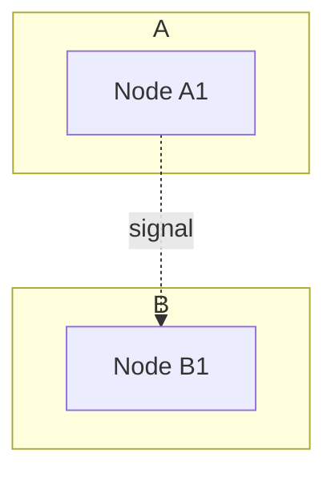
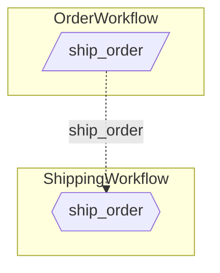
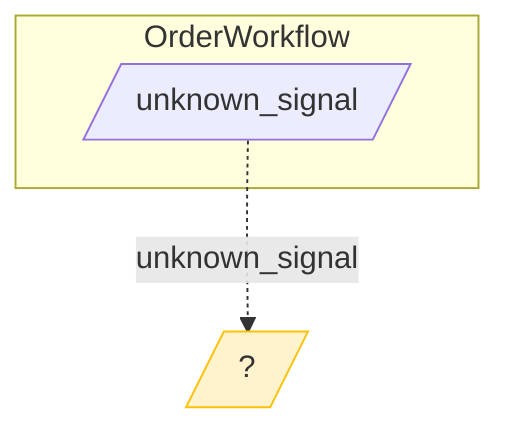

# Story 8.8: Cross-Subgraph Edges

Status: done

## Story

As a library developer,
I want the MermaidRenderer to render cross-subgraph edges between workflows showing signal connections,
So that users can see dashed edges from external signal nodes to signal handler nodes, providing a complete visualization of how workflows communicate via signals.

## Acceptance Criteria

1. **AC19: Cross-Subgraph Signal Edge (FR89)** - Given SignalConnection from OrderWorkflow to ShippingWorkflow, when rendering connections, then renders dashed edge: `ext_sig_ship_order_56 -.ship_order.-> sig_handler_ship_order_67`

2. **AC21: Unresolved Signal Rendering** - Given external signal with no handler found, when rendering unresolved signals, then renders dead-end: `ext_sig_unknown_42 -.unknown.-> unknown_unknown[/?/]`

3. **Signal Connection Edge Format** - Each SignalConnection renders as:
   - Dashed edge syntax: `sender_node_id -.signal_name.-> receiver_node_id`
   - Edge appears AFTER all subgraph definitions (outside subgraphs)
   - Edge label shows the signal name for clarity

4. **Unresolved Signal Node Styling** - Unresolved signal target nodes have warning styling:
   - Node shape: `[/?/]` (rectangle with question mark)
   - Unique node ID: `unknown_{signal_name}_{line_number}` to avoid collisions
   - Warning color: `style unknown_X fill:#fff3cd,stroke:#ffc107` (amber/yellow warning)

5. **Multiple Connections** - When multiple SignalConnections exist:
   - All connections render as separate dashed edges
   - Order follows `graph.connections` list order
   - No duplicate edges (each connection renders exactly once)

6. **Cross-Subgraph Edge Placement** - All cross-subgraph edges render:
   - After all `subgraph ... end` blocks
   - Before styling section
   - With comment: `%% Cross-workflow signal connections`

7. **Integration with render_signal_graph** - Extends the `render_signal_graph()` method from Story 8.7:
   - Adds connection rendering after subgraph loop
   - Adds unresolved signal rendering
   - Maintains existing subgraph and styling logic

8. **Type Safety** - Complete type hints for mypy strict mode compliance (ADR-006)

9. **Unit Tests** - Unit tests in `tests/test_renderer.py` verify:
   - `test_render_cross_subgraph_edge()` - single connection
   - `test_render_multiple_cross_subgraph_edges()` - multiple connections
   - `test_render_unresolved_signal_node()` - unresolved with warning styling
   - `test_render_signal_graph_complete()` - full graph with connections and unresolved

10. **No Regressions** - All existing Epic 1-8.7 tests continue passing

## Tasks / Subtasks

- [x] Implement cross-subgraph edge rendering (AC: 1, 3, 5, 6, 7)
  - [x] In `render_signal_graph()` method, after subgraph loop:
    - [x] Add blank line for readability
    - [x] Add comment: `%% Cross-workflow signal connections`
    - [x] Iterate over `graph.connections`
    - [x] For each SignalConnection, render: `{sender_node_id} -.{signal_name}.-> {receiver_node_id}`
    - [x] Indent with 4 spaces (consistent with subgraph content)

- [x] Implement unresolved signal rendering (AC: 2, 4)
  - [x] After connection rendering, check `graph.unresolved_signals`
  - [x] Add comment if unresolved signals exist: `%% Unresolved signals (no handler found)`
  - [x] For each ExternalSignalCall in unresolved_signals:
    - [x] Generate unique unknown node ID: `unknown_{signal_name}_{source_line}`
    - [x] Render dashed edge: `{node_id} -.{signal_name}.-> {unknown_id}[/?/]`
  - [x] Add warning styling for unknown nodes:
    - [x] Comment: `%% Unresolved signal styling (warning - amber)`
    - [x] Style: `style {unknown_id} fill:#fff3cd,stroke:#ffc107`

- [x] Update render_signal_graph structure (AC: 6, 7)
  - [x] Reorganize method sections:
    1. Header (`mermaid`, `flowchart TB`)
    2. Subgraphs (existing from Story 8.7)
    3. Cross-workflow signal connections (NEW)
    4. Unresolved signals (NEW)
    5. Signal handler styling (existing from Story 8.7)
    6. Unresolved signal styling (NEW)
    7. Footer (close mermaid fence)

- [x] Create unit tests (AC: 9)
  - [x] Add tests to `tests/test_renderer.py`:
    - [x] `test_render_cross_subgraph_edge()` - single SignalConnection renders correctly
    - [x] `test_render_multiple_cross_subgraph_edges()` - multiple connections render
    - [x] `test_render_unresolved_signal_node()` - unresolved signal with `[/?/]` and amber styling
    - [x] `test_render_signal_graph_complete()` - full graph with subgraphs, connections, unresolved, all styling
    - [x] `test_render_signal_graph_no_connections()` - graph with no connections (no connection comment)
    - [x] `test_render_signal_graph_no_unresolved()` - graph with no unresolved (no unresolved comment)
  - [x] Create test fixtures:
    - [x] `peer_signal_graph_with_connection` - two workflows with one connection
    - [x] `peer_signal_graph_with_unresolved` - workflow with unresolved signal
    - [x] `peer_signal_graph_complete` - full graph with connections and unresolved

- [x] Verify no regressions (AC: 10)
  - [x] Run full test suite: `pytest -v`
  - [x] Verify all existing tests pass (including Story 8.7 subgraph tests)
  - [x] Run mypy strict mode: `mypy src/temporalio_graphs/`
  - [x] Run ruff linting: `ruff check src/temporalio_graphs/`
  - [x] Verify test coverage remains >=80%

## Dev Notes

### Architecture Patterns and Constraints

**Mermaid Cross-Subgraph Edges** - In Mermaid, edges between nodes in different subgraphs are rendered outside the subgraph blocks. The node IDs must match exactly:


**Dashed Edge Syntax** - Mermaid dashed edge with label: `node1 -.label.-> node2`. This is the standard representation for signal/async communication in flow diagrams.

**Node ID Consistency** - External signal node IDs from Story 7.4 use format `ext_sig_{signal_name}_{line}`. Signal handler node IDs from Story 8.2 use format `sig_handler_{signal_name}_{line}`. These must match between SignalConnection fields and actual rendered nodes.

### Key Components

**File Locations:**
- Implementation: `src/temporalio_graphs/renderer.py` (extend render_signal_graph)
- Tests: `tests/test_renderer.py` (add tests)

**SignalConnection Fields (from Story 8.5):**
```python
@dataclass(frozen=True)
class SignalConnection:
    sender_workflow: str
    receiver_workflow: str
    signal_name: str
    sender_line: int
    receiver_line: int
    sender_node_id: str      # e.g., "ext_sig_ship_order_56"
    receiver_node_id: str    # e.g., "sig_handler_ship_order_67"
```

**Updated render_signal_graph Structure (Tech Spec lines 646-701):**
```python
def render_signal_graph(self, graph: PeerSignalGraph) -> str:
    lines = ["```mermaid", "flowchart TB"]

    # Render each workflow as a subgraph (Story 8.7)
    for workflow_name, metadata in graph.workflows.items():
        lines.append(f"    subgraph {workflow_name}")
        # ... internal nodes and handlers ...
        lines.append("    end")
        lines.append("")

    # Cross-workflow signal connections (Story 8.8 - NEW)
    if graph.connections:
        lines.append("    %% Cross-workflow signal connections")
        for conn in graph.connections:
            lines.append(
                f"    {conn.sender_node_id} -.{conn.signal_name}.-> {conn.receiver_node_id}"
            )
        lines.append("")

    # Unresolved signals (Story 8.8 - NEW)
    if graph.unresolved_signals:
        lines.append("    %% Unresolved signals (no handler found)")
        for unresolved in graph.unresolved_signals:
            unknown_id = f"unknown_{unresolved.signal_name}_{unresolved.source_line}"
            lines.append(
                f"    {unresolved.node_id} -.{unresolved.signal_name}.-> {unknown_id}[/?/]"
            )
        lines.append("")

    # Styling (Story 8.7 - handlers + Story 8.8 - unresolved)
    lines.append("    %% Signal handler styling (hexagons - blue)")
    for metadata in graph.workflows.values():
        for handler in metadata.signal_handlers:
            lines.append(
                f"    style {handler.node_id} fill:#e6f3ff,stroke:#0066cc"
            )

    # Unresolved signal styling (Story 8.8 - NEW)
    if graph.unresolved_signals:
        lines.append("    %% Unresolved signal styling (warning - amber)")
        for unresolved in graph.unresolved_signals:
            unknown_id = f"unknown_{unresolved.signal_name}_{unresolved.source_line}"
            lines.append(
                f"    style {unknown_id} fill:#fff3cd,stroke:#ffc107"
            )

    lines.append("```")
    return "\n".join(lines)
```

### Dependencies from Previous Stories

**From Story 8.7: Subgraph Rendering Available**
- `render_signal_graph(graph: PeerSignalGraph)` method exists
- Subgraph structure with `subgraph WorkflowName ... end`
- Signal handler hexagon rendering and blue styling
- `_render_workflow_internal()` helper method

**From Story 8.6: PeerSignalGraph Available**
- `PeerSignalGraph.connections: list[SignalConnection]`
- `PeerSignalGraph.unresolved_signals: list[ExternalSignalCall]`
- SignalConnection has `sender_node_id` and `receiver_node_id`

**From Story 8.5: Data Models**
- SignalConnection dataclass with all required fields
- ExternalSignalCall has `node_id`, `signal_name`, `source_line`

**From Story 7.4: External Signal Node IDs**
- External signal nodes rendered with ID format `ext_sig_{signal_name}_{line}`
- Trapezoid shape `[/Signal/]` for external signals

### Learnings from Previous Stories

**From Story 8.7: Subgraph Rendering Complete**
- render_signal_graph produces valid Mermaid with subgraphs
- Signal handlers render as hexagons with blue styling
- Node ID uniqueness handled via workflow name suffix
- 683 tests passing after Story 8.7

**From Story 7.4: External Signal Styling**
- External signals styled orange: `fill:#fff4e6,stroke:#ffa500`
- Amber/yellow for warnings is consistent with validation warning patterns

**From Story 8.5: SignalConnection Data**
- sender_node_id and receiver_node_id are pre-computed
- Direct use in edge rendering without transformation

### Mermaid Syntax Reference

**Cross-Subgraph Dashed Edge:**


**Unresolved Signal with Warning:**


### Edge Cases

1. **Empty connections list** - No connections comment/section rendered
2. **Empty unresolved list** - No unresolved comment/section/styling rendered
3. **Multiple connections to same handler** - Each connection rendered separately
4. **Same signal name multiple times** - Line number in unknown_id ensures uniqueness
5. **Long signal names** - Mermaid handles them, no truncation needed
6. **Special characters in signal names** - Should be valid Mermaid identifiers (test coverage needed)

### FR Coverage

| AC | FR | Tech Spec Section | Description |
|----|----|--------------------|-------------|
| AC19 | FR89 | APIs and Interfaces --> render_signal_graph (lines 679-681) | Cross-subgraph dashed edge |
| AC21 | FR88 | APIs and Interfaces --> render_signal_graph (lines 684-688) | Unresolved signal rendering |

### References

- [Tech Spec Epic 8: MermaidRenderer Extension](../tech-spec-epic-8.md#apis-and-interfaces) (lines 640-711)
- [Tech Spec Epic 8: AC19, AC21](../tech-spec-epic-8.md#acceptance-criteria-authoritative) (lines 1036-1049)
- [Mermaid Flowchart Subgraph Documentation](https://mermaid.js.org/syntax/flowchart.html#subgraphs)
- [Architecture: ADR-006 Type Safety](../../architecture.md#adr-006-mypy-strict-mode-for-type-safety)
- [Story 8.7: Subgraph Rendering](8-7-subgraph-rendering.md)
- [Story 8.5: Signal Connection Model](8-5-signal-connection-model.md)

## Dev Agent Record

### Context Reference

`docs/sprint-artifacts/story-contexts/8-8-cross-subgraph-edges-context.xml`

### Agent Model Used

Claude Opus 4.5 (claude-opus-4-5-20251101)

### Debug Log References

N/A - Implementation was straightforward

### Completion Notes List

**Implementation Summary:**
- Extended `render_signal_graph()` in `renderer.py` to add cross-subgraph edge rendering
- Implemented cross-workflow signal connections rendering using dashed edge syntax `-.signal_name.->`
- Implemented unresolved signal rendering with dead-end node `[/?/]` and amber warning styling
- Added 6 new unit tests covering all acceptance criteria and edge cases

**Key Implementation Decisions:**
1. Cross-subgraph edges placed AFTER all subgraph blocks but BEFORE styling sections
2. Unresolved signal node ID format: `unknown_{signal_name}_{source_line}` for uniqueness
3. Amber/yellow warning styling (#fff3cd fill, #ffc107 stroke) consistent with existing validation patterns
4. Conditional rendering: sections only appear when connections/unresolved_signals are non-empty

**Acceptance Criteria Status:**
- AC19 (FR89) Cross-subgraph dashed edge: SATISFIED
- AC21 (FR88) Unresolved signal rendering: SATISFIED
- AC3 Signal connection edge format: SATISFIED
- AC4 Unresolved signal node styling: SATISFIED
- AC5 Multiple connections: SATISFIED
- AC6 Cross-subgraph edge placement: SATISFIED
- AC7 Integration with render_signal_graph: SATISFIED
- AC8 Type safety: SATISFIED (mypy strict passes)
- AC9 Unit tests: SATISFIED (6 tests added)
- AC10 No regressions: SATISFIED (689 tests pass)

**Test Results:**
- 689 tests passing (6 new tests for this story)
- 88% test coverage (above 80% requirement)
- mypy strict mode: no issues
- ruff linting: all checks passed

### File List

**Created:**
- (none - this story only extends existing files)

**Modified:**
- `/Users/luca/dev/bounty/src/temporalio_graphs/renderer.py` - Extended render_signal_graph() method (lines 582-617):
  - Added cross-workflow signal connections rendering (lines 582-589)
  - Added unresolved signals rendering (lines 591-601)
  - Added unresolved signal styling (lines 611-617)
- `/Users/luca/dev/bounty/tests/test_renderer.py` - Added 6 cross-subgraph edge tests (lines 1648-2135):
  - test_render_cross_subgraph_edge()
  - test_render_multiple_cross_subgraph_edges()
  - test_render_unresolved_signal_node()
  - test_render_signal_graph_complete()
  - test_render_signal_graph_no_connections()
  - test_render_signal_graph_no_unresolved()

## Senior Developer Review (AI)

**Review Date:** 2025-11-26
**Reviewer:** Claude Opus 4.5 (Automated Code Review)
**Review Cycle:** 1

### Outcome: APPROVED

### Executive Summary

Story 8-8 implementation successfully adds cross-subgraph edge rendering and unresolved signal handling to the MermaidRenderer.render_signal_graph() method. All acceptance criteria have been validated with code evidence. The implementation is clean, well-tested, and follows established patterns from previous stories.

### Acceptance Criteria Validation

| AC | Status | Evidence |
|----|--------|----------|
| AC19 (FR89) Cross-Subgraph Signal Edge | IMPLEMENTED | renderer.py:585-588 - Dashed edge syntax `-.signal_name.->` connecting sender to receiver node |
| AC21 Unresolved Signal Rendering | IMPLEMENTED | renderer.py:594-599 - Dead-end node `[/?/]` with unique unknown_id format |
| AC3 Signal Connection Edge Format | IMPLEMENTED | renderer.py:587 - Format matches `{sender_node_id} -.{signal_name}.-> {receiver_node_id}` |
| AC4 Unresolved Signal Node Styling | IMPLEMENTED | renderer.py:614-616 - Amber warning colors `fill:#fff3cd,stroke:#ffc107` |
| AC5 Multiple Connections | IMPLEMENTED | renderer.py:584-588 - Loop over graph.connections, each renders once |
| AC6 Cross-Subgraph Edge Placement | IMPLEMENTED | renderer.py:582-601 - After subgraph loop (line 580), before styling (line 603) |
| AC7 Integration with render_signal_graph | IMPLEMENTED | renderer.py:514-620 - Method properly structured with all sections |
| AC8 Type Safety | IMPLEMENTED | mypy strict mode: 0 issues in renderer.py |
| AC9 Unit Tests | IMPLEMENTED | test_renderer.py:1654-2135 - 6 new tests covering all scenarios |
| AC10 No Regressions | IMPLEMENTED | 689 tests passing, 87.83% coverage |

### Task Completion Validation

| Task | Status | Evidence |
|------|--------|----------|
| Cross-subgraph edge rendering | VERIFIED | renderer.py:582-589 - Complete implementation with comment, iteration, dashed edge syntax |
| Unresolved signal rendering | VERIFIED | renderer.py:591-601 - Complete with comment, unknown_id generation, dead-end node |
| Update render_signal_graph structure | VERIFIED | renderer.py:514-620 - Correct section ordering (subgraphs, connections, unresolved, styling) |
| Create unit tests | VERIFIED | test_renderer.py:1654-2135 - All 6 required tests implemented |
| Verify no regressions | VERIFIED | 689 tests passing, mypy/ruff clean |

### Code Quality Assessment

**Architecture Alignment:** Excellent. Implementation follows tech-spec exactly, extends render_signal_graph() cleanly.

**Code Organization:** Good. Clear separation of sections with descriptive comments.

**Error Handling:** Adequate. Uses conditional rendering when lists are empty.

**Security:** N/A - No security-sensitive operations.

**Performance:** Good. Simple iteration over lists, no performance concerns.

**Maintainability:** Excellent. Code is readable, follows established patterns from Story 8-7.

### Test Coverage Analysis

| Test | Coverage |
|------|----------|
| test_render_cross_subgraph_edge | AC19, AC3, AC6 - Single connection rendering |
| test_render_multiple_cross_subgraph_edges | AC5 - Multiple connections, no duplicates |
| test_render_unresolved_signal_node | AC21, AC4 - Unresolved with dead-end and amber styling |
| test_render_signal_graph_complete | AC7 - Full integration with all features |
| test_render_signal_graph_no_connections | Edge case - Empty connections list |
| test_render_signal_graph_no_unresolved | Edge case - Empty unresolved list |

**Test Quality:** High. Tests include assertion messages, verify structural placement, check styling.

### Issues Found

**CRITICAL:** None

**HIGH:** None

**MEDIUM:** None

**LOW:** None

### Verification Commands Run

```bash
# Tests - All 6 new tests passing
pytest tests/test_renderer.py::test_render_cross_subgraph_edge -v  # PASSED
pytest tests/test_renderer.py::test_render_multiple_cross_subgraph_edges -v  # PASSED
pytest tests/test_renderer.py::test_render_unresolved_signal_node -v  # PASSED
pytest tests/test_renderer.py::test_render_signal_graph_complete -v  # PASSED
pytest tests/test_renderer.py::test_render_signal_graph_no_connections -v  # PASSED
pytest tests/test_renderer.py::test_render_signal_graph_no_unresolved -v  # PASSED

# Full suite - 689 tests passing
pytest -v  # 689 passed, 87.83% coverage

# Type checking - Clean
mypy src/temporalio_graphs/renderer.py --strict  # Success: no issues

# Linting - Clean
ruff check src/temporalio_graphs/renderer.py  # All checks passed!
```

### Sprint Status Update

- **Previous Status:** review
- **New Status:** done
- **Rationale:** All acceptance criteria IMPLEMENTED with evidence, all tests passing, no issues found
