# Epic Technical Specification: Foundation & Project Setup

Date: 2025-11-18
Author: Luca
Epic ID: epic-1
Status: Draft

---

## Overview

Epic 1 establishes the foundational infrastructure for the temporalio-graphs Python library - a developer tool for generating complete workflow visualization diagrams from Temporal workflows using static code analysis. This epic implements the greenfield project initialization, creating a production-ready Python library structure with modern build tooling (uv + hatchling), proper package layout (src/), comprehensive type safety (mypy strict), and development infrastructure that enables all subsequent implementation work across Epics 2-5.

Unlike feature epics that deliver direct user value, this foundation epic is the architectural prerequisite that enables development of the 65 functional requirements defined in the PRD. It implements 10 critical Architecture Decision Records (ADRs 001-010) including the validated static analysis approach over runtime interceptors, establishes the development environment per user requirements (mandatory uv usage), and creates the project structure that supports >80% test coverage requirements and strict type safety mandates throughout the codebase.

## Objectives and Scope

### Objectives

**Primary Objective**: Create production-ready Python library infrastructure that enables development of all 65 functional requirements across 5 epics

**Specific Goals**:

1. **Modern Tooling Compliance**: Implement mandatory uv package manager per global user requirement, integrate hatchling build backend per ADR-003, establish Python 3.10+ compatibility with 3.11 recommended
2. **Type Safety Foundation**: Achieve mypy strict mode compliance from day one (NFR-QUAL-1: 100% type hint coverage for public APIs), establish type checking infrastructure for all future development
3. **Development Environment**: Create reproducible development setup with virtual environment, dependency management (temporalio SDK >=1.7.1), development tools (pytest, pytest-cov, pytest-asyncio, mypy, ruff)
4. **Project Structure Excellence**: Implement src/ layout per ADR-004 preventing common import bugs, create proper package structure (py.typed marker, __init__.py files, .gitignore, .python-version)
5. **Build System Readiness**: Configure pyproject.toml for PyPI distribution, establish version management, prepare for GitHub Actions CI/CD workflows

### In-Scope

- ✅ Project initialization with `uv init --lib --build-backend hatchling`
- ✅ Virtual environment creation and activation via uv
- ✅ Core dependency installation: `temporalio>=1.7.1`
- ✅ Development tool installation: pytest (>=7.4.0), pytest-cov (>=4.1.0), pytest-asyncio (>=0.21.0), mypy (latest strict), ruff (latest)
- ✅ Directory structure: src/temporalio_graphs/, tests/, examples/, docs/
- ✅ Essential files: pyproject.toml, .python-version (3.11), .gitignore, py.typed marker, __init__.py files
- ✅ Configuration: mypy strict mode in pyproject.toml, ruff 100-char line length, pytest settings
- ✅ Verification: Import test proving temporalio SDK is functional

### Out-of-Scope

- ❌ Any feature implementation (covered in Epics 2-5)
- ❌ GitHub Actions workflows (deferred to Epic 5 production readiness)
- ❌ README content beyond placeholder (Epic 5)
- ❌ Examples or documentation (Epic 5)
- ❌ Code implementation beyond project structure
- ❌ Test writing (tests/ directory created but empty)
- ❌ Publishing to PyPI (Epic 5 after MVP complete)

## System Architecture Alignment

This epic implements the foundational architectural decisions documented in the Architecture document (architecture.md), establishing the technical groundwork upon which all subsequent epics build:

### Architecture Decision Implementation

**ADR-001: Static Analysis vs Runtime Interceptors**
- Foundation epic creates the Python AST analysis infrastructure (Python 3.10+ with ast module)
- Validates spike findings showing <1ms analysis performance vs exponential runtime execution
- No runtime dependency or execution framework needed - pure static code analysis

**ADR-002: uv as Package Manager (MANDATORY)**
- Implements user global requirement: "always ALWAYS use uv"
- All dependency management, virtual environments, and builds via uv commands
- Establishes uv.lock for deterministic dependency resolution

**ADR-003: Hatchling as Build Backend**
- pyproject.toml configured with `build-backend = "hatchling.build"`
- Zero-configuration setup leveraging hatchling's native src/ layout support
- PyPA-maintained tool ensuring standards compliance and longevity

**ADR-004: src/ Layout for Package Structure**
- Implements modern best practice preventing accidental local imports during development
- Forces tests to import from installed package (test isolation guarantee)
- Structure: `src/temporalio_graphs/__init__.py` and `src/temporalio_graphs/py.typed`

**ADR-005-010 Foundation**
- Decision marking pattern (to_decision helper) - infrastructure ready for Epic 3 implementation
- mypy strict mode (ADR-006) configured in pyproject.toml from initialization
- ruff (ADR-007) installed and configured for unified linting/formatting
- Path explosion limit (ADR-008) will be implemented in GraphBuildingContext (Epic 2)
- Google-style docstrings (ADR-009) standard established for all development
- pytest >80% coverage (ADR-010) infrastructure in place with pytest-cov

### Component Foundation Alignment

**Technology Stack Implementation**:
- Python 3.10.0 minimum, 3.11+ recommended (.python-version file)
- temporalio SDK >=1.7.1 (core dependency installed)
- Development tools: pytest >=7.4.0, pytest-cov >=4.1.0, pytest-asyncio >=0.21.0, mypy latest, ruff latest

**Project Structure Compliance**:
```
temporalio-graphs/
├── .python-version (3.11)
├── pyproject.toml (hatchling, dependencies, tool configs)
├── .gitignore (comprehensive Python exclusions)
├── README.md (placeholder)
├── src/
│   └── temporalio_graphs/
│       ├── __init__.py (empty, ready for API exports)
│       └── py.typed (type distribution marker)
├── tests/
│   └── __init__.py
├── examples/ (created, empty)
└── docs/ (already exists with PRD, Architecture, Epics)
```

**Integration Points Prepared**:
- Package importable as `temporalio_graphs` after installation
- Type hints will be distributed to downstream consumers (py.typed marker)
- Testing infrastructure ready for Epic 2 test implementation
- Build system ready for local development and eventual PyPI distribution

### Architectural Constraints Implemented

- **No Code Execution**: AST module usage confirmed (static analysis only, never exec/eval)
- **Cross-Platform**: pathlib pattern established (Windows/macOS/Linux compatibility)
- **Minimal Dependencies**: Only temporalio SDK required at runtime (no bloat)
- **Security**: No network access, no arbitrary code execution, safe path handling via pathlib
- **Performance**: Foundation for <1ms analysis target (Python 3.11 performance optimizations)

## Detailed Design

### Services and Modules

Epic 1 is infrastructure-focused, creating the scaffolding for future module development rather than implementing functional modules. The "modules" here are build system components and tooling integrations:

| Component | Responsibility | Inputs | Outputs | Owner/Tool |
|-----------|---------------|--------|---------|-----------|
| **uv Package Manager** | Dependency resolution, virtual environment management, build orchestration | pyproject.toml, user commands | .venv/, uv.lock, built wheels | uv (Astral) |
| **hatchling Build Backend** | Package building, src/ layout handling, wheel/sdist generation | pyproject.toml [build-system], src/ files | dist/*.whl, dist/*.tar.gz | hatchling (PyPA) |
| **mypy Type Checker** | Static type analysis, strict mode enforcement | src/ Python files, pyproject.toml [tool.mypy] | Type errors, validation reports | mypy |
| **ruff Linter & Formatter** | Code quality checks, auto-formatting | src/ Python files, pyproject.toml [tool.ruff] | Lint warnings, formatted code | ruff (Astral) |
| **pytest Test Framework** | Test discovery, execution, coverage measurement | tests/ files, pyproject.toml [tool.pytest] | Test results, coverage reports | pytest + pytest-cov |
| **temporalio SDK** | Workflow type definitions, decorators for future AST detection | (Core dependency, not executed in this epic) | Import validation | Temporal |

**Module Structure Foundation** (created but empty, ready for Epic 2+):

```python
# src/temporalio_graphs/__init__.py
"""Temporalio Graphs - Workflow visualization via static analysis."""
__version__ = "0.1.0"
# Future: Export GraphBuildingContext, analyze_workflow, helpers

# src/temporalio_graphs/py.typed
# Empty marker file enabling type distribution
```

**Directory Ownership**:
- `src/temporalio_graphs/` → Core library code (Epic 2+)
- `tests/` → Test suite (Epic 2+, each story adds tests)
- `examples/` → Sample workflows (Epic 2: linear, Epic 3: MoneyTransfer, Epic 4: signals)
- `docs/` → Already populated with PRD, Architecture, Epics
- `.venv/` → Virtual environment (gitignored, local developer machines)
- `dist/` → Build artifacts (gitignored, created by `uv build`)

### Data Models and Contracts

Epic 1 establishes configuration schemas via pyproject.toml (PEP 621 standard) rather than runtime data models. The "data models" here are build configuration and tool settings:

**pyproject.toml Schema** (primary contract):

```toml
[project]
name = "temporalio-graphs"  # PyPI package name
version = "0.1.0"  # SemVer, will increment per release
description = "Generate complete workflow visualization diagrams from Temporal workflows using static code analysis"
readme = "README.md"  # Placeholder in Epic 1, content in Epic 5
requires-python = ">=3.10"  # Minimum Python 3.10.0, 3.11+ recommended
license = {text = "MIT"}  # Matches .NET version per NFR-QUAL-4
authors = [
    {name = "Luca", email = "placeholder@example.com"}  # Update with actual
]
keywords = ["temporal", "workflow", "visualization", "mermaid", "ast", "static-analysis"]
classifiers = [
    "Development Status :: 3 - Alpha",
    "Intended Audience :: Developers",
    "Topic :: Software Development :: Libraries :: Python Modules",
    "License :: OSI Approved :: MIT License",
    "Programming Language :: Python :: 3.10",
    "Programming Language :: Python :: 3.11",
    "Programming Language :: Python :: 3.12",
]

dependencies = [
    "temporalio>=1.7.1",  # Core Temporal SDK dependency
]

[project.optional-dependencies]
dev = [
    "pytest>=7.4.0",
    "pytest-cov>=4.1.0",
    "pytest-asyncio>=0.21.0",
    "mypy",
    "ruff",
]

[build-system]
requires = ["hatchling"]
build-backend = "hatchling.build"

[tool.hatchling.build.targets.wheel]
packages = ["src/temporalio_graphs"]

[tool.mypy]
strict = true  # ADR-006: Strict mode from day one
python_version = "3.10"
warn_return_any = true
warn_unused_configs = true
disallow_untyped_defs = true

[tool.ruff]
line-length = 100  # Modern display standard
target-version = "py310"
select = ["E", "F", "I", "N", "W", "UP"]  # Error, pyflakes, isort, naming, warnings, pyupgrade

[tool.ruff.format]
quote-style = "double"
indent-style = "space"

[tool.pytest.ini_options]
testpaths = ["tests"]
python_files = ["test_*.py"]
python_classes = ["Test*"]
python_functions = ["test_*"]
addopts = "--cov=src/temporalio_graphs --cov-report=term-missing --cov-fail-under=80"

[tool.coverage.run]
source = ["src"]
branch = true  # Measure branch coverage, not just line coverage
```

**.python-version** (Python version contract):
```
3.11
```
(Recommended version for development, enforces consistency across team)

**.gitignore** (exclusion contract):
```
# Python
__pycache__/
*.py[cod]
*$py.class
*.so
.Python

# Virtual environments
.venv/
venv/
ENV/

# Testing
.pytest_cache/
.coverage
htmlcov/

# Type checking
.mypy_cache/

# Build artifacts
dist/
build/
*.egg-info/

# IDE
.vscode/
.idea/
*.swp
```

**File System Contract** (directory structure guarantee):
- `src/temporalio_graphs/` exists and contains `__init__.py` + `py.typed`
- `tests/` exists with `__init__.py` (ready for test files)
- `examples/` directory created (empty until Epic 2+)
- `pyproject.toml` is valid TOML and passes `uv build` validation
- `.python-version` specifies 3.11 for uv/pyenv/asdf compatibility

**Dependency Resolution Contract** (uv.lock):
- Locked dependency versions ensure reproducible builds across all developer machines
- Future developers run `uv sync` to get exact same environment
- uv.lock committed to version control (differs from pip's approach)

### APIs and Interfaces

Epic 1 establishes command-line interfaces for development workflow rather than library APIs (those come in Epic 2+):

**uv Command Interface** (primary developer interface):

```bash
# Project initialization
uv init --lib --build-backend hatchling
# Response: Created temporalio-graphs project with src/ layout

# Virtual environment management
uv venv  # Creates .venv/
source .venv/bin/activate  # Activate (macOS/Linux)
.venv\Scripts\activate  # Windows

# Dependency installation
uv add "temporalio>=1.7.1"  # Runtime dependency
uv add --dev pytest pytest-cov pytest-asyncio mypy ruff  # Dev dependencies
# Response: Updates pyproject.toml and uv.lock

# Dependency synchronization
uv sync  # Install all locked dependencies
# Response: Installs exact versions from uv.lock

# Build operations
uv build  # Creates dist/*.whl and dist/*.tar.gz
# Response: Built temporalio_graphs-0.1.0-py3-none-any.whl

# Verification
uv run python -c "import temporalio; print('Temporal SDK ready')"
# Expected output: "Temporal SDK ready"
```

**mypy Type Checking Interface**:

```bash
uv run mypy src/
# Expected output (Epic 1): Success: no issues found in 2 source files
# (Only __init__.py and future stubs in Epic 1)
```

**ruff Linting & Formatting Interface**:

```bash
uv run ruff check src/  # Lint code
# Expected: All checks passed (no files with violations yet)

uv run ruff format src/  # Auto-format code
# Expected: Formatted N files (minimal in Epic 1)
```

**pytest Testing Interface**:

```bash
uv run pytest  # Run all tests
# Expected (Epic 1): No tests collected (tests/ empty until Epic 2)

uv run pytest --cov=src/temporalio_graphs --cov-report=term-missing
# Expected: Coverage report (0% in Epic 1, will grow in Epic 2+)
```

**Python Import Interface** (validation endpoint):

```python
# Verification that package structure is correct
import temporalio_graphs  # Should succeed without errors
print(temporalio_graphs.__version__)  # "0.1.0"

# Temporal SDK import validation
import temporalio
from temporalio import workflow
# Should succeed, proving temporalio SDK is installed correctly
```

**Exit Codes** (CI/CD interface):
- `uv add ...` → 0 on success, non-zero on dependency resolution failure
- `uv build` → 0 on successful build, non-zero on build errors
- `uv run mypy src/` → 0 if type checking passes, 1 if errors
- `uv run ruff check src/` → 0 if no violations, 1 if violations found
- `uv run pytest` → 0 if all tests pass, 1 if any failures

**Error Handling**:
- Missing uv → Manual: "Command not found: uv" → Install uv via `curl -LsSf https://astral.sh/uv/install.sh | sh`
- Python version mismatch → uv: "Python 3.10+ required, found 3.9" → Upgrade Python
- Dependency conflicts → uv: "Cannot resolve dependencies: conflict between X and Y" → Review pyproject.toml
- Invalid pyproject.toml → hatchling: "Invalid project metadata" → Validate TOML syntax
- Import failure → Python: "ModuleNotFoundError: No module named 'temporalio'" → Run `uv sync`

### Workflows and Sequencing

**Epic 1 Setup Workflow** (single-story linear sequence):

```mermaid
flowchart LR
    Start((Start)) --> CheckUV[Verify uv installed]
    CheckUV --> InitProject[uv init --lib --build-backend hatchling]
    InitProject --> CreateVenv[uv venv]
    CreateVenv --> ActivateVenv[Activate .venv]
    ActivateVenv --> AddTemporal[uv add temporalio>=1.7.1]
    AddTemporal --> AddDevTools[uv add --dev pytest mypy ruff etc]
    AddDevTools --> CreateStructure[Create src/ tests/ examples/ dirs]
    CreateStructure --> WritePyTyped[Create py.typed marker]
    WritePyTyped --> WriteInit[Create __init__.py files]
    WriteInit --> WritePythonVersion[Create .python-version]
    WritePythonVersion --> WriteGitignore[Create .gitignore]
    WriteGitignore --> SyncDeps[uv sync]
    SyncDeps --> VerifyImport[uv run python -c import test]
    VerifyImport --> ValidateStructure{Structure valid?}
    ValidateStructure -->|Yes| Done((Done))
    ValidateStructure -->|No| FixIssues[Debug and fix] --> SyncDeps
```



**Execution Sequence with Dependencies**:

1. **Prerequisites Check** (no dependencies)
   - Verify uv is installed (user requirement)
   - Verify Python 3.10+ available
   - Verify git available for version control

2. **Project Initialization** (depends: prerequisites)
   - Execute: `uv init --lib --build-backend hatchling`
   - Creates: pyproject.toml, src/ skeleton, README.md placeholder
   - Expected duration: <5 seconds

3. **Virtual Environment Setup** (depends: project init)
   - Execute: `uv venv`
   - Creates: .venv/ directory with Python interpreter
   - Execute: `source .venv/bin/activate` (or Windows equivalent)
   - Expected duration: <10 seconds

4. **Core Dependency Installation** (depends: venv active)
   - Execute: `uv add "temporalio>=1.7.1"`
   - Updates: pyproject.toml [dependencies], creates/updates uv.lock
   - Downloads: temporalio SDK and transitive dependencies
   - Expected duration: 10-30 seconds (network dependent)

5. **Development Tools Installation** (depends: core deps)
   - Execute: `uv add --dev pytest pytest-cov pytest-asyncio mypy ruff`
   - Updates: pyproject.toml [project.optional-dependencies]
   - Expected duration: 10-20 seconds

6. **Project Structure Creation** (depends: basic setup)
   - Create directories: tests/, examples/
   - Create files: src/temporalio_graphs/py.typed, tests/__init__.py, examples/.gitkeep
   - Update: src/temporalio_graphs/__init__.py with version and docstring
   - Expected duration: <1 second

7. **Configuration Files** (depends: structure exists)
   - Create: .python-version (content: "3.11")
   - Create: .gitignore (comprehensive Python exclusions)
   - Update: pyproject.toml with tool configurations (mypy, ruff, pytest)
   - Expected duration: <1 second

8. **Dependency Synchronization** (depends: all configs)
   - Execute: `uv sync`
   - Ensures: All dependencies from uv.lock are installed
   - Expected duration: 5-10 seconds

9. **Validation** (depends: sync complete)
   - Execute: `uv run python -c "import temporalio; print('Temporal SDK ready')"`
   - Expected: Success output "Temporal SDK ready"
   - Execute: `uv run mypy src/` (should pass with empty files)
   - Execute: `uv run ruff check src/` (should pass)
   - Expected duration: <5 seconds

**Rollback Procedure** (if validation fails):
- Delete .venv/ directory
- Delete uv.lock
- Fix pyproject.toml issues
- Restart from step 3 (Virtual Environment Setup)

**State Transitions**:
- NOT_STARTED → STRUCTURE_CREATED (after step 6)
- STRUCTURE_CREATED → DEPENDENCIES_INSTALLED (after step 8)
- DEPENDENCIES_INSTALLED → VALIDATED (after step 9 success)
- VALIDATED → READY_FOR_EPIC_2 (final state)

## Non-Functional Requirements

### Performance

**Setup Performance** (from PRD NFR-PERF-3: Startup Time <500ms):

- **Project initialization**: `uv init` completes in <5 seconds
- **Virtual environment creation**: `uv venv` completes in <10 seconds
- **Core dependency installation**: `uv add temporalio>=1.7.1` completes in <30 seconds (network-dependent)
- **Development tools installation**: `uv add --dev ...` completes in <20 seconds
- **Full sync**: `uv sync` completes in <15 seconds for clean install
- **Import verification**: `python -c "import temporalio"` completes in <500ms (validates NFR-PERF-3)
- **Type checking empty files**: `mypy src/` completes in <1 second
- **Linting empty files**: `ruff check src/` completes in <100ms

**Build Performance**:

- **Package build**: `uv build` creates wheel in <5 seconds
- **Wheel size**: <50KB for Epic 1 (no code, just structure)
- **Installation time**: `uv pip install dist/*.whl` completes in <2 seconds

**Efficiency Targets**:

- Total Epic 1 setup time: <2 minutes on fresh system (excluding network downloads)
- Reproducible builds: `uv sync` guarantees identical environment across machines
- No performance regressions: Benchmark established for future Epic comparison

### Security

**Supply Chain Security** (from PRD NFR-QUAL-4: Security):

- **Dependency provenance**: Only official PyPI packages (temporalio from Temporal.io, tools from verified maintainers)
- **Locked dependencies**: uv.lock ensures reproducible builds, prevents dependency confusion attacks
- **Minimal attack surface**: Only 1 runtime dependency (temporalio), dev dependencies isolated
- **No arbitrary execution**: Epic 1 creates no executable code (only configuration)

**Development Security**:

- **.gitignore protection**: Prevents accidental commit of .venv/, credentials, IDE files
- **py.typed marker**: Ensures type safety propagates to downstream consumers
- **Strict mode mypy**: Catches potential type-related security issues early
- **No secrets**: No API keys, passwords, or credentials in Epic 1 deliverables

**Build Security**:

- **hatchling trust**: PyPA-maintained build backend (official Python Packaging Authority)
- **uv trust**: Astral-maintained tool (same team as ruff, established security track record)
- **Reproducible builds**: uv.lock hash verification ensures build integrity

**Architecture Security Foundation**:

- Validates ADR Security requirements: No code execution, no network access (except pip/uv installs), safe path handling via pathlib
- Establishes patterns for Epic 2+: Type safety, dependency minimalism, no dynamic imports

### Reliability/Availability

**Build Reliability** (from PRD NFR-REL-2: Error Handling):

- **Graceful failure handling**:
  - Missing uv → Clear error message with installation instructions
  - Python version mismatch → Error with required version (>=3.10)
  - Dependency conflicts → uv provides detailed resolution failure message
  - Invalid pyproject.toml → hatchling validates and reports specific TOML errors

- **Idempotent operations**:
  - `uv sync` can run multiple times safely (brings environment to correct state)
  - `uv build` cleans dist/ before building (no stale artifacts)
  - Directory creation checks for existence (no errors on re-run)

**Stability** (from PRD NFR-REL-3: Stability):

- **No crashes**: Epic 1 setup workflow has no failure points that crash system
- **Rollback capability**: Can delete .venv/ and uv.lock to reset to clean state
- **Validation checkpoint**: Import test confirms successful setup before marking complete
- **Platform independence**: Works on Linux, macOS, Windows (pathlib, cross-platform uv)

**Availability**:

- **Offline development**: After initial `uv sync`, no network required for development
- **Reproducible setup**: New developers run `uv sync` to get exact environment
- **Version pinning**: uv.lock ensures same dependency versions across all environments

### Observability

**Development Observability**:

- **uv verbosity**: `uv add` shows progress bars for downloads, package resolutions
- **Mypy output**: Clear type checking results with file:line:column references
- **Ruff output**: Detailed linting violations with rule codes and fix suggestions
- **Pytest output**: Test discovery and execution status (though no tests in Epic 1)

**Build Observability**:

- **Build logs**: `uv build` shows build steps (creating wheel, writing metadata)
- **Dependency tree**: `uv pip tree` shows full dependency graph (after Epic 1 complete)
- **Coverage reports**: pytest-cov configured for detailed coverage output (ready for Epic 2+)

**Validation Observability**:

- **Import test output**: "Temporal SDK ready" confirms successful setup
- **Exit codes**: All tools return 0 on success, non-zero on failure (CI-friendly)
- **Version check**: `python --version`, `uv --version` validate environment

**Future Epic Observability Foundation**:

- pytest configured for verbose test output
- Coverage thresholds set (80% minimum)
- Mypy strict mode ensures no silent type errors
- Logging patterns ready for Epic 2+ implementation (Python logging module)

## Dependencies and Integrations

**Runtime Dependencies** (installed to user environments):

| Dependency | Version Constraint | Purpose | Source | License |
|------------|-------------------|---------|--------|---------|
| temporalio | >=1.7.1 | Core Temporal SDK providing workflow decorators, type definitions for future AST detection | PyPI (temporal.io official) | MIT |
| Python | >=3.10, <4.0 | Language runtime (3.11+ recommended for performance) | python.org | PSF License |

**Development Dependencies** (not distributed, dev-only):

| Tool | Version Constraint | Purpose | Source | License |
|------|-------------------|---------|--------|---------|
| pytest | >=7.4.0 | Test framework for unit and integration testing | PyPI | MIT |
| pytest-cov | >=4.1.0 | Coverage measurement (80% minimum target) | PyPI | MIT |
| pytest-asyncio | >=0.21.0 | Async test support for workflow helpers | PyPI | Apache-2.0 |
| mypy | latest | Strict mode type checking (NFR-QUAL-1 compliance) | PyPI | MIT |
| ruff | latest | Unified linting and formatting (replaces flake8/black/isort) | PyPI | MIT |

**Build Dependencies** (installed automatically by uv):

| Tool | Version | Purpose | Source |
|------|---------|---------|--------|
| hatchling | latest | Build backend for wheel/sdist generation | PyPI (PyPA) |
| uv | latest | Package manager, dependency resolver, build orchestrator | Astral (via installer) |

**Transitive Dependencies** (from temporalio >=1.7.1):

Epic 1 accepts temporalio's transitive dependency tree without inspection (trusted official SDK). Key expected dependencies include:
- protobuf (Temporal protocol buffers)
- grpcio (gRPC communication, though unused in static analysis)
- typing-extensions (backports for older Python versions)

**Integration Points**:

**Internal Integrations** (within project):
- pyproject.toml → All tools (single source of configuration truth)
- src/temporalio_graphs/ → mypy type checking
- src/temporalio_graphs/ → ruff linting/formatting
- tests/ → pytest test discovery
- uv.lock → All dependency installations

**External Integrations** (setup, no code):
- PyPI → Dependency downloads during `uv add` and `uv sync`
- Python interpreter → Virtual environment (.venv/) execution
- File system → src/ layout, gitignore exclusions

**Future Integration Preparation**:
- GitHub Actions → CI/CD workflows (Epic 5)
- PyPI publishing → Package distribution (Epic 5)
- Documentation generators → API docs (Epic 5)

## Acceptance Criteria (Authoritative)

**CRITICAL:** These acceptance criteria are the definitive checklist for Epic 1 completion. ALL criteria must be met before marking epic as "done".

### AC-1: Project Structure Created

**Given** Epic 1 execution is complete
**When** inspecting the project directory
**Then** the following directory structure exists:

```
temporalio-graphs/
├── .python-version (contains "3.11")
├── .gitignore (comprehensive Python exclusions)
├── pyproject.toml (valid TOML, complete metadata)
├── README.md (placeholder file exists)
├── uv.lock (dependency lock file exists)
├── src/
│   └── temporalio_graphs/
│       ├── __init__.py (contains version and docstring)
│       └── py.typed (empty marker file)
├── tests/
│   └── __init__.py (empty file)
├── examples/
│   └── .gitkeep (optional, directory exists)
└── docs/
    ├── prd.md (already exists)
    ├── architecture.md (already exists)
    └── epics.md (already exists)
```

**Verification**: `ls -R` shows all directories and essential files

### AC-2: Package Manager Compliance (MANDATORY)

**Given** global user requirement mandates uv usage
**When** checking project setup
**Then** ALL dependency management uses uv:
- `uv.lock` file exists (NOT requirements.txt)
- pyproject.toml contains `build-backend = "hatchling.build"`
- Virtual environment created via `uv venv` (NOT python -m venv)
- Dependencies added via `uv add` commands (NOT pip install)
- Development workflow uses `uv run` for command execution

**Verification**: No pip-specific files exist (requirements.txt, setup.py, setup.cfg)

### AC-3: Build Backend Configuration

**Given** ADR-003 selects hatchling as build backend
**When** examining pyproject.toml
**Then** `[build-system]` section contains:
```toml
[build-system]
requires = ["hatchling"]
build-backend = "hatchling.build"
```

**And** `uv build` command succeeds without errors
**And** dist/ directory contains:
- temporalio_graphs-0.1.0-py3-none-any.whl (universal wheel)
- temporalio_graphs-0.1.0.tar.gz (source distribution)

**Verification**: `uv build && ls dist/`

### AC-4: Core Dependency Installation

**Given** PRD requires temporalio SDK >=1.7.1
**When** checking installed dependencies
**Then** pyproject.toml [project.dependencies] contains:
```toml
dependencies = [
    "temporalio>=1.7.1",
]
```

**And** `uv run python -c "import temporalio; print(temporalio.__version__)"` succeeds
**And** output shows version >=1.7.1

**Verification**: Import test succeeds with correct version

### AC-5: Development Tools Installation

**Given** NFR-QUAL requirements mandate mypy strict, ruff, pytest
**When** checking development dependencies
**Then** pyproject.toml [project.optional-dependencies.dev] contains:
- pytest >=7.4.0
- pytest-cov >=4.1.0
- pytest-asyncio >=0.21.0
- mypy (latest)
- ruff (latest)

**And** all tools are runnable:
- `uv run mypy --version` succeeds
- `uv run ruff --version` succeeds
- `uv run pytest --version` succeeds

**Verification**: All tool version commands return 0 exit code

### AC-6: Type Safety Configuration (mypy Strict Mode)

**Given** ADR-006 requires mypy strict mode from initialization
**When** examining pyproject.toml
**Then** [tool.mypy] section contains:
```toml
[tool.mypy]
strict = true
python_version = "3.10"
warn_return_any = true
warn_unused_configs = true
disallow_untyped_defs = true
```

**And** `uv run mypy src/` succeeds with 0 errors
**And** mypy validates __init__.py and py.typed marker

**Verification**: `uv run mypy src/` returns exit code 0

### AC-7: Linting and Formatting Configuration (ruff)

**Given** ADR-007 selects ruff for unified linting/formatting
**When** examining pyproject.toml
**Then** [tool.ruff] section contains:
```toml
[tool.ruff]
line-length = 100
target-version = "py310"
select = ["E", "F", "I", "N", "W", "UP"]
```

**And** `uv run ruff check src/` passes with no violations
**And** `uv run ruff format src/ --check` shows all files formatted

**Verification**: Both ruff commands return exit code 0

### AC-8: Testing Infrastructure Configuration (pytest)

**Given** ADR-010 requires >80% coverage infrastructure
**When** examining pyproject.toml
**Then** [tool.pytest.ini_options] section contains:
```toml
[tool.pytest.ini_options]
testpaths = ["tests"]
addopts = "--cov=src/temporalio_graphs --cov-report=term-missing --cov-fail-under=80"
```

**And** `uv run pytest` executes without errors (0 tests collected is acceptable for Epic 1)
**And** pytest-cov is configured for branch coverage

**Verification**: pytest runs successfully even with no tests

### AC-9: Package Metadata Completeness

**Given** package will be distributed on PyPI eventually
**When** examining pyproject.toml [project] section
**Then** ALL required fields are present:
- name = "temporalio-graphs"
- version = "0.1.0"
- description (complete sentence)
- readme = "README.md"
- requires-python = ">=3.10"
- license = {text = "MIT"}
- authors (at least one entry)
- keywords (relevant to project)
- classifiers (Python versions, license, audience)

**Verification**: `uv build` validates metadata without warnings

### AC-10: Type Distribution Configuration

**Given** NFR-QUAL-1 requires type hint distribution
**When** checking package structure
**Then** src/temporalio_graphs/py.typed file exists (can be empty)
**And** future downstream packages can import type hints
**And** mypy strict mode will be enforced for downstream consumers

**Verification**: py.typed file exists in package root

### AC-11: Git Exclusions Configured

**Given** sensitive and generated files must not be committed
**When** examining .gitignore
**Then** file excludes:
- __pycache__/ and *.pyc (Python bytecode)
- .venv/, venv/, ENV/ (virtual environments)
- .pytest_cache/, .coverage, htmlcov/ (test artifacts)
- .mypy_cache/ (type checking cache)
- dist/, build/, *.egg-info/ (build artifacts)
- .vscode/, .idea/, *.swp (IDE files)

**Verification**: git status shows clean working directory (no untracked ignored files)

### AC-12: Python Version Enforcement

**Given** ADR requires Python 3.10+ (3.11 recommended)
**When** checking .python-version file
**Then** file contains "3.11"
**And** uv respects this version for venv creation
**And** pyproject.toml requires-python = ">=3.10"

**Verification**: .python-version matches recommended version

### AC-13: Reproducible Environment

**Given** multiple developers need identical environments
**When** running `uv sync` on clean system
**Then** uv.lock file guarantees exact dependency versions
**And** all developers get temporalio SDK same version
**And** all dev tools are same versions

**Verification**: `uv sync` completes successfully, `uv pip list` shows locked versions

### AC-14: Import Validation Success

**Given** Epic 1 setup is complete
**When** running verification command
**Then** `uv run python -c "import temporalio; print('Temporal SDK ready')"` succeeds
**And** output displays "Temporal SDK ready"
**And** no import errors or warnings

**Verification**: Import test returns exit code 0 with expected output

### AC-15: Package Installability

**Given** package structure is correct
**When** building and installing package
**Then** `uv build` creates wheel successfully
**And** `uv pip install dist/temporalio_graphs-0.1.0-py3-none-any.whl` succeeds
**And** `python -c "import temporalio_graphs; print(temporalio_graphs.__version__)"` outputs "0.1.0"

**Verification**: Package can be built and installed locally

### AC-16: Cross-Platform Compatibility

**Given** PRD NFR-COMPAT-3 requires Windows/macOS/Linux support
**When** running Epic 1 setup
**Then** pathlib patterns used (not os.path)
**And** uv commands work on all platforms (verified documentation)
**And** .gitignore uses Unix-style paths (uv handles cross-platform)

**Verification**: No platform-specific code or assumptions in Epic 1 deliverables

### AC-17: Performance Baseline Established

**Given** NFR-PERF-3 targets <500ms import time
**When** running performance validation
**Then** `python -c "import temporalio"` completes in <500ms
**And** total Epic 1 setup time is <2 minutes (excluding network)
**And** `uv build` completes in <5 seconds

**Verification**: Timed execution of import command

### AC-18: README Placeholder Exists

**Given** documentation will be added in Epic 5
**When** checking project root
**Then** README.md file exists
**And** contains placeholder text (project name, brief description)
**And** is valid markdown

**Verification**: README.md file exists and is not empty

### AC-19: No Code Implementation

**Given** Epic 1 is foundation only
**When** examining src/temporalio_graphs/
**Then** ONLY __init__.py and py.typed exist
**And** __init__.py contains only version, docstring, no logic
**And** no other .py files exist in src/

**Verification**: `find src/ -name "*.py" | wc -l` returns 1 (only __init__.py)

### AC-20: Epic 1 Handoff to Epic 2

**Given** Epic 1 is complete
**When** Epic 2 begins
**Then** Epic 2 developer can:
- Clone repository
- Run `uv sync`
- Start implementing Story 2.1 (Core Data Models)
- Run mypy/ruff/pytest successfully
- Have full development environment ready

**Verification**: Fresh developer can start Epic 2 work with zero setup friction

---

**Epic 1 Completion Checklist** (ALL must be ✅):
- ✅ AC-1: Project structure complete
- ✅ AC-2: uv package manager used exclusively
- ✅ AC-3: hatchling build backend configured
- ✅ AC-4: temporalio >=1.7.1 installed
- ✅ AC-5: Development tools installed
- ✅ AC-6: mypy strict mode configured
- ✅ AC-7: ruff configured
- ✅ AC-8: pytest + coverage configured
- ✅ AC-9: Package metadata complete
- ✅ AC-10: py.typed marker present
- ✅ AC-11: .gitignore comprehensive
- ✅ AC-12: Python 3.11 .python-version
- ✅ AC-13: uv.lock reproducible
- ✅ AC-14: Import validation succeeds
- ✅ AC-15: Package builds and installs
- ✅ AC-16: Cross-platform compatible
- ✅ AC-17: Performance baseline met
- ✅ AC-18: README placeholder exists
- ✅ AC-19: No premature code implementation
- ✅ AC-20: Epic 2 handoff validated

## Traceability Mapping

**Epic 1 → PRD → Architecture → Story → AC → Verification**

| AC # | Spec Section | Component | Story | Test/Verification Method |
|------|-------------|-----------|-------|--------------------------|
| AC-1 | Project Structure | Directory layout | 1.1 | `ls -R` file system check |
| AC-2 | Package Manager | uv compliance | 1.1 | Absence of pip files, presence of uv.lock |
| AC-3 | Build Backend | pyproject.toml [build-system] | 1.1 | `uv build` success, dist/ contents |
| AC-4 | Core Dependencies | temporalio >=1.7.1 | 1.1 | Import test, version check |
| AC-5 | Dev Tools | pytest, mypy, ruff | 1.1 | Tool version commands |
| AC-6 | Type Safety | mypy strict config | 1.1 | `uv run mypy src/` exit code 0 |
| AC-7 | Linting | ruff config | 1.1 | `uv run ruff check src/` exit code 0 |
| AC-8 | Testing | pytest + coverage config | 1.1 | pytest runs (0 tests OK for Epic 1) |
| AC-9 | Package Metadata | pyproject.toml [project] | 1.1 | `uv build` validation |
| AC-10 | Type Distribution | py.typed marker | 1.1 | File existence check |
| AC-11 | Git Exclusions | .gitignore | 1.1 | git status clean |
| AC-12 | Python Version | .python-version | 1.1 | File contents = "3.11" |
| AC-13 | Reproducibility | uv.lock | 1.1 | `uv sync` success on clean system |
| AC-14 | Import Validation | temporalio import | 1.1 | Import test exit code 0 |
| AC-15 | Installability | Package build | 1.1 | Install from built wheel |
| AC-16 | Cross-Platform | pathlib usage | 1.1 | Code review (no os.path) |
| AC-17 | Performance | NFR-PERF-3 baseline | 1.1 | Timed import execution |
| AC-18 | README | Placeholder docs | 1.1 | README.md file exists |
| AC-19 | No Premature Code | src/ contents | 1.1 | File count check |
| AC-20 | Epic 2 Handoff | Development readiness | 1.1 | Epic 2 developer onboarding test |

**PRD Requirements Traceability**:

Epic 1 is **infrastructure-only**, enabling all 65 FRs but not directly implementing any. Traceability to PRD:

- **NFR-QUAL-1** (Type Safety): AC-6, AC-10 (mypy strict mode infrastructure)
- **NFR-QUAL-2** (Test Coverage >80%): AC-8 (pytest-cov infrastructure, threshold set)
- **NFR-QUAL-3** (Code Style): AC-7 (ruff linting/formatting)
- **NFR-QUAL-4** (Security): AC-11, AC-19 (no code execution, gitignore protection)
- **NFR-PERF-3** (Startup <500ms): AC-17 (import time baseline)
- **NFR-COMPAT-1** (Python 3.10+): AC-12 (version enforcement)
- **NFR-COMPAT-3** (Cross-platform): AC-16 (pathlib patterns)
- **NFR-COMPAT-4** (Minimal dependencies): AC-4 (only temporalio runtime)
- **NFR-MAINT-1** (Code organization): AC-1 (src/ layout)
- **NFR-MAINT-2** (Fast tests): AC-8 (pytest infrastructure)
- **NFR-MAINT-3** (CI/CD): AC-5, AC-6, AC-7, AC-8 (tool foundations for CI)

**Architecture Decision Traceability**:

| ADR | Decision | Epic 1 Implementation | AC # |
|-----|----------|----------------------|------|
| ADR-001 | Static Analysis | Python 3.10+ with ast module support | AC-12 |
| ADR-002 | uv package manager | Exclusive use of uv for all dependency management | AC-2 |
| ADR-003 | hatchling build backend | pyproject.toml [build-system] configuration | AC-3 |
| ADR-004 | src/ layout | src/temporalio_graphs/ structure | AC-1 |
| ADR-005 | Explicit decision marking | Infrastructure ready (no code in Epic 1) | N/A |
| ADR-006 | mypy strict mode | [tool.mypy] strict = true | AC-6 |
| ADR-007 | ruff linting/formatting | [tool.ruff] configuration | AC-7 |
| ADR-008 | Path explosion limit | Config foundation (Epic 2 implementation) | N/A |
| ADR-009 | Google-style docstrings | Standard established (__init__.py docstring) | AC-19 |
| ADR-010 | >80% coverage | pytest-cov --cov-fail-under=80 | AC-8 |

**Epic 1 → Epic 2 Handoff**:

Story 2.1 (Core Data Models) depends on:
- AC-1: src/temporalio_graphs/ exists → New modules created here
- AC-6: mypy strict mode → Story 2.1 code must pass strict typing
- AC-7: ruff configured → Story 2.1 code must pass linting
- AC-8: pytest ready → Story 2.1 unit tests can be written
- AC-13: Reproducible environment → Story 2.1 developer runs `uv sync`

## Risks, Assumptions, Open Questions

### Risks

**RISK-1: uv Package Manager Maturity**
- **Severity**: Medium
- **Probability**: Low
- **Description**: uv is relatively new (2024 release), potential for breaking changes or undiscovered bugs
- **Impact**: Could block development if critical uv bug discovered
- **Mitigation**:
  - uv is actively maintained by Astral (reputable team, makers of ruff)
  - Lockfile (uv.lock) provides version pinning fallback
  - Can switch to pip/poetry if absolutely necessary (though not preferred)
  - User mandate makes this an accepted risk
- **Contingency**: Document pip fallback procedure (not executed unless emergency)

**RISK-2: Dependency Conflicts with Temporal SDK**
- **Severity**: Medium
- **Probability**: Low
- **Description**: temporalio SDK has transitive dependencies (protobuf, grpcio) that might conflict with future dependencies
- **Impact**: Could prevent installation or cause runtime issues
- **Mitigation**:
  - uv has robust dependency resolver (Rust-based, similar to cargo/poetry)
  - temporalio SDK is mature and stable (1.7.1+ in production use)
  - Static analysis approach means no runtime Temporal server needed (reduces dependency scope)
- **Contingency**: Pin temporalio version if conflicts arise, file issue with Temporal

**RISK-3: Python Version Fragmentation**
- **Severity**: Low
- **Probability**: Medium
- **Description**: Supporting Python 3.10, 3.11, 3.12 may reveal version-specific bugs
- **Impact**: CI failures on specific Python versions
- **Mitigation**:
  - .python-version pins development to 3.11 (recommended)
  - CI matrix testing will validate 3.10, 3.11, 3.12 (Epic 5)
  - ast module stable across these versions
- **Contingency**: Drop support for problematic versions if necessary (document in README)

### Assumptions

**ASSUME-1: uv Installation Availability**
- **Assumption**: Developers can install uv via curl installer or package manager
- **Validation**: Epic 1 Story 1.1 acceptance criteria verify uv is installed
- **Fallback**: Provide manual installation instructions in Epic 1 verification failure

**ASSUME-2: Internet Access for Initial Setup**
- **Assumption**: Developers have internet access for `uv add` dependency downloads
- **Rationale**: Standard assumption for modern development (PyPI access required)
- **Offline Mode**: After `uv sync`, development can proceed offline

**ASSUME-3: Git Version Control Used**
- **Assumption**: Project uses git for version control (referenced in .gitignore)
- **Validation**: `.git/` directory exists in project root
- **Alternative**: .gitignore still useful even without git (IDE patterns, etc.)

**ASSUME-4: Modern OS Versions**
- **Assumption**: macOS 11+, Windows 10+, Linux (recent kernel) for uv compatibility
- **Rationale**: uv documentation lists minimum OS requirements
- **Validation**: Developers verify OS compatibility during uv installation

**ASSUME-5: No Brownfield Code Migration**
- **Assumption**: This is greenfield project initialization, not migrating existing codebase
- **Validation**: Epic 1 starts with empty directory (or docs/ only)
- **Impact**: Simplifies AC-1 (no legacy code to handle)

### Open Questions

**QUESTION-1: PyPI Package Name Availability** ❓
- **Question**: Is "temporalio-graphs" available on PyPI for eventual distribution?
- **Impact**: If name taken, need to choose alternative (temporalio-graph-gen, temporal-viz, etc.)
- **Resolution Timing**: Before Epic 5 (distribution), can defer for now
- **Action**: Check PyPI during Epic 5 Story 5.5 (documentation/distribution prep)

**QUESTION-2: MIT License Author Attribution** ❓
- **Question**: Should MIT license AUTHORS file list individual contributors or organization?
- **Impact**: Minimal, affects pyproject.toml authors field and LICENSE file
- **Resolution Timing**: Epic 1 (minor), can use placeholder and update later
- **Action**: Use placeholder in Epic 1, finalize before PyPI distribution

**QUESTION-3: CI/CD Platform Choice** (Deferred)
- **Question**: GitHub Actions vs GitLab CI vs other platforms for automated testing?
- **Impact**: Epic 5 workflow files, no impact on Epic 1
- **Resolution Timing**: Epic 5 Story (CI/CD setup)
- **Assumption**: GitHub Actions (most common for open source Python projects)

**QUESTION-4: Code Coverage Reporting Service** (Deferred)
- **Question**: Codecov, Coveralls, or self-hosted coverage reporting?
- **Impact**: Epic 5 integration, no impact on Epic 1 infrastructure
- **Resolution Timing**: Epic 5 (production readiness)
- **Assumption**: pytest-cov local reports sufficient until Epic 5

## Test Strategy Summary

### Epic 1 Testing Approach

**Epic 1 is INFRASTRUCTURE-focused, not feature-focused. Testing validates setup correctness, not functional behavior.**

**Test Levels**:

1. **Structural Tests** (file system validation)
   - Verify directory structure exists per AC-1
   - Verify all essential files present (.python-version, pyproject.toml, etc.)
   - Verify no forbidden files (requirements.txt, setup.py)
   - **Method**: Shell commands (`ls`, `find`, `test -f`)

2. **Configuration Tests** (TOML validation)
   - Verify pyproject.toml is valid TOML syntax
   - Verify all required [project] fields present
   - Verify [tool.mypy], [tool.ruff], [tool.pytest] sections correct
   - **Method**: `uv build` validation (hatchling checks metadata)

3. **Dependency Tests** (installation verification)
   - Verify temporalio >=1.7.1 installed and importable
   - Verify all dev tools (mypy, ruff, pytest) runnable
   - Verify uv.lock exists and `uv sync` succeeds
   - **Method**: Import tests, tool version commands

4. **Tool Integration Tests** (development workflow)
   - Verify mypy passes on empty src/ (AC-6)
   - Verify ruff check passes (AC-7)
   - Verify pytest runs (0 tests collected OK) (AC-8)
   - Verify uv build creates wheel (AC-15)
   - **Method**: Execute each tool, verify exit code 0

5. **Performance Tests** (baseline establishment)
   - Measure `python -c "import temporalio"` execution time
   - Verify <500ms (NFR-PERF-3 baseline)
   - Document baseline for Epic 2+ comparison
   - **Method**: `time` command or Python timeit

**Test Execution**:

```bash
# Epic 1 Validation Script (run after Story 1.1 completion)

# Structural tests
test -d src/temporalio_graphs || echo "FAIL: src dir missing"
test -f src/temporalio_graphs/__init__.py || echo "FAIL: __init__ missing"
test -f src/temporalio_graphs/py.typed || echo "FAIL: py.typed missing"
test -f .python-version || echo "FAIL: .python-version missing"
test -f uv.lock || echo "FAIL: uv.lock missing"
test ! -f requirements.txt || echo "FAIL: requirements.txt exists (should not)"

# Configuration tests
uv build > /dev/null 2>&1 && echo "PASS: uv build" || echo "FAIL: uv build"

# Dependency tests
uv run python -c "import temporalio; print('PASS: temporalio import')" || echo "FAIL: import"

# Tool integration tests
uv run mypy src/ && echo "PASS: mypy" || echo "FAIL: mypy"
uv run ruff check src/ && echo "PASS: ruff" || echo "FAIL: ruff"
uv run pytest && echo "PASS: pytest" || echo "FAIL: pytest"

# Performance test
time uv run python -c "import temporalio" 2>&1 | grep real  # Should be <500ms
```

**Coverage Measurement**:

Epic 1 has **0% code coverage** by design (no code to test, only infrastructure). This is acceptable and expected.

**Coverage will begin in Epic 2:**
- Epic 2 Story 2.1: First code implementation (data models)
- Target: 100% coverage for data models (unit tests)
- Incremental growth toward 80% project-wide coverage

**Test Automation**:

Epic 1 validation is **manual** (one-time setup verification). Future automation:
- Epic 5: GitHub Actions workflow runs validation on every commit
- Epic 5: CI matrix tests Python 3.10, 3.11, 3.12
- Epic 5: CI fails if any tool (mypy/ruff/pytest) fails

**Success Criteria**:

Epic 1 testing is complete when:
- ✅ All 20 acceptance criteria verified
- ✅ All structural tests pass
- ✅ All configuration tests pass
- ✅ All dependency tests pass
- ✅ All tool integration tests pass
- ✅ Performance baseline documented
- ✅ Epic 2 developer can start work immediately after `uv sync`

**No Regression Tests**:

Epic 1 establishes the **baseline** - there's nothing to regress from. Regression testing begins in Epic 2 when functional code exists.

---

**Epic 1 Tech Spec Complete**

This technical specification provides comprehensive implementation guidance for Epic 1 (Foundation & Project Setup), covering all architectural decisions, detailed design, acceptance criteria, and test strategy. Upon completion, the project will have production-ready infrastructure enabling development of the 65 functional requirements across Epics 2-5.
