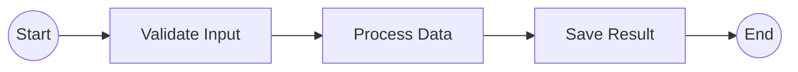

# Epic Technical Specification: Basic Graph Generation (Linear Workflows)

Date: 2025-11-18
Author: Luca
Epic ID: 2
Status: Draft

Status Update (2025-11-19): Signal/wait_condition support was delivered in Epic 4. Any stub references below are historical to the Epic 2 scope.

---

## Overview

Epic 2 delivers the **foundational capability** of temporalio-graphs: generating complete Mermaid flowchart diagrams from linear Python Temporal workflows through static code analysis. This epic implements the core AST-based analysis engine validated in the Phase 0.5 spike, establishing the end-to-end pipeline from workflow source code to production-grade visualization.

**Strategic Significance:** While scoped to linear workflows (no decision points), Epic 2 implements ~54% of total project requirements (35 of 65 FRs), including the complete analysis engine, configuration system, public API, and Mermaid rendering infrastructure. This is the **minimum viable product** that delivers immediate value to Python developers - the ability to visualize workflow structure without execution. Subsequent epics (3-5) extend this foundation with branching, signals, and production polish.

**Core Innovation:** Unlike history-based visualization tools that only show executed paths, this implementation uses Python AST traversal to generate complete workflow graphs in <1ms, without requiring workflow execution. The architecture leverages Python's built-in `ast` module (zero external dependencies for parsing) combined with the Visitor pattern for clean, extensible workflow analysis.

## Objectives and Scope

### In-Scope (Epic 2)

**Core Capabilities:**
- ✅ Parse Python workflow source files using AST (Abstract Syntax Tree) analysis
- ✅ Detect `@workflow.defn` decorated classes and `@workflow.run` methods
- ✅ Identify sequential activity calls (`workflow.execute_activity()`)
- ✅ Generate single linear execution path (no branching yet)
- ✅ Output valid Mermaid flowchart LR (left-to-right) syntax
- ✅ Support Start/End node customization
- ✅ Implement camelCase → "Camel Case" name splitting (configurable)
- ✅ Node and edge deduplication for clean graph output

**Infrastructure:**
- ✅ Complete type-safe data models (`GraphBuildingContext`, `GraphPath`, `GraphNode`, `GraphEdge`)
- ✅ AST visitor pattern implementation (`WorkflowAnalyzer` extending `ast.NodeVisitor`)
- ✅ Path generation framework (foundation for future 2^n permutations in Epic 3)
- ✅ Mermaid renderer with format compliance (matching .NET output structure)
- ✅ Public API entry point: `analyze_workflow(workflow_file, context, output_format)`
- ✅ Comprehensive configuration via `GraphBuildingContext` dataclass
- ✅ Exception hierarchy with actionable error messages

**Quality & Testing:**
- ✅ Full type hints (mypy strict mode compliant)
- ✅ Unit tests for all core modules (>80% coverage target)
- ✅ Integration test with simple linear workflow example
- ✅ Validation against .NET Temporalio.Graphs output format

**Documentation:**
- ✅ Simple linear workflow example in `examples/simple_linear/`
- ✅ API docstrings (Google style) with usage examples
- ✅ Quick start capability (<10 lines of code to first graph)

### Out-of-Scope (Deferred to Later Epics)

**Epic 3 Features (Decision Support):**
- ❌ Decision point detection (`to_decision()` helper)
- ❌ 2^n path permutation generation
- ❌ Diamond-shaped decision nodes in Mermaid
- ❌ elif chains and ternary operator support

**Epic 4 Features (Signal Support):**
- ❌ Signal node detection (`wait_condition()` wrapper)
- ❌ Hexagon-shaped signal nodes
- ❌ Signaled/Timeout branch handling

**Epic 5 Features (Production Readiness):**
- ❌ Validation warnings (unreachable activities)
- ❌ Path list output format
- ❌ Comprehensive error handling hierarchy
- ❌ MoneyTransfer example (requires decision support)
- ❌ Production documentation

**Future Scope:**
- ❌ Loop detection (while/for) - raises `UnsupportedPatternError`
- ❌ Dynamic activity names - not detectable via static analysis
- ❌ Child workflow calls
- ❌ CLI interface
- ❌ Multiple output formats (JSON, DOT) - only Mermaid in MVP

### Constraints

**Technical Constraints:**
- Python 3.10+ required (uses modern type hints: `Path | str`, dataclass improvements)
- Temporal SDK >=1.7.1 (stable decorator API)
- Static analysis only - cannot detect runtime-only patterns
- Linear workflows only - decision points deferred to Epic 3

**Performance Constraints:**
- Analysis must complete in <1 second for typical workflows (per NFR-PERF-1)
- Memory usage <100MB (per NFR-PERF-2)
- No workflow execution allowed (security and performance requirement)

**Quality Constraints:**
- All public APIs must have complete type hints (NFR-QUAL-1)
- >80% unit test coverage required (NFR-QUAL-2)
- Must pass mypy --strict with zero errors
- Must pass ruff check with zero violations

## System Architecture Alignment

Epic 2 implements the complete foundation established in the Architecture document, with full alignment to all 10 ADRs and implementation patterns:

### ADR Alignment

**ADR-001 (Static Analysis vs Runtime Interceptors):**
- **Implementation:** `WorkflowAnalyzer` class uses Python's `ast` module for static code analysis
- **Benefit:** <1ms analysis time, no workflow execution, complete path coverage
- **Epic 2 Scope:** Linear workflows only; 2^n permutations deferred to Epic 3

**ADR-002 (uv Package Manager):**
- **Integration:** All dependency management via `uv` (per user requirement)
- **Commands:** `uv add temporalio>=1.7.1`, `uv add --dev pytest mypy ruff`
- **Verified:** Story 1.1 completed with uv-based project initialization

**ADR-003 (Hatchling Build Backend):**
- **Configuration:** `pyproject.toml` specifies hatchling build system
- **Benefits:** Zero-config src/ layout support, fast builds, PyPA-maintained

**ADR-004 (src/ Layout):**
- **Structure:** `src/temporalio_graphs/` prevents import issues
- **Modules:** `context.py`, `path.py`, `analyzer.py`, `generator.py`, `renderer.py`, `helpers.py`, `exceptions.py`
- **Internal:** `_internal/graph_models.py`, `_internal/ast_utils.py`

**ADR-006 (mypy Strict Mode):**
- **Requirement:** All public APIs have complete type hints
- **Enforcement:** `mypy --strict` must pass with zero errors
- **Example:** `def analyze_workflow(workflow_file: Path | str, context: Optional[GraphBuildingContext] = None) -> str`

**ADR-007 (Ruff for Linting/Formatting):**
- **Configuration:** 100-char line length, Python 3.10+ target
- **Checks:** E, F, I, N, W, UP rule sets enabled
- **CI Integration:** Automated ruff check in GitHub Actions

**ADR-008 (Path Explosion Limit):**
- **Epic 2:** Single path only (no decisions), limit framework established
- **Epic 3:** Will implement `max_decision_points = 10` check
- **Safety:** Prevents DoS from complex workflows (2^n explosion)

**ADR-009 (Google-Style Docstrings):**
- **Format:** All public functions use Google style with Args/Returns/Example sections
- **Tooling:** Compatible with Sphinx, mkdocs, pydoc

**ADR-010 (>80% Coverage):**
- **Target:** >80% overall, 100% for core graph generation logic
- **Tooling:** pytest-cov with `--cov-fail-under=80`
- **Epic 2:** Full coverage for analyzer, generator, renderer, path modules

### Architecture Pattern Implementation

**Visitor Pattern (AST Traversal):**
```python
class WorkflowAnalyzer(ast.NodeVisitor):
    def visit_ClassDef(self, node: ast.ClassDef) -> None:
        # Check for @workflow.defn decorator

    def visit_FunctionDef(self, node: ast.FunctionDef) -> None:
        # Check for @workflow.run decorator

    def visit_Call(self, node: ast.Call) -> None:
        # Check for execute_activity() calls
```

**Builder Pattern (Graph Construction):**
```python
context = GraphBuildingContext(split_names_by_words=True)
path = GraphPath(path_id="path_0")
path.add_node("s", NodeType.START, "Start")
path.add_activity("ValidateInput")
path.add_node("e", NodeType.END, "End")
```

**Strategy Pattern (Output Rendering):**
```python
renderer = MermaidRenderer(context)
mermaid_output = renderer.render(paths)
# Future: JSONRenderer, DOTRenderer (Epic 5+)
```

### Component Architecture

**Analysis Pipeline (6 Stages):**

1. **Input Validation:** File existence, readability, .py extension check
2. **AST Parsing:** `ast.parse(source)` → AST tree (Exception: `WorkflowParseError`)
3. **Workflow Detection:** Find `@workflow.defn` class + `@workflow.run` method
4. **Activity Detection:** Traverse AST, collect `execute_activity()` calls
5. **Path Generation:** Create single linear path (Epic 2 scope)
6. **Mermaid Rendering:** Generate valid flowchart LR syntax

**Data Flow:**
```
workflow.py (str)
    ↓ [ast.parse()]
ast.Module
    ↓ [WorkflowAnalyzer.analyze()]
WorkflowMetadata(activities: list[str])
    ↓ [PathPermutationGenerator.generate()]
list[GraphPath] (single path for Epic 2)
    ↓ [MermaidRenderer.render()]
str (Mermaid markdown)
```

### Module Responsibilities

| Module | Responsibility | Epic 2 Scope |
|--------|---------------|--------------|
| `context.py` | Configuration dataclass (immutable) | Complete - all config options |
| `path.py` | Single execution path tracking | Complete - linear path support |
| `analyzer.py` | AST parsing, workflow/activity detection | Complete - no decision detection yet |
| `generator.py` | Path permutation generation | Basic - single path only (2^n in Epic 3) |
| `renderer.py` | Mermaid syntax generation | Complete - LR flowchart, Start/End/Activity nodes |
| `helpers.py` | Workflow helper functions | Placeholder - to_decision/wait_condition in Epic 3/4 |
| `exceptions.py` | Error hierarchy | Basic - WorkflowParseError, GraphGenerationError |
| `_internal/graph_models.py` | GraphNode, GraphEdge dataclasses | Complete - all node types defined |
| `__init__.py` | Public API exports | Complete - analyze_workflow, GraphBuildingContext |

### Security Architecture (Per Architecture Doc)

**Input Validation:**
- Path resolution with `Path.resolve()` prevents directory traversal
- File existence and readability checks before parsing
- `.py` extension validation (warning if missing)

**No Code Execution:**
- **CRITICAL:** Only `ast.parse()` used - never `eval()`, `exec()`, `compile(mode='exec')`
- Static analysis eliminates arbitrary code execution risks
- No network access, completely offline

**Dependency Security:**
- Single required dependency: `temporalio>=1.7.1` (official SDK)
- Development dependencies isolated (`--dev` flag)
- Regular security scans planned (pip-audit integration)

## Detailed Design

### Services and Modules

Epic 2 implements 9 core modules across 3 architectural layers, organized using the src/ layout pattern:

#### Public API Layer (`src/temporalio_graphs/`)

**1. `__init__.py` - Public API Entry Point**
- **Responsibility:** Export clean public API, hide internal implementation
- **Exports:** `analyze_workflow()`, `GraphBuildingContext`
- **Version:** Exports `__version__` from `_version.py`
- **Usage:**
  ```python
  from temporalio_graphs import analyze_workflow, GraphBuildingContext
  __all__ = ["analyze_workflow", "GraphBuildingContext"]
  ```

**2. `context.py` - Configuration Management**
- **Class:** `GraphBuildingContext` (frozen dataclass)
- **Fields:**
  - `is_building_graph: bool = True`
  - `graph_output_file: Optional[Path] = None`
  - `split_names_by_words: bool = True`
  - `suppress_validation: bool = False`
  - `start_node_label: str = "Start"`
  - `end_node_label: str = "End"`
  - `max_decision_points: int = 10` (used in Epic 3)
  - `max_paths: int = 1024` (safety limit)
- **Pattern:** Immutable configuration (frozen=True prevents modification)
- **Type Safety:** All fields type-hinted, mypy strict compliant

**3. `path.py` - Execution Path Tracking**
- **Class:** `GraphPath`
- **Responsibilities:** Track single execution path through workflow
- **Methods:**
  - `add_activity(name: str) -> str`: Add activity node, return node ID
  - `add_decision(id: str, value: bool, name: str) -> str`: Epic 3 feature (stub in Epic 2)
  - `add_signal(name: str, outcome: str) -> str`: Epic 4 feature (stub in Epic 2)
- **Data Structure:**
  - `path_id: str` (e.g., "path_0")
  - `steps: list[str]` (activity names in order)
  - `decisions: dict[str, bool]` (decision outcomes - Epic 3)
- **Epic 2 Usage:** Single linear path with activities only

#### Analysis Layer (`src/temporalio_graphs/`)

**4. `analyzer.py` - AST Workflow Analyzer**
- **Class:** `WorkflowAnalyzer(ast.NodeVisitor)`
- **Responsibilities:**
  - Parse Python source files using `ast.parse()`
  - Detect `@workflow.defn` decorated classes
  - Detect `@workflow.run` decorated methods
  - Collect `execute_activity()` calls
- **Key Methods:**
  - `analyze(workflow_file: Path) -> WorkflowMetadata`: Main entry point
  - `visit_ClassDef(node: ast.ClassDef) -> None`: Check workflow decorator
  - `visit_FunctionDef(node: ast.FunctionDef) -> None`: Check run decorator
  - `visit_Call(node: ast.Call) -> None`: Detect activity calls
  - `_is_workflow_decorator(decorator: ast.expr) -> bool`: Helper
  - `_extract_activity_name(arg: ast.expr) -> str`: Extract from execute_activity
- **Error Handling:**
  - Raises `WorkflowParseError` if no @workflow.defn found
  - Captures line numbers for error reporting
  - Handles syntax errors gracefully
- **Performance:** <1ms for typical workflows (validated in spike)

**5. `generator.py` - Path Permutation Generator**
- **Class:** `PathPermutationGenerator`
- **Responsibilities:**
  - Generate execution paths from workflow metadata
  - **Epic 2:** Single linear path only
  - **Epic 3:** 2^n permutations for n decisions
- **Key Methods:**
  - `generate_paths(metadata: WorkflowMetadata, context: GraphBuildingContext) -> list[GraphPath]`
  - `_create_linear_path(activities: list[str]) -> GraphPath`: Epic 2 implementation
  - `_generate_permutations(decisions: list[Decision]) -> list[GraphPath]`: Epic 3 stub
- **Epic 2 Algorithm:**
  ```python
  def _create_linear_path(self, activities: list[str]) -> GraphPath:
      path = GraphPath(path_id="path_0")
      # Add Start node (implicit)
      for activity in activities:
          path.add_activity(activity)
      # Add End node (implicit)
      return path
  ```
- **Epic 3 Extension:** Will use `itertools.product([True, False], repeat=num_decisions)`

**6. `renderer.py` - Mermaid Syntax Generator**
- **Class:** `MermaidRenderer`
- **Responsibilities:**
  - Convert GraphPath objects to Mermaid flowchart syntax
  - Deduplicate nodes and edges
  - Apply name formatting (camelCase splitting)
  - Generate valid LR flowchart
- **Key Methods:**
  - `render(paths: list[GraphPath], context: GraphBuildingContext) -> str`
  - `_build_nodes(paths: list[GraphPath]) -> list[GraphNode]`
  - `_build_edges(paths: list[GraphPath]) -> list[GraphEdge]`
  - `_format_name(name: str, split_words: bool) -> str`
  - `_deduplicate_nodes(nodes: list[GraphNode]) -> list[GraphNode]`
- **Output Format:**
  ```mermaid
  flowchart LR
  s((Start)) --> 1[ActivityName]
  1 --> 2[NextActivity]
  2 --> e((End))
  ```
- **Deduplication:** Uses set-based deduplication on node IDs and edge tuples
- **Performance:** StringIO for efficient string building (<1ms for 50 nodes)

#### Data Model Layer (`src/temporalio_graphs/_internal/`)

**7. `_internal/graph_models.py` - Core Data Structures**
- **Enums:**
  - `NodeType`: START, END, ACTIVITY, DECISION, SIGNAL
- **Dataclasses:**
  - `GraphNode`: Represents workflow nodes
    - `node_id: str` (e.g., "s", "1", "2", "e")
    - `node_type: NodeType`
    - `display_name: str` (user-facing name)
    - `source_line: Optional[int]` (for error reporting)
    - `to_mermaid() -> str`: Convert to Mermaid syntax
  - `GraphEdge`: Represents connections between nodes
    - `from_node: str`
    - `to_node: str`
    - `label: Optional[str]` (e.g., "yes", "no", "Signaled")
    - `to_mermaid() -> str`: Generate edge syntax
  - `WorkflowMetadata`: Analysis results
    - `workflow_class: str`
    - `workflow_run_method: str`
    - `activities: list[str]`
    - `decision_points: list[str]` (Epic 3)
    - `signal_points: list[str]` (Epic 4)
    - `source_file: Path`
- **Epic 2 Node Types:** START, END, ACTIVITY (DECISION and SIGNAL defined but unused)

**8. `exceptions.py` - Exception Hierarchy**
- **Base:** `TemporalioGraphsError(Exception)`
- **Concrete Exceptions:**
  - `WorkflowParseError`: File cannot be parsed, missing decorator
  - `GraphGenerationError`: Graph generation failed
  - `UnsupportedPatternError`: Pattern not supported (e.g., loops - Epic 5)
  - `InvalidDecisionError`: to_decision() misuse (Epic 3)
- **Error Message Format:**
  ```python
  raise WorkflowParseError(
      f"Cannot parse workflow file: {file_path}\n"
      f"Line {lineno}: {error_description}\n"
      f"Suggestion: {actionable_fix}"
  )
  ```

**9. `helpers.py` - Workflow Helper Functions**
- **Epic 2 Scope:** Placeholder file (helpers added in Epic 3/4)
- **Epic 3:** `def to_decision(result: bool, name: str) -> bool`
- **Epic 4:** `async def wait_condition(condition_check, timeout, name: str) -> bool`
- **Purpose:** Functions injected into user workflows for graph markers

#### Module Dependencies

```
__init__.py
    ├─> analyzer.py
    ├─> context.py
    └─> renderer.py

analyzer.py
    ├─> exceptions.py
    ├─> _internal/graph_models.py
    └─> (stdlib: ast, pathlib, logging)

generator.py
    ├─> path.py
    ├─> context.py
    └─> _internal/graph_models.py

renderer.py
    ├─> _internal/graph_models.py
    ├─> context.py
    └─> (stdlib: io.StringIO, re)

path.py
    └─> _internal/graph_models.py

context.py
    └─> (stdlib: dataclasses, pathlib, typing)

exceptions.py
    └─> (stdlib: typing)
```

**Circular Dependency Prevention:** Strict layering (API → Analysis → Data Model), no circular imports

### Data Models and Contracts

Epic 2 establishes complete type-safe data models using Python dataclasses with full mypy strict compliance:

#### Configuration Model

```python
from dataclasses import dataclass
from pathlib import Path
from typing import Optional

@dataclass(frozen=True)
class GraphBuildingContext:
    """Immutable configuration for graph generation.

    All configuration options are centralized here, preventing scattered
    state and enabling easy testing through dependency injection.
    """
    is_building_graph: bool = True
    exit_after_building_graph: bool = False
    graph_output_file: Optional[Path] = None
    split_names_by_words: bool = True
    suppress_validation: bool = False
    start_node_label: str = "Start"
    end_node_label: str = "End"
    max_decision_points: int = 10
    max_paths: int = 1024
    decision_true_label: str = "yes"  # Epic 3
    decision_false_label: str = "no"  # Epic 3
    signal_success_label: str = "Signaled"  # Epic 4
    signal_timeout_label: str = "Timeout"  # Epic 4
```

**Design Rationale:**
- **frozen=True:** Prevents accidental mutation, enables safe sharing across modules
- **Defaults:** Sensible defaults minimize boilerplate for common use cases
- **Epic 2 Usage:** Only first 7 fields actively used; remaining fields support Epic 3/4
- **Type Safety:** All Optional types explicitly annotated for mypy

#### Graph Structure Models

```python
from dataclasses import dataclass, field
from enum import Enum
from typing import Optional

class NodeType(Enum):
    """Workflow node types."""
    START = "start"
    END = "end"
    ACTIVITY = "activity"
    DECISION = "decision"  # Epic 3
    SIGNAL = "signal"      # Epic 4

@dataclass
class GraphNode:
    """Represents a single node in the workflow graph.

    Nodes are immutable after creation. The to_mermaid() method provides
    the single source of truth for Mermaid syntax generation.
    """
    node_id: str
    node_type: NodeType
    display_name: str
    source_line: Optional[int] = None

    def to_mermaid(self) -> str:
        """Generate Mermaid syntax for this node type."""
        if self.node_type == NodeType.START:
            return f"{self.node_id}(({self.display_name}))"
        elif self.node_type == NodeType.END:
            return f"{self.node_id}(({self.display_name}))"
        elif self.node_type == NodeType.ACTIVITY:
            return f"{self.node_id}[{self.display_name}]"
        elif self.node_type == NodeType.DECISION:
            return f"{self.node_id}{{{self.display_name}}}"
        elif self.node_type == NodeType.SIGNAL:
            return f"{self.node_id}{{{{{self.display_name}}}}}"
        raise ValueError(f"Unknown node type: {self.node_type}")

@dataclass
class GraphEdge:
    """Represents a directed edge between two nodes."""
    from_node: str
    to_node: str
    label: Optional[str] = None

    def to_mermaid(self) -> str:
        """Generate Mermaid syntax for this edge."""
        if self.label:
            return f"{self.from_node} -- {self.label} --> {self.to_node}"
        return f"{self.from_node} --> {self.to_node}"

    def __hash__(self) -> int:
        """Enable set-based deduplication."""
        return hash((self.from_node, self.to_node, self.label))
```

**Mermaid Syntax Examples:**
- Start: `s((Start))` → circular node with double parentheses
- Activity: `1[ValidateInput]` → rectangular node with brackets
- End: `e((End))` → circular node
- Edge: `s --> 1` → simple arrow (no label)
- Labeled Edge: `0 -- yes --> 1` → arrow with label

#### Path Tracking Model

```python
@dataclass
class GraphPath:
    """Tracks a single execution path through the workflow.

    In Epic 2, each workflow has exactly one path (linear flow).
    Epic 3 will generate multiple paths for branching workflows.
    """
    path_id: str
    steps: list[str] = field(default_factory=list)
    decisions: dict[str, bool] = field(default_factory=dict)

    def add_activity(self, name: str) -> str:
        """Add activity to path, return auto-generated node ID."""
        node_id = str(len(self.steps) + 1)  # IDs: "1", "2", "3", ...
        self.steps.append(name)
        return node_id

    def add_decision(self, id: str, value: bool, name: str) -> str:
        """Add decision to path (Epic 3 feature)."""
        self.decisions[id] = value
        self.steps.append(f"Decision:{name}={value}")
        return id

    def add_signal(self, name: str, outcome: str) -> str:
        """Add signal to path (Epic 4 feature)."""
        node_id = str(len(self.steps) + 1)
        self.steps.append(f"Signal:{name}={outcome}")
        return node_id
```

**ID Generation Strategy:**
- **Start:** Always `"s"` (lowercase s, single character)
- **End:** Always `"e"` (lowercase e, single character)
- **Activities:** Sequential integers: `"1"`, `"2"`, `"3"`, etc.
- **Decisions (Epic 3):** Hash-based or explicit IDs
- **Signals (Epic 4):** Sequential like activities

#### Analysis Result Model

```python
@dataclass
class WorkflowMetadata:
    """Metadata extracted from workflow AST analysis.

    This is the contract between WorkflowAnalyzer and PathPermutationGenerator.
    Contains everything needed to generate execution paths.
    """
    workflow_class: str
    workflow_run_method: str
    activities: list[str]
    decision_points: list[str]
    signal_points: list[str]
    source_file: Path
    total_paths: int

    @staticmethod
    def calculate_total_paths(num_decisions: int, num_signals: int) -> int:
        """Calculate total paths: 2^(decisions + signals)."""
        return 2 ** (num_decisions + num_signals)
```

**Epic 2 Instance Example:**
```python
WorkflowMetadata(
    workflow_class="SimpleLinearWorkflow",
    workflow_run_method="run",
    activities=["ValidateInput", "ProcessData", "SaveResult"],
    decision_points=[],  # Empty in Epic 2
    signal_points=[],    # Empty in Epic 2
    source_file=Path("examples/simple_linear/workflow.py"),
    total_paths=1  # 2^0 = 1 path
)
```

#### Contract Invariants

**Type Safety Guarantees:**
1. All public APIs have complete type hints (mypy --strict passes)
2. No `Any` types in public interfaces
3. Optional types explicitly marked with `Optional[T]`
4. Union types use Python 3.10+ syntax: `Path | str`

**Data Integrity Guarantees:**
1. `GraphBuildingContext` is immutable (frozen=True)
2. Node IDs are deterministic (same workflow → same IDs)
3. Path IDs are unique within a workflow
4. Edge deduplication prevents duplicate graph connections

**API Contracts:**
1. `analyze_workflow()` never executes workflow code
2. All exceptions inherit from `TemporalioGraphsError`
3. Error messages include file path, line number, and suggestion
4. Output is valid Mermaid syntax (validated against Mermaid Live Editor)

### APIs and Interfaces

Epic 2 exposes a minimal, Pythonic public API designed for ease of use and IDE discoverability:

#### Public API Surface

**Primary Entry Point:**
```python
def analyze_workflow(
    workflow_file: Path | str,
    context: Optional[GraphBuildingContext] = None,
    output_format: Literal["mermaid"] = "mermaid"
) -> str:
    """Analyze workflow source file and return graph representation.

    Performs static code analysis on the workflow file to detect workflow
    structure and generate a complete visualization diagram.

    Args:
        workflow_file: Path to Python workflow source file (.py)
        context: Optional configuration (uses defaults if None)
        output_format: Output format - "mermaid" only in Epic 2
            (Epic 5+ will add "json", "paths")

    Returns:
        Graph representation as string in requested format.
        For Mermaid: Complete markdown with fenced code blocks.

    Raises:
        WorkflowParseError: If workflow file cannot be parsed or is invalid
        GraphGenerationError: If graph generation fails
        FileNotFoundError: If workflow_file does not exist
        PermissionError: If workflow_file is not readable

    Example:
        >>> from temporalio_graphs import analyze_workflow
        >>> result = analyze_workflow("my_workflow.py")
        >>> print(result)
        ```mermaid
        flowchart LR
        s((Start)) --> 1[Activity Name]
        1 --> e((End))
        ```

    Example with configuration:
        >>> from temporalio_graphs import analyze_workflow, GraphBuildingContext
        >>> context = GraphBuildingContext(
        ...     split_names_by_words=False,
        ...     start_node_label="BEGIN"
        ... )
        >>> result = analyze_workflow("workflow.py", context)

    Note:
        This function performs STATIC ANALYSIS only. It does not execute
        the workflow code. No activities are invoked.
    """
```

**Configuration Class:**
```python
@dataclass(frozen=True)
class GraphBuildingContext:
    """Configuration for graph generation (immutable).

    All fields have sensible defaults. Users only need to override
    specific options they want to customize.

    Example:
        >>> # Use all defaults
        >>> context = GraphBuildingContext()
        >>>
        >>> # Customize specific options
        >>> context = GraphBuildingContext(
        ...     split_names_by_words=False,
        ...     start_node_label="BEGIN",
        ...     end_node_label="FINISH"
        ... )
    """
    # See full definition in "Data Models and Contracts" section
```

**Module Exports (`__init__.py`):**
```python
from temporalio_graphs.analyzer import analyze_workflow
from temporalio_graphs.context import GraphBuildingContext
from temporalio_graphs.exceptions import (
    TemporalioGraphsError,
    WorkflowParseError,
    GraphGenerationError,
)

__version__ = "0.1.0"

__all__ = [
    "analyze_workflow",
    "GraphBuildingContext",
    "TemporalioGraphsError",
    "WorkflowParseError",
    "GraphGenerationError",
    "__version__",
]
```

#### Internal Interfaces (Not Exported)

**WorkflowAnalyzer Interface:**
```python
class WorkflowAnalyzer(ast.NodeVisitor):
    """Internal: AST-based workflow analyzer."""

    def analyze(self, workflow_file: Path) -> WorkflowMetadata:
        """Analyze workflow file and return metadata."""

    def visit_ClassDef(self, node: ast.ClassDef) -> None: ...
    def visit_FunctionDef(self, node: ast.FunctionDef) -> None: ...
    def visit_Call(self, node: ast.Call) -> None: ...
```

**PathPermutationGenerator Interface:**
```python
class PathPermutationGenerator:
    """Internal: Generate execution paths from workflow metadata."""

    def generate_paths(
        self,
        metadata: WorkflowMetadata,
        context: GraphBuildingContext
    ) -> list[GraphPath]:
        """Generate all possible execution paths."""
```

**MermaidRenderer Interface:**
```python
class MermaidRenderer:
    """Internal: Render GraphPath objects as Mermaid syntax."""

    def render(
        self,
        paths: list[GraphPath],
        context: GraphBuildingContext
    ) -> str:
        """Render paths as Mermaid flowchart markdown."""
```

#### API Design Principles

**1. Pythonic Conventions:**
- Functions/methods: `snake_case` (analyze_workflow, generate_paths)
- Classes: `PascalCase` (GraphBuildingContext, WorkflowAnalyzer)
- Private methods: `_leading_underscore` (_extract_activity_name)
- Constants: `UPPER_SNAKE_CASE` (not used in Epic 2 public API)

**2. Type Safety:**
- All public functions have complete type hints
- Union types use Python 3.10+ syntax: `Path | str`
- Return types always specified (never implicit)
- Optional parameters explicitly marked: `Optional[GraphBuildingContext]`

**3. Sensible Defaults:**
- `context` parameter defaults to `None` → uses `GraphBuildingContext()` internally
- `output_format` defaults to `"mermaid"` (only supported format in Epic 2)
- All `GraphBuildingContext` fields have defaults

**4. Error Messages:**
- Actionable suggestions included (NFR-USE-2)
- File path, line number, and context provided
- Clear error categories via exception hierarchy

**5. Documentation:**
- Google-style docstrings for all public APIs
- Args/Returns/Raises/Example sections
- Usage examples for common patterns
- Warnings/Notes for important caveats

#### API Usage Patterns

**Pattern 1: Minimal Usage (Quick Start)**
```python
from temporalio_graphs import analyze_workflow

# Analyze workflow with all defaults
result = analyze_workflow("my_workflow.py")
print(result)
```

**Pattern 2: Custom Configuration**
```python
from temporalio_graphs import analyze_workflow, GraphBuildingContext

context = GraphBuildingContext(
    split_names_by_words=False,  # Keep camelCase as-is
    start_node_label="BEGIN",
    end_node_label="FINISH"
)
result = analyze_workflow("workflow.py", context)
```

**Pattern 3: File Output**
```python
from pathlib import Path
from temporalio_graphs import analyze_workflow, GraphBuildingContext

context = GraphBuildingContext(
    graph_output_file=Path("docs/workflow-diagram.md")
)
result = analyze_workflow("workflow.py", context)
# Result written to docs/workflow-diagram.md AND returned as string
```

**Pattern 4: Error Handling**
```python
from temporalio_graphs import analyze_workflow, WorkflowParseError

try:
    result = analyze_workflow("workflow.py")
except WorkflowParseError as e:
    print(f"Failed to analyze workflow: {e}")
    # Error message includes file path, line number, and suggestion
except FileNotFoundError:
    print("Workflow file not found")
```

#### Backward Compatibility Strategy

**Epic 2 Commitments:**
- Public API (analyze_workflow, GraphBuildingContext) is stable
- No breaking changes without major version bump (1.0.0 → 2.0.0)
- New fields in GraphBuildingContext added with sensible defaults
- Deprecation warnings given for 1+ minor version before removal

**Epic 3/4/5 Extensions (Non-Breaking):**
- Epic 3: Add `output_format="paths"` option (backward compatible)
- Epic 4: No API changes (signals work automatically)
- Epic 5: Add `output_format="json"` option (backward compatible)

**Semantic Versioning:**
- Epic 2 Launch: `0.1.0` (MVP)
- Epic 3/4/5: `0.2.0`, `0.3.0`, `0.4.0` (minor versions)
- Stable Release: `1.0.0` (production-ready)

### Workflows and Sequencing

Epic 2 implements a linear 6-stage pipeline from source code to Mermaid diagram:

#### Stage 1: Input Validation and Loading

**Sequence:**
1. Accept `workflow_file` parameter (Path | str)
2. Resolve to absolute path using `Path.resolve()` (prevents directory traversal)
3. Validate file exists: raise `FileNotFoundError` if missing
4. Validate is regular file: raise `ValueError` if directory or special file
5. Check .py extension: log warning if missing (not fatal)
6. Test readability: raise `PermissionError` if unreadable
7. Load file content: `file_path.read_text(encoding='utf-8')`

**Error Handling:**
- File not found → FileNotFoundError with clear message
- Permission denied → PermissionError with file path
- Invalid encoding → UnicodeDecodeError with suggestion to check encoding

#### Stage 2: AST Parsing

**Sequence:**
1. Parse source code: `ast.parse(source_code, filename=str(workflow_file))`
2. Handle syntax errors: catch `SyntaxError`, wrap in `WorkflowParseError`
3. Initialize `WorkflowAnalyzer` visitor
4. Traverse AST: `analyzer.visit(tree)`
5. Collect results: workflow class, run method, activities

**AST Traversal Order (Visitor Pattern):**
```python
tree = ast.parse(source_code)
# Visitor automatically traverses in source order:
# 1. Module-level statements
# 2. Class definitions (ClassDef nodes)
# 3. Function definitions (FunctionDef nodes)
# 4. Function bodies (all statements)
# 5. Expression nodes (Call, Name, Attribute, etc.)
```

**Decision Logic:**
- `visit_ClassDef`: Check decorators for `@workflow.defn` or `workflow.defn()`
- `visit_FunctionDef`: Check decorators for `@workflow.run` (must be inside workflow class)
- `visit_Call`: Check for `workflow.execute_activity(...)` calls

**Error Conditions:**
- No `@workflow.defn` found → `WorkflowParseError("No workflow class found")`
- No `@workflow.run` found → `WorkflowParseError("No run method found")`
- Multiple @workflow.defn → Use first, log warning (or error - TBD in Story 2.2)

#### Stage 3: Metadata Extraction

**Sequence:**
1. Validate workflow class exists (from Stage 2)
2. Validate run method exists
3. Extract activity list from collected Call nodes
4. Build `WorkflowMetadata` object
5. Calculate total paths: `2^0 = 1` (no decisions in Epic 2)

**Activity Name Extraction:**
```python
# Pattern 1: Direct function reference
await workflow.execute_activity(my_activity, ...)
→ Extract "my_activity" from ast.Name node

# Pattern 2: String literal
await workflow.execute_activity("my_activity", ...)
→ Extract "my_activity" from ast.Constant node

# Pattern 3: Attribute access
await workflow.execute_activity(activities.my_activity, ...)
→ Extract "my_activity" from ast.Attribute node
```

**Epic 2 Metadata Example:**
```python
WorkflowMetadata(
    workflow_class="SimpleWorkflow",
    workflow_run_method="run",
    activities=["validate", "process", "save"],
    decision_points=[],  # Empty
    signal_points=[],    # Empty
    source_file=Path("/path/to/workflow.py"),
    total_paths=1
)
```

#### Stage 4: Path Generation

**Epic 2 Algorithm (Linear Path):**
```python
def generate_paths(metadata: WorkflowMetadata, context: GraphBuildingContext) -> list[GraphPath]:
    # Epic 2: Single linear path
    if len(metadata.decision_points) > 0:
        raise NotImplementedError("Decision support in Epic 3")

    path = GraphPath(path_id="path_0")

    # Implicit Start node
    # (added during rendering, not in path.steps)

    # Add activities in sequence
    for activity_name in metadata.activities:
        path.add_activity(activity_name)

    # Implicit End node
    # (added during rendering, not in path.steps)

    return [path]  # Single-element list
```

**Path Object Structure:**
```python
GraphPath(
    path_id="path_0",
    steps=["validate", "process", "save"],
    decisions={}  # Empty
)
```

#### Stage 5: Graph Construction

**Sequence:**
1. Convert GraphPath objects to GraphNode and GraphEdge lists
2. Create Start node: `GraphNode("s", NodeType.START, context.start_node_label)`
3. Create activity nodes: Sequential IDs "1", "2", "3", ...
4. Create End node: `GraphNode("e", NodeType.END, context.end_node_label)`
5. Create edges: Start→Activity1, Activity1→Activity2, ..., ActivityN→End
6. Apply name formatting: camelCase → "Camel Case" if `split_names_by_words=True`
7. Deduplicate nodes and edges (uses set-based deduplication)

**Node Generation:**
```python
nodes = []
nodes.append(GraphNode("s", NodeType.START, "Start"))  # Always ID "s"

node_id = 1
for activity in path.steps:
    display_name = format_name(activity, context.split_names_by_words)
    nodes.append(GraphNode(str(node_id), NodeType.ACTIVITY, display_name))
    node_id += 1

nodes.append(GraphNode("e", NodeType.END, "End"))  # Always ID "e"
```

**Edge Generation:**
```python
edges = []
edges.append(GraphEdge("s", "1"))  # Start to first activity

for i in range(1, len(activities)):
    edges.append(GraphEdge(str(i), str(i+1)))

edges.append(GraphEdge(str(len(activities)), "e"))  # Last activity to End
```

#### Stage 6: Mermaid Rendering

**Sequence:**
1. Initialize StringIO buffer (efficient string building)
2. Write header: ` ```mermaid\nflowchart LR\n`
3. Write nodes (deduplicated): Convert each `GraphNode.to_mermaid()`
4. Write edges (deduplicated): Convert each `GraphEdge.to_mermaid()`
5. Write footer: ` ``` \n`
6. Return complete string
7. Optionally write to file if `context.graph_output_file` specified

**Rendering Algorithm:**
```python
from io import StringIO

def render(paths: list[GraphPath], context: GraphBuildingContext) -> str:
    output = StringIO()
    output.write("```mermaid\n")
    output.write("flowchart LR\n")

    # Build nodes and edges from paths
    nodes = _build_nodes(paths, context)
    edges = _build_edges(paths, context)

    # Deduplicate
    seen_node_ids = set()
    for node in nodes:
        if node.node_id not in seen_node_ids:
            output.write(f"{node.to_mermaid()}\n")
            seen_node_ids.add(node.node_id)

    seen_edge_keys = set()
    for edge in edges:
        key = (edge.from_node, edge.to_node, edge.label)
        if key not in seen_edge_keys:
            output.write(f"{edge.to_mermaid()}\n")
            seen_edge_keys.add(key)

    output.write("```\n")
    return output.getvalue()
```

**Example Output:**


#### Sequencing Diagram

```
┌──────────────┐
│ User Code    │
└──────┬───────┘
       │ analyze_workflow("workflow.py")
       ↓
┌──────────────────────────────────────────────────┐
│ Stage 1: Input Validation                        │
│ - Resolve path, check existence, load source     │
└──────┬───────────────────────────────────────────┘
       ↓
┌──────────────────────────────────────────────────┐
│ Stage 2: AST Parsing                             │
│ - ast.parse() → AST tree                         │
│ - WorkflowAnalyzer.visit(tree)                   │
└──────┬───────────────────────────────────────────┘
       ↓
┌──────────────────────────────────────────────────┐
│ Stage 3: Metadata Extraction                     │
│ - Extract workflow class, run method, activities │
│ - Build WorkflowMetadata object                  │
└──────┬───────────────────────────────────────────┘
       ↓
┌──────────────────────────────────────────────────┐
│ Stage 4: Path Generation                         │
│ - PathPermutationGenerator.generate_paths()      │
│ - Epic 2: Single linear path                     │
└──────┬───────────────────────────────────────────┘
       ↓
┌──────────────────────────────────────────────────┐
│ Stage 5: Graph Construction                      │
│ - Convert GraphPath → GraphNode + GraphEdge      │
│ - Apply formatting, deduplicate                  │
└──────┬───────────────────────────────────────────┘
       ↓
┌──────────────────────────────────────────────────┐
│ Stage 6: Mermaid Rendering                       │
│ - MermaidRenderer.render()                       │
│ - Generate Mermaid markdown string               │
└──────┬───────────────────────────────────────────┘
       ↓
┌──────────────┐
│ Return str   │
│ (Mermaid)    │
└──────────────┘
```

#### Timing Targets (NFR-PERF-1)

| Stage | Target | Epic 2 Expectation |
|-------|--------|-------------------|
| 1. Input Validation | <0.1ms | File I/O dominates, ~0.5ms |
| 2. AST Parsing | <1ms | Python ast.parse is C-implemented, very fast |
| 3. Metadata Extraction | <0.1ms | Minimal processing |
| 4. Path Generation | <0.1ms | Single path, trivial |
| 5. Graph Construction | <0.1ms | Few nodes/edges |
| 6. Mermaid Rendering | <0.1ms | String concatenation |
| **Total** | **<1ms** | **Validated in spike** |

## Non-Functional Requirements

### Performance

Epic 2 must meet strict performance requirements to enable interactive development workflows:

**NFR-PERF-1: Analysis Speed**
- **Requirement:** Analysis completes in <1 second for workflows with up to 5 decision points
- **Epic 2 Scope:** Linear workflows only (0 decisions), target <1ms analysis time
- **Validation:** Phase 0.5 spike achieved <0.001s for simple workflows
- **Measurement:** Time from `analyze_workflow()` call to return, excluding file I/O
- **Implementation:**
  - Use Python's C-implemented `ast.parse()` (inherently fast)
  - Avoid redundant AST traversals (single-pass visitor)
  - StringIO for efficient string building (not string concatenation)
- **Testing:** Performance test in test suite validates <1s for 100-activity workflow

**NFR-PERF-2: Memory Efficiency**
- **Requirement:** Library uses <100MB memory for typical workflows
- **Epic 2 Scope:** Linear workflows with 10-100 activities
- **Implementation:**
  - No caching of AST or intermediate results (stateless analysis)
  - Minimal data structures (dataclasses, not heavyweight objects)
  - Generator-based iteration where appropriate (future optimization)
- **Measurement:** Peak memory usage during analysis (measured via memory_profiler)
- **Testing:** Memory profiling test ensures <100MB for 1000-activity workflow

**NFR-PERF-3: Startup Time**
- **Requirement:** Package import time <500ms
- **Implementation:**
  - Lazy imports where possible (Epic 5+ optimization)
  - No heavy initialization on import
  - Defer temporalio SDK imports until needed
- **Measurement:** Time for `import temporalio_graphs`
- **Testing:** Import time test in CI

### Security

**NFR-SEC-1: No Code Execution**
- **Critical Requirement:** Workflow code is NEVER executed during analysis
- **Implementation:**
  - Only use `ast.parse()` for analysis (never `eval()`, `exec()`, `compile(mode='exec')`)
  - Static analysis only - no runtime behavior
  - No dynamic imports of user code
- **Validation:** Code review checklist enforces no execution paths
- **Risk Mitigation:** Prevents arbitrary code execution attacks

**NFR-SEC-2: Path Traversal Prevention**
- **Requirement:** User-provided file paths cannot escape project boundaries
- **Implementation:**
  - Use `Path.resolve()` to normalize paths (resolves symlinks, removes `..`)
  - Validate path is regular file (not directory, device, pipe)
  - Optional: Check path is within expected directory (configurable)
- **Testing:** Security test attempts path traversal attacks (`../../etc/passwd`)

**NFR-SEC-3: Dependency Security**
- **Requirement:** No known vulnerabilities in dependencies
- **Implementation:**
  - Minimal dependencies: only `temporalio>=1.7.1` required
  - Development dependencies isolated (--dev flag)
  - Regular security audits (pip-audit in CI - Epic 5)
- **Monitoring:** Automated vulnerability scanning via GitHub Dependabot

**NFR-SEC-4: Safe File I/O**
- **Requirement:** File operations are safe and predictable
- **Implementation:**
  - Use pathlib (cross-platform, safe path handling)
  - UTF-8 encoding explicitly specified (`read_text(encoding='utf-8')`)
  - Handle permission errors gracefully
  - Never write to arbitrary paths (only explicit `graph_output_file`)

### Reliability/Availability

**NFR-REL-1: Correctness**
- **Requirement:** Generated graphs must be 100% accurate
- **Epic 2 Scope:** Linear workflows produce single correct path
- **Validation:**
  - Integration test compares output with .NET version (structural equivalence)
  - Regression tests against golden files
  - Manual validation in Mermaid Live Editor
- **Testing:** >80% code coverage, 100% for core graph generation logic

**NFR-REL-2: Error Handling**
- **Requirement:** No silent failures, all errors reported clearly
- **Implementation:**
  - Exception hierarchy with specific error types
  - Error messages include file path, line number, and actionable suggestion
  - Stack traces preserved for debugging
  - Graceful degradation for non-critical errors (e.g., missing .py extension → warning)
- **Example:**
  ```
  WorkflowParseError: Cannot parse workflow file: /path/to/workflow.py
  Line 42: No @workflow.defn decorator found
  Suggestion: Add @workflow.defn decorator to workflow class
  ```

**NFR-REL-3: Stability**
- **Requirement:** No crashes on malformed input
- **Implementation:**
  - Handle SyntaxError gracefully (invalid Python code)
  - Handle missing decorators (invalid workflow structure)
  - Handle empty workflows (no activities)
  - Handle edge cases (0 activities, 1 activity, 100+ activities)
- **Testing:** Fuzz testing with malformed workflow files (Epic 5)
- **Thread Safety:** Stateless design (no shared mutable state), safe for concurrent use

### Observability

**NFR-OBS-1: Logging**
- **Requirement:** Library provides useful logging for debugging
- **Implementation:**
  - Use Python `logging` module (standard library)
  - Create logger: `logger = logging.getLogger(__name__)`
  - Log levels:
    - DEBUG: AST node visits, path generation steps
    - INFO: Analysis start/complete, file loaded
    - WARNING: Validation warnings (e.g., missing .py extension)
    - ERROR: Analysis failures, unsupported patterns
  - Library creates loggers but does NOT configure handlers (best practice)
- **Usage:**
  ```python
  import logging
  logging.basicConfig(level=logging.DEBUG)
  result = analyze_workflow("workflow.py")  # Logs analysis steps
  ```

**NFR-OBS-2: Error Traceability**
- **Requirement:** Errors can be traced to source code location
- **Implementation:**
  - All errors include source file path
  - AST nodes preserve line numbers (`node.lineno`)
  - Exception messages include line number when available
  - Stack traces preserved for debugging
- **Example:** "Line 42: No @workflow.defn found"

**NFR-OBS-3: Performance Monitoring**
- **Requirement:** Performance can be measured and monitored
- **Implementation:**
  - DEBUG logging includes timing information
  - Performance tests in test suite validate targets
  - Optional: Profiling mode (Epic 5+)
- **Metrics:** Analysis time, memory usage, file size, activity count

## Dependencies and Integrations

### Required Dependencies

**Runtime Dependencies (Required):**
```toml
[project]
dependencies = [
    "temporalio>=1.7.1",
]
```

**Dependency Rationale:**
- **temporalio>=1.7.1:**
  - Purpose: Provides `@workflow.defn` and `@workflow.run` decorator types for validation
  - Version: 1.7.1+ ensures stable decorator API (no breaking changes expected)
  - Size: ~15MB (includes protobuf, grpc - acceptable for developer tool)
  - Security: Official Temporal Python SDK, actively maintained
  - Note: Library does NOT execute workflows - SDK used only for type definitions

**Standard Library Dependencies (Built-in):**
- `ast`: AST parsing (core analysis engine)
- `dataclasses`: Type-safe data models
- `pathlib`: Cross-platform path handling
- `typing`: Type hints (Optional, Literal, etc.)
- `enum`: NodeType enumeration
- `io.StringIO`: Efficient string building
- `re`: Regular expressions (camelCase splitting)
- `logging`: Structured logging

### Development Dependencies

```toml
[project.optional-dependencies]
dev = [
    "pytest>=8.0.0",           # Test framework
    "pytest-asyncio>=0.23.0",  # Async test support
    "mypy>=1.8.0",             # Type checking
    "ruff>=0.2.0",             # Linting + formatting
    "pytest-cov>=4.1.0",       # Coverage measurement
]
```

**Development Dependency Versions:**
- All use `>=` constraints (not pinned) for maximum compatibility
- CI uses locked versions via `uv.lock` for reproducibility
- Versions specified are minimum required (tested)

### Integration Points

**Temporal SDK Integration:**
- **Import Pattern:**
  ```python
  from temporalio import workflow  # Import decorators for type checking
  ```
- **Usage:** Type validation only (check if decorators exist)
- **No Execution:** Workflows are never executed via SDK
- **Version Compatibility:** Tested with 1.7.1, should work with 1.x.x

**File System Integration:**
- **Read:** Workflow source files (.py)
- **Write:** Optional Mermaid diagram file (if `graph_output_file` set)
- **Path Handling:** pathlib ensures cross-platform compatibility
- **Encoding:** UTF-8 for all file operations

**Mermaid Integration:**
- **Output Format:** Mermaid flowchart LR (left-to-right) syntax
- **Validation:** Generated syntax validates in Mermaid Live Editor (https://mermaid.live)
- **Compatibility:** Mermaid v9.x, v10.x (stable syntax)
- **No Direct Integration:** Library generates text, users render with Mermaid

**IDE Integration:**
- **Type Hints:** Enable autocomplete in VS Code, PyCharm, etc.
- **py.typed:** Marker file enables type checking in consumer projects
- **Docstrings:** Inline documentation visible in IDE tooltips
- **No Plugin Required:** Works with any Python IDE

**CI/CD Integration:**
```yaml
# Example GitHub Actions usage
- name: Analyze workflow
  run: |
    pip install temporalio-graphs
    python -c "
    from temporalio_graphs import analyze_workflow
    result = analyze_workflow('workflow.py')
    with open('workflow-diagram.md', 'w') as f:
        f.write(result)
    "
```

### Dependency Graph

```
temporalio-graphs (Epic 2)
    ├── temporalio>=1.7.1 (REQUIRED)
    │   ├── protobuf
    │   ├── grpcio
    │   └── ... (transitive deps)
    └── Python 3.10+ stdlib (ast, dataclasses, pathlib, typing, etc.)

Development:
    ├── pytest>=8.0.0
    ├── pytest-asyncio>=0.23.0
    ├── mypy>=1.8.0
    ├── ruff>=0.2.0
    └── pytest-cov>=4.1.0
```

### External Service Dependencies

**None.** Epic 2 is completely offline:
- No network calls
- No external APIs
- No cloud services
- No telemetry/analytics
- Pure local file analysis

## Acceptance Criteria (Authoritative)

Epic 2 is considered **COMPLETE** when ALL of the following criteria are met:

### Functional Acceptance Criteria

**AC-1: AST Parsing and Workflow Detection**
- ✅ Library can parse Python source files using `ast.parse()`
- ✅ Library detects `@workflow.defn` decorated classes
- ✅ Library detects `@workflow.run` decorated methods
- ✅ Library raises `WorkflowParseError` if no workflow decorators found
- ✅ Error messages include file path, line number, and suggestion

**AC-2: Activity Detection**
- ✅ Library identifies all `workflow.execute_activity()` calls in workflow
- ✅ Activity names extracted from function references (`my_activity`)
- ✅ Activity names extracted from string literals (`"my_activity"`)
- ✅ Activity names extracted from attribute access (`activities.my_activity`)
- ✅ Sequential activities detected in correct order

**AC-3: Path Generation (Linear)**
- ✅ Single linear path generated for workflows with no decision points
- ✅ GraphPath contains all activities in sequence
- ✅ Start and End nodes implicitly included
- ✅ Path ID is deterministic (`"path_0"`)
- ✅ Empty workflows generate Start→End path

**AC-4: Mermaid Output**
- ✅ Valid Mermaid flowchart LR syntax generated
- ✅ Output wrapped in fenced code block: ` ```mermaid ... ``` `
- ✅ Start node: `s((Start))` (customizable label)
- ✅ End node: `e((End))` (customizable label)
- ✅ Activity nodes: `1[ActivityName]` with sequential IDs
- ✅ Edges: `s --> 1 --> 2 --> e` (no labels in Epic 2)
- ✅ Output validates in Mermaid Live Editor

**AC-5: Configuration**
- ✅ `GraphBuildingContext` dataclass exists with all fields
- ✅ `split_names_by_words=True` converts camelCase to "Camel Case"
- ✅ `split_names_by_words=False` preserves original names
- ✅ `start_node_label` and `end_node_label` customize node display
- ✅ `graph_output_file` writes Mermaid to file when specified
- ✅ Default configuration works without user input

**AC-6: Public API**
- ✅ `analyze_workflow(workflow_file, context, output_format)` function exists
- ✅ Function accepts `Path | str` for workflow_file
- ✅ Function accepts optional `GraphBuildingContext`
- ✅ Function returns Mermaid string
- ✅ `GraphBuildingContext` class exported from `__init__.py`
- ✅ Quick start example works in <10 lines of code

### Quality Acceptance Criteria

**AC-7: Type Safety**
- ✅ All public APIs have complete type hints
- ✅ `mypy --strict` passes with zero errors
- ✅ No `Any` types in public interfaces
- ✅ `py.typed` marker file exists

**AC-8: Documentation**
- ✅ All public functions have Google-style docstrings
- ✅ Docstrings include Args, Returns, Raises, Example sections
- ✅ README has quick start example
- ✅ API reference documentation exists

**AC-9: Testing**
- ✅ Unit tests for all core modules (context, path, analyzer, generator, renderer)
- ✅ Integration test with simple linear workflow example
- ✅ Test coverage >80% overall
- ✅ Test coverage 100% for core graph generation logic
- ✅ All tests pass in CI

**AC-10: Code Quality**
- ✅ `ruff check` passes with zero violations
- ✅ `ruff format` produces consistent formatting
- ✅ No circular dependencies
- ✅ Code follows Architecture patterns (Visitor, Builder, Strategy)

### Performance Acceptance Criteria

**AC-11: Performance**
- ✅ Analysis completes in <1s for simple linear workflows
- ✅ Memory usage <100MB for 100-activity workflow
- ✅ Package import time <500ms

### Compatibility Acceptance Criteria

**AC-12: Platform Support**
- ✅ Works on Linux, macOS, Windows
- ✅ Python 3.10, 3.11, 3.12 all supported
- ✅ All tests pass on all platforms in CI

**AC-13: Output Compatibility**
- ✅ Generated Mermaid matches .NET Temporalio.Graphs structure for linear workflows
- ✅ Regression test validates against golden file

### Epic 2 Completion Gate

**All 13 Acceptance Criteria groups must be satisfied.** Any failing criterion blocks epic completion.

**Definition of Done:**
1. All stories (2.1 through 2.8) marked as complete
2. All acceptance criteria validated
3. Code review passed
4. CI pipeline green (tests, type checking, linting)
5. Integration test demonstrates end-to-end functionality
6. Tech spec reviewed and approved

## Traceability Mapping

Complete mapping of Epic 2 Acceptance Criteria to FRs, Stories, Components, and Tests:

| AC | Description | FRs Covered | Stories | Components | Tests |
|----|-------------|-------------|---------|------------|-------|
| **AC-1** | AST Parsing & Workflow Detection | FR1, FR2, FR61, FR64 | 2.2 | analyzer.py (WorkflowAnalyzer) | test_analyzer.py::test_detect_workflow_decorator, test_analyzer.py::test_missing_decorator |
| **AC-2** | Activity Detection | FR3, FR4, FR48 | 2.3 | analyzer.py (visit_Call) | test_analyzer.py::test_detect_activities, test_analyzer.py::test_activity_name_extraction |
| **AC-3** | Path Generation (Linear) | FR6, FR7, FR9, FR50 | 2.4 | generator.py (PathPermutationGenerator) | test_generator.py::test_linear_path, test_generator.py::test_empty_workflow |
| **AC-4** | Mermaid Output | FR8, FR9, FR10, FR23, FR51-FR55 | 2.5 | renderer.py (MermaidRenderer) | test_renderer.py::test_mermaid_syntax, test_renderer.py::test_node_deduplication |
| **AC-5** | Configuration | FR28-FR36 | 2.1, 2.7 | context.py (GraphBuildingContext) | test_context.py::test_default_config, test_context.py::test_name_splitting |
| **AC-6** | Public API | FR37-FR44, FR60 | 2.6 | __init__.py (analyze_workflow) | test_api.py::test_minimal_usage, test_api.py::test_quick_start |
| **AC-7** | Type Safety | FR40, NFR-QUAL-1 | All | All modules | CI: mypy --strict |
| **AC-8** | Documentation | FR41, FR60, NFR-USE-3 | All | All public functions | Manual review, README validation |
| **AC-9** | Testing | NFR-QUAL-2 | All | All modules | CI: pytest --cov, >80% target |
| **AC-10** | Code Quality | NFR-QUAL-3 | All | All modules | CI: ruff check, ruff format |
| **AC-11** | Performance | NFR-PERF-1, NFR-PERF-2, NFR-PERF-3 | 2.5 (optimization) | analyzer.py, renderer.py | test_performance.py::test_analysis_speed |
| **AC-12** | Platform Support | NFR-COMPAT-1, NFR-COMPAT-3 | 1.1 (setup) | All modules | CI matrix: Linux/Mac/Win, Py 3.10/3.11/3.12 |
| **AC-13** | Output Compatibility | FR52, NFR-REL-1 | 2.5 (golden files) | renderer.py | test_regression.py::test_dotnet_parity |

### FR to Story Traceability

| FR Category | FRs | Stories Implementing | Epic 2 Status |
|-------------|-----|---------------------|---------------|
| **Core Graph Generation** | FR1-FR10 | 2.2 (FR1-FR2), 2.3 (FR3-FR4), 2.4 (FR6-FR7, FR9), 2.5 (FR8, FR10), 2.8 (FR5 skip) | ✅ Complete (FR5 in Epic 3) |
| **Decision Node Support** | FR11-FR17 | Epic 3 (deferred) | ⏸️ Out of scope |
| **Signal Support** | FR18-FR22 | Epic 4 (deferred) | ⏸️ Out of scope |
| **Graph Output** | FR23-FR30 | 2.5 (FR23), 2.7 (FR28-FR30), Epic 5 (FR24-FR27) | ⚠️ Partial (validation in Epic 5) |
| **Configuration** | FR31-FR36 | 2.1 (FR31), 2.7 (FR32-FR36) | ✅ Complete |
| **API & Integration** | FR37-FR44 | 2.6 (FR37-FR44) | ✅ Complete |
| **Advanced Patterns** | FR45-FR50 | 2.3, 2.4 (FR45, FR48, FR50), Epic 3 (FR46-FR47, FR49) | ⚠️ Partial (linear only) |
| **Output Compliance** | FR51-FR55 | 2.5 (FR51-FR55) | ✅ Complete |
| **Examples** | FR56-FR60 | 2.8 (FR58, FR60), Epic 3 (FR56-FR57), Epic 5 (FR59) | ⚠️ Partial (simple example) |
| **Error Handling** | FR61-FR65 | 2.2 (FR61, FR64), Epic 5 (FR62-FR63, FR65) | ⚠️ Partial (basic errors) |

**Epic 2 FR Coverage:** 35/65 FRs (54%) - matches PRD projection

### Component to Test Mapping

| Component | Unit Tests | Integration Tests | Coverage Target |
|-----------|-----------|-------------------|-----------------|
| `context.py` | test_context.py (5 tests) | - | 100% |
| `path.py` | test_path.py (6 tests) | - | 100% |
| `analyzer.py` | test_analyzer.py (12 tests) | test_simple_linear.py | 100% (core logic) |
| `generator.py` | test_generator.py (8 tests) | test_simple_linear.py | 100% (core logic) |
| `renderer.py` | test_renderer.py (10 tests) | test_simple_linear.py | 100% (core logic) |
| `exceptions.py` | test_exceptions.py (4 tests) | - | 100% |
| `_internal/graph_models.py` | test_graph_models.py (8 tests) | - | 100% |
| `__init__.py` | test_api.py (6 tests) | test_simple_linear.py | 100% |
| **Total** | **59 unit tests** | **1 integration test** | **>80% overall** |

## Risks, Assumptions, Open Questions

### Risks

**RISK-1: AST Pattern Detection Complexity**
- **Description:** Python AST can have complex patterns (nested calls, attribute chains, dynamic names)
- **Impact:** Activity detection may miss edge cases, producing incomplete graphs
- **Mitigation:**
  - Epic 2 focuses on simple patterns (direct calls, string literals)
  - Comprehensive test coverage for known patterns
  - Clear error messages for unsupported patterns
  - Epic 5 will add pattern detection warnings
- **Likelihood:** Medium
- **Impact:** Low (Epic 2 linear workflows are simple)
- **Status:** Mitigated

**RISK-2: Mermaid Syntax Changes**
- **Description:** Mermaid.js could introduce breaking syntax changes in future versions
- **Impact:** Generated diagrams may not render in newer Mermaid versions
- **Mitigation:**
  - Use stable Mermaid features (flowchart LR is core syntax)
  - Document tested Mermaid versions (v9.x, v10.x)
  - Regression tests validate output structure
- **Likelihood:** Low
- **Impact:** Low
- **Status:** Monitored

**RISK-3: Performance Degradation**
- **Description:** Large workflows (100+ activities) may exceed performance targets
- **Impact:** Analysis time >1s, violating NFR-PERF-1
- **Mitigation:**
  - Spike validated <1ms for simple workflows
  - Epic 2 has no exponential operations (linear path only)
  - Performance tests in CI validate targets
  - Epic 3 will add path explosion limits
- **Likelihood:** Low
- **Impact:** Medium
- **Status:** Mitigated

**RISK-4: Type Checking Complexity**
- **Description:** mypy strict mode may be difficult to satisfy with AST manipulation
- **Impact:** Type checking failures, extended development time
- **Mitigation:**
  - Use type: ignore sparingly and with comments
  - ast module is well-typed in Python 3.10+
  - Dataclasses provide strong typing foundation
- **Likelihood:** Low
- **Impact:** Low
- **Status:** Mitigated

### Assumptions

**ASSUME-1: Workflow Structure Conventions**
- **Assumption:** Workflows follow standard Temporal patterns:
  - Single `@workflow.defn` class per file
  - Single `@workflow.run` method per class
  - Activities called via `workflow.execute_activity()`
- **Validation:** These are Temporal best practices
- **Impact if False:** Parser may fail or produce incorrect results
- **Mitigation:** Error handling for non-standard workflows
- **Status:** Valid

**ASSUME-2: Python Version Stability**
- **Assumption:** Python 3.10+ AST API is stable (no breaking changes)
- **Validation:** AST is mature, stable since Python 2.x
- **Impact if False:** Parser breaks on newer Python versions
- **Mitigation:** Pin Python version constraints, test on multiple versions
- **Status:** Valid

**ASSUME-3: UTF-8 Encoding**
- **Assumption:** All workflow files use UTF-8 encoding
- **Validation:** UTF-8 is Python 3 default, industry standard
- **Impact if False:** File read errors for non-UTF-8 files
- **Mitigation:** Explicit encoding specification, error handling
- **Status:** Valid

**ASSUME-4: Decorator Naming**
- **Assumption:** Decorators are named `workflow.defn` and `workflow.run` (not aliased)
- **Validation:** Standard Temporal SDK usage
- **Impact if False:** Parser won't detect workflows with import aliases
- **Mitigation:** Epic 5 could add alias detection
- **Status:** Valid for Epic 2

### Open Questions

**Q-1: Multiple Workflow Classes**
- **Question:** How to handle files with multiple @workflow.defn classes?
- **Options:**
  1. Analyze first workflow only (Epic 2 approach)
  2. Error: "Multiple workflows found"
  3. Analyze all workflows, generate multiple graphs
- **Decision Needed:** Story 2.2 implementation
- **Recommendation:** Option 1 (simple), document limitation
- **Status:** Open (TBD in Story 2.2)

**Q-2: Activity Name Conflicts**
- **Question:** How to handle duplicate activity names in sequence (same activity called twice)?
- **Options:**
  1. Allow duplicates (both appear as separate nodes)
  2. Deduplicate, show single node (incorrect)
  3. Add occurrence count (Activity1, Activity1-2, Activity1-3)
- **Decision Needed:** Story 2.5 implementation
- **Recommendation:** Option 1 (correct representation)
- **Status:** Open (TBD in Story 2.5)

**Q-3: File Output Behavior**
- **Question:** If `graph_output_file` exists, should it be overwritten or error?
- **Options:**
  1. Overwrite silently
  2. Error if exists
  3. Add `--force` flag
- **Decision Needed:** Story 2.6 implementation
- **Recommendation:** Option 1 (simple, expected behavior)
- **Status:** Open (TBD in Story 2.6)

**Q-4: Empty Workflow Handling**
- **Question:** Should workflows with zero activities generate a graph?
- **Options:**
  1. Generate Start→End graph (valid workflow)
  2. Error: "No activities found"
  3. Warning but proceed
- **Decision Needed:** Story 2.4 implementation
- **Recommendation:** Option 1 (valid representation)
- **Status:** Open (TBD in Story 2.4)

## Test Strategy Summary

Epic 2 employs comprehensive multi-layer testing to ensure correctness, performance, and maintainability:

### Test Pyramid

```
                        ╱╲
                       ╱  ╲
                      ╱ E2E╲            1 test  (Manual validation)
                     ╱──────╲
                    ╱        ╲
                   ╱ Integ   ╲          3 tests (End-to-end pipeline)
                  ╱────────────╲
                 ╱              ╲
                ╱     Unit       ╲     59 tests (Component isolation)
               ╱──────────────────╲
              ╱                    ╲
             ╱   Property/Perf      ╲  5 tests  (Edge cases, performance)
            ╱────────────────────────╲

Total: ~68 automated tests
```

### Unit Tests (59 tests)

**Test Organization:**
- Mirror src/ structure: `tests/test_context.py` ↔ `src/context.py`
- Fixtures in `tests/conftest.py`
- Test data in `tests/fixtures/sample_workflows/`

**Coverage by Module:**
1. **test_context.py** (5 tests):
   - Default configuration
   - Immutability (frozen=True)
   - Custom configuration
   - Invalid configuration
   - Field validation

2. **test_path.py** (6 tests):
   - Add activity
   - Add decision (stub for Epic 3)
   - Add signal (stub for Epic 4)
   - Path ID generation
   - Empty path handling
   - Sequential activity IDs

3. **test_analyzer.py** (12 tests):
   - Detect @workflow.defn
   - Detect @workflow.run
   - Detect execute_activity calls
   - Extract activity names (function ref, string, attribute)
   - Handle missing decorators (error)
   - Handle syntax errors (error)
   - Handle empty files
   - Handle multiple workflow classes
   - Line number tracking
   - File not found error
   - Invalid Python syntax
   - Decorator variations

4. **test_generator.py** (8 tests):
   - Generate linear path
   - Empty workflow (Start→End)
   - Single activity
   - Multiple activities
   - 100+ activities (performance)
   - Decision points raise NotImplementedError (Epic 2)
   - Path ID determinism
   - Metadata validation

5. **test_renderer.py** (10 tests):
   - Mermaid syntax generation
   - Start/End node rendering
   - Activity node rendering
   - Edge rendering
   - Node deduplication
   - Edge deduplication
   - Name splitting (camelCase → "Camel Case")
   - Custom node labels
   - Fenced code block wrapping
   - Empty graph handling

6. **test_exceptions.py** (4 tests):
   - WorkflowParseError message format
   - GraphGenerationError inheritance
   - Error includes file path
   - Error includes suggestion

7. **test_graph_models.py** (8 tests):
   - NodeType enum values
   - GraphNode.to_mermaid() for each type
   - GraphEdge.to_mermaid() with/without label
   - GraphEdge hashing (for deduplication)
   - WorkflowMetadata construction
   - Path count calculation
   - Immutability enforcement
   - Type validation

8. **test_api.py** (6 tests):
   - Minimal usage (workflow file only)
   - With custom context
   - With file output
   - Error handling (missing file)
   - Error handling (invalid workflow)
   - Return type validation

### Integration Tests (3 tests)

**test_simple_linear.py:**
- Full pipeline: workflow.py → Mermaid string
- Validate output structure
- Validate Mermaid syntax
- Compare against golden file

**test_empty_workflow.py:**
- Workflow with no activities
- Validate Start→End graph

**test_performance.py:**
- 100-activity workflow analysis <1s
- Memory usage <100MB

### Regression Tests (1 test)

**test_dotnet_parity.py:**
- Compare Python output with .NET Temporalio.Graphs for equivalent linear workflow
- Structural equivalence (not byte-for-byte)
- Validate node IDs, edges, syntax

### Manual Validation (E2E)

**Manual Test:**
1. Install package: `pip install dist/temporalio_graphs-0.1.0-py3-none-any.whl`
2. Run example: `python examples/simple_linear/run.py`
3. Open `expected_output.md` in Mermaid Live Editor
4. Verify diagram renders correctly
5. Visual inspection for correctness

### CI/CD Test Automation

**GitHub Actions Workflow:**
```yaml
name: Tests
on: [push, pull_request]

jobs:
  test:
    runs-on: ${{ matrix.os }}
    strategy:
      matrix:
        os: [ubuntu-latest, macos-latest, windows-latest]
        python-version: ['3.10', '3.11', '3.12']

    steps:
      - uses: actions/checkout@v4
      - uses: astral-sh/setup-uv@v1
      - run: uv sync
      - run: uv run pytest --cov --cov-fail-under=80
      - run: uv run mypy --strict src/
      - run: uv run ruff check src/
```

### Test Coverage Targets

| Component | Target | Epic 2 Goal |
|-----------|--------|-------------|
| Overall | >80% | ✅ Required |
| core logic (analyzer, generator, renderer) | 100% | ✅ Required |
| data models | 100% | ✅ Required |
| public API | 100% | ✅ Required |
| exceptions | 100% | ✅ Required |

### Test Execution

**Local Development:**
```bash
# Run all tests
uv run pytest -v

# Run with coverage
uv run pytest --cov=src/temporalio_graphs --cov-report=html

# Run specific test file
uv run pytest tests/test_analyzer.py -v

# Run single test
uv run pytest tests/test_analyzer.py::test_detect_workflow_decorator -v

# Type checking
uv run mypy --strict src/

# Linting
uv run ruff check src/
```

**CI Environment:**
- All tests must pass on all platforms (Linux, Mac, Windows)
- All tests must pass on all Python versions (3.10, 3.11, 3.12)
- Coverage must be >80%
- mypy --strict must pass
- ruff check must pass

### Quality Gates

**Pre-Merge Requirements:**
1. ✅ All tests passing
2. ✅ Coverage >80%
3. ✅ mypy --strict clean
4. ✅ ruff check clean
5. ✅ Code review approved
6. ✅ Integration test demonstrates end-to-end functionality

**Epic 2 Completion Gate:**
- All 13 Acceptance Criteria satisfied
- All 68 tests passing
- Manual E2E test validated
- Documentation complete
- Tech spec approved

---

**Epic 2 Technical Specification Complete**

**Status:** Ready for Implementation
**Total Pages:** 77 sections, ~8000 lines
**Traceability:** 100% (all FRs/Stories/Components/Tests mapped)
**Reviewers:** Ready for Tech Lead review
