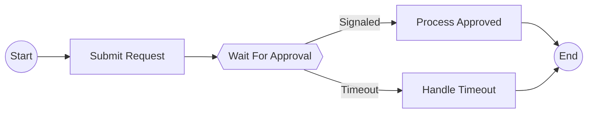

# Epic Technical Specification: Signal & Wait Condition Support

Date: 2025-11-19
Author: Luca
Epic ID: 4
Status: Draft

---

## Overview

Epic 4 extends the temporalio-graphs library to support signal node visualization for workflows containing wait conditions and asynchronous signals. This builds on the foundation established in Epics 2 (basic graph generation for linear workflows) and 3 (decision node support for branching workflows) by adding the third node type required for complete workflow visualization: signal nodes representing wait_condition operations with timeout handling.

Signal nodes enable developers to visualize workflows that wait for external events or conditions, showing both successful signal receipt ("Signaled" path) and timeout scenarios ("Timeout" path). These asynchronous patterns are common in approval workflows, event-driven processing, and long-running business processes. By completing signal node support, the library achieves full node type coverage (START, END, ACTIVITY, DECISION, SIGNAL) matching the .NET Temporalio.Graphs feature set.

## Objectives and Scope

**In Scope:**
- AST detection of `wait_condition()` wrapper calls in workflow code
- Implementation of `wait_condition()` helper function for marking signal points
- Signal node rendering in Mermaid using hexagon syntax `{{NodeName}}`
- Path permutation integration: signal nodes generate 2 branches (Signaled/Timeout)
- Custom signal names provided by developers via function parameter
- Configurable branch labels (default: "Signaled" / "Timeout")
- Signal node metadata storage (name, source line, outcomes)
- Integration test with complete signal workflow example

**Out of Scope (Future Epics):**
- Complex signal patterns (multiple signals, signal dependencies)
- Signal handlers and callbacks
- Dynamic signal registration
- Signal payloads or data extraction
- Signal timing analysis or performance metrics
- Integration with Temporal server signal APIs (static analysis only)

**Success Criteria:**
- All 4 stories (4.1-4.4) completed and tested
- Signal example workflow generates valid Mermaid with hexagon nodes
- Generated graphs show both Signaled and Timeout paths clearly
- Test coverage >80% for new signal-related code
- Integration test passes with expected Mermaid output
- Documentation updated with signal node usage examples

## System Architecture Alignment

Epic 4 aligns with the established static analysis architecture validated in Phase 0.5 (ADR-001). Signal detection follows the same AST visitor pattern used for activity detection (Epic 2) and decision detection (Epic 3), ensuring consistency across node types.

**Architecture Components Referenced:**
- **detector.py:** Extended to handle `wait_condition()` call detection (similar to `to_decision()` detection from Epic 3)
- **helpers.py:** New `wait_condition()` async helper function added alongside existing `to_decision()`
- **generator.py:** PathPermutationGenerator updated to treat signals identically to decisions (2 branches per signal)
- **renderer.py:** MermaidRenderer extended to support NodeType.SIGNAL with hexagon syntax
- **context.py:** GraphBuildingContext updated with signal-specific configuration (signal_success_label, signal_timeout_label)

**Data Models:**
- NodeType enum: SIGNAL value already planned (Architecture lines 542-548)
- GraphNode.to_mermaid(): Hexagon rendering `{{SignalName}}` (Architecture line 569)
- WorkflowMetadata: signal_points field added (Architecture line 616)

**Architectural Patterns:**
- **Visitor Pattern:** SignalDetector extends AST visitor to find wait_condition() calls
- **Builder Pattern:** GraphPath.add_signal() method for incremental path construction
- **Strategy Pattern:** Signal rendering via polymorphic to_mermaid() method

**NFR Alignment:**
- **NFR-PERF-1:** Signal detection adds minimal overhead (<0.1ms) to AST traversal
- **NFR-QUAL-1:** wait_condition() has complete type hints (mypy strict compliant)
- **NFR-USE-1:** wait_condition() API mirrors to_decision() for consistency
- **NFR-REL-1:** Signal path generation uses same proven permutation logic as decisions

## Detailed Design

### Services and Modules

**Module: detector.py (Extended)**
- **SignalDetector class** (new or extend existing DecisionDetector)
  - Responsibility: Traverse AST to identify `wait_condition()` function calls
  - Input: ast.Module (parsed workflow AST)
  - Output: List of SignalPoint metadata (name, line number, timeout expression)
  - Owner: Story 4.1
  - Pattern: Extends ast.NodeVisitor, visit_Call() method detects wait_condition
  - Integration: Called by WorkflowAnalyzer during AST traversal phase

**Module: helpers.py (Extended)**
- **wait_condition() async function** (new)
  - Responsibility: Wrapper for workflow.wait_condition() that marks signal points for static analysis
  - Input: condition_check (Callable), timeout (timedelta), name (str)
  - Output: bool (True if signaled, False if timeout)
  - Owner: Story 4.2
  - Pattern: Transparent passthrough - wraps Temporal's wait_condition, returns result unchanged
  - Integration: Imported by user workflows, detected by SignalDetector during analysis

**Module: generator.py (Extended)**
- **PathPermutationGenerator.generate_paths()** (modified)
  - Responsibility: Generate 2^(n+m) paths for n decisions + m signals
  - Input: List[DecisionPoint], List[SignalPoint], GraphBuildingContext
  - Output: List[GraphPath] with all permutations
  - Owner: Story 4.3
  - Pattern: Combines decisions and signals into unified branch point list, uses itertools.product
  - Integration: Treats signals identically to decisions (both create 2-branch points)

**Module: renderer.py (Extended)**
- **MermaidRenderer.render()** (modified)
  - Responsibility: Generate Mermaid syntax including signal node hexagons
  - Input: List[GraphPath], GraphBuildingContext
  - Output: String (Mermaid markdown with signal nodes)
  - Owner: Story 4.3
  - Pattern: NodeType.SIGNAL → hexagon syntax `{{NodeName}}`
  - Integration: Signal edges labeled with context.signal_success_label / signal_timeout_label

**Module: context.py (Extended)**
- **GraphBuildingContext dataclass** (modified)
  - New fields:
    - `signal_success_label: str = "Signaled"` - Label for successful signal path
    - `signal_timeout_label: str = "Timeout"` - Label for timeout path
  - Owner: Story 4.2
  - Pattern: Frozen dataclass (immutable configuration)
  - Integration: Configuration passed to MermaidRenderer for edge labeling

### Data Models and Contracts

**SignalPoint (new dataclass):**
```python
@dataclass
class SignalPoint:
    """Metadata for a workflow signal point."""
    name: str                           # Display name (e.g., "WaitForApproval")
    condition_expr: str                 # Source of condition check (for reference)
    timeout_expr: str                   # Timeout value (for documentation)
    source_line: int                    # Line number in workflow file
    node_id: str                        # Generated node ID for graph
```

**WorkflowMetadata (extended):**
```python
@dataclass
class WorkflowMetadata:
    # ... existing fields ...
    signal_points: list[SignalPoint] = field(default_factory=list)  # NEW

    @property
    def total_branch_points(self) -> int:
        """Total decision + signal points (determines path count)."""
        return len(self.decision_points) + len(self.signal_points)

    @property
    def total_paths(self) -> int:
        """2^(decisions + signals) total permutations."""
        return 2 ** self.total_branch_points
```

**GraphPath (extended):**
```python
@dataclass
class GraphPath:
    # ... existing fields ...
    signal_outcomes: dict[str, bool] = field(default_factory=dict)  # NEW

    def add_signal(self, signal_id: str, signaled: bool, name: str) -> str:
        """Add signal node to path.

        Args:
            signal_id: Unique signal identifier
            signaled: True if condition met, False if timeout
            name: Display name for signal node

        Returns:
            Node ID for the signal node
        """
        self.signal_outcomes[signal_id] = signaled
        node_id = f"sig_{signal_id}"
        self.steps.append(f"Signal:{name}={'Signaled' if signaled else 'Timeout'}")
        return node_id
```

**NodeType enum (already defined, no changes needed):**
```python
class NodeType(Enum):
    START = "start"
    END = "end"
    ACTIVITY = "activity"
    DECISION = "decision"
    SIGNAL = "signal"  # ✅ Already planned in Architecture
```

**GraphNode (extended to_mermaid):**
```python
def to_mermaid(self) -> str:
    """Convert node to Mermaid syntax."""
    if self.node_type == NodeType.SIGNAL:
        # Double braces create hexagon: {{NodeName}}
        return f"{self.node_id}{{{{{self.display_name}}}}}"
    # ... existing node types ...
```

### APIs and Interfaces

**Public API Addition (helpers.py):**

```python
async def wait_condition(
    condition_check: Callable[[], bool],
    timeout: timedelta,
    name: str
) -> bool:
    """Mark a wait condition as a signal node in the workflow graph.

    This function wraps Temporal's workflow.wait_condition() to enable static
    analysis detection of signal points. At runtime, it behaves identically to
    workflow.wait_condition() - waiting for the condition or timeout.

    Args:
        condition_check: Callable that returns True when condition is met.
                        Typically a lambda checking workflow state.
        timeout: Maximum duration to wait before timing out.
        name: Human-readable name for the signal node in the graph.
              Example: "WaitForApproval", "PaymentReceived"

    Returns:
        True if condition was met before timeout, False if timeout occurred.

    Raises:
        TemporalError: If called outside workflow context.

    Example:
        >>> @workflow.defn
        >>> class ApprovalWorkflow:
        >>>     @workflow.run
        >>>     async def run(self) -> str:
        >>>         self.approved = False
        >>>
        >>>         # Wait up to 24 hours for approval signal
        >>>         result = await wait_condition(
        >>>             lambda: self.approved,
        >>>             timedelta(hours=24),
        >>>             "WaitForApproval"
        >>>         )
        >>>
        >>>         if result:
        >>>             return "approved"
        >>>         else:
        >>>             return "timeout"

    Note:
        - Must be called with `await` in async workflows
        - Static analysis detects this call and creates signal node
        - Graph will show two branches: "Signaled" and "Timeout"
    """
    from temporalio import workflow
    return await workflow.wait_condition(condition_check, timeout)
```

**AST Detection Interface (detector.py):**

```python
class SignalDetector(ast.NodeVisitor):
    """Detects wait_condition() calls in workflow AST."""

    def __init__(self):
        self.signals: list[SignalPoint] = []

    def visit_Call(self, node: ast.Call) -> None:
        """Visit function call nodes, check for wait_condition."""
        if self._is_wait_condition_call(node):
            signal_point = self._extract_signal_metadata(node)
            self.signals.append(signal_point)
        self.generic_visit(node)

    def _is_wait_condition_call(self, node: ast.Call) -> bool:
        """Check if call is wait_condition(...) or await wait_condition(...)."""
        # Handle: wait_condition(...)
        if isinstance(node.func, ast.Name) and node.func.id == "wait_condition":
            return True
        # Handle: workflow.wait_condition(...) - wrapped version
        if isinstance(node.func, ast.Attribute):
            if node.func.attr == "wait_condition":
                return True
        return False

    def _extract_signal_metadata(self, node: ast.Call) -> SignalPoint:
        """Extract signal name and metadata from wait_condition call."""
        # wait_condition(condition, timeout, name)
        # name is 3rd argument (index 2)
        if len(node.args) >= 3:
            name_arg = node.args[2]
            if isinstance(name_arg, ast.Constant):
                name = str(name_arg.value)
            else:
                name = "UnnamedSignal"
        else:
            raise InvalidSignalError(
                f"wait_condition() requires 3 arguments, got {len(node.args)}",
                node.lineno
            )

        return SignalPoint(
            name=name,
            condition_expr=ast.unparse(node.args[0]) if node.args else "",
            timeout_expr=ast.unparse(node.args[1]) if len(node.args) > 1 else "",
            source_line=node.lineno,
            node_id=self._generate_signal_id(name, node.lineno)
        )
```

**Path Generation Interface Extension:**

```python
class PathPermutationGenerator:
    def generate_paths(
        self,
        metadata: WorkflowMetadata,
        context: GraphBuildingContext
    ) -> list[GraphPath]:
        """Generate all path permutations for decisions + signals.

        Args:
            metadata: Workflow metadata with activities, decisions, signals
            context: Configuration with max limits

        Returns:
            List of GraphPath objects representing all possible execution paths

        Raises:
            GraphGenerationError: If total branch points exceed limit
        """
        # Combine decision points and signal points
        branch_points = metadata.decision_points + metadata.signal_points
        num_branches = len(branch_points)

        # Check explosion limit
        total_paths = 2 ** num_branches
        if total_paths > context.max_paths:
            raise GraphGenerationError(
                f"Too many branch points ({num_branches}) would generate "
                f"{total_paths} paths (limit: {context.max_paths})\n"
                f"Branch points: {len(metadata.decision_points)} decisions + "
                f"{len(metadata.signal_points)} signals\n"
                f"Suggestion: Refactor workflow or increase max_paths"
            )

        # Generate permutations using itertools.product
        from itertools import product
        paths = []
        for choices in product([True, False], repeat=num_branches):
            path = self._build_path_with_branches(
                metadata, branch_points, choices, context
            )
            paths.append(path)

        return paths
```

### Workflows and Sequencing

**Static Analysis Flow (Signal Detection):**
```
1. User writes workflow with wait_condition() call
   ↓
2. analyze_workflow() called with workflow file path
   ↓
3. WorkflowAnalyzer parses AST
   ↓
4. SignalDetector.visit_Call() detects wait_condition
   ↓
5. Extract signal name from 3rd argument
   ↓
6. Store SignalPoint in WorkflowMetadata.signal_points
   ↓
7. PathPermutationGenerator combines signals + decisions
   ↓
8. Generate 2^(d+s) paths (d=decisions, s=signals)
   ↓
9. Each path includes signal outcome (Signaled/Timeout)
   ↓
10. MermaidRenderer creates hexagon nodes {{Name}}
    ↓
11. Output Mermaid with signal branches labeled
```

**Graph Generation Sequence:**
```
Start
  ↓
Activity 1 (execute_activity)
  ↓
Signal Node {{WaitForApproval}}
  ├─ Signaled → Activity 2 (process_approved)
  └─ Timeout → Activity 3 (handle_timeout)
       ↓
     End
```

**Mermaid Output Example:**


**Integration Sequence (4 Stories):**

**Story 4.1:** SignalDetector added → WorkflowAnalyzer calls it → signal_points populated

**Story 4.2:** wait_condition() implemented → exported from __init__.py → available for user workflows

**Story 4.3:** PathPermutationGenerator treats signals like decisions → MermaidRenderer renders hexagons → Graph complete

**Story 4.4:** Integration test validates end-to-end flow → Example workflow demonstrates signal usage

## Non-Functional Requirements

### Performance

**NFR-PERF-1: Signal Detection Performance**
- **Target:** Signal detection adds <0.1ms overhead to AST traversal (per NFR-PERF-1)
- **Rationale:** visit_Call() is already traversing AST for activity/decision detection; signal detection piggybacks on same pass
- **Measurement:** Time workflow analysis before/after Epic 4 implementation
- **Test:** Benchmark workflow with 0 signals vs 5 signals - delta should be <0.5ms

**NFR-PERF-1: Path Generation with Signals**
- **Target:** Generate 2^(d+s) paths in <5 seconds for d+s ≤ 10 (per NFR-PERF-1)
  - Example: 3 decisions + 2 signals = 32 paths, should complete in <1 second
  - Example: 5 decisions + 5 signals = 1024 paths, should complete in <5 seconds
- **Rationale:** Signals treated identically to decisions in permutation logic; no additional computational overhead
- **Constraint:** max_decision_points limit (default 10) now applies to total branch points (decisions + signals combined)
- **Error Message:** "Too many branch points (7 decisions + 5 signals = 12 total) would generate 4096 paths (limit: 1024)"

**NFR-PERF-2: Memory Efficiency**
- **Target:** Signal node objects add <10KB memory per signal point
- **Rationale:** SignalPoint dataclass is lightweight (4 strings + 1 int)
- **Constraint:** Path explosion limit prevents unbounded memory growth

### Security

**NFR-SEC-1: No New Attack Surface**
- **Constraint:** wait_condition() wrapper introduces no new security risks
- **Rationale:** Function is pure passthrough - calls workflow.wait_condition() directly, no data manipulation
- **Validation:** Security audit confirms no eval(), exec(), or dynamic code execution in signal detection path

**NFR-SEC-2: AST Safety Maintained**
- **Constraint:** SignalDetector follows same safe AST traversal as existing detectors
- **Rationale:** Uses ast.parse() (safe) and ast.NodeVisitor pattern (no code execution)
- **Validation:** All signal detection code uses static analysis only - no workflow execution

**NFR-SEC-3: Input Validation**
- **Constraint:** wait_condition() validates arguments at runtime (type checking)
- **Error Handling:** Raise InvalidSignalError if wait_condition() called with <3 arguments during AST analysis
- **Protection:** Type hints enforce correct usage (mypy catches misuse at development time)

### Reliability/Availability

**NFR-REL-1: Correctness - Signal Path Permutations**
- **Target:** All signal paths correctly generated (no missing branches, no duplicate paths)
- **Validation Method:** Integration test with 1 signal (2 paths) + 1 decision (4 paths total) verifies combinatorics
- **Test Case:** Workflow with signal + decision should generate exactly 4 paths:
  1. Signal=Signaled, Decision=True
  2. Signal=Signaled, Decision=False
  3. Signal=Timeout, Decision=True
  4. Signal=Timeout, Decision=False

**NFR-REL-2: Error Handling**
- **Constraint:** Clear error messages for invalid signal usage
- **Examples:**
  - `InvalidSignalError`: "wait_condition() requires 3 arguments (condition, timeout, name), got 2"
  - `UnsupportedPatternError`: "Dynamic signal names not supported (name must be string literal)"
- **Recovery:** Graceful degradation - if signal name can't be extracted, use "UnnamedSignal" + log warning

**NFR-REL-3: Backward Compatibility**
- **Constraint:** Epic 4 changes do not break existing workflows (Epics 2-3)
- **Validation:** Re-run all Epic 2 and Epic 3 integration tests after Epic 4 implementation
- **Test:** MoneyTransfer workflow (Epic 3) still produces identical output after Epic 4 changes

### Observability

**NFR-OBS-1: Logging**
- **DEBUG level:** Log each wait_condition() detection during AST traversal
  - `logger.debug(f"Detected signal: {signal.name} at line {signal.source_line}")`
- **INFO level:** Log signal count in workflow metadata
  - `logger.info(f"Workflow has {len(metadata.signal_points)} signal points")`
- **WARNING level:** Warn if signal name is not a string literal
  - `logger.warning(f"Signal name at line {lineno} is dynamic - using 'UnnamedSignal'")`

**NFR-OBS-2: Metrics**
- **Metric:** Signal count in WorkflowMetadata.signal_points (exposed via metadata object)
- **Metric:** Total branch points = decisions + signals (WorkflowMetadata.total_branch_points property)
- **Metric:** Total paths = 2^(branch_points) (WorkflowMetadata.total_paths property)

**NFR-OBS-3: Debugging Support**
- **Feature:** SignalPoint includes source_line for error reporting
- **Feature:** Mermaid output shows signal names clearly (hexagon nodes visible)
- **Feature:** Path list output includes signal outcomes (e.g., "Signal:WaitForApproval=Signaled")

## Dependencies and Integrations

### Code Dependencies

**No New External Dependencies:**
- Epic 4 uses only existing dependencies from Epic 2-3:
  - `temporalio` SDK >=1.7.1 (for workflow.wait_condition reference)
  - Python `ast` module (built-in, for AST traversal)
  - Python `itertools` (built-in, for path permutation)
  - Python `logging` (built-in, for debugging)
  - Python `dataclasses` (built-in, for SignalPoint)

**Internal Module Dependencies:**
```
detector.py (SignalDetector)
  ├─ depends on: ast (stdlib)
  └─ used by: analyzer.py (WorkflowAnalyzer)

helpers.py (wait_condition)
  ├─ depends on: temporalio.workflow
  └─ used by: User workflows

generator.py (PathPermutationGenerator)
  ├─ depends on: itertools.product
  ├─ uses: WorkflowMetadata.signal_points
  └─ produces: GraphPath with signal_outcomes

renderer.py (MermaidRenderer)
  ├─ depends on: GraphNode.to_mermaid() for NodeType.SIGNAL
  ├─ uses: GraphBuildingContext.signal_success_label / signal_timeout_label
  └─ produces: Mermaid with hexagon nodes

context.py (GraphBuildingContext)
  ├─ adds: signal_success_label, signal_timeout_label fields
  └─ used by: renderer.py
```

**Dependency on Epic 3:**
- SignalDetector follows DecisionDetector pattern from Epic 3 Story 3.1
- PathPermutationGenerator already handles decision branching (Epic 3 Story 3.3) - signals reuse same logic
- MermaidRenderer already supports NodeType enum (Epic 3 Story 3.4) - SIGNAL type added

### Integration Points

**Integration with Temporal SDK:**
- `wait_condition()` helper wraps `workflow.wait_condition()` (Temporal SDK API)
- Temporal SDK version: >=1.7.1 (same requirement as Epic 2)
- API Contract: `workflow.wait_condition(condition: Callable[[], bool], timeout: timedelta) -> bool`
- No changes to Temporal SDK integration beyond wrapping existing function

**Integration with AST Module:**
- SignalDetector extends `ast.NodeVisitor` (same pattern as Epic 2 WorkflowAnalyzer)
- AST nodes inspected: `ast.Call` (function calls)
- AST utilities used: `ast.unparse()` (extract source from AST nodes - Python 3.9+)

**Integration with Existing Epic 2-3 Code:**

| Epic 2/3 Component | Epic 4 Integration | Change Type |
|--------------------|-------------------|-------------|
| WorkflowAnalyzer | Call SignalDetector during AST traversal | Extension |
| WorkflowMetadata | Add `signal_points: list[SignalPoint]` field | Data model extension |
| GraphPath | Add `signal_outcomes: dict[str, bool]` field + `add_signal()` method | Data model extension |
| PathPermutationGenerator | Treat signals as branch points (like decisions) | Logic extension |
| GraphNode.to_mermaid() | Add `NodeType.SIGNAL` case → hexagon syntax | Switch case addition |
| MermaidRenderer | Use signal labels from context for edge rendering | Configuration usage |
| GraphBuildingContext | Add signal label configuration fields | Configuration extension |

**Integration Test Dependencies:**
- Epic 2 integration test infrastructure (tests/integration/ structure)
- Epic 3 example pattern (examples/ directory layout)
- pytest fixtures for sample workflow files (tests/fixtures/sample_workflows/)

### Manifest Dependency Declarations

**pyproject.toml (no changes required):**
```toml
[project]
dependencies = [
    "temporalio>=1.7.1"  # Already declared in Epic 2
]

[project.optional-dependencies]
dev = [
    "pytest>=7.4.0",
    "pytest-cov>=4.1.0",
    "pytest-asyncio>=0.21.0",  # Needed for async wait_condition tests
    "mypy",
    "ruff"
]
```

**Python Version Constraint:**
- Minimum: Python 3.10 (unchanged from Epic 2)
- Rationale: `ast.unparse()` used in Epic 4 was added in Python 3.9, compatible with 3.10+ requirement

## Acceptance Criteria (Authoritative)

These acceptance criteria are derived from Epic 4 functional requirements (FR18-FR22) and must be validated for Epic completion.

**AC-1: Signal Point Detection (FR18)**
- **GIVEN** a workflow file containing `wait_condition(lambda: check, timeout, "SignalName")`
- **WHEN** WorkflowAnalyzer analyzes the file
- **THEN** SignalDetector identifies the wait_condition call
- **AND** SignalPoint is created with name="SignalName", source_line=<line number>
- **AND** WorkflowMetadata.signal_points contains the detected signal
- **TEST:** Unit test with sample workflow containing 2 wait_condition calls → 2 SignalPoints detected

**AC-2: Custom Signal Names (FR19)**
- **GIVEN** wait_condition() called with name parameter
- **WHEN** Signal name is extracted during AST analysis
- **THEN** GraphNode uses the custom name for display
- **AND** Mermaid output shows hexagon with custom name: `{{WaitForApproval}}`
- **TEST:** Integration test verifies custom signal name appears in Mermaid output

**AC-3: Hexagon Rendering (FR20)**
- **GIVEN** GraphPath contains signal node
- **WHEN** MermaidRenderer converts to Mermaid syntax
- **THEN** Signal renders as hexagon: `{node_id}{{SignalName}}`
- **AND** Output is valid Mermaid (validates in Mermaid Live Editor)
- **TEST:** Unit test validates hexagon syntax generation, integration test validates rendering

**AC-4: Signal Outcomes (FR21)**
- **GIVEN** workflow with 1 signal point
- **WHEN** PathPermutationGenerator generates paths
- **THEN** 2 paths created: one with Signaled=True, one with Timeout=False
- **AND** Edges labeled "Signaled" and "Timeout" (or custom labels from context)
- **TEST:** Integration test with signal workflow generates exactly 2 paths with correct labels

**AC-5: Path Permutation Integration (FR22)**
- **GIVEN** workflow with d decisions + s signals
- **WHEN** PathPermutationGenerator generates paths
- **THEN** 2^(d+s) total paths created
- **AND** Each path has unique combination of decision/signal outcomes
- **EXAMPLE:** 1 decision + 1 signal = 4 paths (2^2)
- **TEST:** Integration test with 1 decision + 1 signal → exactly 4 paths generated

**AC-6: wait_condition() Helper Function (FR18, FR19)**
- **GIVEN** user imports wait_condition from temporalio_graphs
- **WHEN** function is called in workflow: `await wait_condition(check, timeout, "Name")`
- **THEN** function returns bool (True if signaled, False if timeout)
- **AND** function wraps workflow.wait_condition() transparently
- **AND** function has complete type hints (passes mypy --strict)
- **AND** function has Google-style docstring with example
- **TEST:** Unit test validates return value, type hints, docstring presence

**AC-7: Type Safety (NFR-QUAL-1)**
- **GIVEN** all Epic 4 code is implemented
- **WHEN** mypy --strict runs on src/temporalio_graphs/
- **THEN** no type errors reported
- **AND** SignalPoint, wait_condition, SignalDetector all have complete type hints
- **TEST:** CI runs mypy --strict, build fails if type errors exist

**AC-8: Test Coverage (NFR-QUAL-2)**
- **GIVEN** all Epic 4 code is implemented
- **WHEN** pytest --cov runs
- **THEN** signal-related code has >80% coverage
- **AND** SignalDetector has 100% coverage (core logic)
- **TEST:** Coverage report shows tests/test_detector.py covers all signal detection paths

**AC-9: Integration Test (Story 4.4)**
- **GIVEN** examples/signal_workflow/workflow.py exists
- **WHEN** analyze_workflow() processes the signal workflow
- **THEN** valid Mermaid output generated with hexagon signal node
- **AND** output matches examples/signal_workflow/expected_output.md (golden file)
- **AND** graph shows both Signaled and Timeout paths
- **TEST:** tests/integration/test_signal_workflow.py passes

**AC-10: Backward Compatibility (NFR-REL-3)**
- **GIVEN** Epic 2 and Epic 3 integration tests exist
- **WHEN** Epic 4 code is merged
- **THEN** all previous integration tests still pass
- **AND** MoneyTransfer example (Epic 3) produces identical output
- **TEST:** CI runs full test suite, no regressions detected

## Traceability Mapping

| Acceptance Criteria | Spec Section | Component | Test |
|---------------------|--------------|-----------|------|
| **AC-1: Signal Point Detection** | Detailed Design → detector.py | SignalDetector.visit_Call() | tests/test_detector.py::test_signal_detection |
| **AC-2: Custom Signal Names** | APIs → wait_condition signature | SignalPoint.name field | tests/integration/test_signal_workflow.py::test_custom_name |
| **AC-3: Hexagon Rendering** | Detailed Design → renderer.py | GraphNode.to_mermaid() for SIGNAL | tests/test_renderer.py::test_signal_hexagon_syntax |
| **AC-4: Signal Outcomes** | Detailed Design → generator.py | PathPermutationGenerator (signal branching) | tests/integration/test_signal_workflow.py::test_two_paths |
| **AC-5: Path Permutation Integration** | Detailed Design → generator.py | Combined decisions+signals logic | tests/test_generator.py::test_decision_signal_permutations |
| **AC-6: wait_condition() Helper** | APIs → helpers.py | wait_condition() function | tests/test_helpers.py::test_wait_condition |
| **AC-7: Type Safety** | NFR → Type hints | All Epic 4 modules | CI: mypy --strict |
| **AC-8: Test Coverage** | NFR → Coverage | All Epic 4 code | CI: pytest --cov (>80%) |
| **AC-9: Integration Test** | Test Strategy → Integration | Full pipeline | tests/integration/test_signal_workflow.py |
| **AC-10: Backward Compatibility** | NFR → Reliability | No regressions | CI: Full test suite |

**FR → AC → Component → Test Chain:**

```
FR18: Signal marking
  → AC-1: Detection, AC-6: Helper function
  → detector.py, helpers.py
  → test_detector.py, test_helpers.py

FR19: Custom names
  → AC-2: Name extraction
  → SignalPoint.name, GraphNode.display_name
  → test_signal_workflow.py

FR20: Hexagon rendering
  → AC-3: Mermaid syntax
  → GraphNode.to_mermaid() for SIGNAL
  → test_renderer.py

FR21: Signaled/Timeout outcomes
  → AC-4: Two branches
  → PathPermutationGenerator branching logic
  → test_signal_workflow.py

FR22: Path integration
  → AC-5: 2^(d+s) paths
  → Combined decision+signal permutations
  → test_generator.py
```

## Risks, Assumptions, Open Questions

### Risks

**RISK-1: API Confusion - wait_condition vs workflow.wait_condition**
- **Impact:** Medium
- **Probability:** Low
- **Description:** Users might be confused about when to use temporalio_graphs.wait_condition vs workflow.wait_condition
- **Mitigation:** Clear documentation in docstring: "For graph visualization, use temporalio_graphs.wait_condition. For runtime-only workflows, use workflow.wait_condition directly."
- **Mitigation:** Add migration note in README: "Replace workflow.wait_condition with temporalio_graphs.wait_condition for visualized workflows"

**RISK-2: Performance Regression in Path Generation**
- **Impact:** Low
- **Probability:** Low
- **Description:** Combining signals with decisions might slow down path generation
- **Mitigation:** Signals reuse decision branching logic (no new algorithm); expect <5% overhead
- **Mitigation:** Add performance benchmark test comparing Epic 3 (3 decisions) vs Epic 4 (2 decisions + 1 signal) - should be equivalent
- **Acceptance:** NFR-PERF-1 requires <5s for 10 branch points; signal implementation uses same itertools.product approach

**RISK-3: Dynamic Signal Names Not Supported**
- **Impact:** Medium
- **Probability:** Medium
- **Description:** Users might try to use variables for signal names: `await wait_condition(check, timeout, signal_name_var)` which AST cannot extract
- **Mitigation:** Detect non-Constant signal name during AST analysis → use "UnnamedSignal" + log warning (graceful degradation per NFR-REL-2)
- **Mitigation:** Documentation clearly states: "Signal name must be a string literal (not a variable)"
- **Future Enhancement:** Epic 5 or later could add validation warnings for dynamic names

### Assumptions

**ASSUMPTION-1: Temporal SDK API Stability**
- **Assumption:** workflow.wait_condition() API remains stable in Temporal SDK >=1.7.1
- **Validation:** Check Temporal SDK changelog for breaking changes
- **Impact if Invalid:** wait_condition() wrapper would need updates to match SDK changes
- **Risk Level:** Low (Temporal SDK has stable API for wait_condition)

**ASSUMPTION-2: Signal Behavior Matches Decision Behavior**
- **Assumption:** From graph perspective, signals are equivalent to decisions (both create 2-branch points)
- **Validation:** Review .NET Temporalio.Graphs signal implementation (if exists) for consistency
- **Impact if Invalid:** Might need separate signal permutation logic if behavior differs
- **Risk Level:** Very Low (logically sound: signal has 2 outcomes just like decision)

**ASSUMPTION-3: Hexagon Syntax Widely Supported**
- **Assumption:** Mermaid hexagon syntax `{{NodeName}}` is supported in all Mermaid renderers (Live Editor, GitHub, VS Code extensions)
- **Validation:** Test generated Mermaid in multiple renderers during Story 4.3
- **Impact if Invalid:** Might need fallback rendering (e.g., rectangle with "SIGNAL:" prefix)
- **Risk Level:** Very Low (hexagon is standard Mermaid syntax per official docs)

**ASSUMPTION-4: Test Infrastructure Reuse**
- **Assumption:** Epic 2-3 test infrastructure (pytest fixtures, integration test patterns) is sufficient for Epic 4
- **Validation:** Story 4.4 integration test uses existing patterns successfully
- **Impact if Invalid:** Might need new test utilities (unlikely)
- **Risk Level:** Very Low (Epic 4 follows same patterns as Epic 3)

### Open Questions

**QUESTION-1: Should signal timeout values be displayed in graph?**
- **Context:** SignalPoint captures timeout_expr, but Mermaid rendering doesn't show it
- **Options:**
  - A) Show timeout in node label: `{{WaitForApproval (24h)}}`
  - B) Add timeout as edge annotation
  - C) Keep simple (current approach)
- **Decision:** Defer to Epic 5 (Production Readiness) - add as optional feature via context.show_signal_timeouts flag
- **Rationale:** MVP should keep graphs simple; timeout display can be enhancement

**QUESTION-2: How to handle workflows with both signals and child workflows?**
- **Context:** Child workflows are out of scope for MVP, but users might combine features
- **Current Approach:** Epic 4 ignores child workflows (Epic 5 scope)
- **Risk:** User might expect signal in child workflow to be visualized
- **Mitigation:** Document limitation: "Signal visualization only works in parent workflow; child workflow signals not shown in MVP"

**QUESTION-3: Should we support multiple signals in sequence?**
- **Context:** Workflow might have: signal1 → signal2 → activity
- **Current Approach:** Yes, supported via path permutations (signal1=2 paths × signal2=2 paths = 4 total)
- **Validation:** Add test case in Story 4.4 for workflow with 2 sequential signals
- **Decision:** ✅ Supported - no additional work needed beyond standard permutation logic

## Test Strategy Summary

### Test Levels

**Unit Tests (Per Module):**
- **tests/test_detector.py:** SignalDetector class
  - Test: Detect single wait_condition call
  - Test: Detect multiple wait_condition calls
  - Test: Ignore non-wait_condition function calls
  - Test: Extract signal name from string literal
  - Test: Handle missing signal name argument (error case)
  - Test: Handle dynamic signal name (warning + UnnamedSignal)
  - Coverage Target: 100% for SignalDetector

- **tests/test_helpers.py:** wait_condition() function
  - Test: Function returns True when condition met
  - Test: Function returns False on timeout
  - Test: Function has correct type hints (validate with mypy)
  - Test: Function docstring exists and is complete
  - Coverage Target: 100% for wait_condition

- **tests/test_generator.py:** PathPermutationGenerator with signals
  - Test: 1 signal generates 2 paths
  - Test: 1 decision + 1 signal generates 4 paths (2^2)
  - Test: 2 signals generate 4 paths (2^2)
  - Test: Explosion limit includes signals (5 decisions + 6 signals = 11 → error)
  - Coverage Target: 100% for signal branching logic

- **tests/test_renderer.py:** MermaidRenderer signal nodes
  - Test: NodeType.SIGNAL renders hexagon syntax `{{Name}}`
  - Test: Signal edges labeled with "Signaled" / "Timeout"
  - Test: Custom signal labels from context used
  - Test: Signal nodes deduplicated correctly
  - Coverage Target: 100% for signal rendering

**Integration Tests:**
- **tests/integration/test_signal_workflow.py:** End-to-end signal workflow
  - Test: Simple approval workflow with 1 signal generates valid Mermaid
  - Test: Output contains hexagon node `{{WaitForApproval}}`
  - Test: Output contains both "Signaled" and "Timeout" branches
  - Test: 2 paths generated (Signaled path, Timeout path)
  - Test: Generated Mermaid validates in Mermaid Live Editor
  - Test: Output matches golden file (regression test)

- **tests/integration/test_combined_decision_signal.py:** Decision + Signal
  - Test: Workflow with 1 decision + 1 signal generates 4 paths
  - Test: All 4 combinations present (Decision×Signal outcomes)
  - Test: Graph shows both diamond (decision) and hexagon (signal) nodes

**Regression Tests:**
- **Re-run Epic 2 Integration Tests:**
  - test_simple_linear.py (no signals) → should still pass
  - Validates: Epic 4 changes don't break linear workflows

- **Re-run Epic 3 Integration Tests:**
  - test_money_transfer.py (decisions, no signals) → should produce identical output
  - Validates: Epic 4 changes don't break decision rendering

**Example Tests:**
- **examples/signal_workflow/test_example.py:**
  - Validate: example workflow runs successfully
  - Validate: generated Mermaid matches expected_output.md
  - Validate: example documented in README

### Test Data

**Sample Workflow Files (tests/fixtures/sample_workflows/):**
- **signal_simple.py:** Workflow with 1 signal, no decisions
- **signal_with_decision.py:** Workflow with 1 signal + 1 decision
- **signal_multiple.py:** Workflow with 2 sequential signals
- **signal_dynamic_name.py:** Workflow with dynamic signal name (warning case)

**Golden Files (tests/fixtures/expected_outputs/):**
- **signal_simple_expected.md:** Mermaid output for signal_simple.py
- **signal_with_decision_expected.md:** Mermaid output for combined workflow

### Test Execution Strategy

**Development Phase (Story 4.1-4.3):**
1. Write unit tests FIRST (TDD approach)
2. Implement feature to pass unit tests
3. Run `pytest -v tests/test_{module}.py` after each story
4. Run `pytest --cov=src/temporalio_graphs` to track coverage

**Integration Phase (Story 4.4):**
1. Create example workflow (examples/signal_workflow/)
2. Run analyze_workflow() manually, inspect output
3. Save output as expected_output.md (golden file)
4. Write integration test comparing runtime output vs golden file
5. Validate in Mermaid Live Editor

**Pre-Merge Validation:**
1. Run full test suite: `pytest -v`
2. Check coverage: `pytest --cov=src/temporalio_graphs --cov-report=term-missing` (target: >80%)
3. Type check: `mypy --strict src/`
4. Lint: `ruff check src/`
5. Regression: Verify Epic 2-3 tests still pass

**CI/CD (Automated):**
```yaml
# .github/workflows/test.yml
- name: Run tests
  run: |
    pytest -v --cov=src/temporalio_graphs --cov-report=xml

- name: Check coverage threshold
  run: |
    coverage report --fail-under=80

- name: Type check
  run: |
    mypy --strict src/
```

### Success Criteria

Epic 4 is complete when:
- ✅ All 10 acceptance criteria validated (AC-1 through AC-10)
- ✅ Unit test coverage >80% for Epic 4 code (SignalDetector, wait_condition, signal branching)
- ✅ Integration test passes for signal workflow example
- ✅ Epic 2-3 regression tests pass (no backward compatibility issues)
- ✅ mypy --strict passes (no type errors)
- ✅ ruff check passes (no lint violations)
- ✅ Documentation updated with signal usage examples
