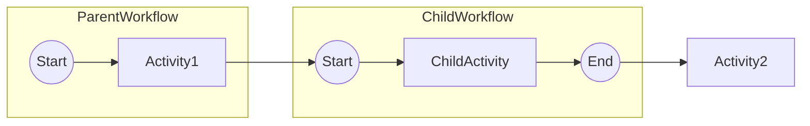

# Epic Technical Specification: Cross-Workflow Visualization (MVP Extension)

Date: 2025-11-19
Author: Luca
Epic ID: 6
Status: Draft

---

## Overview

Epic 6 extends the temporalio-graphs library with cross-workflow visualization capabilities, enabling Python developers to analyze and visualize parent-child workflow relationships and complete end-to-end execution flows spanning multiple workflows.

This epic implements FR67-FR74 (8 functional requirements) from the PRD, delivering the "MVP Extension (v0.2.0)" after the Core MVP (v0.1.0, Epics 1-5) is complete. Real-world Temporal applications commonly use parent-child workflow patterns via `workflow.execute_child_workflow()` - this epic makes these relationships visible in generated diagrams, providing critical insights for understanding complex workflow orchestrations.

**Core Capability:**
Detect child workflow calls in workflow source code, analyze multi-workflow systems as call graphs, and generate Mermaid diagrams showing end-to-end execution paths that span parent and child workflows with configurable visualization modes (reference, inline, subgraph).

## Objectives and Scope

### In Scope

**Parent-Child Workflow Detection:**
- Detect `workflow.execute_child_workflow()` calls in Python AST
- Extract child workflow type/class names from call arguments
- Record call site line numbers and parent workflow context
- Support both class reference and string-based child workflow specification

**Multi-Workflow Analysis Pipeline:**
- New `WorkflowCallGraphAnalyzer` module for orchestrating multi-workflow analysis
- Recursive child workflow discovery and analysis
- Workflow call graph construction (parent-child relationships)
- Circular workflow reference detection with clear error messages
- Configurable workflow search paths for locating child workflow files

**Cross-Workflow Visualization:**
- Three visualization modes (configurable via `GraphBuildingContext.child_workflow_expansion`):
  1. **Reference mode (default):** Child workflows as special nodes `[[ChildWorkflow]]`
  2. **Inline mode:** Child workflow content expanded into parent paths (end-to-end flow)
  3. **Subgraph mode:** Mermaid subgraph rendering for workflow boundaries
- End-to-end execution path generation spanning multiple workflows
- Deterministic node IDs for child workflow nodes
- Path explosion safeguards across multi-workflow graphs

**New Public API:**
- `analyze_workflow_graph()` function for multi-workflow analysis
- New exception types: `ChildWorkflowNotFoundError`, `CircularWorkflowError`
- Extended `GraphBuildingContext` with cross-workflow configuration
- New `NodeType.CHILD_WORKFLOW` enum value

**Documentation & Examples:**
- Parent-child workflow example (`examples/parent_child_workflow/`)
- Integration test demonstrating 4-path end-to-end flow (parent + child decisions)
- Updated README with cross-workflow usage guide
- API reference for new functions and data models

### Out of Scope (Post-MVP / v0.3.0+)

- **N-level deep workflow hierarchies:** Limited to `max_expansion_depth=2` to prevent explosion
- **Dynamic child workflow resolution:** Only detects statically analyzable execute_child_workflow() calls
- **Cross-workflow data flow analysis:** Focus is control flow visualization only
- **Workflow versioning support:** Assumes single version of each child workflow
- **External workflow calls:** Only workflows in local filesystem, no remote workflow references
- **Interactive workflow navigation:** Static Mermaid output only (no clickable drill-down yet)
- **Workflow composition patterns:** Beyond parent-child (e.g., saga patterns, workflow as code)

### Version Delivery

**v0.1.0 (Core MVP):** Epics 1-5, single-workflow analysis (65 FRs) - **PREREQUISITE**
**v0.2.0 (MVP Extension):** Epic 6, cross-workflow support (+8 FRs, total 73 FRs) - **THIS EPIC**
**Timeline:** v0.2.0 releases ~1 week after v0.1.0 completion

## System Architecture Alignment

Epic 6 extends the existing static analysis architecture (ADR-001) with cross-workflow capabilities while maintaining consistency with core architectural patterns established in Epics 1-5.

**Aligns with Existing Architecture:**
- **AST Visitor Pattern (Epic 2):** Extends `WorkflowAnalyzer.visit_Call()` to detect `execute_child_workflow()` calls, similar to activity detection
- **Builder Pattern (Epic 2):** `WorkflowCallGraph` data model follows same frozen dataclass pattern as `WorkflowMetadata`
- **Strategy Pattern (Epic 2):** New rendering modes (reference/inline/subgraph) extend existing `MermaidRenderer`
- **Path Permutation Logic (Epic 3):** Cross-workflow paths use same 2^n generation with explosion safeguards
- **Exception Hierarchy (Epic 5):** New exceptions (`ChildWorkflowNotFoundError`, `CircularWorkflowError`) extend `TemporalioGraphsError` base

**New Architectural Components:**
- **`WorkflowCallGraphAnalyzer`** (`call_graph_analyzer.py`): Orchestrates multi-workflow analysis, manages recursive discovery
- **`ChildWorkflowDetector`** (`detector.py`): Extends existing detector module with child workflow call detection
- **Cross-Workflow Data Models** (`_internal/graph_models.py`): `ChildWorkflowCall`, `WorkflowCallGraph`, `MultiWorkflowPath`

**Follows ADR-011:** Implements three visualization modes (reference/inline/subgraph) with reference as default, `max_expansion_depth=2` safeguard

**Technology Stack:** No new dependencies. Pure Python AST analysis, builds on existing `temporalio` SDK integration.

## Detailed Design

### Services and Modules

| Module | Responsibility | Key Classes/Functions | Dependencies |
|--------|----------------|----------------------|--------------|
| `detector.py` | Child workflow call detection | `ChildWorkflowDetector` (extends existing) | `ast`, `_internal/graph_models.py` |
| `call_graph_analyzer.py` | Multi-workflow analysis orchestration | `WorkflowCallGraphAnalyzer` | `analyzer.py`, `detector.py`, `generator.py` |
| `renderer.py` | Mermaid rendering with child workflow nodes | `MermaidRenderer._render_child_workflow_node()` (new method) | `context.py`, `path.py` |
| `_internal/graph_models.py` | Cross-workflow data models | `ChildWorkflowCall`, `WorkflowCallGraph`, `MultiWorkflowPath` | `pathlib`, `dataclasses` |
| `__init__.py` | Public API exports | `analyze_workflow_graph()` (new function) | `call_graph_analyzer.py` |
| `exceptions.py` | Cross-workflow exceptions | `ChildWorkflowNotFoundError`, `CircularWorkflowError` | `TemporalioGraphsError` base |

**Module Interaction Flow:**
1. User calls `analyze_workflow_graph(entry_workflow, search_paths)`
2. `WorkflowCallGraphAnalyzer` analyzes entry workflow → detects child calls via `ChildWorkflowDetector`
3. Analyzer recursively resolves child workflow files → analyzes each child workflow
4. Builds `WorkflowCallGraph` with all workflows and relationships
5. `PathPermutationGenerator` generates cross-workflow paths based on expansion mode
6. `MermaidRenderer` outputs diagram with child workflow nodes (reference mode) or expanded content (inline/subgraph mode)

### Data Models and Contracts

```python
@dataclass(frozen=True)
class ChildWorkflowCall:
    """Represents a child workflow invocation point."""
    workflow_name: str  # e.g., "PaymentWorkflow"
    workflow_file: Optional[Path]  # Resolved during analysis
    call_site_line: int  # Line number in parent workflow
    call_id: str  # Unique identifier for this call
    parent_workflow: str  # Parent workflow name

@dataclass(frozen=True)
class WorkflowCallGraph:
    """Complete parent-child workflow relationship graph."""
    root_workflow: WorkflowMetadata  # Entry point
    child_workflows: dict[str, WorkflowMetadata]  # name -> metadata
    call_relationships: list[tuple[str, str]]  # (parent, child) pairs
    all_child_calls: list[ChildWorkflowCall]  # All child calls
    total_workflows: int

@dataclass(frozen=True)
class MultiWorkflowPath:
    """Execution path spanning multiple workflows."""
    path_id: str
    workflows: list[str]  # Ordered workflow names
    steps: list[str]  # All steps including boundaries
    workflow_transitions: list[tuple[int, str, str]]  # (step, from, to)
    total_decisions: int

@dataclass(frozen=True)
class GraphBuildingContext:
    # ... existing fields from Epics 1-5 ...

    # NEW for Epic 6:
    child_workflow_expansion: Literal["reference", "inline", "subgraph"] = "reference"
    max_expansion_depth: int = 2  # Prevent infinite recursion

class NodeType(Enum):
    # ... existing types ...
    CHILD_WORKFLOW = "child_workflow"  # NEW for Epic 6
```

**Field Descriptions:**
- `ChildWorkflowCall.call_id`: Generated as `f"{parent_name}_{child_name}_{call_site_line}"`
- `WorkflowCallGraph.call_relationships`: List of edges in call graph (e.g., `[("OrderWorkflow", "PaymentWorkflow")]`)
- `GraphBuildingContext.child_workflow_expansion`: Controls how child workflows render (default: separate diagrams)
- `max_expansion_depth`: Maximum nesting level for recursive child workflow expansion (default: 2 levels deep)

### APIs and Interfaces

**Primary New API:**

```python
def analyze_workflow_graph(
    entry_workflow: Path | str,
    workflow_search_paths: Optional[list[Path | str]] = None,
    context: Optional[GraphBuildingContext] = None,
    output_format: Literal["mermaid", "json", "paths"] = "mermaid"
) -> str:
    """
    Analyze workflow and all child workflows for end-to-end visualization.

    Args:
        entry_workflow: Path to entry point (parent) workflow file
        workflow_search_paths: Directories to search for child workflows
                               (default: same dir as entry_workflow)
        context: Optional configuration
        output_format: "mermaid" (default), "json", or "paths"

    Returns:
        Complete workflow graph visualization as string

    Raises:
        WorkflowParseError: If any workflow file cannot be parsed
        ChildWorkflowNotFoundError: If child workflow file not found
        CircularWorkflowError: If circular workflow references detected
        GraphGenerationError: If graph cannot be generated

    Example:
        >>> from temporalio_graphs import analyze_workflow_graph
        >>> result = analyze_workflow_graph(
        ...     "parent_workflow.py",
        ...     workflow_search_paths=["./workflows", "./child_workflows"]
        ... )
        >>> print(result)  # End-to-end Mermaid diagram
    """
```

**Internal API Extensions:**

```python
class ChildWorkflowDetector:
    """Detects execute_child_workflow() calls in AST."""
    def detect(self, tree: ast.Module) -> list[ChildWorkflowCall]:
        """
        Visit Call nodes, identify execute_child_workflow() patterns.
        Extract workflow name from first argument (class reference or string).
        Record call site line numbers.
        """

class WorkflowCallGraphAnalyzer:
    """Orchestrates multi-workflow analysis."""
    def analyze(
        self,
        entry_workflow: Path,
        search_paths: list[Path],
        context: GraphBuildingContext
    ) -> WorkflowCallGraph:
        """
        1. Analyze entry workflow → detect child calls
        2. Resolve child workflow files from search paths
        3. Recursively analyze child workflows (depth limited)
        4. Build call graph with relationships
        5. Detect circular references
        6. Return complete WorkflowCallGraph
        """
```

**Exception API:**

```python
class ChildWorkflowNotFoundError(TemporalioGraphsError):
    def __init__(self, workflow_name: str, search_paths: list[Path]):
        # Error: "Child workflow 'PaymentWorkflow' not found in: ./workflows, ./child"
        # Suggestion: "Ensure child workflow file exists in search paths"

class CircularWorkflowError(TemporalioGraphsError):
    def __init__(self, workflow_chain: list[str]):
        # Error: "Circular reference: OrderWorkflow -> PaymentWorkflow -> OrderWorkflow"
        # Suggestion: "Remove circular dependency between workflows"
```

### Workflows and Sequencing

**Child Workflow Discovery Sequence:**

```
1. User calls analyze_workflow_graph("parent_workflow.py")
   ↓
2. WorkflowCallGraphAnalyzer loads parent_workflow.py
   ↓
3. ChildWorkflowDetector scans AST for execute_child_workflow() calls
   ↓
4. Extract child workflow names (e.g., "PaymentWorkflow")
   ↓
5. Resolve child workflow files:
   - Search in workflow_search_paths (or same dir as parent)
   - Look for PaymentWorkflow class in .py files
   - Raise ChildWorkflowNotFoundError if not found
   ↓
6. Recursively analyze child workflows:
   - Check depth < max_expansion_depth
   - Detect circular references (visited set)
   - Analyze child workflow AST
   - Detect grandchild calls (if depth permits)
   ↓
7. Build WorkflowCallGraph:
   - Root workflow metadata
   - Child workflow metadata (keyed by name)
   - Call relationships [(parent, child), ...]
   ↓
8. Generate paths based on expansion mode:
   - Reference: Parent paths only, child workflows as nodes
   - Inline: Cross-product of parent × child paths
   - Subgraph: Separate path sets, linked at boundaries
   ↓
9. Render Mermaid diagram with mode-specific syntax
   ↓
10. Return complete visualization string
```

**Path Generation Modes:**

**Reference Mode (Default):**
```
Parent: Start → Activity1 → [[ChildWorkflow]] → Activity2 → End
Child (separate diagram): Start → ChildActivity → End
Total paths: parent_paths (child workflows NOT expanded)
```

**Inline Mode:**
```
Path 1: Start → Activity1 → [ChildStart → ChildActivity → ChildEnd] → Activity2 → End
Total paths: parent_paths × child_paths (exponential growth)
```

**Subgraph Mode:**


## Non-Functional Requirements

### Performance

**NFR-PERF-Epic6-1: Multi-Workflow Analysis Speed**
- Cross-workflow analysis (parent + 1 child) completes in <2 seconds for typical workflows
- Recursive workflow discovery and resolution adds <500ms overhead per child workflow
- Target: Parent workflow with 2 children (3 workflows total) analyzed in <3 seconds

**NFR-PERF-Epic6-2: Path Generation with Cross-Workflow Expansion**
- Reference mode (default): Same performance as single-workflow (child workflows as atomic nodes)
- Inline mode: Parent paths × child paths calculated efficiently using itertools.product
- Explosion safeguards: max_expansion_depth=2 and max_paths limits prevent runaway generation
- Target: 2 parent decisions + 2 child decisions = 16 total paths generated in <1 second (inline mode)

**NFR-PERF-Epic6-3: Workflow File Resolution**
- Child workflow file search completes in <100ms per child (typical filesystem)
- Supports up to 100 workflows in search paths without performance degradation
- Caches resolved workflow paths within single analysis run (no inter-run caching in MVP)

### Security

**NFR-SEC-Epic6-1: Path Traversal Prevention**
- All workflow file paths resolved using `Path.resolve()` to prevent directory traversal
- Search paths validated to be real directories before searching
- No symbolic link following outside allowed search paths

**NFR-SEC-Epic6-2: Circular Reference Protection**
- Circular workflow detection prevents infinite recursion DoS
- Clear error message with workflow chain: "A → B → C → A"
- No stack overflow risk from deeply nested workflow hierarchies

**NFR-SEC-Epic6-3: Depth Limit Protection**
- `max_expansion_depth=2` enforced (configurable, but capped at 5 maximum)
- Prevents excessive memory use from deep workflow nesting
- Raises clear error when depth exceeded

### Reliability/Availability

**NFR-REL-Epic6-1: Graceful Child Workflow Not Found**
- `ChildWorkflowNotFoundError` raised with clear message listing search paths
- Error suggests checking file existence and search path configuration
- No silent failures - all missing child workflows reported immediately

**NFR-REL-Epic6-2: Circular Reference Detection**
- `CircularWorkflowError` detects cycles at any depth
- Uses visited set to track workflow chain during recursive analysis
- Error includes complete circular path for debugging

**NFR-REL-Epic6-3: Partial Analysis Resilience**
- If child workflow cannot be resolved, analysis does not crash entire graph
- Missing child workflows appear as nodes with warning annotation
- User can choose to proceed with partial visualization or fix missing workflows

### Observability

**NFR-OBS-Epic6-1: Logging for Multi-Workflow Analysis**
- DEBUG: Log each workflow file loaded, child workflow detected, recursion depth
- INFO: Log workflow call graph structure (total workflows, relationships)
- WARNING: Log when max_expansion_depth reached, child workflows skipped
- ERROR: Log circular references detected, missing child workflows

**NFR-OBS-Epic6-2: Metrics for Path Generation**
- Log total workflows analyzed (parent + children count)
- Log total paths generated across all workflows
- Log expansion mode used (reference/inline/subgraph)
- Performance timing: time per workflow, total analysis time

## Dependencies and Integrations

**No New External Dependencies:**
- Epic 6 builds entirely on existing dependencies (Python stdlib + temporalio SDK)
- Uses Python `ast` module for child workflow detection (same as Epics 1-5)
- Uses `pathlib` for cross-platform file resolution
- Uses `dataclasses` for data models (frozen=True pattern)

**Dependency on Epics 1-5 Components:**
- **Epic 2 (Analyzer):** `WorkflowAnalyzer` extended by `ChildWorkflowDetector`
- **Epic 2 (Renderer):** `MermaidRenderer` extended with child workflow node syntax
- **Epic 3 (Generator):** `PathPermutationGenerator` used for cross-workflow paths
- **Epic 5 (Exceptions):** `TemporalioGraphsError` base class for new exceptions

**Integration Points:**
- **Filesystem:** Searches `workflow_search_paths` for child workflow files
- **AST Parser:** Detects `execute_child_workflow()` calls via ast.visit_Call
- **Public API:** Exports `analyze_workflow_graph()` alongside existing `analyze_workflow()`

**Version Compatibility:**
- Requires v0.1.0 (Core MVP, Epics 1-5) as prerequisite
- Extends public API without breaking changes
- New exceptions added to hierarchy (backward compatible)

## Acceptance Criteria (Authoritative)

### AC-Epic6-1: Child Workflow Call Detection (Story 6.1)
- [x] Detect `workflow.execute_child_workflow(ChildWorkflow, ...)` calls in AST
- [x] Detect `workflow.execute_child_workflow("ChildWorkflowName", ...)` string-based calls
- [x] Extract child workflow class names from first argument
- [x] Record call site line numbers for error reporting
- [x] Handle multiple child workflow calls in single parent
- [x] Support nested child calls (grandchildren) within depth limits

### AC-Epic6-2: Child Workflow Node Rendering (Story 6.2)
- [x] Child workflow nodes render with double-bracket syntax: `[[ChildWorkflow]]`
- [x] Node IDs are deterministic (based on workflow name + call site)
- [x] Child workflow nodes integrate into path generation like activities
- [x] Generated Mermaid validates in Mermaid Live Editor
- [x] Visual distinction clear between activities (rectangles) and child workflows (subroutines)

### AC-Epic6-3: Multi-Workflow Analysis Pipeline (Story 6.3)
- [x] `WorkflowCallGraphAnalyzer` accepts entry workflow and discovers children
- [x] Recursively analyzes all referenced child workflow files
- [x] Builds `WorkflowCallGraph` with parent-child relationships
- [x] Supports workflow resolution from search paths (default: same directory)
- [x] Detects circular workflow references and raises `CircularWorkflowError`
- [x] Respects `max_expansion_depth` limit (default: 2)
- [x] Creates separate `WorkflowMetadata` for each workflow

### AC-Epic6-4: End-to-End Path Generation (Story 6.4)
- [x] Reference mode: Child workflows as atomic nodes (no expansion)
- [x] Inline mode: Generates parent_paths × child_paths permutations
- [x] Subgraph mode: Renders workflows as Mermaid subgraphs with boundaries
- [x] Cross-workflow paths show workflow transitions clearly
- [x] Path explosion safeguards apply to total cross-workflow paths
- [x] Configurable via `GraphBuildingContext.child_workflow_expansion`

### AC-Epic6-5: Integration Test with Parent-Child Example (Story 6.5)
- [x] Example `examples/parent_child_workflow/` exists with parent + child workflows
- [x] Parent workflow calls child via `execute_child_workflow()`
- [x] Parent has 1 decision, child has 1 decision (4 total paths in inline mode)
- [x] `analyze_workflow_graph()` produces valid Mermaid with child workflow nodes
- [x] Integration test validates output matches expected diagram structure
- [x] Test validates path count = 4 for inline mode (2² paths)
- [x] Example documented in README with usage instructions

### Cross-Cutting Acceptance Criteria
- [x] All new functions have complete type hints (mypy strict passes)
- [x] All new functions have Google-style docstrings with examples
- [x] New exceptions inherit from `TemporalioGraphsError` base
- [x] Unit tests achieve 100% coverage for new modules
- [x] Integration test demonstrates end-to-end multi-workflow flow
- [x] No breaking changes to existing v0.1.0 API

## Traceability Mapping

| Acceptance Criteria | Spec Section | Component/API | Test Coverage |
|---------------------|--------------|---------------|---------------|
| AC-Epic6-1: Child workflow detection | Detailed Design > Services > ChildWorkflowDetector | `detector.py::ChildWorkflowDetector.detect()` | `tests/test_detector.py::test_child_workflow_detection` |
| AC-Epic6-2: Child workflow rendering | Detailed Design > APIs > MermaidRenderer | `renderer.py::MermaidRenderer._render_child_workflow()` | `tests/test_renderer.py::test_child_workflow_nodes` |
| AC-Epic6-3: Multi-workflow analysis | Detailed Design > Services > WorkflowCallGraphAnalyzer | `call_graph_analyzer.py::WorkflowCallGraphAnalyzer.analyze()` | `tests/test_call_graph_analyzer.py::test_recursive_analysis` |
| AC-Epic6-4: Cross-workflow paths | Detailed Design > Workflows > Path Generation Modes | `generator.py::PathPermutationGenerator` (extended) | `tests/test_generator.py::test_cross_workflow_paths` |
| AC-Epic6-5: Integration test | Objectives > Documentation & Examples | `examples/parent_child_workflow/` | `tests/integration/test_parent_child_workflow.py` |

**FR to Component Mapping:**
- **FR67** (detect child calls) → `ChildWorkflowDetector`, `WorkflowAnalyzer.visit_Call()`
- **FR68** (extract child names) → `ChildWorkflowDetector._extract_workflow_name()`
- **FR69** (child node rendering) → `MermaidRenderer._render_child_workflow_node()`, `NodeType.CHILD_WORKFLOW`
- **FR70** (child node display) → `GraphNode.to_mermaid()` for CHILD_WORKFLOW type
- **FR71** (multi-workflow analysis) → `WorkflowCallGraphAnalyzer.analyze()`, `analyze_workflow_graph()`
- **FR72** (workflow call graph) → `WorkflowCallGraph` data model, call_relationships field
- **FR73** (end-to-end paths) → `PathPermutationGenerator` inline mode, `MultiWorkflowPath`
- **FR74** (parent-child example) → `examples/parent_child_workflow/`, integration test

## Risks, Assumptions, Open Questions

### Risks

**RISK-1: Path Explosion in Inline Mode**
- **Description:** Parent with 5 decisions + child with 5 decisions = 1024 paths (2¹⁰)
- **Impact:** High - Memory/performance issues, unreadable diagrams
- **Mitigation:** Reference mode as default, max_paths limit enforced, clear documentation about mode tradeoffs
- **Probability:** Medium

**RISK-2: Child Workflow File Resolution Ambiguity**
- **Description:** Multiple files may contain workflows with same class name
- **Impact:** Medium - Wrong workflow analyzed, confusing diagrams
- **Mitigation:** Search paths ordered (first match wins), clear error if ambiguous, log which file resolved
- **Probability:** Low

**RISK-3: Circular Workflow Reference Not Detected**
- **Description:** Complex circular paths through multiple levels might slip through detection
- **Impact:** High - Infinite recursion, stack overflow, analysis hangs
- **Mitigation:** Visited set tracks entire workflow chain, depth limit enforced, comprehensive unit tests for circular scenarios
- **Probability:** Very Low (well-tested pattern)

### Assumptions

**ASSUME-1: Child Workflows in Same Language (Python)**
- Assumes all child workflows are Python source files analyzable by AST
- Cross-language workflows (e.g., Python parent calling Go child) not supported in MVP

**ASSUME-2: Child Workflow Files Available Locally**
- Assumes child workflow source files exist in filesystem at analysis time
- No support for analyzing workflows from remote repositories or package dependencies

**ASSUME-3: Static Child Workflow References**
- Assumes child workflow names are static (class references or string literals)
- Dynamic child workflow resolution (`execute_child_workflow(get_workflow_class())`) not supported

**ASSUME-4: Single Version of Each Workflow**
- Assumes one version of each child workflow (no workflow versioning support)
- If multiple versions exist, first match in search paths is used

### Open Questions

**Q-1: Should Reference Mode Include Child Workflow Summaries?**
- **Question:** In reference mode, should `[[ChildWorkflow]]` nodes include metadata (e.g., activity count, decision count)?
- **Options:** (a) Minimal - just workflow name, (b) Summary - add stats, (c) Configurable
- **Decision:** Defer to Story 6.2 implementation. Start with minimal, add summary as enhancement if users request

**Q-2: How to Handle Missing Child Workflows in Reference Mode?**
- **Question:** If child workflow file not found, should we render placeholder node or fail analysis?
- **Options:** (a) Fail with ChildWorkflowNotFoundError, (b) Render placeholder with warning, (c) Configurable strict mode
- **Decision:** Fail by default (option a) for correctness. Add lenient mode in future if needed.

**Q-3: Should Inline Mode Support Max Path Filtering?**
- **Question:** In inline mode with path explosion, should we limit to "first N paths" instead of hard failing?
- **Options:** (a) Hard fail when max_paths exceeded, (b) Generate first N paths with warning, (c) Sample representative paths
- **Decision:** Hard fail (option a) for MVP. Path sampling is complex feature, defer to post-MVP.

## Test Strategy Summary

### Unit Testing Strategy

**Test Modules:**
- `tests/test_detector.py`: Child workflow call detection (single/multiple/nested calls, edge cases)
- `tests/test_call_graph_analyzer.py`: Multi-workflow analysis orchestration, circular detection, depth limits
- `tests/test_renderer.py`: Child workflow node rendering (all three modes), Mermaid syntax validation
- `tests/test_exceptions.py`: New exception types (ChildWorkflowNotFoundError, CircularWorkflowError)
- `tests/test_context.py`: Extended GraphBuildingContext fields (child_workflow_expansion, max_expansion_depth)

**Coverage Target:** 100% for new Epic 6 modules

**Test Fixtures:**
- `tests/fixtures/parent_child_workflows/`: Sample workflows for testing (simple parent+child, nested, circular)
- `tests/fixtures/expected_outputs_epic6/`: Golden Mermaid diagrams for regression testing

### Integration Testing Strategy

**Test File:** `tests/integration/test_parent_child_workflow.py`

**Test Scenarios:**
1. **Simple Parent-Child:** Linear parent → linear child, validate Mermaid structure
2. **Parent + Child with Decisions:** Parent (1 decision) + child (1 decision) = 4 paths in inline mode
3. **Multiple Children:** Parent calls 2 different child workflows
4. **Nested Children (Grandchild):** Parent → Child → Grandchild (depth=2 test)
5. **Circular Reference Detection:** Parent → Child → Parent (expect CircularWorkflowError)
6. **Missing Child Workflow:** Parent calls non-existent child (expect ChildWorkflowNotFoundError)

**Validation:**
- Mermaid syntax validates in renderer
- Path counts match expected (reference: parent paths, inline: parent × child)
- Node IDs are deterministic (repeated analysis yields identical output)
- Error messages are actionable (include file paths, suggestions)

### Regression Testing

**Golden File Comparison:**
- Compare generated Mermaid output against `tests/fixtures/expected_outputs_epic6/parent_child_expected.md`
- Ensure no changes to existing single-workflow analysis behavior (Epics 1-5 tests still pass)
- Validate API backward compatibility (v0.1.0 code still works with v0.2.0)

### Example Validation

**Manual Testing:**
- Run `examples/parent_child_workflow/run.py`
- Verify output matches `expected_output.md`
- Test all three expansion modes (reference/inline/subgraph)
- Paste generated Mermaid into Mermaid Live Editor, verify rendering

### Performance Testing

**Benchmarks:**
- Parent + 1 child (linear): <2 seconds total analysis time
- Parent + 2 children (with decisions): <3 seconds total analysis time
- Inline mode with 4 total decisions (16 paths): <1 second path generation

**Load Testing:**
- 10 child workflows: Ensure analysis completes without memory issues
- Deep nesting (depth=2 limit): Validate no stack overflow at max depth

---

**Tech Spec Status:** Complete - Ready for Story Drafting

**Next Steps:**
1. SM drafts Story 6.1 from this tech spec
2. Dev implements stories sequentially (6.1 → 6.2 → 6.3 → 6.4 → 6.5)
3. SM reviews implementation against ACs
4. Release v0.2.0 after Epic 6 completion
