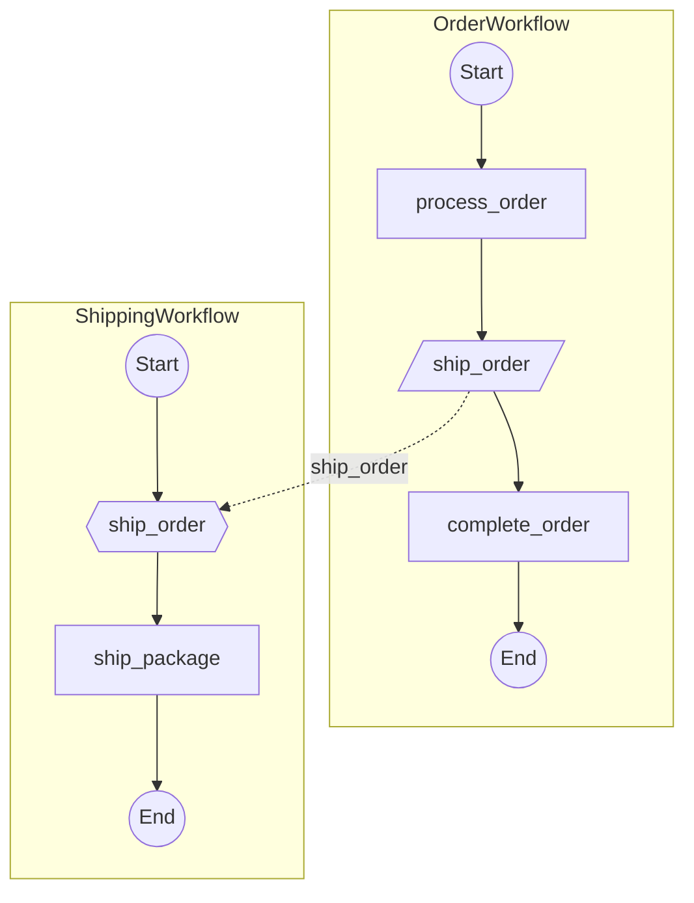

# Epic Technical Specification: Cross-Workflow Signal Visualization

Date: 2025-11-26
Author: Luca
Epic ID: 8
Status: Draft
Depends On: Epic 7 (Peer-to-Peer Workflow Signaling)

---

## Overview

This epic extends the temporalio-graphs library to provide **full cross-workflow signal visualization**, showing both sender and receiver workflows connected together with signal flow clearly visible between them.

Epic 7 implemented detection and visualization of external signals (outgoing signals via `workflow.get_external_workflow_handle().signal()`), but only visualizes the **sender side** - the signal appears as a trapezoid node that "goes nowhere" in the diagram.

Epic 8 completes the picture by:
1. Detecting `@workflow.signal` handlers in receiver workflows
2. Resolving external signals to their target workflows by matching signal names
3. Building connected workflow graphs showing signal flows between workflows
4. Rendering cross-workflow diagrams using Mermaid subgraphs

**Before (Epic 7):** Single workflow view only
```
OrderWorkflow:  Start --> process_order --> [/ship_order/] --> complete_order --> End
                                                   |
                                              (goes nowhere in visualization)
```

**After (Epic 8):** Cross-workflow connected view


This completes the library's signal visualization coverage:
- **Epic 4:** Internal Signals (wait_condition for own state)
- **Epic 7:** Peer-to-Peer Signals sender-side (external signal sends)
- **Epic 8:** Cross-Workflow Signals (connected sender + receiver visualization)

## Objectives and Scope

### In Scope

**Signal Handler Detection (FR82-FR83):**
- Detect `@workflow.signal` decorated methods in workflow classes
- Extract signal name (method name or explicit name from decorator)
- Track source line number for signal handler
- Handle both sync and async signal handlers
- Create `SignalHandler` frozen dataclass with: signal_name, method_name, workflow_class, source_line, node_id
- Add `signal_handlers` field to `WorkflowMetadata`

**Target Workflow Resolution (FR84-FR85):**
- Resolve external signals to target workflows by signal name matching
- Scan configurable search paths for workflow files
- Build index of signal handlers across all discovered workflows
- Support graceful fallback for unresolved signals (warn, render as "unresolved")
- Default search path: same directory as entry workflow

**Cross-Workflow Graph Building (FR86-FR87):**
- Build graph of connected workflows from entry point
- Track signal connections (sender, receiver, signal_name, lines)
- Detect and handle circular signal dependencies (don't re-analyze, but render edges)
- Support configurable max depth for recursive analysis (default: 10)
- Create `SignalConnection` and `PeerSignalGraph` data models

**Cross-Workflow Visualization (FR88-FR89):**
- Render connected workflows as Mermaid subgraphs
- Render signal connections as dashed edges between subgraphs
- Style signal handler nodes as hexagons (consistency with Epic 4)
- Show unresolved signals as dead-ends with "?" node
- Multiple handlers for same signal: show ALL matches with warning

**API and Configuration (FR90):**
- Provide `analyze_signal_flow()` function for cross-workflow analysis
- Extend `GraphBuildingContext` with signal resolution options
- Maintain backward compatibility with existing `analyze_workflow()`
- `analyze_workflow()` also detects signal handlers in metadata (even without resolution)

**Examples & Documentation:**
- Create Order --> Shipping --> Notification signal flow example
- Add cross-workflow section to README with rendered diagram
- Document ADR-013: Cross-Workflow Signal Visualization strategy
- Update CHANGELOG.md for v0.4.0

### Out of Scope

**Deferred to Future:**
- Runtime signal verification (library is static analysis only)
- Signal payload type analysis
- Unified visualization mode (single flat diagram, no subgraphs) - subgraph mode only for MVP
- Sequence diagram output (Mermaid sequence diagram syntax)
- Automatic signal handler discovery in external packages

**Explicit Exclusions:**
- Cross-system signals (signals to non-Temporal services)
- Activity-to-workflow signals (activity code analysis)
- Signal ordering/timing guarantees (runtime property)

## System Architecture Alignment

This epic builds on the established static analysis architecture (ADR-001) using Python AST to detect workflow patterns. It follows the detector pattern established in Epic 3-7.

**Architecture Constraints:**
- **ADR-001 (Static Analysis):** Signal handler detection via AST traversal, no workflow execution
- **ADR-006 (mypy strict):** Complete type hints for all new classes
- **ADR-010 (>=80% coverage):** Unit tests for detector, integration tests for examples
- **Visitor Pattern:** SignalHandlerDetector extends ast.NodeVisitor
- **Immutable Data:** All new dataclasses are frozen
- **Error Handling:** Graceful degradation for unresolved signals

**Component Alignment:**
- **detector.py:** Add `SignalHandlerDetector` class
- **graph_models.py:** Add `SignalHandler`, `SignalConnection`, `PeerSignalGraph` dataclasses
- **analyzer.py:** Integrate SignalHandlerDetector into analysis pipeline
- **resolver.py (NEW):** `SignalNameResolver` for target workflow resolution
- **signal_graph_analyzer.py (NEW):** `PeerSignalGraphAnalyzer` for cross-workflow analysis
- **renderer.py:** Add `render_signal_graph()` method for subgraph rendering
- **context.py:** Add configuration options for signal resolution and visualization

**Design Decisions Confirmed:**
1. **Multiple handlers same signal:** Show ALL matches + warning (user decides intent)
2. **Default visualization mode:** Subgraph mode (clear workflow boundaries)
3. **Signal handler shape:** Hexagon `{{name}}` (consistency with Epic 4 internal signals)
4. **Default search path:** Same directory as entry workflow (intuitive default)
5. **Handler detection in analyze_workflow():** YES - always detect handlers in metadata

## Detailed Design

### Services and Modules

| Module | Responsibility | Inputs | Outputs | Owner |
|--------|----------------|--------|---------|-------|
| **detector.py (SignalHandlerDetector)** | Detect `@workflow.signal` decorated methods in AST | ast.Module (workflow source) | list[SignalHandler] | Story 8.1 |
| **graph_models.py (SignalHandler)** | Store signal handler metadata | signal_name, method_name, workflow_class, source_line, node_id | Frozen dataclass instance | Story 8.2 |
| **graph_models.py (SignalConnection)** | Store signal flow between workflows | sender_workflow, receiver_workflow, signal_name, lines, node_ids | Frozen dataclass instance | Story 8.5 |
| **graph_models.py (PeerSignalGraph)** | Store complete cross-workflow signal graph | root_workflow, workflows, signal_handlers, connections, unresolved_signals | Frozen dataclass instance | Story 8.5 |
| **resolver.py (SignalNameResolver)** | Resolve external signals to target workflows by signal name | search_paths, ExternalSignalCall | list[tuple[Path, SignalHandler]] | Story 8.3-8.4 |
| **signal_graph_analyzer.py (PeerSignalGraphAnalyzer)** | Build cross-workflow graph from entry point | entry_workflow, search_paths, context | PeerSignalGraph | Story 8.6 |
| **analyzer.py (WorkflowAnalyzer)** | Integrate signal handler detection into analysis pipeline | workflow source file | WorkflowMetadata with signal_handlers | Story 8.2 |
| **renderer.py (MermaidRenderer)** | Render cross-workflow graph as Mermaid subgraphs | PeerSignalGraph, context | Mermaid flowchart syntax with subgraphs | Story 8.7-8.8 |
| **context.py (GraphBuildingContext)** | Configure signal resolution and visualization options | User configuration | Immutable context dataclass | Story 8.9 |
| **__init__.py** | Export `analyze_signal_flow()` public function | entry_workflow, search_paths, context | Mermaid diagram string | Story 8.9 |
| **examples/signal_flow/** | Demonstrate Order --> Shipping --> Notification flow | workflow files | Mermaid diagram with subgraphs | Story 8.10 |

### Data Models and Contracts

**SignalHandler Dataclass (graph_models.py):**
```python
@dataclass(frozen=True)
class SignalHandler:
    """Represents a @workflow.signal decorated method.

    Signal handlers receive external signals from other workflows.
    They are the "receive side" of peer-to-peer signal communication.

    Args:
        signal_name: Name of the signal this handler receives.
            Usually matches method name unless explicitly specified
            via @workflow.signal(name="custom").
        method_name: Actual method name in the workflow class.
        workflow_class: Name of the workflow class containing this handler.
        source_line: Line number where the handler is defined.
        node_id: Unique identifier for graph rendering.
            Format: "sig_handler_{signal_name}_{line_number}"

    Example:
        >>> handler = SignalHandler(
        ...     signal_name="ship_order",
        ...     method_name="ship_order",
        ...     workflow_class="ShippingWorkflow",
        ...     source_line=67,
        ...     node_id="sig_handler_ship_order_67"
        ... )
    """
    signal_name: str
    method_name: str
    workflow_class: str
    source_line: int
    node_id: str
```

**SignalConnection Dataclass (graph_models.py):**
```python
@dataclass(frozen=True)
class SignalConnection:
    """Represents a signal flow between two workflows.

    Captures the relationship between an external signal send
    (ExternalSignalCall) and a signal handler (SignalHandler).

    Args:
        sender_workflow: Name of workflow sending the signal.
        receiver_workflow: Name of workflow receiving the signal.
        signal_name: Name of the signal being sent/received.
        sender_line: Line number in sender where signal() is called.
        receiver_line: Line number in receiver where @workflow.signal is.
        sender_node_id: Node ID of the external signal node.
        receiver_node_id: Node ID of the signal handler node.
    """
    sender_workflow: str
    receiver_workflow: str
    signal_name: str
    sender_line: int
    receiver_line: int
    sender_node_id: str
    receiver_node_id: str
```

**PeerSignalGraph Dataclass (graph_models.py):**
```python
@dataclass(frozen=True)
class PeerSignalGraph:
    """Complete graph of workflows connected by peer-to-peer signals.

    The result of cross-workflow signal analysis, containing all
    discovered workflows, their signal handlers, and the connections
    between them.

    Args:
        root_workflow: Entry point workflow for the analysis.
        workflows: All workflows discovered during analysis.
            Maps workflow class name to WorkflowMetadata.
        signal_handlers: All signal handlers discovered.
            Maps signal name to list of handlers (multiple workflows
            may handle the same signal).
        connections: All signal connections between workflows.
        unresolved_signals: External signals where no target was found.
    """
    root_workflow: WorkflowMetadata
    workflows: dict[str, WorkflowMetadata]
    signal_handlers: dict[str, list[SignalHandler]]
    connections: list[SignalConnection]
    unresolved_signals: list[ExternalSignalCall]
```

**WorkflowMetadata Extension (graph_models.py):**
```python
@dataclass(frozen=True)
class WorkflowMetadata:
    # ... existing fields ...
    external_signals: tuple[ExternalSignalCall, ...] = ()  # Epic 7
    signal_handlers: tuple[SignalHandler, ...] = ()  # NEW: Epic 8
```

**GraphBuildingContext Extension (context.py):**
```python
@dataclass(frozen=True)
class GraphBuildingContext:
    # ... existing fields ...

    # Epic 8: Cross-workflow signal options
    resolve_signal_targets: bool = False
    # Enable target workflow resolution during analysis

    signal_target_search_paths: tuple[Path, ...] = ()
    # Directories to search for target workflows.
    # Empty tuple = search in entry workflow's directory only.

    signal_resolution_strategy: Literal["by_name", "explicit", "hybrid"] = "by_name"
    # "by_name": Match external signal to @workflow.signal by signal name
    # "explicit": Use user-provided mapping file (future)
    # "hybrid": by_name with pattern hints for disambiguation (future)

    signal_visualization_mode: Literal["subgraph", "unified"] = "subgraph"
    # "subgraph": Each workflow as Mermaid subgraph (MVP)
    # "unified": Single flat diagram (future)

    signal_max_discovery_depth: int = 10
    # Maximum recursion depth for workflow discovery

    warn_unresolved_signals: bool = True
    # Emit validation warning for unresolved external signals
```

**Entity Relationships:**
```
PeerSignalGraph (1) ──< (n) WorkflowMetadata
PeerSignalGraph (1) ──< (n) SignalConnection
PeerSignalGraph (1) ──< (n) ExternalSignalCall (unresolved)

WorkflowMetadata (1) ──< (n) SignalHandler (handlers in this workflow)
WorkflowMetadata (1) ──< (n) ExternalSignalCall (signals sent from this workflow)

SignalConnection (1) ──< (1) ExternalSignalCall (sender side)
SignalConnection (1) ──< (1) SignalHandler (receiver side)
```

### APIs and Interfaces

**SignalHandlerDetector API (detector.py):**

```python
class SignalHandlerDetector(ast.NodeVisitor):
    """Detects @workflow.signal decorated methods in workflow classes.

    Identifies signal handlers that can receive external signals from
    other workflows. Supports both explicit signal names and method-name
    based signals.

    Patterns detected:
    1. @workflow.signal
       async def ship_order(self, data): ...
       --> signal_name = "ship_order"

    2. @workflow.signal(name="custom_signal")
       async def handler(self, data): ...
       --> signal_name = "custom_signal"
    """

    def __init__(self) -> None:
        """Initialize detector with empty state."""
        self._handlers: list[SignalHandler] = []
        self._workflow_class: str = ""

    def set_workflow_class(self, name: str) -> None:
        """Set workflow class context for handler metadata."""
        self._workflow_class = name

    def visit_AsyncFunctionDef(self, node: ast.AsyncFunctionDef) -> None:
        """Detect @workflow.signal decorated async methods."""
        for decorator in node.decorator_list:
            if self._is_signal_decorator(decorator):
                signal_name = self._extract_signal_name(decorator, node.name)
                handler = SignalHandler(
                    signal_name=signal_name,
                    method_name=node.name,
                    workflow_class=self._workflow_class,
                    source_line=node.lineno,
                    node_id=f"sig_handler_{signal_name}_{node.lineno}",
                )
                self._handlers.append(handler)
        self.generic_visit(node)

    def visit_FunctionDef(self, node: ast.FunctionDef) -> None:
        """Detect @workflow.signal decorated sync methods."""
        # Same logic as AsyncFunctionDef
        for decorator in node.decorator_list:
            if self._is_signal_decorator(decorator):
                signal_name = self._extract_signal_name(decorator, node.name)
                handler = SignalHandler(
                    signal_name=signal_name,
                    method_name=node.name,
                    workflow_class=self._workflow_class,
                    source_line=node.lineno,
                    node_id=f"sig_handler_{signal_name}_{node.lineno}",
                )
                self._handlers.append(handler)
        self.generic_visit(node)

    def _is_signal_decorator(self, decorator: ast.expr) -> bool:
        """Check if decorator is @workflow.signal or @signal."""
        # Handle: @workflow.signal, @workflow.signal(), @workflow.signal(name="...")
        ...

    def _extract_signal_name(self, decorator: ast.expr, method_name: str) -> str:
        """Extract signal name from decorator or fall back to method name."""
        # If @workflow.signal(name="custom"), return "custom"
        # Otherwise return method_name
        ...

    @property
    def handlers(self) -> list[SignalHandler]:
        """Get detected signal handlers."""
        return list(self._handlers)
```

**SignalNameResolver API (resolver.py):**

```python
class SignalNameResolver:
    """Resolves external signals to target workflows by signal name.

    Searches for workflows that have a @workflow.signal handler
    with a name matching the external signal's signal_name.
    """

    def __init__(self, search_paths: list[Path]) -> None:
        """Initialize resolver with search paths.

        Args:
            search_paths: Directories to search for workflow files.
                If empty, no resolution can occur.
        """
        self._search_paths = search_paths
        self._workflow_cache: dict[Path, WorkflowMetadata] = {}
        self._handler_index: dict[str, list[tuple[Path, SignalHandler]]] = {}
        self._index_built = False

    def build_index(self) -> None:
        """Scan search paths and index all signal handlers.

        Builds a map of signal_name -> [(file_path, SignalHandler), ...]
        for efficient lookup during resolution.
        """
        for search_path in self._search_paths:
            for py_file in search_path.glob("**/*.py"):
                try:
                    metadata = self._analyze_file(py_file)
                    if metadata and metadata.signal_handlers:
                        self._workflow_cache[py_file] = metadata
                        for handler in metadata.signal_handlers:
                            if handler.signal_name not in self._handler_index:
                                self._handler_index[handler.signal_name] = []
                            self._handler_index[handler.signal_name].append(
                                (py_file, handler)
                            )
                except Exception:
                    continue  # Skip invalid files
        self._index_built = True

    def resolve(
        self, signal: ExternalSignalCall
    ) -> list[tuple[Path, SignalHandler]]:
        """Find workflows that handle the given signal.

        Args:
            signal: External signal call to resolve.

        Returns:
            List of (file_path, handler) tuples for workflows that
            have a @workflow.signal handler matching signal.signal_name.
            Returns empty list if no handlers found.

        Note:
            Multiple handlers may exist for the same signal name.
            All matches are returned; caller decides how to handle.
        """
        if not self._index_built:
            self.build_index()
        return self._handler_index.get(signal.signal_name, [])

    def _analyze_file(self, file_path: Path) -> WorkflowMetadata | None:
        """Analyze single file for workflow metadata."""
        ...
```

**PeerSignalGraphAnalyzer API (signal_graph_analyzer.py):**

```python
class PeerSignalGraphAnalyzer:
    """Analyzes workflows and builds cross-workflow signal graph.

    Starting from an entry workflow, discovers all connected workflows
    by following external signal --> signal handler connections.

    Example:
        >>> analyzer = PeerSignalGraphAnalyzer(
        ...     search_paths=[Path("./workflows/")],
        ...     max_depth=10,
        ... )
        >>> graph = analyzer.analyze(Path("order_workflow.py"))
        >>> print(graph.workflows.keys())
        ['OrderWorkflow', 'ShippingWorkflow', 'NotificationWorkflow']
    """

    def __init__(
        self,
        search_paths: list[Path],
        resolver: SignalNameResolver | None = None,
        max_depth: int = 10,
        context: GraphBuildingContext | None = None,
    ) -> None:
        """Initialize analyzer.

        Args:
            search_paths: Directories to search for target workflows.
            resolver: Custom resolver instance. If None, creates SignalNameResolver.
            max_depth: Maximum recursion depth for discovery.
            context: Graph building configuration.
        """
        self._search_paths = search_paths
        self._resolver = resolver or SignalNameResolver(search_paths)
        self._max_depth = max_depth
        self._context = context or GraphBuildingContext()

        # Analysis state
        self._visited_workflows: set[str] = set()
        self._workflows: dict[str, WorkflowMetadata] = {}
        self._connections: list[SignalConnection] = []
        self._unresolved: list[ExternalSignalCall] = []

    def analyze(self, entry_workflow: Path) -> PeerSignalGraph:
        """Analyze entry workflow and discover all connected workflows.

        Args:
            entry_workflow: Path to the entry point workflow file.

        Returns:
            PeerSignalGraph containing all discovered workflows,
            their signal handlers, and connections between them.

        Raises:
            WorkflowParseError: If entry_workflow cannot be parsed.
        """
        # Build signal handler index
        self._resolver.build_index()

        # Analyze entry workflow
        root_metadata = self._analyze_workflow(entry_workflow)
        self._workflows[root_metadata.workflow_class] = root_metadata
        self._visited_workflows.add(root_metadata.workflow_class)

        # Recursively discover connected workflows
        self._discover_connections(root_metadata, depth=0)

        # Build handler index from all discovered workflows
        handler_index = self._build_handler_index()

        return PeerSignalGraph(
            root_workflow=root_metadata,
            workflows=self._workflows,
            signal_handlers=handler_index,
            connections=self._connections,
            unresolved_signals=self._unresolved,
        )

    def _discover_connections(
        self,
        metadata: WorkflowMetadata,
        depth: int
    ) -> None:
        """Recursively discover workflows connected by signals."""
        if depth >= self._max_depth:
            logger.warning(f"Max depth {self._max_depth} reached, stopping discovery")
            return

        for external_signal in metadata.external_signals:
            # Find target workflows
            targets = self._resolver.resolve(external_signal)

            if not targets:
                self._unresolved.append(external_signal)
                continue

            for target_path, handler in targets:
                # Analyze target workflow
                target_metadata = self._analyze_workflow(target_path)

                # Check for cycle (already visited)
                if target_metadata.workflow_class not in self._visited_workflows:
                    self._workflows[target_metadata.workflow_class] = target_metadata
                    self._visited_workflows.add(target_metadata.workflow_class)

                    # Recurse into target workflow
                    self._discover_connections(target_metadata, depth + 1)

                # Record connection (even for cycles - shows relationship)
                connection = SignalConnection(
                    sender_workflow=metadata.workflow_class,
                    receiver_workflow=target_metadata.workflow_class,
                    signal_name=external_signal.signal_name,
                    sender_line=external_signal.source_line,
                    receiver_line=handler.source_line,
                    sender_node_id=external_signal.node_id,
                    receiver_node_id=handler.node_id,
                )
                self._connections.append(connection)
```

**Public API (\_\_init\_\_.py):**

```python
def analyze_signal_flow(
    entry_workflow: Path | str,
    search_paths: list[Path | str] | None = None,
    context: GraphBuildingContext | None = None,
) -> str:
    """Analyze workflows and visualize cross-workflow signal connections.

    Starting from an entry workflow, discovers all connected workflows
    by following external signal sends to their signal handlers. Renders
    the complete signal flow graph as a Mermaid diagram with subgraphs.

    Args:
        entry_workflow: Path to the entry point workflow file.
        search_paths: Directories to search for target workflows.
            Defaults to the directory containing entry_workflow.
        context: Configuration options for graph generation.

    Returns:
        Mermaid diagram string showing all connected workflows
        with signal flow edges between them.

    Example:
        >>> result = analyze_signal_flow(
        ...     "workflows/order_workflow.py",
        ...     search_paths=["workflows/", "services/"],
        ... )
        >>> print(result)
        ```mermaid
        flowchart TB
            subgraph OrderWorkflow
                ...
            end
            subgraph ShippingWorkflow
                ...
            end
            ext_sig_ship_order_56 -.ship_order.-> sig_handler_ship_order_67
        ```

    Raises:
        FileNotFoundError: If entry_workflow does not exist.
        WorkflowParseError: If entry_workflow is not a valid workflow.

    Note:
        This function uses subgraph visualization mode. Each workflow
        appears as a separate subgraph with signal connections shown
        as dashed edges between subgraphs.
    """
    entry_path = Path(entry_workflow)
    if not entry_path.exists():
        raise FileNotFoundError(f"Workflow file not found: {entry_path}")

    # Default search paths to entry workflow's directory
    if search_paths is None:
        search_paths = [entry_path.parent]
    else:
        search_paths = [Path(p) for p in search_paths]

    # Create analyzer and analyze
    analyzer = PeerSignalGraphAnalyzer(
        search_paths=search_paths,
        max_depth=context.signal_max_discovery_depth if context else 10,
        context=context,
    )
    graph = analyzer.analyze(entry_path)

    # Render to Mermaid
    renderer = MermaidRenderer(context or GraphBuildingContext())
    return renderer.render_signal_graph(graph)
```

**MermaidRenderer Extension (renderer.py):**

```python
class MermaidRenderer:
    # ... existing methods ...

    def render_signal_graph(
        self,
        graph: PeerSignalGraph,
    ) -> str:
        """Render cross-workflow signal graph as Mermaid with subgraphs.

        Args:
            graph: PeerSignalGraph containing all connected workflows.

        Returns:
            Mermaid flowchart string with subgraphs and cross-subgraph edges.
        """
        lines = ["```mermaid", "flowchart TB"]

        # Render each workflow as a subgraph
        for workflow_name, metadata in graph.workflows.items():
            lines.append(f"    subgraph {workflow_name}")

            # Render workflow internals (activities, decisions, etc.)
            internal_lines = self._render_workflow_internal(metadata)
            for line in internal_lines:
                lines.append(f"        {line}")

            # Render signal handlers as hexagon nodes
            for handler in metadata.signal_handlers:
                lines.append(
                    f"        {handler.node_id}{{{{{handler.signal_name}}}}}"
                )

            lines.append("    end")
            lines.append("")

        # Render cross-subgraph signal connections
        for conn in graph.connections:
            lines.append(
                f"    {conn.sender_node_id} -.{conn.signal_name}.-> {conn.receiver_node_id}"
            )

        # Render unresolved signals with "?" target
        for unresolved in graph.unresolved_signals:
            unknown_id = f"unknown_{unresolved.signal_name}"
            lines.append(
                f"    {unresolved.node_id} -.{unresolved.signal_name}.-> {unknown_id}[/?/]"
            )

        # Styling
        lines.append("")
        lines.append("    %% Signal handler styling (hexagons - blue)")
        for metadata in graph.workflows.values():
            for handler in metadata.signal_handlers:
                lines.append(
                    f"    style {handler.node_id} fill:#e6f3ff,stroke:#0066cc"
                )

        lines.append("```")
        return "\n".join(lines)

    def _render_workflow_internal(
        self,
        metadata: WorkflowMetadata,
    ) -> list[str]:
        """Render workflow internal nodes (activities, decisions, signals)."""
        # Reuse existing path generation and node rendering
        # But output without subgraph wrapper
        ...
```

### Workflows and Sequencing

**Cross-Workflow Signal Analysis Workflow:**

1. **Entry Point** (analyze_signal_flow)
   - Validate entry workflow path exists
   - Default search paths to entry workflow directory if not provided
   - Create PeerSignalGraphAnalyzer instance

2. **Index Building** (SignalNameResolver.build_index)
   - Scan all .py files in search paths
   - Parse each file with AST
   - Run SignalHandlerDetector on each workflow
   - Build index: signal_name --> [(file, handler), ...]

3. **Entry Workflow Analysis** (PeerSignalGraphAnalyzer.analyze)
   - Parse entry workflow AST
   - Run WorkflowAnalyzer to extract metadata (including signal_handlers)
   - Store in workflows dict
   - Mark as visited

4. **Recursive Discovery** (_discover_connections)
   - For each external_signal in workflow.external_signals:
     - Resolve to target handlers via SignalNameResolver
     - If no targets: add to unresolved list
     - If targets found:
       - Analyze target workflow (if not visited)
       - Create SignalConnection for each match
       - Recurse into target workflow (depth check)

5. **Graph Assembly**
   - Collect all discovered workflows
   - Build handler index from discovered workflows
   - Return PeerSignalGraph

6. **Mermaid Rendering** (render_signal_graph)
   - Render each workflow as subgraph
   - Render internal workflow nodes
   - Render signal handlers as hexagons
   - Render cross-subgraph signal edges (dashed)
   - Render unresolved signals as dead-ends
   - Apply color styling

**Sequence Diagram (Text):**

```
User --> analyze_signal_flow(entry_workflow, search_paths)
analyze_signal_flow --> SignalNameResolver.build_index()
    SignalNameResolver --> glob("**/*.py")
    SignalNameResolver --> WorkflowAnalyzer.analyze() for each file
    SignalNameResolver --> SignalHandlerDetector.visit()
    SignalNameResolver --> build handler_index[signal_name] = [(path, handler)]

analyze_signal_flow --> PeerSignalGraphAnalyzer.analyze(entry_workflow)
    PeerSignalGraphAnalyzer --> WorkflowAnalyzer.analyze(entry_workflow)
    PeerSignalGraphAnalyzer --> _discover_connections(metadata, depth=0)
        for external_signal in metadata.external_signals:
            PeerSignalGraphAnalyzer --> SignalNameResolver.resolve(signal)
            if targets:
                for (path, handler) in targets:
                    PeerSignalGraphAnalyzer --> WorkflowAnalyzer.analyze(path)
                    PeerSignalGraphAnalyzer --> SignalConnection(...)
                    PeerSignalGraphAnalyzer --> _discover_connections(target, depth+1)
            else:
                PeerSignalGraphAnalyzer --> unresolved.append(signal)
    PeerSignalGraphAnalyzer --> return PeerSignalGraph

analyze_signal_flow --> MermaidRenderer.render_signal_graph(graph)
    MermaidRenderer --> render subgraphs for each workflow
    MermaidRenderer --> render signal connections
    MermaidRenderer --> apply styling
    MermaidRenderer --> return mermaid_string
```

**Data Flow:**

```
entry_workflow.py (source file)
    |
    v
search_paths (directories)
    |
    v [glob + analyze]
handler_index: {signal_name: [(path, SignalHandler), ...]}
    |
    v [recursive discovery]
PeerSignalGraph:
    - workflows: {name: WorkflowMetadata}
    - connections: [SignalConnection, ...]
    - unresolved_signals: [ExternalSignalCall, ...]
    |
    v [render_signal_graph]
Mermaid diagram with subgraphs
```

## Non-Functional Requirements

### Performance

**NFR-PERF-1: Signal Handler Detection Speed**
- Target: <1ms per workflow for signal handler detection (AST traversal)
- Rationale: Same O(n) traversal as existing detectors

**NFR-PERF-2: Target Resolution Speed**
- Target: <100ms for indexing 100 workflow files
- Target: <5ms per signal resolution (hash map lookup)
- Rationale: Index built once, reused for all resolutions

**NFR-PERF-3: Total Analysis Time**
- Target: <5s for graphs with 20 connected workflows
- Rationale: NFR-PERF-1 from PRD, extended for multi-workflow

**NFR-PERF-4: Memory Efficiency**
- SignalHandler: ~200 bytes per instance
- PeerSignalGraph: <1MB for 20 workflows with 50 connections
- No path explosion: Signal handlers don't create branching

### Security

**NFR-SEC-1: Static Analysis Only**
- No workflow execution (consistent with ADR-001)
- No network calls to discover workflows
- Path traversal prevented: Uses existing pathlib.resolve()

**NFR-SEC-2: Safe File Discovery**
- Only scan directories in explicit search_paths
- Skip files that fail to parse (don't crash)
- No arbitrary code execution (AST inspection only)

### Reliability/Availability

**NFR-REL-1: Detection Accuracy**
- 100% accuracy for @workflow.signal decorated methods
- 100% accuracy for explicit name: @workflow.signal(name="custom")
- 100% resolution for matching signal names

**NFR-REL-2: Graceful Degradation**
- Unresolved signals: Add to list, render as "?" node, continue
- Parse errors: Skip file, log warning, continue
- Max depth reached: Log warning, stop recursion, return partial graph
- Circular signals: Detect cycle, record connection, don't re-analyze

**NFR-REL-3: Backward Compatibility**
- Existing analyze_workflow() unchanged
- New signal_handlers field in WorkflowMetadata has empty tuple default
- All Epic 1-7 tests continue passing

### Observability

**NFR-OBS-1: Debug Logging**
- Log each discovered workflow: "Discovered workflow '{name}' at {path}"
- Log each signal handler: "Found @workflow.signal handler '{name}' at line {line}"
- Log each connection: "Resolved signal '{name}': {sender} --> {receiver}"
- Log unresolved signals: "Could not resolve signal '{name}' - no matching handler found"

**NFR-OBS-2: Validation Warnings**
- Warn for unresolved signals: "External signal '{name}' has no handler in search paths"
- Warn for multiple handlers: "Signal '{name}' handled by multiple workflows: {list}"
- Include in ValidationReport if context.include_validation_report = True

## Dependencies and Integrations

### External Dependencies

**Core (Production):**
- `temporalio>=1.7.1` (existing dependency, no changes)

**Development:**
- Same as Epic 7 (pytest, mypy, ruff, pytest-cov)

**No New Dependencies Required.**

### Internal Dependencies

**Module Dependencies:**
- `detector.py (SignalHandlerDetector)` depends on:
  - `ast` (stdlib)
  - `_internal/graph_models.py` (SignalHandler)

- `resolver.py (SignalNameResolver)` depends on:
  - `pathlib` (stdlib)
  - `analyzer.py` (WorkflowAnalyzer)
  - `_internal/graph_models.py` (SignalHandler, WorkflowMetadata)

- `signal_graph_analyzer.py (PeerSignalGraphAnalyzer)` depends on:
  - `resolver.py` (SignalNameResolver)
  - `analyzer.py` (WorkflowAnalyzer)
  - `_internal/graph_models.py` (PeerSignalGraph, SignalConnection)
  - `context.py` (GraphBuildingContext)

- `renderer.py (MermaidRenderer)` depends on:
  - `_internal/graph_models.py` (PeerSignalGraph)
  - `context.py` (GraphBuildingContext)

**Story Dependencies (Sequential):**
- Story 8.1 (SignalHandlerDetector) --> Story 8.2 (SignalHandler data model)
- Story 8.2 --> Story 8.3 (SignalNameResolver)
- Story 8.3 --> Story 8.4 (Search path scanning)
- Story 8.4 --> Story 8.5 (SignalConnection + PeerSignalGraph models)
- Story 8.5 --> Story 8.6 (PeerSignalGraphAnalyzer)
- Story 8.6 --> Story 8.7 (Subgraph rendering)
- Story 8.7 --> Story 8.8 (Cross-subgraph edges)
- Story 8.8 --> Story 8.9 (Public API + context extensions)
- Story 8.9 --> Story 8.10 (Integration tests)
- Story 8.10 --> Story 8.11 (Documentation)

## Acceptance Criteria (Authoritative)

**AC1: Signal Handler Detection (FR82)**
- GIVEN a workflow with `@workflow.signal` decorated method
- WHEN SignalHandlerDetector analyzes the AST
- THEN detector identifies the signal handler
- AND extracts signal name (method name or explicit name="...")
- AND creates SignalHandler with correct metadata

**AC2: Explicit Signal Name**
- GIVEN code: `@workflow.signal(name="custom_name") async def handler(self):`
- WHEN detector analyzes AST
- THEN signal_name = "custom_name" (not method name)

**AC3: Method Name as Signal Name**
- GIVEN code: `@workflow.signal async def ship_order(self):`
- WHEN detector analyzes AST
- THEN signal_name = "ship_order" (method name)

**AC4: Sync Signal Handler**
- GIVEN code: `@workflow.signal def ship_order(self):` (sync, not async)
- WHEN detector analyzes AST
- THEN handler detected correctly

**AC5: SignalHandler Data Model (FR83)**
- GIVEN SignalHandler dataclass
- THEN dataclass is frozen (immutable)
- AND has fields: signal_name, method_name, workflow_class, source_line, node_id
- AND node_id format is "sig_handler_{signal_name}_{line_number}"
- AND has complete type hints (mypy strict compliant)

**AC6: WorkflowMetadata Extension**
- GIVEN WorkflowMetadata dataclass
- THEN includes signal_handlers: tuple[SignalHandler, ...] field
- AND default value is empty tuple ()
- AND `analyze_workflow()` populates signal_handlers (even without cross-workflow resolution)

**AC7: Signal Name Resolution (FR84)**
- GIVEN external signal with signal_name = "ship_order"
- AND search path contains workflow with @workflow.signal ship_order handler
- WHEN SignalNameResolver.resolve() called
- THEN returns list containing (path, handler) for matching workflow

**AC8: Multiple Handlers Same Signal**
- GIVEN two workflows both have @workflow.signal ship_order handler
- WHEN resolver resolves signal with name "ship_order"
- THEN returns BOTH handlers in list
- AND validation warning emitted: "Signal 'ship_order' handled by multiple workflows"

**AC9: No Handler Found**
- GIVEN external signal with signal_name = "unknown_signal"
- AND no workflow has @workflow.signal unknown_signal handler
- WHEN resolver resolves signal
- THEN returns empty list
- AND signal added to unresolved_signals in PeerSignalGraph

**AC10: Search Path Scanning (FR85)**
- GIVEN search_paths = ["/workflows", "/services"]
- WHEN SignalNameResolver.build_index() called
- THEN scans all .py files in both directories recursively
- AND builds index of signal handlers

**AC11: Default Search Path**
- GIVEN analyze_signal_flow(entry_workflow) called with NO search_paths
- THEN search_paths defaults to [entry_workflow.parent]

**AC12: PeerSignalGraph Model (FR86)**
- GIVEN PeerSignalGraphAnalyzer completes analysis
- THEN PeerSignalGraph contains:
  - root_workflow: WorkflowMetadata for entry workflow
  - workflows: dict of all discovered workflows
  - signal_handlers: dict mapping signal_name to list of handlers
  - connections: list of SignalConnection
  - unresolved_signals: list of ExternalSignalCall

**AC13: SignalConnection Model**
- GIVEN connection between OrderWorkflow and ShippingWorkflow
- THEN SignalConnection has:
  - sender_workflow = "OrderWorkflow"
  - receiver_workflow = "ShippingWorkflow"
  - signal_name = "ship_order"
  - sender_line, receiver_line = line numbers
  - sender_node_id, receiver_node_id = node IDs

**AC14: Recursive Discovery (FR87)**
- GIVEN OrderWorkflow signals ShippingWorkflow signals NotificationWorkflow
- WHEN analyze_signal_flow("order_workflow.py") called
- THEN all three workflows discovered
- AND two connections created (Order->Shipping, Shipping->Notification)

**AC15: Cycle Detection**
- GIVEN WorkflowA signals WorkflowB signals WorkflowA (cycle)
- WHEN analyzer discovers cycle
- THEN connection A->B->A recorded
- AND WorkflowA NOT re-analyzed (visited check)
- AND no infinite loop

**AC16: Max Depth Limit**
- GIVEN signal_max_discovery_depth = 2
- AND chain: A -> B -> C -> D
- WHEN analyzer runs
- THEN stops at depth 2 (A, B, C discovered; D not analyzed)
- AND warning logged: "Max depth 2 reached, stopping discovery"

**AC17: Subgraph Rendering (FR88)**
- GIVEN PeerSignalGraph with OrderWorkflow and ShippingWorkflow
- WHEN MermaidRenderer.render_signal_graph() called
- THEN output contains:
  - `subgraph OrderWorkflow` with internal nodes
  - `subgraph ShippingWorkflow` with internal nodes
  - `end` for each subgraph

**AC18: Signal Handler Hexagon Shape**
- GIVEN signal handler for "ship_order"
- WHEN rendering handler node
- THEN renders as hexagon: `sig_handler_ship_order_67{{ship_order}}`

**AC19: Cross-Subgraph Signal Edge (FR89)**
- GIVEN SignalConnection from OrderWorkflow to ShippingWorkflow
- WHEN rendering connections
- THEN renders dashed edge: `ext_sig_ship_order_56 -.ship_order.-> sig_handler_ship_order_67`

**AC20: Signal Handler Styling**
- GIVEN signal handler nodes
- WHEN applying styling
- THEN handler nodes have blue color: `style sig_handler_ship_order_67 fill:#e6f3ff,stroke:#0066cc`

**AC21: Unresolved Signal Rendering**
- GIVEN external signal with no handler found
- WHEN rendering unresolved signals
- THEN renders dead-end: `ext_sig_unknown_42 -.unknown.-> unknown_unknown[/?/]`

**AC22: Public API analyze_signal_flow (FR90)**
- GIVEN analyze_signal_flow() function
- THEN accepts: entry_workflow (Path|str), search_paths (optional), context (optional)
- AND returns Mermaid diagram string
- AND raises FileNotFoundError if entry_workflow missing
- AND raises WorkflowParseError if not valid workflow

**AC23: Context Extensions**
- GIVEN GraphBuildingContext
- THEN includes new fields:
  - resolve_signal_targets: bool = False
  - signal_target_search_paths: tuple[Path, ...] = ()
  - signal_resolution_strategy: Literal["by_name", "explicit", "hybrid"] = "by_name"
  - signal_visualization_mode: Literal["subgraph", "unified"] = "subgraph"
  - signal_max_discovery_depth: int = 10
  - warn_unresolved_signals: bool = True

**AC24: Example Workflows**
- GIVEN examples/signal_flow/ directory
- THEN includes:
  - order_workflow.py (sends ship_order signal)
  - shipping_workflow.py (handles ship_order, sends notify_shipped)
  - notification_workflow.py (handles notify_shipped)
  - run.py demonstrating analyze_signal_flow()
  - expected_output.md with golden Mermaid diagram

**AC25: Integration Test**
- GIVEN tests/integration/test_signal_flow.py
- WHEN test runs analyze_signal_flow("order_workflow.py")
- THEN output contains all three subgraphs
- AND output contains two signal connections
- AND output is valid Mermaid syntax
- AND output matches expected_output.md structure

**AC26: No Regression**
- GIVEN existing Epic 1-7 tests (547+ tests)
- WHEN Epic 8 implementation complete
- THEN all existing tests continue passing
- AND test coverage remains >=80%
- AND mypy strict mode passes
- AND ruff linting passes

## Traceability Mapping

| AC | FR | Spec Section | Component | Test |
|----|----|--------------|-----------| -----|
| AC1 | FR82 | APIs and Interfaces --> SignalHandlerDetector | detector.py | test_detector.py::test_detect_signal_handler |
| AC2 | FR82 | APIs and Interfaces --> _extract_signal_name | detector.py | test_detector.py::test_explicit_signal_name |
| AC3 | FR82 | APIs and Interfaces --> _extract_signal_name | detector.py | test_detector.py::test_method_name_as_signal |
| AC4 | FR82 | APIs and Interfaces --> visit_FunctionDef | detector.py | test_detector.py::test_sync_signal_handler |
| AC5 | FR83 | Data Models --> SignalHandler | graph_models.py | test_graph_models.py::test_signal_handler |
| AC6 | FR83 | Data Models --> WorkflowMetadata | graph_models.py, analyzer.py | test_analyzer.py::test_metadata_with_handlers |
| AC7 | FR84 | APIs and Interfaces --> SignalNameResolver | resolver.py | test_resolver.py::test_resolve_signal |
| AC8 | FR84 | APIs and Interfaces --> SignalNameResolver | resolver.py | test_resolver.py::test_multiple_handlers |
| AC9 | FR84 | APIs and Interfaces --> SignalNameResolver | resolver.py | test_resolver.py::test_no_handler_found |
| AC10 | FR85 | APIs and Interfaces --> build_index | resolver.py | test_resolver.py::test_build_index |
| AC11 | FR85 | APIs and Interfaces --> analyze_signal_flow | __init__.py | test_api.py::test_default_search_path |
| AC12 | FR86 | Data Models --> PeerSignalGraph | graph_models.py | test_graph_models.py::test_peer_signal_graph |
| AC13 | FR86 | Data Models --> SignalConnection | graph_models.py | test_graph_models.py::test_signal_connection |
| AC14 | FR87 | APIs and Interfaces --> _discover_connections | signal_graph_analyzer.py | test_analyzer.py::test_recursive_discovery |
| AC15 | FR87 | APIs and Interfaces --> _discover_connections | signal_graph_analyzer.py | test_analyzer.py::test_cycle_detection |
| AC16 | FR87 | APIs and Interfaces --> _discover_connections | signal_graph_analyzer.py | test_analyzer.py::test_max_depth |
| AC17 | FR88 | APIs and Interfaces --> render_signal_graph | renderer.py | test_renderer.py::test_subgraph_rendering |
| AC18 | FR88 | APIs and Interfaces --> render_signal_graph | renderer.py | test_renderer.py::test_handler_hexagon_shape |
| AC19 | FR89 | APIs and Interfaces --> render_signal_graph | renderer.py | test_renderer.py::test_cross_subgraph_edge |
| AC20 | FR88 | APIs and Interfaces --> render_signal_graph | renderer.py | test_renderer.py::test_handler_styling |
| AC21 | FR88 | APIs and Interfaces --> render_signal_graph | renderer.py | test_renderer.py::test_unresolved_signal |
| AC22 | FR90 | APIs and Interfaces --> analyze_signal_flow | __init__.py | test_api.py::test_analyze_signal_flow |
| AC23 | FR90 | Data Models --> GraphBuildingContext | context.py | test_context.py::test_signal_flow_options |
| AC24 | All | Examples & Documentation | examples/signal_flow/ | integration/test_signal_flow.py |
| AC25 | All | Examples & Documentation | integration test | integration/test_signal_flow.py |
| AC26 | All | Non-Functional Requirements | All components | pytest (full suite) |

## Risks, Assumptions, Open Questions

### Risks

**RISK-1: Search Path Performance**
- **Risk:** Large codebases with thousands of .py files may slow index building
- **Impact:** Analysis startup time could exceed 5s target
- **Mitigation:** Lazy indexing, caching, parallel file scanning
- **Likelihood:** Medium (enterprise projects)
- **Severity:** Medium (affects UX, not correctness)

**RISK-2: Signal Name Collision**
- **Risk:** Multiple unrelated workflows use same signal name (e.g., "notify")
- **Impact:** False positive connections in graph
- **Mitigation:** Show all matches + warning; user can filter search_paths
- **Likelihood:** Medium
- **Severity:** Low (visible in diagram, user can adjust)

**RISK-3: Complex Subgraph Rendering**
- **Risk:** 20+ workflow subgraph diagram becomes unreadable
- **Impact:** Poor visualization for large systems
- **Mitigation:** Future: collapsed mode, zoom, filtering. MVP: user limits search_paths
- **Likelihood:** Low (most signal flows have 2-5 workflows)
- **Severity:** Medium (visualization quality)

### Assumptions

**ASSUMP-1: Signal Names Match**
- Assumes external signal's signal_name matches @workflow.signal method/name exactly
- Based on: Temporal signal naming convention (sender and receiver must agree)
- Validation: Document in README; mismatch = unresolved signal

**ASSUMP-2: Workflows in Search Paths**
- Assumes target workflows are in user-provided search_paths
- Based on: User controls their codebase layout
- Impact if invalid: Signals show as unresolved (graceful degradation)

**ASSUMP-3: One Signal Handler Per Workflow**
- Assumes most workflows have one handler per signal name
- Based on: Common Temporal patterns
- Impact if invalid: Multiple handlers per workflow supported, shown correctly

### Open Questions

All open questions from design notes have been resolved:

**Q1: Multiple Handlers Same Signal** - RESOLVED
- Decision: Show ALL matches + warning (user decides intent)

**Q2: Default Visualization Mode** - RESOLVED
- Decision: Subgraph mode (clear workflow boundaries)

**Q3: Signal Handler Shape** - RESOLVED
- Decision: Hexagon `{{name}}` (consistency with Epic 4)

**Q4: Default Search Path** - RESOLVED
- Decision: Same directory as entry workflow

**Q5: Handler Detection in analyze_workflow()** - RESOLVED
- Decision: YES - always detect handlers in WorkflowMetadata

## Test Strategy Summary

### Unit Tests

**SignalHandlerDetector Tests (~80 lines):**
- `test_detect_signal_handler_async()` - async method detection
- `test_detect_signal_handler_sync()` - sync method detection
- `test_explicit_signal_name()` - @workflow.signal(name="custom")
- `test_method_name_as_signal()` - @workflow.signal (no explicit name)
- `test_multiple_handlers_same_workflow()` - workflow with multiple handlers
- **Coverage Target:** 100%

**SignalNameResolver Tests (~100 lines):**
- `test_build_index()` - scan search paths
- `test_resolve_single_handler()` - one match
- `test_resolve_multiple_handlers()` - multiple matches
- `test_resolve_no_handler()` - no match
- `test_empty_search_paths()` - edge case
- **Coverage Target:** 100%

**PeerSignalGraphAnalyzer Tests (~150 lines):**
- `test_analyze_single_workflow()` - no external signals
- `test_analyze_connected_workflows()` - two connected workflows
- `test_recursive_discovery()` - chain A->B->C
- `test_cycle_detection()` - A->B->A cycle
- `test_max_depth_limit()` - stop at max_depth
- `test_unresolved_signals()` - no handler found
- **Coverage Target:** 100%

**Renderer Tests (~100 lines):**
- `test_render_subgraph()` - single workflow subgraph
- `test_render_multiple_subgraphs()` - multiple workflows
- `test_render_signal_handler_hexagon()` - hexagon shape
- `test_render_cross_subgraph_edge()` - dashed connection
- `test_render_handler_styling()` - blue color
- `test_render_unresolved()` - ? node
- **Coverage Target:** 100%

### Integration Tests

**End-to-End Integration (~150 lines):**
- `test_analyze_signal_flow_order_shipping()` - two workflow flow
- `test_analyze_signal_flow_three_workflows()` - three workflow chain
- `test_example_matches_expected_output()` - golden file comparison
- `test_valid_mermaid_syntax()` - syntax validation

### Regression Tests

- Run full test suite: `pytest -v` (expect 547+ tests passing)
- Coverage: `pytest --cov=src/temporalio_graphs --cov-fail-under=80`
- Type check: `mypy src/`
- Lint: `ruff check src/`

## Story Breakdown

| Story | Title | Description | Dependencies |
|-------|-------|-------------|--------------|
| 8.1 | Signal Handler Detector | Create SignalHandlerDetector to detect @workflow.signal methods | - |
| 8.2 | Signal Handler Data Model | Create SignalHandler dataclass, extend WorkflowMetadata | 8.1 |
| 8.3 | Signal Name Resolver | Create resolver to find workflows by signal handler name | 8.2 |
| 8.4 | Search Path Scanning | Implement directory scanning and handler indexing | 8.3 |
| 8.5 | Signal Connection Model | Create SignalConnection and PeerSignalGraph data models | 8.4 |
| 8.6 | Peer Signal Graph Analyzer | Build cross-workflow graph with cycle detection | 8.5 |
| 8.7 | Subgraph Rendering | Extend MermaidRenderer for subgraph mode | 8.6 |
| 8.8 | Cross-Subgraph Edges | Render signal connections between subgraphs | 8.7 |
| 8.9 | Public API | Create analyze_signal_flow() and context extensions | 8.8 |
| 8.10 | Integration Tests | End-to-end tests with Order->Shipping->Notification example | 8.9 |
| 8.11 | Documentation | README, examples, ADR-013, CHANGELOG | 8.10 |

---

**Tech Spec Status:** Draft - Ready for Story Breakdown
**Epic 8 Version:** v0.4.0
**Story Count:** 11 stories (8.1 through 8.11)
**Estimated Complexity:** ~37 hours total (based on design notes)

---

_Generated using BMM Tech-Spec Workflow_
_Date: 2025-11-26_
_For: temporalio-graphs-python-port - Luca_
