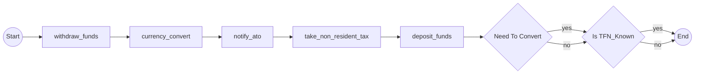
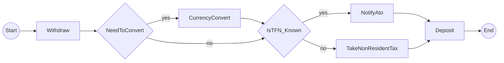

# Sprint Change Proposal - CRITICAL-1: Graph Structure Generation Issue

**Date:** 2025-11-19
**Project:** temporalio-graphs-python-port
**Trigger:** Story 3-5 Code Review
**Scope Classification:** MINOR - Direct Implementation
**Estimated Impact:** 3-4 hours
**Status:** APPROVED

**Status Update (2025-11-19):** Path ordering defect resolved. `PathPermutationGenerator` now interleaves activities, decisions, signals, and child workflows by source line number. This document is retained for historical context.

---

## Executive Summary

**The Issue:**
PathPermutationGenerator creates **sequential linear graphs** instead of **branching decision-tree graphs**. All activities render before decision nodes, producing topology that does not represent actual workflow control flow.

**Business Impact:**
- Violates FR52 (feature parity with .NET reference implementation)
- Violates FR55 (Mermaid output quality requirements)
- Story 3-5 blocked from approval
- Epic 3 cannot be marked complete

**Recommended Action:**
**Direct Adjustment** - Implement Hybrid Solution (2-3 hours development + 1 hour testing/validation)

**Outcome:**
- Achieves .NET feature parity (FR52, FR55 satisfied)
- Epic 3 completes successfully
- Solid foundation for Epic 4 (Signal nodes)
- No PRD changes, no scope reduction, no timeline delays

---

## 1. Issue Summary

### Problem Statement

The PathPermutationGenerator builds paths by **sequentially adding all activities followed by all decisions**, creating linear topology that violates the requirement to show branching decision-tree structure where decisions appear at their actual positions in control flow.

### Discovery Context

Discovered during Story 3-5 Senior Developer code review when comparing Python output against .NET reference implementation (`Temporalio.Graphs/README.md:77-79`). Review identified structural mismatch between Python's sequential chains and .NET's branching decision trees.

### Evidence

**Current Python Output (WRONG):**


**Expected .NET Reference (CORRECT):**


**Root Cause:** `src/temporalio_graphs/generator.py:280-288`
```python
# WRONG: Adds ALL activities sequentially first
for activity_name in activities:
    path.add_activity(activity_name)

# WRONG: Then adds decisions after all activities
for decision, value in zip(decisions, decision_values):
    path.add_decision(decision.id, value, decision.name)
```

---

## 2. Impact Analysis

### Epic Impact Assessment

**Epic 3: Decision Node Support**
- Status: IN PROGRESS (Story 3-5 blocked)
- Can Complete: **YES** - with targeted fix to integration logic
- Stories 3.1-3.4: Technically complete, need minor enhancements (line number tracking)
- Story 3-5: Requires implementation fix + test updates
- **No scope change needed** - implementation approach needs correction

**Epic 4: Signal & Wait Condition Support**
- Status: BACKLOG
- Impact: **DEPENDS ON Epic 3 architecture**
- If Epic 3 fixed properly → Epic 4 inherits correct decision-tree pattern
- If Epic 3 NOT fixed → Epic 4 inherits same topology flaw

**Epic 5: Production Readiness**
- Status: BACKLOG
- Impact: **MINIMAL** - focuses on validation/errors/docs, unaffected by topology fix

**Conclusion:** No epic resequencing needed. Epic 3 completes after fix, Epic 4/5 proceed as planned.

### Artifact Conflict Analysis

**PRD (docs/prd.md):** ✅ **NO CHANGES NEEDED**
- FR52 and FR55 requirements are correct and clear
- MVP scope is appropriate
- Issue is implementation bug, not requirement misunderstanding

**Architecture (docs/architecture.md):** ⚠️ **MINOR CLARIFICATIONS**
- Add emphasis on position tracking in PathPermutationGenerator section
- Update data flow diagram to show position-based node merging
- Document lesson learned about sequential vs interleaved processing

**Epic 3 Tech Spec (docs/sprint-artifacts/tech-spec-epic-3.md):** 📝 **LESSONS LEARNED**
- Add note about importance of AST position tracking
- Document that separate list processing creates wrong topology
- Recommend merged-and-sorted approach for similar patterns

**Story 3-5:** 🔧 **IMPLEMENTATION FIX**
- Modify PathPermutationGenerator (sort by line number)
- Enhance DecisionDetector (capture line numbers)
- Update DecisionPoint dataclass (add line_num field)
- Regenerate golden file
- Add topology validation tests

**Test Artifacts:** 🧪 **UPDATES REQUIRED**
- Golden file regeneration (examples/money_transfer/expected_output.md)
- New topology tests (edge sequence validation)
- Existing tests continue to pass

---

## 3. Recommended Approach

### Selected Path: **Direct Adjustment (Hybrid Solution)**

**Implementation Strategy:**

**Phase 1: Code Enhancements** (2-3 hours)

1. **Update `src/temporalio_graphs/_internal/graph_models.py`:**
   ```python
   @dataclass
   class DecisionPoint:
       decision_id: str
       name: str
       line_number: int  # EXISTING - for error reporting
       line_num: int     # ADD THIS - for sorting with activities
       true_label: str = "yes"
       false_label: str = "no"
   ```

2. **Update `src/temporalio_graphs/detector.py`:**
   ```python
   def visit_Call(self, node: ast.Call) -> None:
       if self._is_to_decision_call(node):
           decision_name = self._extract_decision_name(node)
           decision_id = self._generate_decision_id(decision_name, node.lineno)
           self.decision_points.append(DecisionPoint(
               decision_id=decision_id,
               name=decision_name,
               line_number=node.lineno,
               line_num=node.lineno  # ADD THIS
           ))
   ```

3. **Update `src/temporalio_graphs/generator.py`:**
   ```python
   def generate_paths(self, metadata, context):
       decisions = metadata.decision_points
       activities = metadata.activities  # Assume has line_num too

       # CREATE merged execution order list
       execution_order = []
       for activity in activities:
           execution_order.append(('activity', activity, activity.line_num))
       for decision in decisions:
           execution_order.append(('decision', decision, decision.line_num))

       # SORT by line number (execution order)
       execution_order.sort(key=lambda x: x[2])

       # GENERATE paths in correct order
       for permutation in self._get_permutations(decisions):
           path = GraphPath()
           for node_type, node, _ in execution_order:
               if node_type == 'activity':
                   path.add_activity(node.name)
               elif node_type == 'decision':
                   value = permutation[node.decision_id]
                   path.add_decision(node.decision_id, value, node.name)
           paths.append(path)
   ```

**Phase 2: Test Updates** (30 minutes)

4. **Regenerate golden file:**
   - Run `analyze_workflow("examples/money_transfer/workflow.py")`
   - Save correct output to `examples/money_transfer/expected_output.md`

5. **Add topology validation tests:**
   ```python
   def test_money_transfer_graph_topology(self):
       """Verify graph structure matches .NET reference topology."""
       result = analyze_workflow("examples/money_transfer/workflow.py")
       mermaid = _extract_mermaid_content(result)

       # Verify first decision comes AFTER first activity
       assert "withdraw_funds] --> d0{Need To Convert}" in mermaid

       # Verify conditional activities only on correct branches
       # (Would FAIL with current implementation)
   ```

**Phase 3: Validation** (30 minutes)

6. Run full test suite (pytest)
7. Execute code review workflow
8. Update sprint-status.yaml (Story 3-5: in-progress → done)

**Total Effort:** 3-4 hours

### Rationale for This Approach

✅ **Efficiency:** 2-3 hours vs 8-12 hours for rollback or full redesign
✅ **Code Preservation:** Stories 3.1-3.4 components work correctly, no redo needed
✅ **Clear Solution:** CRITICAL-1 document provides detailed implementation guide
✅ **Low Risk:** Changes isolated to 3 files, well-understood scope
✅ **Team Momentum:** Quick fix allows Epic 3 completion without demoralization
✅ **Business Value:** Achieves .NET feature parity (FR52) as promised
✅ **Solid Foundation:** Epic 4 (signals) will inherit correct pattern

### Alternatives Considered (and Rejected)

❌ **Option 2: Rollback Stories 3.1-3.4**
- Effort: HIGH (8-12 hours to redo working code)
- Risk: HIGH (lose correctly working components)
- Justification: None - components work, only assembly order is wrong

❌ **Option 3: PRD MVP Review / Scope Reduction**
- Effort: HIGH (redefine MVP, update PRD, cascade changes)
- Risk: HIGH (fail stakeholder expectations, lose feature parity)
- Justification: None - MVP is right-sized, just needs implementation fix

❌ **Full Redesign (Solution 1 from CRITICAL-1)**
- Effort: MEDIUM-HIGH (4-6 hours for control flow tree architecture)
- Benefit: More comprehensive, better long-term architecture
- Verdict: Defer to post-MVP - hybrid solution is sufficient for MVP

---

## 4. Detailed Change Proposals

### File: `src/temporalio_graphs/_internal/graph_models.py`

**Section:** DecisionPoint dataclass
**Change:** Add `line_num` field

**OLD:**
```python
@dataclass
class DecisionPoint:
    decision_id: str
    name: str
    line_number: int
    true_label: str = "yes"
    false_label: str = "no"
```

**NEW:**
```python
@dataclass
class DecisionPoint:
    decision_id: str
    name: str
    line_number: int  # For error reporting
    line_num: int     # For sorting with activities (execution order)
    true_label: str = "yes"
    false_label: str = "no"
```

**Rationale:** Separate field for sorting allows clean integration with activity position tracking

---

### File: `src/temporalio_graphs/detector.py`

**Section:** DecisionDetector.visit_Call()
**Change:** Capture line_num when creating DecisionPoint

**OLD:**
```python
self.decision_points.append(DecisionPoint(
    decision_id=decision_id,
    name=decision_name,
    line_number=node.lineno
))
```

**NEW:**
```python
self.decision_points.append(DecisionPoint(
    decision_id=decision_id,
    name=decision_name,
    line_number=node.lineno,
    line_num=node.lineno  # ADD for execution order sorting
))
```

**Rationale:** Provides position information for correct interleaving with activities

---

### File: `src/temporalio_graphs/generator.py`

**Section:** PathPermutationGenerator.generate_paths()
**Change:** Merge and sort by line number before building paths

**OLD (lines 280-288):**
```python
# WRONG: Sequential processing
for activity_name in activities:
    path.add_activity(activity_name)

for decision, value in zip(decisions, decision_values):
    path.add_decision(decision.id, value, decision.name)
```

**NEW:**
```python
# Merge activities and decisions with positions
execution_order = []
for activity in activities:
    execution_order.append(('activity', activity, activity.line_num))
for decision in decisions:
    execution_order.append(('decision', decision, decision.line_num))

# Sort by line number (execution order)
execution_order.sort(key=lambda x: x[2])

# Generate paths in correct interleaved order
for decision_values in permutations:
    path = GraphPath()
    for node_type, node, _ in execution_order:
        if node_type == 'activity':
            path.add_activity(node.name)
        elif node_type == 'decision':
            value = decision_values[decision.decision_id]
            path.add_decision(decision.decision_id, value, decision.name)
```

**Rationale:** Sorting ensures decisions appear at their ACTUAL positions in control flow, creating correct branching topology

---

### File: `examples/money_transfer/expected_output.md`

**Change:** Regenerate entire file with correct graph structure

**Action:** After code fix, run `analyze_workflow()` and save output
**Validation:** Compare against .NET reference (Temporalio.Graphs/README.md:77-79)

---

### File: `tests/integration/test_money_transfer.py`

**Change:** Add topology validation tests

**NEW TEST:**
```python
def test_money_transfer_graph_topology(self):
    """Verify graph structure matches .NET reference topology."""
    result = analyze_workflow("examples/money_transfer/workflow.py")
    mermaid = _extract_mermaid_content(result)

    # Verify first decision comes after first activity
    assert "withdraw_funds] --> d0{Need To Convert}" in mermaid

    # Verify conditional activities only on correct branches
    lines = mermaid.split('\n')
    # Additional edge sequence validation...
```

**Rationale:** Prevents regression - validates structure not just node existence

---

## 5. Implementation Handoff

### Scope Classification

**MINOR** - Direct implementation by development team

### Handoff Recipients and Responsibilities

**Development Team (Primary Executor):**
- Implement code fixes (3 files: graph_models.py, detector.py, generator.py)
- Update DecisionPoint dataclass (+1 field)
- Enhance DecisionDetector (capture line_num)
- Redesign PathPermutationGenerator path building logic
- Add topology validation tests
- Regenerate golden file
- Run full test suite (284 tests must pass)
- Execute code review workflow
- Validate .NET feature parity

**Scrum Master (Story Tracking - Optional):**
- Update sprint-status.yaml (Story 3-5: in-progress → done)
- Mark Epic 3 as "complete" when Story 3-5 passes review
- No backlog reorganization required

**Product Manager (FYI Only):**
- Informed of fix completion
- Validates FR52 and FR55 satisfaction
- No PRD changes required

### Deliverables

1. ✅ Fixed code (3 modified source files)
2. ✅ Regenerated golden file (expected_output.md)
3. ✅ Enhanced test suite (topology validation tests)
4. ✅ Passing tests (100% success rate, 284/284)
5. ✅ Code review approval
6. ✅ Updated sprint status (Story 3-5 → done, Epic 3 → complete)

### Success Criteria

- MoneyTransfer output matches .NET reference topology (branching decision tree)
- All 284 tests pass including new topology tests
- Code review approval obtained (Senior Developer agent)
- Story 3-5 marked "done" in sprint-status.yaml
- Epic 3 marked "complete"
- FR52 and FR55 satisfied (verified by PM)

### Timeline

- **Code fixes:** 2-3 hours
- **Test updates:** 30 minutes
- **Validation:** 30 minutes
- **Total:** 3-4 hours

---

## 6. PRD MVP Impact

**Impact:** ✅ **NONE** - MVP remains 100% achievable and unchanged

Epic 3 (Decision Node Support) is part of MVP. Fixing this architectural bug completes Epic 3, which completes the MVP decision visualization capability.

**No scope reduction required.**
**No timeline impact beyond 3-4 hours.**
**No requirement changes.**

MVP deliverables remain:
- ✅ Core graph generation (Epic 2 - DONE)
- 🔧 Decision node support (Epic 3 - fixing now)
- 📅 Signal/wait support (Epic 4 - planned)
- 📅 Production readiness (Epic 5 - planned)

---

## Change Navigation Checklist - COMPLETED

✅ **Section 1: Trigger and Context**
- Triggering story: Story 3-5 (MoneyTransfer integration)
- Problem type: Failed approach (graph construction logic)
- Evidence: CRITICAL-1 doc, .NET reference, code review findings

✅ **Section 2: Epic Impact**
- Current epic: Fixable with targeted changes
- Future epics: Epic 4 depends on fix, Epic 5 unaffected
- No epic resequencing needed

✅ **Section 3: Artifact Conflicts**
- PRD: No changes
- Architecture: Minor clarifications
- Tech Spec: Lessons learned additions

✅ **Section 4: Path Forward**
- Option 1 (Direct Adjustment): **RECOMMENDED** ✓
- Option 2 (Rollback): Rejected
- Option 3 (MVP Review): Rejected

✅ **Section 5: Proposal Components**
- Issue summary: Complete
- Impact analysis: Complete
- Recommended approach: Complete
- Action plan: Complete
- Handoff plan: Complete

✅ **Section 6: Final Review**
- Checklist complete: Yes
- Proposal accurate: Yes
- User approval: APPROVED

---

## Approval

**Approved by:** Luca
**Date:** 2025-11-19
**Approval Type:** Continue with implementation

---

**Generated with BMAD Correct Course Workflow v1.0**
**Product Manager:** John
**Project:** temporalio-graphs-python-port
