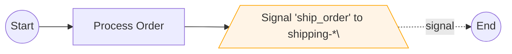

# temporalio-graphs-python-port - Technical Specification
## Epic 7: Peer-to-Peer Workflow Signaling Visualization

**Author:** Luca
**Date:** 2025-11-20
**Project Level:** Extension (v0.3.0)
**Change Type:** Feature Addition - Cross-Workflow Signal Detection
**Development Context:** Brownfield (building on v0.1.1 production codebase)

---

## Context

### Available Documents

**Loaded Context:**
- ✅ PRD (prd.md) - 73 functional requirements, extensible architecture
- ✅ Architecture (architecture.md) - Static analysis approach, ADR-001 to ADR-011
- ✅ Epics (epics.md) - Epic 1-6 complete (v0.1.0 Core MVP + v0.2.0 MVP Extension)
- ✅ Existing Codebase - Production-ready v0.1.1 with Epics 1-5 delivered

### Project Stack

**Runtime & Dependencies:**
- Python 3.10+ (3.11+ recommended)
- temporalio SDK >=1.7.1
- uv package manager (per user requirement)
- Build: hatchling with src/ layout

**Development Tools:**
- pytest >=8.0.0 (>=80% coverage requirement)
- mypy >=1.8.0 (strict mode)
- ruff >=0.2.0 (linting + formatting)
- pytest-asyncio >=0.23.0

### Existing Codebase Structure

**Production-Ready Foundation (v0.1.1):**

```
src/temporalio_graphs/
├── __init__.py              # Public API: analyze_workflow, analyze_workflow_graph
├── analyzer.py              # WorkflowAnalyzer (AST parsing)
├── context.py               # GraphBuildingContext configuration
├── detector.py              # DecisionDetector, SignalDetector, ChildWorkflowDetector  ✅ Existing
├── generator.py             # PathPermutationGenerator
├── renderer.py              # MermaidRenderer
├── path.py                  # GraphPath data model
├── helpers.py               # to_decision(), wait_condition()
├── validator.py             # ValidationWarning, ValidationReport
├── exceptions.py            # Error handling hierarchy
└── _internal/
    └── graph_models.py      # DecisionPoint, SignalPoint, ChildWorkflowCall ✅ Existing
```

**Key Existing Capabilities:**
- ✅ Epic 1-5: Core graph generation, decisions, internal signals, production hardening
- ✅ Epic 6: Parent-child workflow visualization (`execute_child_workflow()`)
- ✅ DecisionDetector, SignalDetector, ChildWorkflowDetector patterns established in `detector.py`
- ✅ AST visitor pattern, path permutation, Mermaid rendering pipeline

---

## The Change

### Problem Statement

**Current Limitation:**
The library successfully visualizes three workflow interaction patterns:
1. ✅ Sequential activities within workflows (Epic 2)
2. ✅ Internal signals via `wait_condition()` - workflow waits for own state changes (Epic 4)
3. ✅ Parent-child orchestration via `execute_child_workflow()` - synchronous spawning (Epic 6)

**What's Missing:**
**Peer-to-peer workflow signaling** - when Workflow A sends an external signal to Workflow B that's already running independently. This is a common Temporal pattern for:
- Asynchronous workflow coordination (Order workflow signals Shipping workflow)
- Event-driven architectures (Payment workflow notifies Fulfillment workflow)
- Saga patterns with compensation signals
- Multi-tenant workflows communicating across instances

**Real-World Example:**
```python
# Order Workflow (Workflow A)
@workflow.defn
class OrderWorkflow:
    @workflow.run
    async def run(self, order_id: str) -> str:
        await workflow.execute_activity(process_order, ...)

        # 🎯 PEER-TO-PEER SIGNAL: Send external signal to Shipping workflow
        shipping_handle = workflow.get_external_workflow_handle(f"shipping-{order_id}")
        await shipping_handle.signal("ship_order", order_id)

        return "complete"

# Shipping Workflow (Workflow B)
@workflow.defn
class ShippingWorkflow:
    @workflow.run
    async def run(self, shipping_id: str) -> str:
        # Wait for ship_order signal from Order workflow
        await workflow.wait_condition(lambda: self.should_ship)
        await workflow.execute_activity(ship_package, ...)
        return "shipped"

    @workflow.signal  # 🎯 SIGNAL RECEIVER
    async def ship_order(self, order_id: str) -> None:
        self.should_ship = True
```

**Current Visualization Gap:**
- Static analysis doesn't detect `get_external_workflow_handle()` calls
- Signal sends (`.signal()` on external handles) are invisible in graphs
- No cross-workflow signal edges showing A → signal → B relationships
- Users cannot see complete system-level workflow communication patterns

### Proposed Solution

**Add Peer-to-Peer Signal Detection to Static Analysis:**

1. **Detect Signal Sends:**
   - Identify `workflow.get_external_workflow_handle(workflow_id)` calls
   - Detect `.signal(signal_name, payload)` calls on external handles
   - Extract signal names, target workflow patterns (if deterministic)
   - Record source line numbers for error reporting

2. **Detect Signal Receives:**
   - Scan for `@workflow.signal` decorated methods (signal handlers)
   - Extract signal names from decorator or method name
   - Cross-reference with signal sends to identify peer relationships

3. **Visualize Cross-Workflow Signals:**
   - Render external signal sends as special nodes in Mermaid (e.g., trapezoid shape)
   - Create dashed edges showing signal flow between workflows (A --signal--> B)
   - Support three visualization modes:
     - **Reference Mode (default):** Signal nodes show "Signal to WorkflowX"
     - **Inline Mode:** Expand target workflow inline (if file available)
     - **System Diagram Mode:** Generate multi-workflow diagram showing all peer relationships

4. **API Extension:**
   - New function: `analyze_workflow_system(workflow_paths, entry_workflow)` for system-wide analysis
   - Extend `GraphBuildingContext` with `peer_signal_visualization` mode
   - New data model: `ExternalSignalCall` in `graph_models.py`

**Key Innovation:**
Unlike parent-child (deterministic call graph), peer-to-peer signals often have **runtime-determined targets**. We'll use:
- **Pattern matching:** Detect common patterns like `f"workflow-{id}"` to infer relationships
- **Configuration:** Allow users to specify signal mappings `{signal_name: [source_workflow, target_workflow]}`
- **Best-effort visualization:** Show what we CAN determine statically, warn about dynamic targets

### Scope

**In Scope:**

1. ✅ Detect `workflow.get_external_workflow_handle()` calls in workflow source
2. ✅ Detect `.signal()` method calls on external workflow handles
3. ✅ Extract signal names from `.signal(signal_name, ...)` arguments
4. ✅ Detect `@workflow.signal` decorated methods (signal receivers)
5. ✅ Create `ExternalSignalDetector` class extending AST visitor pattern
6. ✅ Add `ExternalSignalCall` data model to `graph_models.py`
7. ✅ Render external signal nodes in Mermaid with distinct shape (trapezoid `/\\`)
8. ✅ Generate cross-workflow signal edges (dashed lines for async communication)
9. ✅ Support reference mode visualization (show signal sends, don't expand targets)
10. ✅ Extend public API with system-level analysis function
11. ✅ Add integration example: Order ↔ Shipping workflow peer signaling
12. ✅ Documentation updates explaining peer-to-peer vs parent-child vs internal signals

**Out of Scope (Future Enhancements):**

1. ❌ Runtime workflow ID resolution (dynamic IDs determined at execution time)
2. ❌ Signal payload schema analysis or validation
3. ❌ Signal ordering or temporal dependencies (which signals fire when)
4. ❌ Bidirectional signal flows (workflow A and B both signal each other)
5. ❌ Signal buffering or queueing semantics
6. ❌ Integration with Temporal server to discover actual workflow instances
7. ❌ Interactive visualization (clickable signal nodes to navigate workflows)
8. ❌ Inline expansion mode (defer to post-MVP)
9. ❌ System diagram mode (defer to post-MVP)

---

## Implementation Details

### Source Tree Changes

**Files to CREATE:**
- None (all changes extend existing modules)

**Files to MODIFY:**

1. **`src/temporalio_graphs/detector.py`** (ADD ExternalSignalDetector)
   - Line ~756 (after ChildWorkflowDetector): Add new `ExternalSignalDetector` class
   - Extends `ast.NodeVisitor` following established pattern
   - Methods: `visit_Call()`, `_is_get_external_workflow_handle()`, `_is_external_signal_call()`, `_extract_signal_name()`, `_extract_target_workflow()`, `_generate_signal_id()`
   - Detects two-step pattern: (1) get handle, (2) call .signal() on handle
   - ~200 lines of code

2. **`src/temporalio_graphs/_internal/graph_models.py`** (ADD ExternalSignalCall)
   - Add `ExternalSignalCall` dataclass after `ChildWorkflowCall`
   - Fields: signal_name, target_workflow_pattern, source_line, node_id, source_workflow
   - ~30 lines of code

3. **`src/temporalio_graphs/analyzer.py`** (MODIFY WorkflowAnalyzer)
   - Import and instantiate `ExternalSignalDetector`
   - Add `external_signals` to WorkflowMetadata
   - Run detector alongside DecisionDetector, SignalDetector, ChildWorkflowDetector
   - ~10 lines of code

4. **`src/temporalio_graphs/renderer.py`** (MODIFY MermaidRenderer)
   - Add NodeType.EXTERNAL_SIGNAL handling
   - Render trapezoid shape: `node_id[/Signal Name\\]`
   - Add dashed edge style for signal edges: `node1 -.signal.-> node2`
   - ~30 lines of code

5. **`src/temporalio_graphs/context.py`** (MODIFY GraphBuildingContext)
   - Add `external_signal_label_style: Literal["name-only", "target-pattern"] = "name-only"`
   - Add `show_external_signals: bool = True` (toggle peer signals on/off)
   - ~5 lines of code

6. **`tests/test_detector.py`** (ADD TestExternalSignalDetector)
   - Unit tests for ExternalSignalDetector class
   - Test cases: single signal, multiple signals, nested signals, signal in conditional
   - ~150 lines of code

7. **`tests/integration/test_peer_signals.py`** (CREATE integration test)
   - End-to-end test with Order ↔ Shipping workflow example
   - Validate signal detection, Mermaid rendering, edge generation
   - ~100 lines of code

8. **`examples/peer_signal_workflow/`** (CREATE example directory)
   - `order_workflow.py` - Order workflow sends signal
   - `shipping_workflow.py` - Shipping workflow receives signal
   - `run.py` - Example runner
   - `expected_output.md` - Golden Mermaid diagram
   - ~200 lines of code total

9. **`docs/architecture.md`** (ADD ADR-012)
   - Document peer-to-peer signal detection design decision
   - Explain runtime ID limitation and best-effort approach
   - ~100 lines of markdown

10. **`README.md`** (UPDATE examples section)
    - Add peer-to-peer signaling example
    - Explain three signal patterns (internal, parent-child, peer-to-peer)
    - ~50 lines of markdown

### Technical Approach

**Static Analysis Strategy:**

Since workflow IDs are often runtime values (e.g., `f"shipping-{order_id}"`), we use **best-effort pattern matching**:

1. **Direct String Literals (Easy):**
   ```python
   handle = workflow.get_external_workflow_handle("shipping-workflow-123")
   await handle.signal("ship", data)
   # ✅ Can detect: signal="ship", target="shipping-workflow-123"
   ```

2. **Format Strings (Pattern Matching):**
   ```python
   handle = workflow.get_external_workflow_handle(f"shipping-{order_id}")
   await handle.signal("ship", data)
   # ✅ Can detect: signal="ship", target_pattern=f"shipping-{*}"
   # Show in graph: "Signal 'ship' to shipping-* workflow"
   ```

3. **Variable References (Limited):**
   ```python
   workflow_id = get_shipping_id()  # Dynamic
   handle = workflow.get_external_workflow_handle(workflow_id)
   await handle.signal("ship", data)
   # ⚠️ Fallback: signal="ship", target="<dynamic>"
   # Show in graph: "Signal 'ship' to external workflow"
   ```

**AST Detection Pattern:**

```python
class ExternalSignalDetector(ast.NodeVisitor):
    def __init__(self):
        self._external_signals: list[ExternalSignalCall] = []
        self._handle_assignments: dict[str, str] = {}  # var_name -> workflow_id_pattern

    def visit_Assign(self, node: ast.Assign) -> None:
        """Track handle = get_external_workflow_handle(...) assignments."""
        if self._is_get_external_workflow_handle_call(node.value):
            var_name = node.targets[0].id  # e.g., "shipping_handle"
            target_pattern = self._extract_workflow_id_pattern(node.value.args[0])
            self._handle_assignments[var_name] = target_pattern

    def visit_Await(self, node: ast.Await) -> None:
        """Detect await handle.signal(...) calls."""
        if isinstance(node.value, ast.Call):
            if self._is_external_signal_call(node.value):
                signal_name = self._extract_signal_name(node.value)
                handle_var = node.value.func.value.id  # e.g., "shipping_handle"
                target_pattern = self._handle_assignments.get(handle_var, "<dynamic>")

                self._external_signals.append(ExternalSignalCall(
                    signal_name=signal_name,
                    target_workflow_pattern=target_pattern,
                    source_line=node.lineno,
                    node_id=self._generate_signal_id(signal_name, node.lineno),
                    source_workflow=self._source_workflow
                ))
```

**Mermaid Rendering:**

External signal nodes use **trapezoid shape** (distinct from internal hexagons and child workflow subroutines):



- **Shape:** Trapezoid `/\ ... /\` for signal send nodes
- **Edge:** Dashed `-.->` for asynchronous signal flow
- **Color:** Orange/amber tint to distinguish from activities (blue) and decisions (yellow)

### Existing Patterns to Follow

**AST Visitor Pattern (from DecisionDetector, SignalDetector, ChildWorkflowDetector):**
- Extend `ast.NodeVisitor`
- Implement `visit_Call()`, `visit_Assign()` methods
- Use helper methods prefixed with `_` for internal logic
- Extract metadata into dataclass models (e.g., `ExternalSignalCall`)
- Log debug messages for detected patterns
- Raise `WorkflowParseError` for invalid patterns with actionable suggestions

**Error Handling Pattern:**
- Clear exception messages with file path, line number, error description
- Include "Suggestion:" text explaining how to fix
- Example:
  ```python
  raise WorkflowParseError(
      file_path=file_path,
      line=node.lineno,
      message="signal() requires at least 1 argument (signal name)",
      suggestion="Use: handle.signal('signal_name', payload)"
  )
  ```

**Testing Pattern:**
- Unit tests in `tests/test_detector.py` for `ExternalSignalDetector` class
- Integration tests in `tests/integration/` for end-to-end workflow analysis
- Test fixtures in `tests/fixtures/sample_workflows/`
- Golden file comparisons for Mermaid output regression tests

**Code Style:**
- Type hints on all functions (mypy strict compliance)
- Google-style docstrings for public methods
- Snake_case function names, PascalCase class names
- 100-character line length (ruff configuration)

### Integration Points

**Internal Module Integration:**

1. **`analyzer.py` → `detector.py`:**
   - `WorkflowAnalyzer` instantiates `ExternalSignalDetector`
   - Runs detector.visit(tree) alongside existing detectors
   - Collects external_signals list into `WorkflowMetadata`

2. **`detector.py` → `graph_models.py`:**
   - `ExternalSignalDetector` creates `ExternalSignalCall` dataclass instances
   - Stored in list, returned via `external_signals` property

3. **`generator.py` → `graph_models.py`:**
   - `PathPermutationGenerator` receives `ExternalSignalCall` objects
   - Adds external signal nodes to path generation (treated like activities)
   - No branching (signals are one-way sends, not decisions)

4. **`renderer.py` → `graph_models.py`:**
   - `MermaidRenderer` handles `NodeType.EXTERNAL_SIGNAL` in `to_mermaid()`
   - Renders trapezoid shape with signal name
   - Generates dashed edges for signal flow

**External API Integration:**

No external APIs required. Fully self-contained static analysis.

---

## Development Context

### Relevant Existing Code

**Key Reference Points:**

1. **`src/temporalio_graphs/detector.py:313-560` (SignalDetector class):**
   - Template for ExternalSignalDetector structure
   - Shows AST visitor pattern for detecting function calls
   - Demonstrates signal name extraction and metadata storage

2. **`src/temporalio_graphs/detector.py:562-756` (ChildWorkflowDetector class):**
   - Pattern for detecting external workflow calls (`execute_child_workflow`)
   - Similar to external signal detection (both involve external workflows)
   - Shows handle vs string literal workflow reference patterns

3. **`src/temporalio_graphs/_internal/graph_models.py` (ChildWorkflowCall dataclass):**
   - Template for `ExternalSignalCall` dataclass structure
   - Fields: workflow_name, call_site_line, call_id, parent_workflow

4. **`src/temporalio_graphs/renderer.py` (MermaidRenderer.to_mermaid):**
   - Shows how to add new NodeType cases
   - Pattern: `if node_type == NodeType.X: return f"{id}[shape syntax]"`

### Framework/Libraries

**Core Dependencies (from pyproject.toml):**
- temporalio SDK >=1.7.1 (workflow decorators, types)
- Python ast module (built-in, no version constraint)

**Development Dependencies:**
- pytest >=8.0.0 (test framework, >=80% coverage requirement)
- pytest-asyncio >=0.23.0 (async test support)
- pytest-cov >=4.1.0 (coverage measurement)
- mypy >=1.8.0 (strict mode type checking)
- ruff >=0.2.0 (linting + formatting)

### Internal Dependencies

**Import Structure:**

```python
# In detector.py (ExternalSignalDetector)
import ast
import logging
from pathlib import Path
from temporalio_graphs._internal.graph_models import ExternalSignalCall
from temporalio_graphs.exceptions import WorkflowParseError

# In graph_models.py (ExternalSignalCall)
from dataclasses import dataclass
from pathlib import Path

# In analyzer.py (integrate detector)
from temporalio_graphs.detector import ExternalSignalDetector

# In renderer.py (render signal nodes)
from temporalio_graphs._internal.graph_models import NodeType, ExternalSignalCall
```

### Configuration Changes

**GraphBuildingContext Updates:**

```python
# In context.py
@dataclass(frozen=True)
class GraphBuildingContext:
    # ... existing fields ...

    # New fields for Epic 7:
    show_external_signals: bool = True
    external_signal_label_style: Literal["name-only", "target-pattern"] = "name-only"
    external_signal_edge_style: str = "dashed"  # "dashed" or "dotted"
```

**No changes to:**
- pyproject.toml dependencies (no new external libs)
- .python-version file
- build configuration

---

## Implementation Stack

**Language & Runtime:**
- Python 3.10.0+ (minimum)
- Python 3.11+ (recommended for performance)
- Type hints: PEP 484/585/604 syntax
- Dataclasses: PEP 557 (frozen=True for immutability)

**Core Analysis:**
- Python ast module (built-in, static code analysis)
- temporalio SDK >=1.7.1 (workflow type definitions only, no execution)

**Development & Quality:**
- uv (package manager, venv, builds) - per user requirement
- pytest >=8.0.0 + pytest-asyncio >=0.23.0 (testing)
- pytest-cov >=4.1.0 (>=80% coverage enforcement)
- mypy >=1.8.0 strict mode (100% type hint coverage)
- ruff >=0.2.0 (unified linting + formatting)

**Build & Distribution:**
- hatchling (build backend, zero-config src/ layout support)
- PyPI registry (package name: temporalio-graphs)
- Semantic versioning: v0.3.0 for Epic 7 (new feature)

---

## Technical Details

### AST Node Patterns to Detect

**Pattern 1: Direct External Signal (Two-Step)**
```python
# Step 1: Get external workflow handle
handle = workflow.get_external_workflow_handle("shipping-123")
# Step 2: Send signal
await handle.signal("ship_order", payload)

# AST Structure:
# Assign(
#   targets=[Name(id='handle')],
#   value=Call(
#     func=Attribute(value=Name(id='workflow'), attr='get_external_workflow_handle'),
#     args=[Constant(value="shipping-123")]
#   )
# )
# Await(
#   value=Call(
#     func=Attribute(value=Name(id='handle'), attr='signal'),
#     args=[Constant(value="ship_order"), ...]
#   )
# )
```

**Pattern 2: Inline External Signal (Single Expression)**
```python
# Inline: Get handle and signal in one expression
await workflow.get_external_workflow_handle("shipping-123").signal("ship_order", data)

# AST Structure:
# Await(
#   value=Call(
#     func=Attribute(
#       value=Call(func=Attribute(attr='get_external_workflow_handle'), ...),
#       attr='signal'
#     ),
#     args=[Constant(value="ship_order"), ...]
#   )
# )
```

**Pattern 3: Format String Target (Pattern Matching)**
```python
# Dynamic workflow ID with pattern
handle = workflow.get_external_workflow_handle(f"shipping-{order_id}")
await handle.signal("ship_order", payload)

# AST Structure:
# args=[JoinedStr(values=[Constant("shipping-"), FormattedValue(value=Name(id='order_id'))])]
# Extract pattern: "shipping-{*}"
```

**Pattern 4: Signal Receiver Detection**
```python
# Detect @workflow.signal decorated methods
@workflow.signal
async def ship_order(self, order_id: str) -> None:
    self.should_ship = True

# AST Structure:
# FunctionDef(
#   name='ship_order',
#   decorator_list=[Attribute(value=Name(id='workflow'), attr='signal')]
# )
```

### Data Structures

**New Dataclass:**

```python
@dataclass(frozen=True)
class ExternalSignalCall:
    """Represents an external signal send detected in workflow source.

    Attributes:
        signal_name: Name of the signal being sent (e.g., "ship_order")
        target_workflow_pattern: Target workflow ID or pattern (e.g., "shipping-123" or "shipping-{*}")
        source_line: Line number where signal send occurs
        node_id: Unique identifier for this signal node (e.g., "ext_sig_ship_order_42")
        source_workflow: Name of the workflow sending the signal
    """
    signal_name: str
    target_workflow_pattern: str  # "workflow-id", "pattern-{*}", or "<dynamic>"
    source_line: int
    node_id: str
    source_workflow: str
```

**Enhanced Enum:**

```python
class NodeType(Enum):
    START = "start"
    END = "end"
    ACTIVITY = "activity"
    DECISION = "decision"
    SIGNAL = "signal"  # Internal wait_condition
    CHILD_WORKFLOW = "child_workflow"
    EXTERNAL_SIGNAL = "external_signal"  # NEW for Epic 7
```

### Algorithm: External Signal Detection

**Pseudo-Code:**

```
ExternalSignalDetector:
    handle_assignments = {}  # var_name -> (target_pattern, line)
    external_signals = []

    On visit_Assign(node):
        IF node.value is get_external_workflow_handle(...):
            var_name = node.targets[0].id
            target_pattern = extract_workflow_id_pattern(node.value.args[0])
            handle_assignments[var_name] = (target_pattern, node.lineno)

    On visit_Await(node):
        IF node.value is Call to .signal():
            handle_var = node.value.func.value.id
            signal_name = node.value.args[0].value  # String constant

            IF handle_var in handle_assignments:
                target_pattern, _ = handle_assignments[handle_var]
            ELSE:
                target_pattern = "<dynamic>"

            external_signals.append(ExternalSignalCall(
                signal_name=signal_name,
                target_workflow_pattern=target_pattern,
                source_line=node.lineno,
                node_id=f"ext_sig_{signal_name}_{node.lineno}",
                source_workflow=current_workflow_name
            ))

    extract_workflow_id_pattern(arg_node):
        IF arg_node is Constant(value=string):
            RETURN string  # Direct literal: "shipping-123"
        ELSE IF arg_node is JoinedStr (f-string):
            RETURN infer_pattern(arg_node)  # "shipping-{*}"
        ELSE:
            RETURN "<dynamic>"  # Variable reference
```

### Edge Cases & Error Handling

**Edge Case 1: Signal Without Handle Assignment**
```python
# Inline signal call - no intermediate handle variable
await workflow.get_external_workflow_handle("target").signal("sig", data)
# ✅ Handle via visit_Await detection of chained call
```

**Edge Case 2: Dynamic Workflow ID**
```python
# Runtime-determined workflow ID
workflow_id = compute_id()  # Function call
handle = workflow.get_external_workflow_handle(workflow_id)
# ⚠️ Show as: "Signal to <dynamic> workflow" with warning
logger.warning(f"External signal at line {lineno} has dynamic target (cannot determine statically)")
```

**Edge Case 3: Conditional Signal**
```python
if should_notify:
    await handle.signal("notify", data)
# ✅ Detect signal inside If block (no branching in graph - signal is not a decision)
```

**Edge Case 4: Multiple Signals to Same Target**
```python
handle = workflow.get_external_workflow_handle("target")
await handle.signal("start", data)
await handle.signal("update", more_data)
# ✅ Detect both signals, create two separate signal nodes
```

**Error Scenario: Invalid Signal Call**
```python
await handle.signal()  # Missing signal name
# ❌ Raise WorkflowParseError:
#     "signal() requires at least 1 argument (signal name)"
#     Suggestion: "Use: handle.signal('signal_name', payload)"
```

---

## Development Setup

**Prerequisites:**
- Python 3.10+ installed (3.11+ recommended)
- uv package manager: `curl -LsSf https://astral.sh/uv/install.sh | sh`
- Git for version control

**Setup Commands:**

```bash
# 1. Navigate to project (already exists)
cd /Users/luca/dev/bounty

# 2. Sync dependencies (uv reads pyproject.toml)
uv sync

# 3. Activate virtual environment
source .venv/bin/activate

# 4. Verify installation
uv run python -c "import temporalio_graphs; print('Ready for Epic 7')"

# 5. Run existing tests (ensure baseline passes)
uv run pytest

# 6. Run type checking (ensure strict mode passes)
uv run mypy src/

# 7. Run linting (ensure clean baseline)
uv run ruff check src/
```

**Development Workflow:**

```bash
# Make code changes for Story 7.X...

# Run tests with coverage
uv run pytest --cov=src/temporalio_graphs --cov-report=term-missing

# Run type checker
uv run mypy src/temporalio_graphs/detector.py

# Run linter and formatter
uv run ruff check src/
uv run ruff format src/

# Run integration tests
uv run pytest tests/integration/test_peer_signals.py -v

# Commit changes
git add src/temporalio_graphs/detector.py tests/test_detector.py
git commit -m "feat(epic-7): add ExternalSignalDetector for peer-to-peer signals"
```

---

## Implementation Guide

### Setup Steps

**Pre-Implementation Checklist:**

1. ✅ Verify Epic 1-6 are complete and tests pass (baseline validation)
2. ✅ Read existing `detector.py` to understand SignalDetector, ChildWorkflowDetector patterns
3. ✅ Review `graph_models.py` dataclass structures (DecisionPoint, SignalPoint, ChildWorkflowCall)
4. ✅ Study Mermaid trapezoid syntax: `/\ shape /\` for signal nodes
5. ✅ Understand AST visitor pattern: `visit_Assign()`, `visit_Await()`, `visit_FunctionDef()`

### Implementation Steps

**Story 7.1: Implement ExternalSignalDetector (AST Detection)**
- Create `ExternalSignalDetector` class in `detector.py` (after line 756)
- Implement `visit_Assign()` to track `get_external_workflow_handle()` calls
- Implement `visit_Await()` to detect `.signal()` calls on handles
- Add helper methods: `_is_get_external_workflow_handle()`, `_is_external_signal_call()`, `_extract_signal_name()`, `_extract_workflow_id_pattern()`
- Write unit tests in `tests/test_detector.py`
- Acceptance: 100% coverage for ExternalSignalDetector, all tests pass

**Story 7.2: Create ExternalSignalCall Data Model**
- Add `ExternalSignalCall` dataclass to `graph_models.py`
- Add `NodeType.EXTERNAL_SIGNAL` enum value
- Update `WorkflowMetadata` to include `external_signals: list[ExternalSignalCall]`
- Write unit tests for data model
- Acceptance: Type-safe dataclass, mypy strict passes

**Story 7.3: Integrate Detector into Analysis Pipeline**
- Modify `WorkflowAnalyzer` in `analyzer.py` to instantiate `ExternalSignalDetector`
- Run detector.visit(tree) alongside existing detectors
- Collect external_signals into `WorkflowMetadata`
- Write integration test validating end-to-end detection
- Acceptance: External signals appear in WorkflowMetadata, integration test passes

**Story 7.4: Implement Mermaid Rendering for External Signals**
- Extend `MermaidRenderer` in `renderer.py` to handle `NodeType.EXTERNAL_SIGNAL`
- Render trapezoid shape: `node_id[/Signal 'name' to target\\]`
- Generate dashed edges: `source_node -.signal.-> signal_node`
- Add orange/amber color styling
- Write unit tests comparing Mermaid output
- Acceptance: Valid Mermaid syntax, renders in Mermaid Live Editor

**Story 7.5: Add Peer Signal Workflow Example & Documentation**
- Create `examples/peer_signal_workflow/` directory
- Write `order_workflow.py` (sends signal to Shipping)
- Write `shipping_workflow.py` (receives ship_order signal)
- Write `run.py` example runner
- Create `expected_output.md` golden Mermaid diagram
- Write integration test `tests/integration/test_peer_signals.py`
- Update README.md with peer-to-peer signaling section
- Add ADR-012 to architecture.md documenting design
- Acceptance: Example works end-to-end, documentation complete

### Testing Strategy

**Unit Tests (tests/test_detector.py):**
- Test ExternalSignalDetector with single external signal
- Test multiple external signals in sequence
- Test conditional external signal (inside if block)
- Test format string workflow ID pattern extraction
- Test dynamic workflow ID fallback (`<dynamic>`)
- Test invalid signal call error handling
- Coverage target: 100% for ExternalSignalDetector

**Integration Tests (tests/integration/test_peer_signals.py):**
- Test Order → Shipping workflow peer signaling
- Validate signal node appears in Mermaid output
- Validate dashed edge connects workflows
- Validate target pattern appears in signal label
- Compare output against golden file
- Coverage target: End-to-end pipeline validated

**Regression Tests:**
- Ensure existing tests (Epics 1-6) still pass after changes
- No regressions in WorkflowAnalyzer, PathPermutationGenerator, MermaidRenderer
- Golden file comparisons for MoneyTransfer, SignalWorkflow examples unchanged

### Acceptance Criteria

**Story 7.1 Acceptance:**
- ExternalSignalDetector class exists and extends ast.NodeVisitor
- Detects `get_external_workflow_handle()` and `.signal()` calls
- Extracts signal names and target workflow patterns correctly
- Unit tests achieve 100% coverage
- All tests pass with no regressions

**Story 7.2 Acceptance:**
- ExternalSignalCall dataclass created with all required fields
- NodeType.EXTERNAL_SIGNAL enum value added
- WorkflowMetadata includes external_signals list
- Type checking passes (mypy strict)
- Data model tests pass

**Story 7.3 Acceptance:**
- WorkflowAnalyzer instantiates ExternalSignalDetector
- External signals populate WorkflowMetadata.external_signals
- Integration test validates detection pipeline
- Existing Epic 1-6 tests still pass (no regressions)

**Story 7.4 Acceptance:**
- MermaidRenderer handles NodeType.EXTERNAL_SIGNAL
- Trapezoid shape renders correctly in Mermaid Live Editor
- Dashed edges show signal flow
- Unit tests validate Mermaid syntax
- Golden file comparison passes

**Story 7.5 Acceptance:**
- Order → Shipping example workflows exist and are runnable
- Integration test passes with 100% accuracy
- README.md updated with peer-to-peer section
- ADR-012 added to architecture.md
- Documentation explains three signal types (internal, parent-child, peer-to-peer)
- Epic 7 complete, v0.3.0 ready for release

---

## UX/UI Considerations

**No UI Impact** - This is a library with programmatic API (no visual interface).

**Developer Experience Impact:**

1. **API Consistency:**
   - External signal detection happens automatically (no new helper function required)
   - `analyze_workflow()` existing function handles peer signals transparently
   - Configuration via `GraphBuildingContext.show_external_signals` (opt-out if desired)

2. **Error Messages:**
   - Clear warnings for dynamic workflow IDs: "Signal target cannot be determined statically (dynamic expression at line X)"
   - Actionable suggestions for invalid patterns: "Use string literal or format string for workflow ID"

3. **Documentation Clarity:**
   - README must clearly explain three signal types:
     - **Internal Signals (Epic 4):** `wait_condition()` - workflow waits for own state
     - **Parent-Child (Epic 6):** `execute_child_workflow()` - synchronous spawning
     - **Peer-to-Peer (Epic 7):** `get_external_workflow_handle().signal()` - async communication
   - Examples show when to use each pattern

4. **Visualization Clarity:**
   - **Shape Differentiation:**
     - Activities: Rectangle `[Activity]`
     - Decisions: Diamond `{Decision}`
     - Internal Signals: Hexagon `{{Signal}}`
     - Child Workflows: Subroutine `[[ChildWorkflow]]`
     - External Signals: Trapezoid `[/ExternalSignal\\]`
   - **Edge Styles:**
     - Activity flow: Solid arrow `-->`
     - Decision branches: Labeled solid `-- yes -->`
     - Child workflow call: Solid arrow `-->`
     - External signal: Dashed arrow `-.signal.->`

---

## Testing Approach

**Test Framework:** pytest >=8.0.0 with pytest-asyncio >=0.23.0

**Coverage Target:** >=80% overall (per pyproject.toml), 100% for ExternalSignalDetector

**Test Organization:**

```
tests/
├── test_detector.py                  # Unit tests for ExternalSignalDetector
├── integration/
│   └── test_peer_signals.py          # End-to-end peer signaling test
└── fixtures/
    └── sample_workflows/
        ├── order_workflow_sample.py  # Test fixture with external signal
        └── shipping_workflow_sample.py
```

**Test Strategy:**

1. **Unit Tests (test_detector.py):**
   ```python
   def test_detect_single_external_signal():
       """Test detection of single get_external_workflow_handle + signal call."""
       source = """
       handle = workflow.get_external_workflow_handle("target-123")
       await handle.signal("notify", data)
       """
       tree = ast.parse(source)
       detector = ExternalSignalDetector()
       detector.visit(tree)

       assert len(detector.external_signals) == 1
       sig = detector.external_signals[0]
       assert sig.signal_name == "notify"
       assert sig.target_workflow_pattern == "target-123"

   def test_detect_format_string_target():
       """Test pattern extraction from f-string workflow ID."""
       source = """
       handle = workflow.get_external_workflow_handle(f"ship-{order_id}")
       await handle.signal("ship", order_id)
       """
       tree = ast.parse(source)
       detector = ExternalSignalDetector()
       detector.visit(tree)

       assert detector.external_signals[0].target_workflow_pattern == "ship-{*}"
   ```

2. **Integration Tests (test_peer_signals.py):**
   ```python
   def test_order_shipping_peer_signals():
       """Test end-to-end analysis of Order → Shipping peer signaling."""
       # Analyze Order workflow
       order_result = analyze_workflow("examples/peer_signal_workflow/order_workflow.py")

       # Validate signal node appears
       assert "[/Signal 'ship_order'" in order_result

       # Validate dashed edge (signal flow)
       assert "-.signal.->" in order_result

       # Validate target pattern
       assert "shipping-{*}" in order_result or "shipping-" in order_result
   ```

3. **Regression Tests:**
   - Run full test suite after each story completion
   - Ensure Epic 1-6 tests still pass (no breaking changes)
   - Golden file comparisons for existing examples (MoneyTransfer, ApprovalWorkflow)

**Test Execution:**

```bash
# Run all tests with coverage
uv run pytest --cov=src/temporalio_graphs --cov-report=term-missing

# Run only Epic 7 tests
uv run pytest tests/test_detector.py::TestExternalSignalDetector -v
uv run pytest tests/integration/test_peer_signals.py -v

# Run with verbose output
uv run pytest -vv --tb=short

# Check coverage report
uv run pytest --cov-report=html && open htmlcov/index.html
```

---

## Deployment Strategy

### Deployment Steps

**Version:** v0.3.0 (new feature: peer-to-peer signal visualization)

**Release Process:**

1. ✅ Complete all 5 stories (7.1 - 7.5)
2. ✅ Ensure >=80% test coverage maintained
3. ✅ Ensure mypy strict mode passes (no type errors)
4. ✅ Ensure ruff check passes (no lint violations)
5. ✅ Update CHANGELOG.md with Epic 7 changes
6. ✅ Update version in pyproject.toml: `version = "0.3.0"`
7. ✅ Commit and tag: `git tag v0.3.0`
8. ✅ Build package: `uv build`
9. ✅ Publish to PyPI: `uv publish` (GitHub Actions automated)
10. ✅ Update README badges (PyPI version, coverage)

**CHANGELOG.md Entry:**

```markdown
## [0.3.0] - 2025-11-20

### Added (Epic 7: Peer-to-Peer Workflow Signaling)
- ExternalSignalDetector for detecting `get_external_workflow_handle()` and `.signal()` calls
- ExternalSignalCall data model for representing peer-to-peer signals
- Mermaid trapezoid shape rendering for external signal nodes
- Dashed edge style for asynchronous signal flow visualization
- Peer signal workflow example (Order → Shipping)
- Documentation explaining three signal types (internal, parent-child, peer-to-peer)
- ADR-012: Peer-to-peer signal detection design decision

### Changed
- Extended NodeType enum with EXTERNAL_SIGNAL value
- Enhanced WorkflowMetadata to include external_signals list
- Updated README with peer-to-peer signaling examples
```

### Rollback Plan

**If Issues Found Post-Release:**

1. **Immediate:** Tag rollback version: `git tag v0.3.1-rollback`
2. **Revert:** Cherry-pick revert commit: `git revert <epic-7-merge-commit>`
3. **Rebuild:** `uv build` with reverted code
4. **Republish:** `uv publish` v0.3.1 without Epic 7 changes
5. **Communicate:** Update PyPI description noting rollback and issue

**Low Risk:** Epic 7 is purely additive (no breaking changes to existing API). If peer signal detection fails, it doesn't affect Epic 1-6 features.

### Monitoring Approach

**Post-Release Monitoring:**

1. **PyPI Downloads:** Monitor download count for v0.3.0 adoption
2. **GitHub Issues:** Watch for bug reports related to external signal detection
3. **Test Coverage:** Ensure coverage stays >=80% in CI
4. **Type Safety:** mypy strict mode must pass in CI
5. **Community Feedback:** Monitor Python Temporal community for feedback

**Success Metrics:**

- ✅ No critical bugs reported within 2 weeks
- ✅ Test coverage remains >=80%
- ✅ Type checking passes (mypy strict)
- ✅ Integration examples work without errors
- ✅ Documentation is clear (no confusion between signal types)

---

## Summary

**Epic 7: Peer-to-Peer Workflow Signaling Visualization** extends temporalio-graphs to detect and visualize asynchronous signal communication between independent Temporal workflows. This completes the workflow interaction pattern coverage:

1. ✅ Activities (Epic 2)
2. ✅ Internal Signals (Epic 4)
3. ✅ Parent-Child Orchestration (Epic 6)
4. 🆕 **Peer-to-Peer Signaling (Epic 7)**

**Key Deliverables:**
- `ExternalSignalDetector` AST visitor for detecting `get_external_workflow_handle().signal()` calls
- `ExternalSignalCall` data model for representing peer signals
- Mermaid trapezoid rendering for external signal nodes
- Peer signal workflow example (Order ↔ Shipping)
- Documentation clarifying three signal types

**Technical Approach:**
- Best-effort static analysis of external signal targets (string literals, format strings, dynamic fallback)
- AST visitor pattern following existing detector architecture (DecisionDetector, SignalDetector, ChildWorkflowDetector)
- Trapezoid shape (`/\ ... /\`) with dashed edges (`-.->`) for visual distinction

**Scope:**
- ✅ IN: Detect signal sends, basic visualization, reference mode
- ❌ OUT: Runtime ID resolution, signal payload analysis, inline/system diagram modes (defer to post-MVP)

**Story Breakdown:**
1. Story 7.1: ExternalSignalDetector (AST detection)
2. Story 7.2: ExternalSignalCall data model
3. Story 7.3: Integration into analysis pipeline
4. Story 7.4: Mermaid rendering (trapezoid nodes, dashed edges)
5. Story 7.5: Example workflows + documentation

**Estimated Effort:** ~25-30 hours (5 stories, building on established patterns)

**Target Release:** v0.3.0 (incremental feature addition, no breaking changes)

---

_Tech-Spec created for temporalio-graphs-python-port Epic 7_
_Generated: 2025-11-20_
_For implementation: Use BMM `create-story` workflow to generate detailed story implementation plans from this tech-spec._
