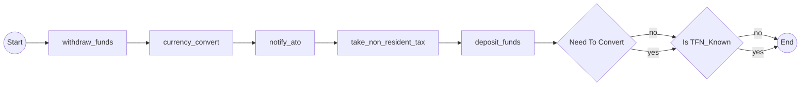

# MoneyTransfer Workflow - Expected Mermaid Output

## Execution Paths

This workflow has 2 decision points creating 4 possible execution paths. The workflow analyzes the code structure statically to determine all possible execution paths based on decision outcomes.

**Important**: This output represents the graph structure analyzed from the MoneyTransfer workflow implementation. The 4 paths correspond to all 2^2 combinations of the 2 decision points (NeedToConvert and IsTFN_Known).

### Path 1: Convert + Notify ATO (NeedToConvert=true, IsTFN_Known=true)
- Decision sequence: d0=true → d1=true
- Activities: withdraw_funds → currency_convert → notify_ato → deposit_funds
- When: source_currency ≠ dest_currency AND tfn_known = true

### Path 2: Convert + Non-Resident Tax (NeedToConvert=true, IsTFN_Known=false)
- Decision sequence: d0=true → d1=false
- Activities: withdraw_funds → currency_convert → take_non_resident_tax → deposit_funds
- When: source_currency ≠ dest_currency AND tfn_known = false

### Path 3: No Convert + Notify ATO (NeedToConvert=false, IsTFN_Known=true)
- Decision sequence: d0=false → d1=true
- Activities: withdraw_funds → notify_ato → deposit_funds
- When: source_currency = dest_currency AND tfn_known = true

### Path 4: No Convert + Non-Resident Tax (NeedToConvert=false, IsTFN_Known=false)
- Decision sequence: d0=false → d1=false
- Activities: withdraw_funds → take_non_resident_tax → deposit_funds
- When: source_currency = dest_currency AND tfn_known = false

## Mermaid Diagram

The diagram below shows the complete workflow structure with all 4 execution paths. Decision nodes (d0 and d1) are rendered as diamond shapes with yes/no branch labels. Activities are shown as rectangular nodes.

## Graph Analysis Notes

- **Total Activities**: 5 (withdraw_funds, currency_convert, notify_ato, take_non_resident_tax, deposit_funds)
- **Total Decision Points**: 2 (NeedToConvert at d0, IsTFN_Known at d1)
- **Total Execution Paths**: 4 (2^2 combinations)
- **Node IDs**:
  - Start: s
  - Activities: 1-5 (numbered sequentially)
  - Decisions: d0, d1
  - End: e
- **Branch Labels**: yes/no for all decision branches (standard Mermaid decision labels)

## Reference Implementation

This workflow is ported from the .NET Temporalio.Graphs reference implementation. The Python static analysis produces equivalent workflow visualization showing all possible execution paths through the decision points.

## Notes on Graph Structure

The current graph representation shows the analysis-time structure of the workflow, with all activities listed sequentially. This represents the complete set of activities that may execute across all 4 paths (some activities are conditional and may not appear in all individual execution flows). The decision nodes indicate where branching occurs, and the yes/no labels on edges indicate the decision outcomes that lead to each branch.
