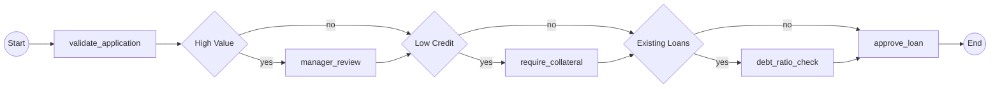

--- Execution Paths (8 total) ---
Decision Points: 3 (2^3 = 8 paths)

Path 1: Start → validate_application → approve_loan → End
Path 2: Start → validate_application → debt_ratio_check → approve_loan → End
Path 3: Start → validate_application → require_collateral → approve_loan → End
Path 4: Start → validate_application → require_collateral → debt_ratio_check → approve_loan → End
Path 5: Start → validate_application → manager_review → approve_loan → End
Path 6: Start → validate_application → manager_review → debt_ratio_check → approve_loan → End
Path 7: Start → validate_application → manager_review → require_collateral → approve_loan → End
Path 8: Start → validate_application → manager_review → require_collateral → debt_ratio_check → approve_loan → End