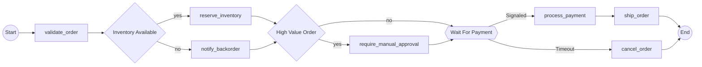

# Temporalio-Graphs Test Project

Test project demonstrating the `temporalio-graphs` library for visualizing Temporal workflow execution paths.

## What is temporalio-graphs?

A Python library that generates complete workflow visualization diagrams for Temporal workflows using static code analysis. It shows **ALL** possible execution paths without executing workflow code.

## Project Structure

```
temporalio-graphs-test/
├── order_workflow.py      # Sample order processing workflow
├── analyze_workflow.py    # Analysis script demonstrating the library
├── workflow_diagram.md    # Generated Mermaid diagram (output)
├── pyproject.toml         # Project dependencies
└── README.md             # This file
```

## Sample Workflow

The `order_workflow.py` demonstrates:
- **Decision nodes**: Inventory check, high-value order check
- **Signal nodes**: Payment confirmation with timeout
- **Activity execution**: Order validation, payment processing, shipping
- **8 possible execution paths** (2 decisions × 1 signal = 2² paths)

## Running the Tests

1. **Setup environment** (using uv):
   ```bash
   uv venv
   source .venv/bin/activate
   uv pip install temporalio temporalio-graphs
   ```

2. **Run analysis**:
   ```bash
   python analyze_workflow.py
   ```

## What the Library Does

The analysis script demonstrates:

1. **Mermaid diagram generation** - Visual flowchart showing all paths
2. **Path enumeration** - Text list of all 8 execution paths
3. **Custom configuration** - Different node labels and styles
4. **File output** - Save diagrams to markdown files

## Key Features Demonstrated

- ✅ **Decision nodes** (`to_decision()`) - Diamond shapes for business logic
- ✅ **Signal nodes** (`wait_condition()`) - Hexagon shapes for async waits
- ✅ **Activity detection** - Automatic detection of workflow activities
- ✅ **Path explosion handling** - Warns about complex workflows
- ✅ **Custom labels** - Configurable node and edge labels
- ✅ **Multiple output formats** - Mermaid diagrams and path lists

## Example Output

### Mermaid Diagram


### Path List
The library generates all 8 possible execution paths:
1. Normal order (in stock, low value, payment received)
2. High-value order requiring approval
3. Backorder scenario
4. Payment timeout leading to cancellation
... and 4 more combinations

## Dependencies

- `temporalio >= 1.7.1` - Temporal workflow SDK
- `temporalio-graphs >= 0.1.0` - Workflow visualization library
- Python 3.10+

## Learn More

- [temporalio-graphs on GitHub](https://github.com/LucaDeLeo/temporalio-graphs)
- [temporalio-graphs on PyPI](https://pypi.org/project/temporalio-graphs/)
