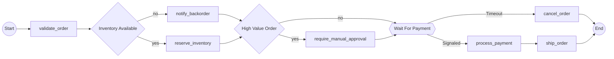

--- Execution Paths (8 total) ---
Decision Points: 2 (2^2 = 8 paths)

Path 1: Start → validate_order → notify_backorder → cancel_order → End
Path 2: Start → validate_order → notify_backorder → process_payment → ship_order → End
Path 3: Start → validate_order → notify_backorder → require_manual_approval → cancel_order → End
Path 4: Start → validate_order → notify_backorder → require_manual_approval → process_payment → ship_order → End
Path 5: Start → validate_order → reserve_inventory → cancel_order → End
Path 6: Start → validate_order → reserve_inventory → process_payment → ship_order → End
Path 7: Start → validate_order → reserve_inventory → require_manual_approval → cancel_order → End
Path 8: Start → validate_order → reserve_inventory → require_manual_approval → process_payment → ship_order → End