# Expected Output: Inline Mode

Complete end-to-end paths spanning parent and child workflows.
Generates 4 paths (2 parent × 2 child = 2² × 2¹ = 4).

```mermaid
flowchart LR
s((Start))
HighValue[High Value]
Requires3DS[Requires3DS]
manager_approval[manager_approval]
process_payment[process_payment]
send_confirmation[send_confirmation]
validate_order[validate_order]
verify_3ds[verify_3ds]
e((End))
s --> validate_order
validate_order --> HighValue
HighValue --> manager_approval
manager_approval --> process_payment
process_payment --> Requires3DS
Requires3DS --> verify_3ds
verify_3ds --> send_confirmation
send_confirmation --> e
```

## Path List

Path 0: validate_order → HighValue → manager_approval → process_payment → Requires3DS → verify_3ds → send_confirmation
Path 1: validate_order → HighValue → manager_approval → process_payment → Requires3DS → verify_3ds → send_confirmation
Path 2: validate_order → HighValue → manager_approval → process_payment → Requires3DS → verify_3ds → send_confirmation
Path 3: validate_order → HighValue → manager_approval → process_payment → Requires3DS → verify_3ds → send_confirmation

## Expected Path Combinations

The 4 paths should represent these combinations:
1. High value (yes) + 3DS required (yes)
2. High value (yes) + 3DS not required (no)
3. Low value (no) + 3DS required (yes)
4. Low value (no) + 3DS not required (no)

## Notes

- Complete end-to-end flow from parent through child back to parent
- All activities from both workflows are visible
- Shows actual execution sequence
- Future enhancement: Render decision nodes as diamond {Decision} shape with labeled edges
