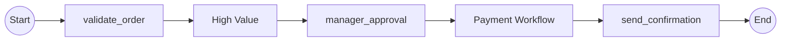

# Expected Output: Reference Mode

Child workflow appears as [[PaymentWorkflow]] node (or PaymentWorkflow until rendering is fully implemented).
Generates 2 paths (parent decisions only).

## Path List

Path 0: validate_order → HighValue → manager_approval → PaymentWorkflow → send_confirmation
Path 1: validate_order → HighValue → manager_approval → PaymentWorkflow → send_confirmation

## Notes

- Child workflow (PaymentWorkflow) appears as atomic node
- Only parent workflow decisions are expanded
- No path explosion (safe mode)
- Future enhancement: Render as [[PaymentWorkflow]] with double brackets
