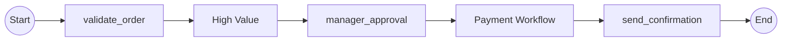

# Expected Output: Subgraph Mode

Separate subgraph blocks showing workflow boundaries.
Generates 2 paths per workflow (same as reference for path count).



## Path List

Path 0: validate_order → HighValue → manager_approval → PaymentWorkflow → send_confirmation
Path 1: validate_order → HighValue → manager_approval → PaymentWorkflow → send_confirmation

## Notes

- Same path generation as reference mode
- Future enhancement: Wrap parent and child workflows in separate `subgraph` blocks:
  ```
  subgraph OrderWorkflow
    [parent workflow nodes]
  end
  subgraph PaymentWorkflow
    [child workflow nodes]
  end
  ```
- Transition edges should connect between subgraphs
- Provides clear visual separation of workflow boundaries
