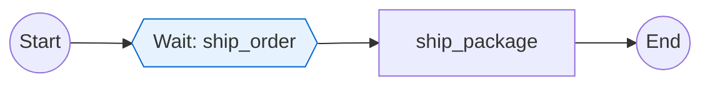

# Expected Output: Peer-to-Peer Workflow Signaling

This document shows the expected Mermaid output when analyzing workflows with
external signals (peer-to-peer pattern).

## Order Workflow (Signal Sender)

The Order workflow sends an external signal to the Shipping workflow using
`get_external_workflow_handle()` and `.signal()`.

```mermaid
flowchart LR
s((Start)) --> process_order[process_order]
process_order --> ext_sig_ship_order[/Signal 'ship_order' to shipping-{*}\]
ext_sig_ship_order -.signal.-> complete_order[complete_order]
complete_order --> e((End))
style ext_sig_ship_order fill:#fff4e6,stroke:#ffa500
```

### Visualization Features

- **Trapezoid node**: `[/Signal 'ship_order' to shipping-{*}\]` shows the external signal
- **Dashed edge**: `-.signal.->` shows async communication (vs solid edge for activities)
- **Color styling**: Orange/amber fill (#fff4e6) and stroke (#ffa500) distinguishes signals
- **Target pattern**: `shipping-{*}` shows the target workflow pattern with wildcard for dynamic ID

### Path List

Path 0: process_order → Signal 'ship_order' to shipping-{*} → complete_order

## Shipping Workflow (Signal Receiver)

The Shipping workflow receives the signal via `@workflow.signal` decorated handler
and waits for it via `wait_condition()`.



### Visualization Features

- **Hexagon node**: `{{Wait: ship_order}}` shows the internal signal/wait condition
- **Blue styling**: Hexagons use blue color to distinguish from external signals (orange)
- **Signal handler**: The `@workflow.signal` decorated method is detected as wait point

### Path List

Path 0: Wait: ship_order → ship_package

## Notes

### Signal Types Comparison

1. **Internal Signals (Epic 4)**: `wait_condition()` for workflow's own state changes
   - Visualization: Hexagon node `{{Wait: condition_name}}`
   - Color: Blue (#e6f3ff fill, #0066cc stroke)
   - Example: Approval workflow waiting for manager approval

2. **Parent-Child (Epic 6)**: `execute_child_workflow()` for synchronous spawning
   - Visualization: Subroutine node `[[ChildWorkflowName]]`
   - Color: Green (#e6ffe6 fill, #00cc00 stroke)
   - Example: Order workflow spawning Payment child workflow

3. **Peer-to-Peer (Epic 7)**: `get_external_workflow_handle().signal()` for async communication
   - Visualization: Trapezoid node `[/Signal 'name' to target\]`
   - Color: Orange/amber (#fff4e6 fill, #ffa500 stroke)
   - Example: Order workflow signaling independent Shipping workflow

### Static Analysis Limitations

External signal detection is best-effort due to static analysis constraints:

- **String literals**: Exact target extracted (e.g., `"shipping-123"` → `shipping-123`)
- **Format strings**: Pattern with wildcard (e.g., `f"shipping-{order_id}"` → `shipping-{*}`)
- **Dynamic expressions**: Fallback to `<dynamic>` when ID cannot be determined

This is documented in ADR-012: Peer-to-Peer Signal Detection.
