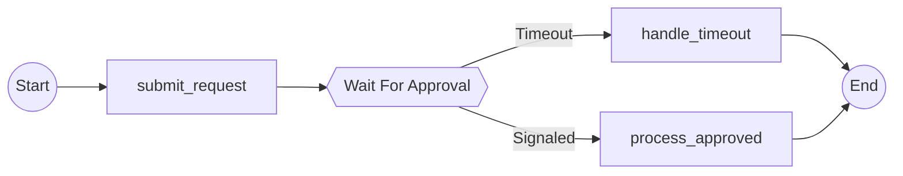

# Signal Workflow Example: Approval with Timeout

This example demonstrates how to visualize Temporal workflows that use signal/wait condition patterns with the temporalio-graphs library.

## Overview

The `ApprovalWorkflow` shows a common business pattern: submitting a request and waiting for approval with a timeout. The workflow creates two execution paths:

1. **Signaled Path**: Approval signal received within 24 hours → Process approved request
2. **Timeout Path**: No approval after 24 hours → Handle timeout

## Workflow Structure

```python
@workflow.defn
class ApprovalWorkflow:
    def __init__(self) -> None:
        self.approved = False

    @workflow.run
    async def run(self, request_id: str) -> str:
        # Submit approval request
        await workflow.execute_activity(submit_request, args=[request_id], ...)

        # Wait for approval signal (creates signal node in graph)
        if await wait_condition(
            lambda: self.approved,
            timedelta(hours=24),
            "WaitForApproval",
        ):
            # Signaled branch: approval received
            await workflow.execute_activity(process_approved, args=[request_id], ...)
            return "approved"
        else:
            # Timeout branch: no approval
            await workflow.execute_activity(handle_timeout, args=[request_id], ...)
            return "timeout"

    @workflow.signal
    async def approve(self) -> None:
        self.approved = True
```

## Using wait_condition()

The `wait_condition()` helper function from temporalio-graphs marks signal points for visualization:

```python
from temporalio_graphs import wait_condition

result = await wait_condition(
    lambda: self.condition,  # Condition check (callable returning bool)
    timedelta(hours=24),     # Timeout duration
    "WaitForApproval",       # Signal node name (must be string literal)
)
```

**Key Points:**
- Import from `temporalio_graphs` (not `temporalio.workflow`)
- Wraps Temporal's `workflow.wait_condition()` transparently
- Returns `True` if signaled before timeout, `False` if timeout
- The `name` parameter must be a string literal for static analysis
- Use in `if/else` statement to create conditional branches

## Expected Visualization

When you analyze this workflow, temporalio-graphs generates a Mermaid diagram showing:

- **Hexagon node** for the signal point (double braces syntax: `{{WaitForApproval}}`)
- **Two branches** with labels "Signaled" and "Timeout"
- **Conditional activities** that only execute on specific paths



## Running the Example

### Analyze and Visualize

```bash
# Run the analysis script
uv run python examples/signal_workflow/run.py

# Copy the Mermaid output and paste into https://mermaid.live
```

### Run Integration Tests

```bash
# Test signal workflow visualization
pytest tests/integration/test_signal_workflow.py -v

# Verify golden file regression
pytest tests/integration/test_signal_workflow.py::test_signal_workflow_matches_golden_file -v
```

## Path Generation

This workflow has **1 signal point**, generating **2 execution paths** (2^1):

| Path | Signal Outcome | Activities |
|------|----------------|------------|
| 1 | Signaled | submit_request → process_approved |
| 2 | Timeout | submit_request → handle_timeout |

Both paths reconverge at the End node.

## Differences from Decision Points

Signal nodes differ from decision points in several ways:

| Feature | Decision (`to_decision`) | Signal (`wait_condition`) |
|---------|-------------------------|--------------------------|
| Node Shape | Diamond `{Name}` | Hexagon `{{Name}}` |
| Branch Labels | "yes" / "no" | "Signaled" / "Timeout" |
| Purpose | Synchronous boolean check | Asynchronous wait for event |
| Typical Use | Business logic branching | Waiting for external signals |

## Real-World Use Cases

- **Approval workflows**: Wait for manager approval with timeout
- **Payment processing**: Wait for payment confirmation or timeout
- **Event-driven flows**: Wait for external system callback
- **Long-running processes**: Wait for human intervention with deadline

## See Also

- [Main README](../../README.md) - Library usage and features
- [MoneyTransfer Example](../money_transfer/README.md) - Decision point demonstration
- [Tech Spec Epic 4](../../docs/sprint-artifacts/tech-spec-epic-4.md) - Signal node implementation details
