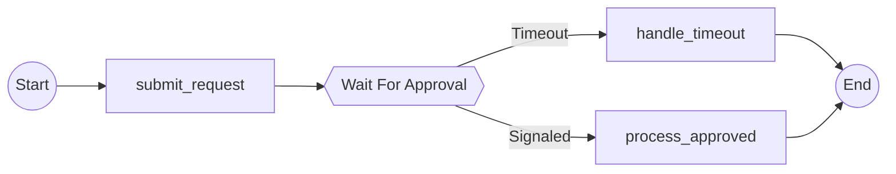

# Expected Mermaid Output for Signal Workflow

This file contains the expected Mermaid output for the ApprovalWorkflow example.
It serves as a golden file for regression testing to ensure future changes don't
break signal node visualization.

## Workflow Structure

The workflow demonstrates a single signal point with two execution paths:

1. **Signaled Path**: Request submitted → Approval received within 24h → Process approved
2. **Timeout Path**: Request submitted → No approval after 24h → Handle timeout

## Expected Graph

The graph should show:
- Start node (circle)
- submit_request activity (rectangle)
- WaitForApproval signal node (hexagon with double braces)
- Two branching edges with labels "Signaled" and "Timeout"
- process_approved activity (only on Signaled path)
- handle_timeout activity (only on Timeout path)
- End node (circle)

## Mermaid Diagram

## Validation Notes

- Signal node uses hexagon syntax: `{{Wait For Approval}}`
- Edges are labeled with "Signaled" and "Timeout"
- Activities are conditional: process_approved only on Signaled, handle_timeout only on Timeout
- Both paths reconverge at End node
- Exactly 2 execution paths (2^1 for 1 signal point)
