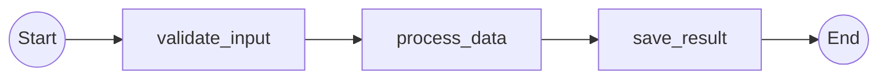

# Simple Linear Workflow - Expected Output

This file contains the expected Mermaid diagram output when analyzing the SimpleWorkflow.

## Diagram

When you run:

```bash
python examples/simple_linear/run.py
```

You should see the following diagram:



## Explanation

The diagram shows a simple linear workflow with:

- **Start Node (s)**: Where the workflow begins
- **Activity 1 (validate_input)**: First step - validates input data
- **Activity 2 (process_data)**: Second step - processes the validated data
- **Activity 3 (save_result)**: Third step - saves the processing result
- **End Node (e)**: Where the workflow completes

The arrows show the sequence of execution:
- Start → validate_input → process_data → save_result → End

This is a straightforward sequential workflow with no branching, conditions, or decision points.

## Running the Example

To try this yourself:

1. Install the library (if not already installed):
   ```bash
   pip install temporalio-graphs
   ```

2. Run the example:
   ```bash
   python examples/simple_linear/run.py
   ```

3. The output will be a Mermaid diagram that can be:
   - Rendered in GitHub markdown
   - Pasted into Mermaid Live Editor (https://mermaid.live)
   - Included in documentation
   - Used in design docs and architecture diagrams

## Understanding the Structure

The workflow code defines:

```python
@workflow.defn
class SimpleWorkflow:
    @workflow.run
    async def run(self) -> str:
        await workflow.execute_activity(validate_input)
        await workflow.execute_activity(process_data)
        await workflow.execute_activity(save_result)
        return "complete"
```

The temporalio-graphs library analyzes this code and:
1. Detects the @workflow.defn decorator
2. Finds the @workflow.run method
3. Identifies all execute_activity() calls
4. Generates a diagram showing the exact execution order

No workflow execution is needed - pure static analysis!
