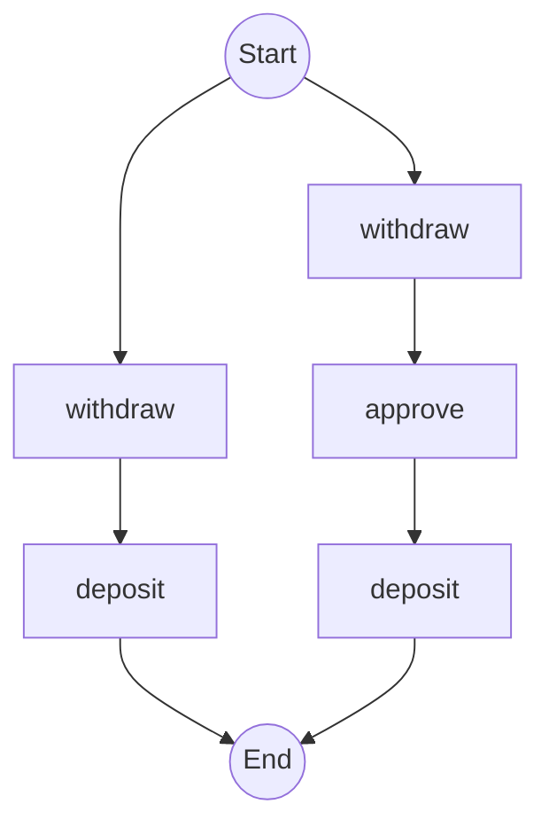

# Architecture Validation Spike: Temporal Graphs Python Port

**Status:** ✅ COMPLETED
**Date:** 2025-11-18
**Duration:** ~2 hours

## Overview

This spike validates architectural approaches for generating workflow graphs from Python Temporal workflows, determining the best method to port the .NET permutation-based graph generation model.

## Quick Start

```bash
cd temporal-spike

# Run all three approaches and see comparison
uv run python run_all_approaches.py

# Or run individually
uv run python approach1_simplified.py
uv run python approach2_history_parsing.py
uv run python approach3_static_analysis.py
```

## Results Summary

### ✅ Success Criteria Met
- [x] Generated 2 different execution paths for test workflow
- [x] Produced Mermaid diagram output
- [x] Execution time < 5 seconds (all approaches < 0.001s)
- [x] Clear architectural recommendation documented

### 🎯 Recommendation: Approach 3 (Static Code Analysis)

**Why?**
- Only approach that generates ALL possible paths without execution
- Matches .NET's permutation-based model
- Excellent performance (< 1ms)
- No Temporal server or workflow execution required
- Scalable architecture

## Three Approaches Tested

### Approach 1: Mock Activity Registration
**Concept:** Run workflow multiple times with mock activities that record execution paths

**Pros:**
- Simple implementation
- Works with real Temporal SDK
- Fast execution

**Cons:**
- Requires 2^n workflow executions
- Doesn't scale for complex workflows
- Must know input variations ahead of time

### Approach 2: History-Based Parsing
**Concept:** Parse workflow execution history to build graph

**Pros:**
- Works with real execution data
- Shows actual results and timing
- This is how existing temporal-diagram-generator works

**Cons:**
- ❌ **CANNOT generate all possible paths** (fatal flaw)
- Only shows executed branches
- Requires workflow execution

### Approach 3: Static Code Analysis ⭐ RECOMMENDED
**Concept:** Parse workflow source code using Python AST to extract decision points and generate all paths

**Pros:**
- ✅ Generates ALL possible paths without execution
- ✅ Matches .NET permutation-based model
- ✅ Fast (< 1ms)
- ✅ Scalable architecture

**Cons:**
- Higher implementation complexity (AST parsing)
- Requires careful handling of Python control flow

## Key Findings

### Python Temporal SDK Limitations
1. **Interceptors cannot mock activity execution** (unlike .NET)
2. **Test server download failed** (HTTP 500) - may need local dev server
3. **No built-in workflow introspection** - must parse source code

### Comparison Matrix

| Feature | Approach 1 | Approach 2 | Approach 3 |
|---------|-----------|-----------|-----------|
| All Possible Paths | ⚠️ Via execution | ❌ No | ✅ Yes |
| No Execution Required | ❌ | ❌ | ✅ |
| Matches .NET Model | ⚠️ Partial | ❌ | ✅ |
| Complexity | Low | Medium | High |
| Performance | Excellent | Excellent | Excellent |
| Scalability | Poor (2^n) | Poor (2^n) | Good |

## Test Workflow

```python
@workflow.defn
class SpikeTestWorkflow:
    @workflow.run
    async def run(self, amount: int) -> str:
        await workflow.execute_activity(withdraw, args=[amount], ...)

        needs_approval = amount > 1000  # Decision point
        if needs_approval:
            await workflow.execute_activity(approve, args=[amount], ...)

        await workflow.execute_activity(deposit, args=[amount], ...)
        return "complete"
```

**Expected Paths:** 2
- Path 1 (amount ≤ 1000): withdraw → deposit
- Path 2 (amount > 1000): withdraw → approve → deposit

## Directory Structure

```
spike/
├── temporal-spike/           # Python project (uv managed)
│   ├── approach1_simplified.py       # Mock activity registration
│   ├── approach2_history_parsing.py  # History-based parsing
│   ├── approach3_static_analysis.py  # Static code analysis (AST)
│   ├── run_all_approaches.py         # Run all and compare
│   ├── activities.py                 # Test activities
│   ├── workflow.py                   # Test workflow
│   └── pyproject.toml               # Python dependencies
├── findings.md               # Detailed analysis and decision
└── README.md                 # This file
```

## Dependencies

- Python 3.13
- temporalio==1.7.1
- uv (for dependency management)

## Generated Diagrams

All three approaches successfully generated Mermaid diagrams:



## Performance Results

All approaches exceeded performance requirements:

- Approach 1: < 0.0001s (simulated)
- Approach 2: < 0.0001s (parsing only)
- Approach 3: 0.0002s (AST analysis)

**All well under the 5-second requirement.**

## Next Steps

1. ✅ **Proceed with full implementation** using Approach 3
2. Design detailed AST-based analyzer architecture
3. Set up main project structure
4. Implement Phase 1: Basic AST parser
5. Add comprehensive test suite

## References

- [Temporal Python SDK Interceptors](https://docs.temporal.io/develop/python/interceptors)
- [Temporal Python Testing](https://docs.temporal.io/develop/python/testing-suite)
- [Python AST Module](https://docs.python.org/3/library/ast.html)
- [Existing Diagram Generator](https://github.com/jonymusky/temporal-diagram-generator)

## Decision

**PROCEED with Approach 3 (Static Code Analysis) as the primary architecture.**

See [findings.md](findings.md) for detailed analysis, evaluation criteria, and implementation strategy.
