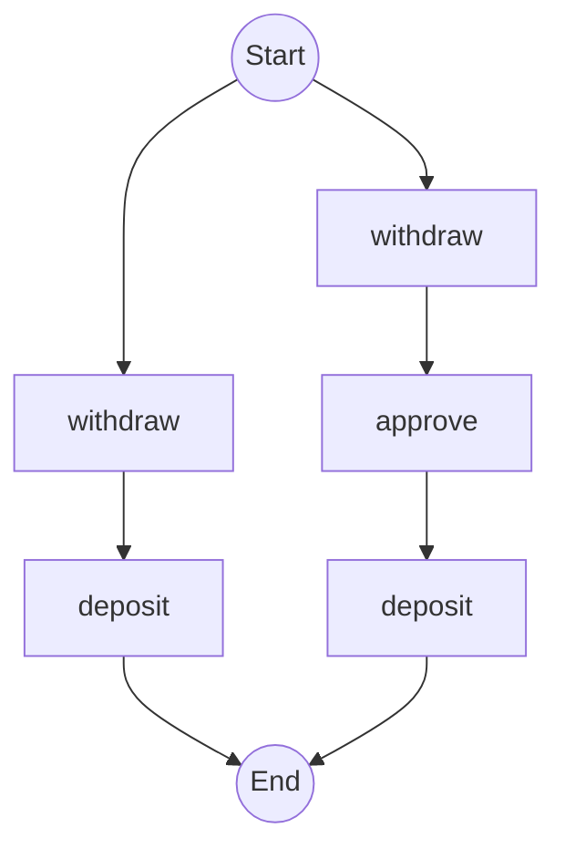
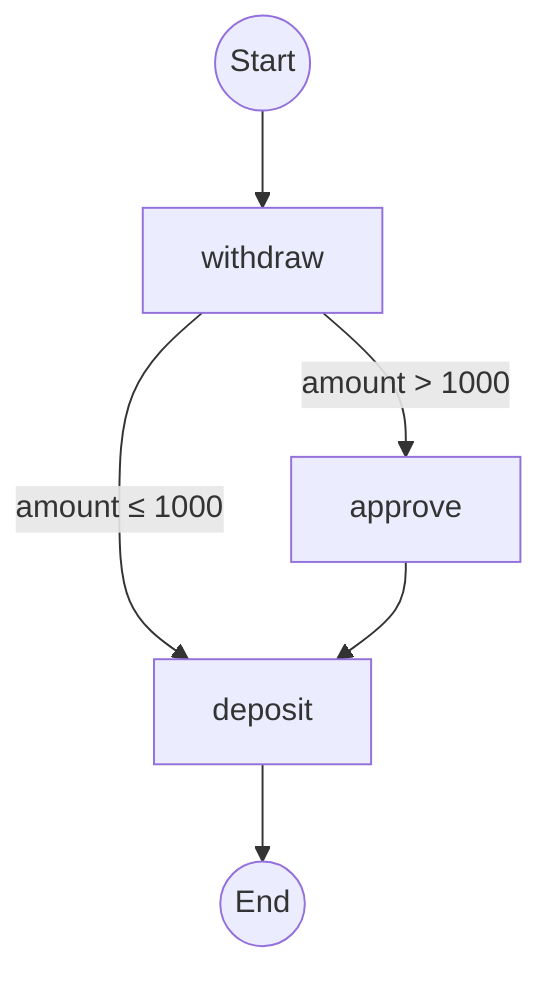

# Generated Mermaid Diagrams - All Approaches

## Test Workflow

```python
@workflow.defn
class SpikeTestWorkflow:
    @workflow.run
    async def run(self, amount: int) -> str:
        await workflow.execute_activity(withdraw, args=[amount], ...)

        needs_approval = amount > 1000  # Decision point
        if needs_approval:
            await workflow.execute_activity(approve, args=[amount], ...)

        await workflow.execute_activity(deposit, args=[amount], ...)
        return "complete"
```

**Decision Points:** 1 (needs_approval)
**Expected Paths:** 2^1 = 2

---

## Approach 1: Mock Activity Registration

**Method:** Execute workflow multiple times with different inputs, record paths

### Path 1 (amount=500, no approval needed)
```
withdraw(500) -> deposit(500)
```

### Path 2 (amount=2000, approval needed)
```
withdraw(2000) -> approve(2000) -> deposit(2000)
```

### Generated Diagram
```mermaid
graph TD
    Start((Start))
    P0S0[withdraw(500)]
    Start --> P0S0
    P0S1[deposit(500)]
    P0S0 --> P0S1
    P0S1 --> End
    P1S0[withdraw(2000)]
    Start --> P1S0
    P1S1[approve(2000)]
    P1S0 --> P1S1
    P1S2[deposit(2000)]
    P1S1 --> P1S2
    P1S2 --> End
    End((End))
```

**Characteristics:**
- Shows input values in nodes
- Separate branches for each execution
- Both paths visible but not merged

---

## Approach 2: History-Based Parsing

**Method:** Parse execution history events after workflow runs

### Workflow 1 (spike-test-500)
```
withdraw -> deposit
```
Events: 8 (including WorkflowStarted, ActivityScheduled, etc.)

### Workflow 2 (spike-test-2000)
```
withdraw -> approve -> deposit
```
Events: 11

### Generated Diagram


**Characteristics:**
- Generic activity names (no input values)
- Based on real execution history
- Separate branches per execution
- This is how existing temporal-diagram-generator works

---

## Approach 3: Static Code Analysis ⭐ RECOMMENDED

**Method:** Parse Python AST to extract decision points and generate all paths

### Analysis Results
```
Decision Points: 1
  - Line 15: needs_approval (variable: needs_approval)

Activity Calls: 3
  - Unconditional: withdraw, deposit
  - Conditional: approve
```

### Path 1 (condition=False)
```
withdraw -> deposit
```

### Path 2 (condition=True)
```
withdraw -> approve -> deposit
```

### Generated Diagram


**Characteristics:**
- Generic activity names
- Pure code analysis (no execution)
- All possible paths generated
- Matches .NET permutation model

---

## Comparison

| Aspect | Approach 1 | Approach 2 | Approach 3 |
|--------|-----------|-----------|-----------|
| Shows all paths | ✅ (via execution) | ❌ | ✅ (via analysis) |
| Input values in diagram | ✅ | ❌ | ❌ |
| Requires execution | ✅ | ✅ | ❌ |
| Execution time | < 0.0001s | < 0.0001s | 0.0002s |
| Scalability | Poor (2^n runs) | Poor (2^n runs) | Good |

---

## Ideal Output (Future Enhancement)

For a more readable diagram, we could merge common paths:



This merged representation:
- Shows decision logic on edges
- Reduces visual clutter
- Makes control flow clearer
- Could be implemented in Phase 2 of development

---

## Conclusion

All three approaches successfully generated valid Mermaid diagrams showing both execution paths. **Approach 3 (Static Code Analysis)** is recommended as it:
- Generates all paths without execution
- Matches the .NET permutation model
- Scales well for complex workflows
- Provides foundation for advanced features (merged paths, decision annotations, etc.)
